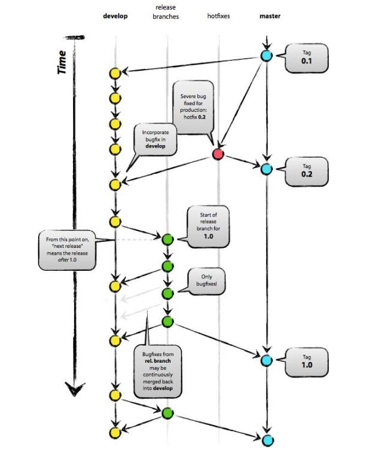

#请开发人员在开发前阅读该约定

---
## Git Workflow 介绍

提交时首先提交到develop分支，务必保持master分支**时刻可用**

原生的Git Flow包括五种分支：master\hotfix\release\develop\feature  
其中develop为主开发分支，其分支上的代码为下一个版本将要发布的内容。  
当一个新功能需要开发时，从develop上新建个人开发分支，开发完成后合并至develop。  
当需要发布时，从develop拉出release分支，在release上打包部署测试，需修复时，直接在release上提交，修复后再次打包部署测试。  
当release上通过测试后，将修复合并至develop和master，生产则从master打包。 

本项目统一使用变种Git Workflow工作流，我们所采用的变体的GitFLow图示大致如下（不完全一致）：
  

---
## 各个分支作用及规则（变种Git Workflow）

- Master分支  
仅用于正式环境发布重大版本（体现在正式环境），所有生产环境的发布应该基于Master分支，**记录版本tag**，并且打发布分支。

- Develop分支  
开发主分支，日常新功能开发在此分支上但其他分支所做的操作最终都会合并在此分支上，所有的新功能分支基于Develop分支，并且完成相对完整的功能之后才能合并会Develop分支。

        命名规则
        新功能开发分支：pr-feature-v${versionNumber}-${featureName}-${personName}
        实例：pr-feature-v1.0.1-test-zhangsan

- Release Test分支  
预发布测试分支，该分支基于Develop分支，待全体开发人员功能开发完成且合并回Develop分支之后，从Develop分支拉取Release Test分支用于测试人员打包测试。
待测试无问题或所有问题均已修复，则可以合并回Develop。  
**注意：该分支在合并回Develop分支之后因立刻将Develop分支合并到Master分支并在Master最新节点记录版本tag**

        命名规则
        测试分支：rel-test-v${versionNumber}
  
- Bug Fix 分支  
BUG修复分支，该分支基于Release Test分支，用于修复测试所提的BUG。
待BUG修复完毕，则合并回Release Test分支。

        命名规则
        BUG修复分支：bugfix-v${versionNumber}-${bugNumber/bugDescrib}

- Release分支：
发布分支，该分支基于Master并且仅根据tag进行创建，用于生产环境打包

        命名规则
        发布分支：rel-v${versionNumber}
        发布分支（热修复）：rel-v${versionNumber}-fixed

- Hotfixes分支：
热修复分支，该分支基于Release分支，仅用于正式环境版本发布后临时紧急修复正式环境BUG。
当BUG解决完毕后并且测试人员测试认可后，合并到相应版本的Release分支，再由Release分支合并到Master分支,最后同步（合并）到Develop分支上。
此时需要在该Master节点打热修复tag，并拉取热修复Release分支。

        命名规则
        热修复分支：hotfix-v${versionNumber}
  
- Tag:
Tag仅在Master分支上记录，其作用为记录发布节点用于版本发布、版本回滚和问题溯源。

        命名规则
        发布Tag：rel-v${versionNumber}
        发布Tag（热修复）：rel-v${versionNumber}-fixed

---
## 整体开发部署流程

1. 明确需求后确定此次将要发布的版本号，在Develop分支上拉取属于自己的开发分支

2. 开发完成（联调自测完成）后将Develop分支合并到自己的开发分支上（这么做的目的是在自己分支上解决可能与Develop分支存在的冲突，以防止因冲突解决失败或冲突解决不成功而导致Develop分支出现脏代码），并解决冲突（如果有的话）

3. 在GitLab上提交自己的开发分支合并到Develop分支的Merge Request，并且选择审核人为出自己以外的另外两名开发人员（若开发人员人数不足3人则仅需选择另一名开发人员即可）

4. 指定审核人员审核确认无误后确认合并，个人开发分支将合并回Develop分支

5. 待所有开发人员代码均完成步骤1、2、3，则在Develop分支的最新节点上创建Release Test分支提供给测试人员测试

6. 若测试人员测试过程中发现BUG并提交BUG单之后，需从该版本Release Test分支上拉取Bug Fix分支

7. 当开发人员将BUG修复完毕后，将该版本Release Test分支合并到自己的Bug Fix分支上并解决冲突（此做法的原因和步骤2如出一辙），若无冲突则可以将自己的Bug Fix分支合并回该版本Release Test分支

8. 待所有开发人员均完成步骤7，并且测试人员已全部测试通过。则在GitLab上提交Merge Request并且审核人选定全体开发人员，将该版本Release Test分支合并回Develop分支

9. 待该版本Release Test分支合并回Develop分支之后，因立即将Develop分支合并至Master分支，并在Master分支的最新节点上打该版本Tag

10. 从Master分支的该版本Tag节点上创建该版本Release分支，在该版本Release分支上进行生产环境打包

11. 将打好的生产环境包提交给运维人员进行生产环境部署和验证

12. 若验证发现问题，则需要根据具体情况选择热修复或者回滚

12.1.1. 若选择热修复则需要在该版本Release分支上创建该版本Hotfixes分支，并在该版本Hotfixes分支上进行紧急代码修复

12.1.2. 待热修复完成后将该版本Hotfixes分支合并回该版本Release分支（该合并操作由于时间紧急，可不通过GitLab进行，但要注意可能存在的代码冲突处理），并再次在该版本Release分支上打生产环境部署包

12.2.1. 若选择回滚，则需执行回滚指令（包括sql回滚）将上一版本部署包重新部署回生产环境

---
## 注意事项

- 本地分支推送到远端之前**须先手动执行fetch和pull当前分支**刷新分支状态（因为如果本地分支最新版本落后于远端版本的时候直接push即便没有代码冲突也会提示存在冲突需要merge，徒增风险），
并且正常情况下禁止强制推送。在未刷新分支状态下强制提交极有可能造成部分远端分支已提交的代码被回滚或覆盖，从而造成不可逆的损失。

- 所有合并回Develop分支的代码必须是可成功编译的（若提交无法编译的代码且Merge Request审核漏审，合并回了Develop将会影响其他同事的代码编译）。

- 后台开发人员在本地自测时尽量使用自己的Eureka服务器，以防止服务调用错乱。

- 在取得所有开发成员一致同意并对lombok的一些坑（例如父类属性、构造器注解重载等问题）有所了解之前不要使用lombok，可能会被依赖的模块不要使用lombok。

- 模块中需要的第三方依赖若Spring Boot或Spring Cloud中不存在需要自己引入时，则尽量将依赖写在父POM文件（最外层POM文件）的dependencyManagement标签中，再由子POM引用。
这样做一是可以比较直观了解整个项目引用的所有第三方依赖，避免重复引用；二是防止A开发人员与B开发人员在独立开发自己的模块时重复引用了同一第三方依赖的不同且不兼容版本导致的依赖冲突。

- 还有更多欢迎补充