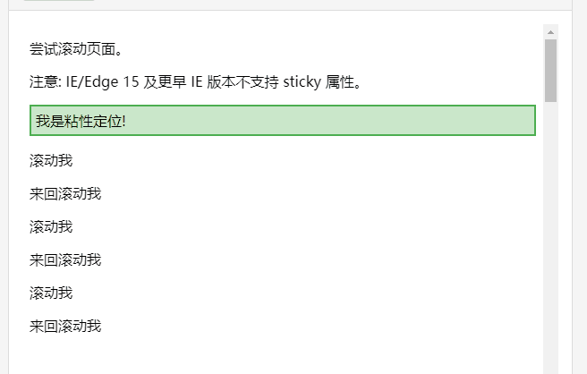

## 定位

### relative 相对定位

position: relative： 相对定位

- 不影响元素本身的特性（如：对div使用，div本身是块元素，其块元素的特性不会被影响）
- 不使元素脱离文档流（元素移动之后，原始位置会被保留，即没有产生偏移量之前，所在位置始终被占用的。）
- 如果没有定位偏移量，对元素本身没有任何影响
- 提升层级


#### 定位元素位置控制

top/ right/ bottom/ left	定位元素偏移量。


### absolute 绝对定位

position: absolute：绝对定位

- 使元素完全脱离文档流
- “非块级”的元素会被转化成“块级元素”；
- 元素的宽和高将对内容自适应（不再是“块级元素”默认100%的宽度了）。
- 若一个具有宽和高的元素是其父级元素中唯一的子元素，并且其父元素没有设置高度属性，那父元素内容的高度将会变为“0”。
- 如果有定位父级，相对于定位父级发生偏移；没有，则相对于document发生偏移
- 相对定位一般都是配合绝对定位元素使用
- 提升层级


### fixed 固定定位

position: fixed：固定定位

与绝对定位的特性，基本一致，差别是：固定定位，始终相对整个文档进行定位；

[^ tips]: IE6不支持固定定位。


### sticky 粘性定位

position: sticky：粘性定位

粘性定位的元素是依赖于用户的滚动，在 **position:relative** 与 **position:fixed** 定位之间切换。

它的行为就像 **position:relative;** 而当页面滚动超出目标区域时，它的表现就像 **position:fixed;**，它会固定在目标位置。

元素定位表现为在跨越特定阈值前为相对定位，之后为固定定位。

这个特定阈值指的是 top, right, bottom 或 left 之一，换言之，指定 top, right, bottom 或 left 四个阈值其中之一，才可使粘性定位生效。否则其行为与相对定位相同。

[^ tips]:  Internet Explorer, Edge 15 及更早 IE 版本不支持 sticky 定位。 Safari 需要使用 -webkit- prefix (查看以下实例)。

```html
<!DOCTYPE html>
<html>
<head>
<meta charset="utf-8"> 
<style>
div.sticky {
  position: sticky;
  top: 0;
  padding: 5px;
  background-color: #cae8ca;
  border: 2px solid #4CAF50;
}
</style>
</head>
<body>

<p>尝试滚动页面。</p>
<p>注意: IE/Edge 15 及更早 IE 版本不支持 sticky 属性。</p>

<div class="sticky">我是粘性定位!</div>

<div style="padding-bottom:2000px">
  <p>滚动我</p>
  <p>来回滚动我</p>
  <p>滚动我</p>
  <p>来回滚动我</p>
  <p>滚动我</p>
  <p>来回滚动我</p>
</div>

</body>
</html>
```



### 定位其他值

- position: static：默认值，即没有定位，遵循正常的文档流对象。。
- position: inherit：从父元素继承定位属性的值（不兼容）。