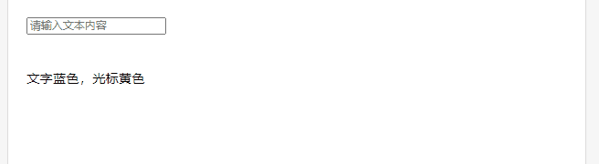
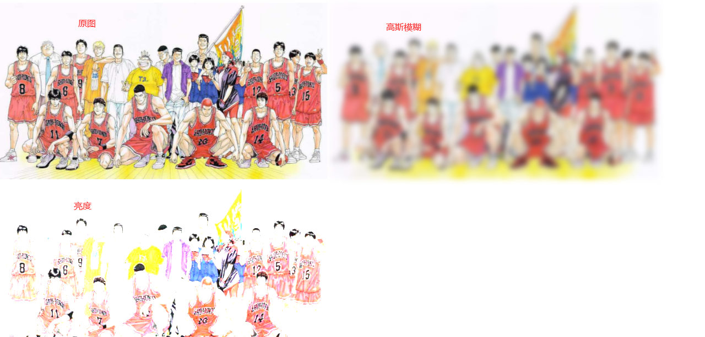
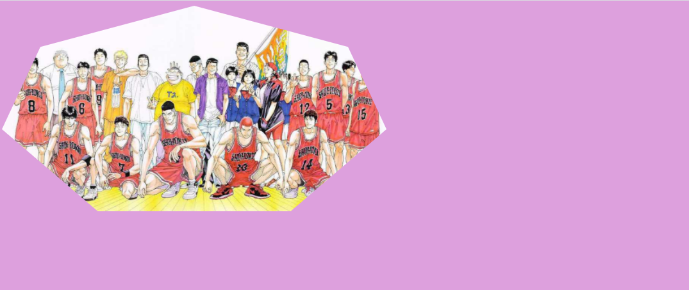

## 显示

### 1、元素显示方式  

`display` 属性规定元素的显示方式。元素类型可分为块级元素（`block`）、行内元素（`inline`）以及行内块元素（`inline-block`），各类型的元素在呈现方式上也不尽相同。HTML文档中自带的标签元素的“显示类型”已经被定义，如果考虑到布局需要，有的时候我们会强制的将“显示类型”进行转换，在进行转换后，该元素的功能和特性（如将\<div>标签转换为“inline-block”之后，也不能嵌套在\<p>里和转换为“block”的\<span>里）也不会产生变化。所以，在元素页面布局的时候，若对“行内元素”、“行内块级元素”和“块级元素”已经理解得比较透彻了，根据需要完全可以大胆地对“显示类型”进行转换。

该属性可以设置以下值：

| none               | 此元素不会被显示。                                           |
| ------------------ | ------------------------------------------------------------ |
| block              | 此元素将显示为块级元素，此元素前后会带有换行符。             |
| inline             | 默认。此元素会被显示为内联元素，元素前后没有换行符。         |
| inline-block       | 行内块元素。（CSS2.1 新增的值）                              |
| list-item          | 此元素会作为列表显示。                                       |
| run-in             | 此元素会根据上下文作为块级元素或内联元素显示。               |
| compact            | CSS 中有值 compact，不过由于缺乏广泛支持，已经从 CSS2.1 中删除。 |
| marker             | CSS 中有值 marker，不过由于缺乏广泛支持，已经从 CSS2.1 中删除。 |
| table              | 此元素会作为块级表格来显示（类似 <table>），表格前后带有换行符。 |
| inline-table       | 此元素会作为内联表格来显示（类似 <table>），表格前后没有换行符。 |
| table-row-group    | 此元素会作为一个或多个行的分组来显示（类似 <tbody>）。       |
| table-header-group | 此元素会作为一个或多个行的分组来显示（类似 <thead>）。       |
| table-footer-group | 此元素会作为一个或多个行的分组来显示（类似 <tfoot>）。       |
| table-row          | 此元素会作为一个表格行显示（类似 <tr>）。                    |
| table-column-group | 此元素会作为一个或多个列的分组来显示（类似 <colgroup>）。    |
| table-column       | 此元素会作为一个单元格列显示（类似 <col>）                   |
| table-cell         | 此元素会作为一个表格单元格显示（类似 <td> 和 <th>）          |
| table-caption      | 此元素会作为一个表格标题显示（类似 <caption>）               |
| inherit            | 规定应该从父元素继承 display 属性的值。                      |
| flex               | 弹性布局*（主要）*                                           |
| grid               | 网格布局*（主要）*                                           |


### 2、元素可见性

`visibility`  用于设置元素是否可见，该属性即使元素不可见，也不会脱离文档流，仍会占据空间，该属性可以设置以下值：

- visible：（默认），元素可见。
- hidden：元素不可见，**仍会占据空间**。

[^ tips]: 要隐藏元素，可以使用 `display: none;` 或 `visibility: hidden等;`，但值得注意的是，将 `visibility` 的属性值设置为 `hidden`，元素虽然不可见了，但仍未脱离“文档流”，在页面显示中占据着原本的位置。而通过将 `display` 的属性值设置为 `none` ，元素不可见了，而且在页面中占据的位置也让给“文档流”内布局的其它元素了。通过这两个属性的这一特性，我们可以更加灵活地进行元素的显隐操作，以达到更理想的页面布局效果。


### 3、元素不透明度

`opacity` 用于设置元素的不透明度，该属性的值范围为：`0 ~ 1`，可以保留两位小数，设值时可以省略 `0`，如：`.5` 或 `.75`。`0`（相当于 `visibility:hidden;`）表示完全透明，`1`（默认）表示完全不透明。

[^ tips]: 将 `opacity` 的值设置为 `0`，和将 `visibility` 的值设置为 `hidden` 在布局表现上几乎一致，但在对待用户*行为*上却有着很大的差别。因为，通过将 `opacity` 的值设置为 `0` 的方式，只是让元素透明了，但仍然是可以让如鼠标悬浮等事件生效的，而将 `visibility` 的值设置为 `hidden` 的方式，是不能触发鼠标悬浮这一类的事件的，这点要注意区分。


### 4、鼠标指针类型

`cursor`属性定义了鼠标指针放在一个元素边界范围内时所用的光标形状

| 值        | 描述                                                         |
| :-------- | :----------------------------------------------------------- |
| *url*     | 需使用的自定义光标的 URL。注释：请在此列表的末端始终定义一种普通的光标，以防没有由 URL 定义的可用光标。 |
| default   | 默认光标（通常是一个箭头）                                   |
| auto      | 默认。浏览器设置的光标。                                     |
| crosshair | 光标呈现为十字线。                                           |
| pointer   | 光标呈现为指示链接的指针（一只手）                           |
| move      | 此光标指示某对象可被移动。                                   |
| e-resize  | 此光标指示矩形框的边缘可被向右（东）移动。                   |
| ne-resize | 此光标指示矩形框的边缘可被向上及向右移动（北/东）。          |
| nw-resize | 此光标指示矩形框的边缘可被向上及向左移动（北/西）。          |
| n-resize  | 此光标指示矩形框的边缘可被向上（北）移动。                   |
| se-resize | 此光标指示矩形框的边缘可被向下及向右移动（南/东）。          |
| sw-resize | 此光标指示矩形框的边缘可被向下及向左移动（南/西）。          |
| s-resize  | 此光标指示矩形框的边缘可被向下移动（南）。                   |
| w-resize  | 此光标指示矩形框的边缘可被向左移动（西）。                   |
| text      | 此光标指示文本。                                             |
| wait      | 此光标指示程序正忙（通常是一只表或沙漏）。                   |
| help      | 此光标指示可用的帮助（通常是一个问号或一个气球）。           |

```html
<!DOCTYPE html>
<html>
<head>
<meta charset="utf-8"> 
</head>
<body>
<p>请把鼠标移动到单词上，可以看到鼠标指针发生变化：</p>
<span style="cursor:auto">auto</span><br>
<span style="cursor:crosshair">crosshair</span><br>
<span style="cursor:default">default</span><br>
<span style="cursor:e-resize">e-resize</span><br>
<span style="cursor:help">help</span><br>
<span style="cursor:move">move</span><br>
<span style="cursor:n-resize">n-resize</span><br>
<span style="cursor:ne-resize">ne-resize</span><br>
<span style="cursor:nw-resize">nw-resize</span><br>
<span style="cursor:pointer">pointer</span><br>
<span style="cursor:progress">progress</span><br>
<span style="cursor:s-resize">s-resize</span><br>
<span style="cursor:se-resize">se-resize</span><br>
<span style="cursor:sw-resize">sw-resize</span><br>
<span style="cursor:text">text</span><br>
<span style="cursor:w-resize">w-resize</span><br>
<span style="cursor:wait">wait</span><br>
</body>
</html>
```


### 5、修改光标颜色

`caret-color` : 改变**输入框**光标颜色，同时又不改变输入框里面的内容的颜色

[^ tips]: `caret-color` 属性不仅对于原生的输入表单控件有效，设置`contenteditable`的普通标签也适用。`contenteditable` 属性: 规定是否可编辑元素内容.

```html
<!DOCTYPE html>
<html>
<head>
<meta charset="utf-8"> 
</head>
<body>
	<input type="text" style="caret-color:red;" placeholder="请输入文本内容">
	<br>
	<br>
	<br>
	<div contenteditable="true" style="caret-color: yellow">文字蓝色，光标黄色</div>
</body>
</html>
```




### 6、滤镜

filter 属性定义了元素(通常是)的可视效果(例如：模糊与饱和度)。

CSS语法：

```
filter: none | blur() | brightness() | contrast() | drop-shadow() | grayscale() | hue-rotate() | invert() | opacity() | saturate() | sepia() | url();
```

| Filter                                             | 描述                                                         |
| :------------------------------------------------- | :----------------------------------------------------------- |
| none                                               | 默认值，没有效果。                                           |
| blur(*px*)                                         | 给图像设置高斯模糊。"radius"一值设定高斯函数的标准差，或者是屏幕上以多少像素融在一起， 所以值越大越模糊；  如果没有设定值，则默认是0；这个参数可设置css长度值，但不接受百分比值。 |
| brightness(*%*)                                    | 给图片应用一种线性乘法，使其看起来更亮或更暗。如果值是0%，图像会全黑。值是100%，则图像无变化。其他的值对应线性乘数效果。值超过100%也是可以的，图像会比原来更亮。如果没有设定值，默认是1。 |
| contrast(*%*)                                      | 调整图像的对比度。值是0%的话，图像会全黑。值是100%，图像不变。值可以超过100%，意味着会运用更低的对比。若没有设置值，默认是1。 |
| drop-shadow(*h-shadow v-shadow blur spread color*) | 给图像设置一个阴影效果。阴影是合成在图像下面，可以有模糊度的，可以以特定颜色画出的遮罩图的偏移版本。 函数接受<shadow>(在CSS3背景中定义)类型的值，除了"inset"关键字是不允许的。该函数与已有的box-shadow box-shadow属性很相似；不同之处在于，通过滤镜，一些浏览器为了更好的性能会提供硬件加速。`参数如下：``**** **** (必须)这是设置阴影偏移量的两个 值. **** 设定水平方向距离. 负值会使阴影出现在元素左边. ****设定垂直距离.负值会使阴影出现在元素上方。查看****可能的单位.**如果两个值都是0**, 则阴影出现在元素正后面 (如果设置了 and/or ，会有模糊效果).**** (可选)这是第三个code>值. 值越大，越模糊，则阴影会变得更大更淡.不允许负值 若未设定，默认是0 (则阴影的边界很锐利).**** (可选)这是第四个 值. 正值会使阴影扩张和变大，负值会是阴影缩小.若未设定，默认是0 (阴影会与元素一样大小). 注意: Webkit, 以及一些其他浏览器 不支持第四个长度，如果加了也不会渲染。 **** (可选)查看 该值可能的关键字和标记。若未设定，颜色值基于浏览器。在Gecko (Firefox), Presto (Opera)和Trident (Internet Explorer)中， 会应用color**color**属性的值。另外, 如果颜色值省略，WebKit中阴影是透明的。` |
| grayscale(*%*)                                     | 将图像转换为灰度图像。值定义转换的比例。值为100%则完全转为灰度图像，值为0%图像无变化。值在0%到100%之间，则是效果的线性乘子。若未设置，值默认是0； |
| hue-rotate(*deg*)                                  | 给图像应用色相旋转。"angle"一值设定图像会被调整的色环角度值。值为0deg，则图像无变化。若值未设置，默认值是0deg。该值虽然没有最大值，超过360deg的值相当于又绕一圈。 |
| invert(*%*)                                        | 反转输入图像。值定义转换的比例。100%的价值是完全反转。值为0%则图像无变化。值在0%和100%之间，则是效果的线性乘子。 若值未设置，值默认是0。 |
| opacity(*%*)                                       | 转化图像的透明程度。值定义转换的比例。值为0%则是完全透明，值为100%则图像无变化。值在0%和100%之间，则是效果的线性乘子，也相当于图像样本乘以数量。 若值未设置，值默认是1。该函数与已有的opacity属性很相似，不同之处在于通过filter，一些浏览器为了提升性能会提供硬件加速。 |
| saturate(*%*)                                      | 转换图像饱和度。值定义转换的比例。值为0%则是完全不饱和，值为100%则图像无变化。其他值，则是效果的线性乘子。超过100%的值是允许的，则有更高的饱和度。 若值未设置，值默认是1。 |
| sepia(*%*)                                         | 将图像转换为深褐色。值定义转换的比例。值为100%则完全是深褐色的，值为0%图像无变化。值在0%到100%之间，则是效果的线性乘子。若未设置，值默认是0； |
| url()                                              | URL函数接受一个XML文件，该文件设置了 一个SVG滤镜，且可以包含一个锚点来指定一个具体的滤镜元素。例如：`filter: url(svg-url#element-id)` |
| initial                                            | 设置属性为默认值，可参阅： [CSS initial 关键字](https://www.runoob.com/cssref/css-initial.html) |
| inherit                                            | 从父元素继承该属性，可参阅：[CSS inherit 关键字](https://www.runoob.com/cssref/css-inherit.html) |

高斯模糊和亮度例子如下：

```html
<!DOCTYPE html>
<html lang="en">

<head>
    <meta charset="UTF-8">
    <meta name="viewport" content="width=device-width, initial-scale=1.0">
    <style>
        img{
            width: 600px;
        }
        .img1 {
            filter: blur(5px);
        }
        .img2{
            filter: brightness(200%);
        }
    </style>
</head>

<body>
    
    
    
</body>

</html>
```




### 7、clip-path

clip-path是一个css3新属性 , 一般用在svg元素上 , 但是也可以作为普通元素裁剪使用

`clip-path` [CSS](https://developer.mozilla.org/zh-CN/docs/Web/CSS) 属性使用裁剪方式创建元素的可显示区域。区域内的部分显示，区域外的隐藏。

MDN文档地址：https://developer.mozilla.org/zh-CN/docs/Web/CSS/clip-path

绘制工具：https://www.html.cn/tool/css-clip-path/

这里用普通标签作为例子，如下

```html
<!DOCTYPE html>
<html lang="en">

<head>
    <meta charset="UTF-8">
    <meta name="viewport" content="width=device-width, initial-scale=1.0">
    <style>
        body {
            background-color: plum;
        }
        img{
            width: 600px;
            clip-path: polygon(50% 0%, 90% 20%, 100% 60%, 75% 100%, 25% 100%, 0% 60%, 10% 20%);
        }
    </style>
</head>

<body>
    
</body>

</html>
```

