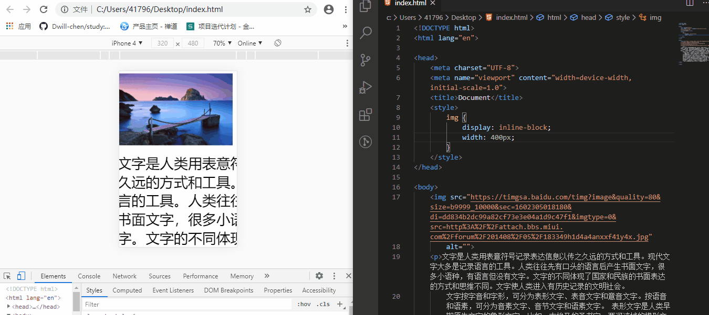
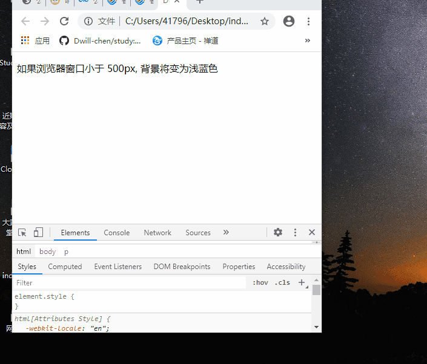
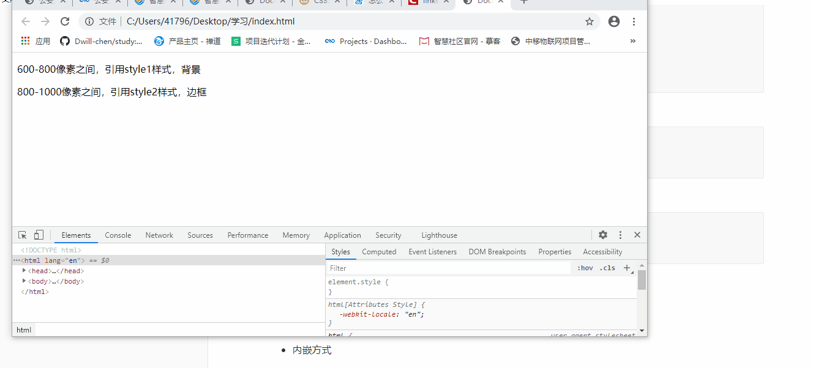

## 响应式布局

### 什么是响应式布局

- 让一个网站可 **兼容不同分辨率** 的设备
- 给用户更好的 **视觉使用体验**

  随着移动终端设备的发展，移动web开发的需求也越来越多，移动产品的屏幕规格也多样化，这对于前端开发的同志们来说是非常打脑壳的，我们不得不去为了提升用户体验而做屏幕适配。目前主流的适配方法便是使用 `bootstrap` 响应式布局，这里我们只是浅谈如何使用媒体查询 `@media` 的方式进行响应式布局。

  响应式布局是Ethan Marcotte在2010年5月份提出的一个概念，简而言之，就是一个网站能够兼容多个终端——而不是为每个终端做一个特定的版本。这个概念是为解决移动互联网浏览而诞生的。

  响应式布局可以为不同终端的用户提供更加舒适的界面和更好的用户体验，而且随着目前大屏幕移动设备的普及，用大势所趋来形容也不为过。随着越来越多的设计师采用这个技术，我们不仅看到很多的创新，还看到了一些成形的模式。

[^ tips]: 移动互联网催生了响应式布局的诞生


### 响应式布局优缺点

#### 优点

- 面对不同分辨率设备灵活性强
- 能够快捷解决多设备显示适应问题


#### 缺点

- 兼容各种设备工作量大，效率低下
- 代码累赘，会出现隐藏无用的元素，加载时间加长
- 一定程度上改变了网站原有的布局结构，会出现用户混淆的情况


#### 设计原则

- 移动优先：在设计 **初期** 就要考虑页面如何在 **多终端** 显示
- 渐进增强：充分发挥硬件设备的最大功能


### 实现方法

- CSS3-Media Queries（最简单的方式）
- 借助原生JavaScript（成本高，不推荐使用）
- 第三方开源框架（可以很好的支持浏览器响应式布局的设计）


## CSS3-Media Queries

Media Query 是制作响应式布局的一个利器，使用这个工具，我们可以非常方便快捷的制造出各种丰富的实用性强的界面。CSS3 的多媒体查询继承了 CSS2 多媒体类型的所有思想： 取代了查找设备的类型，CSS3 根据设置自适应显示。媒体查询可用于检测很多事情，

例如：

- viewport（视窗）的宽度与高度
- 设备的宽度与高度
- 朝向（智能手机横屏，竖屏）
- 分辨率等


### 自适应视窗

#### 什么是viewport

viewport 是用户网页的可视区域。

viewport 翻译为中文可以叫做"视区"。

手机浏览器是把页面放在一个虚拟的"窗口"（viewport）中，通常这个虚拟的"窗口"（viewport）比屏幕宽，这样就不用把每个网页挤到很小的窗口中（这样会破坏没有针对手机浏览器优化的网页的布局），用户可以通过平移和缩放来看网页的不同部分。


#### 设置 Viewport

一个常用的针对移动网页优化过的页面的 viewport meta 标签大致如下：

```html
<meta name="viewport" content="width=device-width, initial-scale=1.0">
```

- width：控制 viewport 的大小，可以指定的一个值，如 600，或者特殊的值，如 device-width 为设备的宽度（单位为缩放为 100% 时的 CSS 的像素）。
- height：和 width 相对应，指定高度。
- initial-scale：初始缩放比例，也即是当页面第一次 load 的时候缩放比例。
- maximum-scale：允许用户缩放到的最大比例。
- minimum-scale：允许用户缩放到的最小比例。
- user-scalable：用户是否可以手动缩放。

[^ tips]: 更多详情 https://www.jianshu.com/p/7e32131c1b47


```html
<!DOCTYPE html>
<html lang="en">

<head>
    <meta charset="UTF-8">
    <meta name="viewport" content="width=device-width, initial-scale=1.0">
    <title>Document</title>
    <style>
        img {
            display: inline-block;
            width: 400px;
        }
    </style>
</head>

<body>
    
    <p>文字是人类用表意符号记录表达信息以传之久远的方式和工具。现代文字大多是记录语言的工具。人类往往先有口头的语言后产生书面文字，很多小语种，有语言但没有文字。文字的不同体现了国家和民族的书面表达的方式和思维不同。文字使人类进入有历史记录的文明社会。
        文字按字音和字形，可分为表形文字、表音文字和意音文字。按语音和语素，可分为音素文字、音节文字和语素文字。 表形文字是人类早期原生文字的象形文字，比如：古埃及的圣书字、两河流域的楔形文字、古印度文字、美洲的玛雅文和早期的汉字。
        表音文字用少量字母（大多不到50个）组成单词记录语言的语音进行表义的文字。表音文字可分为音节文字和音素文字。音节文字是以音节为单位的文字，如日文的假名。音素文字是以音素为单位的文字，比如英文字母26个，西文字母29个，俄文字母33个。
        意音文字是由表义的象形符号和表音的声旁组成的文字，汉字是由表形文字进化成的意音文字，汉字也是语素文字。</p>
</body>

</html>
```

该meta标签的作用是让当前viewport的宽度等于设备的宽度，如果你不这样的设定的话，那就会使用那个比屏幕宽的默认viewport，也就是说会出现横向滚动条。




### 媒体查询语法

```html
@media 设备名 only(选取条件)|not(选取条件)|and(选取条件) {}
```


```css
@media only screen and (max-width: 500px){
    body {
        background-color: blue;
    }            
}
```




### 引入方式

- 外链方式

  ```css
  <link rel="stylesheet" media="mediaType and|not|only (media feature)" href="./css/xxx.css">
  ```

  [^ 解释]: 通过设定屏幕的判断条件，调用对应的css文件，该实例多用于页面不同风格的css调用与选取，使用该方法可能需要为一个页面制作多个css文件。

  ```html
  <!DOCTYPE html>
  <html lang="en">
  
  <head>
      <meta charset="UTF-8">
      <meta name="viewport" content="width=device-width, initial-scale=1.0">
      <link rel="stylesheet" type="text/css" href="./style1.css"
          media="screen and (min-width: 600px) and (max-width: 800px)">
      <link rel="stylesheet" type="text/css" href="./style2.css"
          media="screen and (min-width: 800px) and (max-width: 1000px)">
      <title>Document</title>
  </head>
  
  <body>
      <p>600-800像素之间，引用style1样式，背景</p>
      <p>800-1000像素之间，引用style2样式，边框</p>
  </body>
  
  </html>
  ```

  style1.css

  ```css
  p{
      background-color: brown;
  }
  ```

  style2.css

  ```css
  p{
      border: 1px solid black;
  }
  ```

  

- 内嵌方式

  ```css
  @media mediaType and|not|only (media feature) {
        /* css code... */
  }
  ```

  [^ tips]: 上述实例可以出现在外部样式表与内部样式表中。`mediaType` 指定媒体类型，`mediaFeature `指定判断条件。

  如果指定的多媒体类型匹配设备类型则查询结果返回 true，文档会在匹配的设备上显示指定样式效果。

  除非你使用了 not 或 only 操作符，否则所有的样式会适应在所有设备上显示效果。

  - not: not是用来排除掉某些特定的设备的，比如 @media not print（非打印设备）。
  - only: 用来定某种特别的媒体类型。对于支持Media Queries的移动设备来说，如果存在only关键字，移动设备的Web浏览器会忽略only关键字并直接根据后面的表达式应用样式文件。对于不支持Media Queries的设备但能够读取Media Type类型的Web浏览器，遇到only关键字时会忽略这个样式文件。
  - all: 所有设备，这个应该经常看到。


### 相关信息

- not|only|all

  | 类型 | 描述                                                         |
  | ---- | ------------------------------------------------------------ |
  | not  | 排除某种指定的媒体类型，换句话来说就是用于排除符合表达式的设备，比如`@media not print and （max-width:1200px）`表示排除宽度小于等于1200px的打印设备; |
  | only | 用来指定某种特定的媒体类型，可以用来排除不支持媒体查询的浏览器。 其实only很多时候是用来对那些不支持Media Query但却支持Media Type的设备隐藏样式表的。 其主要有：支持媒体特性（Media Queries）的设备，正常调用样式，此时就当only不存在；对于不支持媒体特性(Media Queries)但又支持媒体类型(Media Type)的设备，就会忽略样式，因为其先读only而不是screen；另外不支持Media Queries的浏览器，不论是否支持only，样式都不会被采用； |
  | all  | all：所有设备，如果在Media Query 中没有明确指定Media Tpe，那么其默认值就为all; |


- media type

  | 值     | 描述                             |
  | ------ | -------------------------------- |
  | all    | 用于所有多媒体类型设备           |
  | print  | 用于打印机                       |
  | screen | 用于电脑屏幕，平板，智能手机等 * |
  | speech | 用于屏幕阅读器                   |


- 可用设备参数

  | 值                      | 描述                                                         |
  | ----------------------- | ------------------------------------------------------------ |
  | aspect-ratio            | 定义输出设备中的页面可见区域宽度与高度的比率                 |
  | color                   | 定义输出设备每一组彩色原件的个数。如果不是彩色设备，则值等于0 |
  | color-index             | 定义在输出设备的彩色查询表中的条目数。如果没有使用彩色查询表，则值等于0 |
  | device-aspect-ratio     | 定义输出设备的屏幕可见宽度与高度的比率。                     |
  | device-height           | 定义输出设备的屏幕可见高度。                                 |
  | device-width            | 定义输出设备的屏幕可见宽度。                                 |
  | grid                    | 用来查询输出设备是否使用栅格或点阵。                         |
  | height                  | 定义输出设备中的页面可见区域高度。                           |
  | max-aspect-ratio        | 定义输出设备的屏幕可见宽度与高度的最大比率。                 |
  | max-color               | 定义输出设备每一组彩色原件的最大个数。                       |
  | max-color-index         | 定义在输出设备的彩色查询表中的最大条目数。                   |
  | max-device-aspect-ratio | 定义输出设备的屏幕可见宽度与高度的最大比率。                 |
  | max-device-height       | 定义输出设备的屏幕可见的最大高度。                           |
  | max-device-width        | 定义输出设备的屏幕最大可见宽度。                             |
  | max-height              | 定义输出设备中的页面最大可见区域高度。 *                     |
  | max-monochrome          | 定义在一个单色框架缓冲区中每像素包含的最大单色原件个数。     |
  | max-resolution          | 定义设备的最大分辨率。                                       |
  | max-width               | 定义输出设备中的页面最大可见区域宽度。                       |
  | min-aspect-ratio        | 定义输出设备中的页面可见区域宽度与高度的最小比率。           |
  | min-color               | 定义输出设备每一组彩色原件的最小个数。                       |
  | min-color-index         | 定义在输出设备的彩色查询表中的最小条目数。                   |
  | min-device-aspect-ratio | 定义输出设备的屏幕可见宽度与高度的最小比率。                 |
  | min-device-width        | 定义输出设备的屏幕最小可见宽度。                             |
  | min-device-height       | 定义输出设备的屏幕的最小可见高度。                           |
  | min-height              | 定义输出设备中的页面最小可见区域高度。                       |
  | min-monochrome          | 定义在一个单色框架缓冲区中每像素包含的最小单色原件个数       |
  | min-resolution          | 定义设备的最小分辨率。                                       |
  | min-width               | 定义输出设备中的页面最小可见区域宽度。 *                     |
  | monochrome              | 定义在一个单色框架缓冲区中每像素包含的单色原件个数。如果不是单色设备，则值等于0 |
  | orientation             | 定义输出设备中的页面可见区域高度是否大于或等于宽度。         |
  | resolution              | 定义设备的分辨率。如：96dpi, 300dpi, 118dpcm                 |
  | scan                    | 定义电视类设备的扫描工序。                                   |
  | width                   | 定义输出设备中的页面可见区域宽度。                           |


- 示例

  ```css
  /*1、当设备屏幕小于1180px时会采用该样式*/
  @media screen and (max-width:1180px) { css codes }
  
  /* 2、当设备屏幕大于850px时会采用该样式 */
  @media screen and (min-width:850px) {  css codes }
  
  /* 3、当设备屏幕大于850px,小于1180px时会采用该样式 */
  @media screen and (min-width:850px) and (max-width:1180px) {  css codes }
  
  /* 4、仅当电脑、手机、平板设备屏幕小于1180px时会采用该样式 */
  @media only screen and (max-width:1180px) { css codes }
  ```

  

### 注意事项

有的时候你会发现一个奇怪的问题，就是你的 @media 没有起作用。我们知道`min-width`表示最小即大于等于（`>=`），`max-width` 表示最大即小于等于（`<=`），代码从上往下依次执行，后面重复代码会覆盖之前的代码。正确的适配顺序如下：

> `max-width:num0;`：小于等于，分辨率从大写到小，如果同一选择器在更小分辨率下没有重写则会沿用css中定义的基本样式；

> `(min-width:num1) and (max-width:num2)` :大于等于num1，同时满足小于等于num2；写完 `max-width`则开始写其中间值。num1必须在num0的基础上+1px，以免覆盖之前width<=num0的样式，num2 则不要求必须在 num3 的基础上 -1px (因为后面定义的 `width >= num3` 就算 width 的 num 相等也会根据先后原则覆盖这个样式) 。

> `min-wdith: num3` 大于等于 分辨率从小写到大 如果同一选择器样式在更大分辨率下没有重写则会沿用之前 `@media` 定义的样式 其次再是 CSS中定义的基本样式


## bootstrap

具体看官网 https://www.bootcss.com/