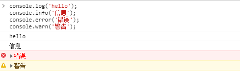
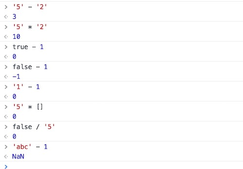

## 一、注释与语句

### 1、注释

- 单行注释：`//`
- 多行注释：`/**/`

> 提示：单行注释不能折行，可以嵌套；多行注释可以折行，不能嵌套；

<font color="red">**更多内容，查看  `请开发人员在开发前阅读` 中的 `前端注释`**</font>


### 2、语句

一段脚本就是一系列计算机能够一步一步执行的指令。每一条单独的指令或步骤就被称为一条语句。语句以分号（`;`）结尾，多个语句可以写在一行内

```javascript
let a = 10;                // 这是一条赋值语句
let b = 10; let c = a + b; // 多条语句可以写在一行内；
```

[^ tips]: 分号在 JavaScript 不是必须的，但为了养成良好的编码习惯，建议每一条语句之后都加上分号。


### 3、输出

#### a、控制台输出

除去最常用的console.log()外，还有以下方法

| 方法             | 描述                                                         | 实例                                                         |
| :--------------- | :----------------------------------------------------------- | :----------------------------------------------------------- |
| assert()         | ssert方法接受两个参数，第一个参数是表达式，第二个参数是字符串。只有当第一个参数为false，才会输出第二个参数，否则不会有任何结果。 | `// 实例 console.assert(true === false, "判断条件不成立") // Assertion failed: 判断条件不成立` |
| clear()          | 清除当前控制台的所有输出，将光标回置到第一行。               | `console.clear()`                                            |
| count()          | 用于计数，输出它被调用了多少次。                             | `(function() {  for (var i = 0; i < 5; i++) {     console.count('count');   } })();` |
| error()          | 输出信息时，在最前面加一个红色的叉，表示出错，同时会显示错误发生的堆栈。 | `console.error("Error: %s (%i)", "Server is not responding",500)` |
| group()          | 用于将显示的信息分组，可以把信息进行折叠和展开。             | `console.group('第一层');  console.group('第二层');     console.log('error');    console.error('error');    console.warn('error');   console.groupEnd();  console.groupEnd();` |
| groupCollapsed() | 与console.group方法很类似，唯一的区别是该组的内容，在第一次显示时是收起的（collapsed），而不是展开的。 | `console.groupCollapsed('第一层');  console.groupCollapsed('第二层');     console.log('error');    console.error('error');    console.warn('error');   console.groupEnd();  console.groupEnd();` |
| groupEnd()       | 结束内联分组                                                 | `console.group('Group One'); console.group('Group Two'); // some code console.groupEnd(); // Group Two 结束 console.groupEnd(); // Group One 结束` |
| info()           | console.log 别名，输出信息                                   | `console.info("runoob")`                                     |
| log()            | 输出信息                                                     | `console.log("runoob")`                                      |
| table()          | 将复合类型的数据转为表格显示。                               | `var arr= [          { num: "1"},         { num: "2"},          { num: "3" }    ]; console.table(arr); var obj= {     a:{ num: "1"},     b:{ num: "2"},     c:{ num: "3" } }; console.table(obj);` |
| time()           | 计时开始                                                     | `console.time('计时器1'); for (var i = 0; i < 100; i++) {  for (var j = 0; j < 100; j++) {} } console.timeEnd('计时器1'); console.time('计时器2'); for (var i = 0; i < 1000; i++) {  for (var j = 0; j < 1000; j++) {} } console.timeEnd('计时器2');` |
| timeEnd()        | 计时结束                                                     | `console.time('计时器1'); for (var i = 0; i < 100; i++) {  for (var j = 0; j < 100; j++) {} } console.timeEnd('计时器1'); console.time('计时器2'); for (var i = 0; i < 1000; i++) {  for (var j = 0; j < 1000; j++) {} } console.timeEnd('计时器2');` |
| trace()          | 追踪函数的调用过程                                           | `function d(a) {   console.trace();  return a; } function b(a) {   return c(a); } function c(a) {   return d(a); } var a = b('123');` |
| warn()           | 输出警告信息                                                 | `console.warn("警告")`                                       |



[^ tips]: console.info是console.log()别名


#### b、页面输出

```javascript
document.write('Hello, world!');
```


#### c、弹出的对话框

```javascript
alert('Hello, world!');
```


#### d、确认框

```javascript
confirm("您确定要退出么？");
```


#### e、输入框

```javascript
prompt("请输入您的名字");
```


## 二、变量


脚本必须暂时地存储一些完成工作所需的信息，可以将这些数据存储在变量中，变量是对“值”的引用，使用变量等同于引用一个值。每一个变量都有一个变量名。定义变量使用 `var` 关键字。

```javascript
var a = 10;
```


### 1、声明与赋值

```javascript
var a;  // 声明变量a
a = 10; // 为变量a赋值
```

[^ 提示]:你可以将变量的声明与赋值放在一起，一步到位，如 `var a = 10`，这种定义变量的方式被称为字面量定义，即在声明的同时为变量赋值。

如果只是声明变量而不为其赋值，则该变量的值是`undefined`。`undefined` 是一个JavaScript 数据类型，表示未定义。

```javascript
var a;
a; // undefined
```

你可以在同一行中声明多个变量。

```javascript
var a = 10, name = "dwillChen";
```

- 变量一定先声明，后使用，如果访问一个未定义的变量，程序将报错：

  ```javascript
  console.log(a);
  // Uncaught ReferenceError: a is not defined
  ```

- 变量为可变量，可以修改变量的值：

  ```javascript
  var a = 10;
  a; // 10
  
  a = 20;
  a; // 20
  ```

- JavaScript 允许重复定义变量，如果重复定义，之前的值将会被覆盖，如果只定义不赋值，则新定义的变量无效：

  ```javascript
  // 定义变量a
  var a = 10; 
  console.log(a); // 10
  
  // 重复定义变量a
  var a;
  console.log(a); // 10
  
  var a = 20;
  console.log(a); // 20
  ```


### 2、类型推断与typeof

JavaScript是一种动态类型的语言，也就是说变量的类型没有限制，可以赋予各种类型的值，变量的类型在赋值之后确定，JavaScript本身存在一种类型推断机制，所谓类型推断，就是根据变量的值确定变量的类型。通过 `typeof` 可以查看变量的数据类型。

```javascript
var a;
a = 10; typeof a; // 'number'
a = true; typeof a; // 'boolean'
a = 'Henrry Lee'; typeof a; // 'string'
a = function(){}; typeof a; // 'function'
a = {age:26}; typeof a; // 'object'
```

[^ tips]:  在JavaScript中，数组是一种特殊的对象类型。 因此 typeof [1,2,3,4] 返回 object。 

```javascript
typeof [1,2,3,4]             // 返回 object
```

[^tips]: 用 typeof 检测 null 返回是object。

```javascript
typeof null                  // object
```

[^ tips]: **typeof** 一个没有值的变量会返回 **undefined**

```javascript
typeof undefined             // undefined
```


### 3、变量提升

暗示全局变量（imply golbal）：任何变量未经声明（没有用 var 关键字声明）就赋值，此变量就为全局变量所有；

 a = 123;            // a 是全局变量
 var a = b = 123;        // b 是全局变量。赋值一定是从右向左的

一切声明的全局变量都是 window 的属性（window 就是全局）。


## 三、标识符

标识符（identifier）是用来识别具体对象的一个名称。最常见的标识符就是 “变量名 ”，以及后面要提到的 “函数名 ”。JavaScript语言的标识符对**大小写敏感**，所以*a*和*A*是两个不同的标识符。标识符的命名规则如下：。

- 必须以字母、美元符号(**$**)以及下划线（**_**）开头，不能以数字开头；
- 名字可以包含字母、数字、下划线、美元符。注意，在变量中不能使用连字符(***-***)和点(***.***)号；
- 不能使用关键字或保留字来对变量命名。
- 所有的变量都是大小写敏感的，变量 `x` 与变量 `X` 是不一样的；
- 变量命名必须见名知意，语义化，如创建一个数字变量，名字可以取名为 `num`，再或者要描述一个人的名字你应该取名为`name`，不能使用拼音或中文命名变量；
- 如果变量的名字由多个单词组成，则应遵守**驼峰命名**法则，即第一个单词首字母小写，后面单词首字母大写，如一个描述人的姓名的变量，正确的变量命名应该是*personName*;


## 四、关键字与保留字(了解)

**关键字**”和“**保留字**”，就是我们在进行变量命名的时候需要避免使用的两类名称。所谓“关键字”，就是JavaScript现在正常使用的一些名称，它们可能是系统变量名，也可能是一个JS内置的方法函数名，还可能是已知宿主环境提供的API。而“保留字”是现在暂时没有使用，但在未来JavaScript可能会使用的名称，这些“保留字”经过JS不断的发展，已经有一些成为了“关键字”。

- 关键字

| break    | do     | instanceof | typeof    | if       | else      |
| -------- | ------ | ---------- | --------- | -------- | --------- |
| case     | var    | new        | finally   | return   | void      |
| continue | for    | switch     | while     | debugger | function  |
| this     | with   | try        | catch     | throw    | delete    |
| default  | in     | implements | package   | public   | interface |
| private  | static | let        | protected | yield    |           |

- 保留字

| abstract | enum    | int    | short | boolean | export       |
| -------- | ------- | ------ | ----- | ------- | ------------ |
| byte     | extends | long   | super | native  | synchronized |
| class    | float   | throws | const | goto    | transient    |
| volatile | double  | import |       |         |              |

但是需要明白的是JavaScript中的“关键字”和“保留字”也不是一成不变的，它们也会随着这个语言的发展新增或删除（例如“debugger”就是ECMAScript 5中新增的关键字）。但考虑到“向上兼容”，以前提出的这些“关键字”和“保留字”也应该在规范出现更改之后也避免去使用，以免造成程序异常。


## 五、变量作用域

JavaScript变量分为“局部变量”和“全局变量”。所谓“局部变量”就是指所定义的变量只会在一个限定的范围内生效，通常指在某一个函数（function）内。而通过全局的方法或者其它函数是无法获取该变量的值的。

而“全局变量”，它的值可以被所有的方法或函数获取到。通常将一个变量写在所有函数的外部的变量，就叫做“全局变量”，但是在函数内部，若忘记在变量名前加上`var`的话，该变量也会成为全局变量，从而不小心被其它函数将值给误改了，所以在函数内部一定要记得在变量名前加上关键字 `var` 来定义一个变量。

[^ 注意]: 函数内部，没有var时，该变量会成为全局变量，影响如下

```javascript
// 有var的时候
var x = 5;
function aFn() {
    var x = 10;
};
aFn();
console.log(x);		// 5
```


```javascript
// 没有var的时候
var x = 5;
function aFn() {
    x = 10;
};
aFn();
console.log(x);		// 10
```

> 解析：函数内部，存在var的时候，函数内部的赋值，只存在于这个函数的局部作用域，并不会影响到外面的值。没有var的时候，函数内部的赋值，变为全局变量，会影响到函数外部的变量的值。


```javascript
var a = "全局变量";
function print() {
  // a 为全局变量，在任意位置都可以访问
  console.log(a);    
}

function test(y) {
  // 参数 y 也为局部变量
  // x 在函数内部创建，为一个局部变量
  var x = "局部变量"; 
}
console.log(x); // x 为局部变量，此处不能访问x变量，程序会报错
console.log(y); // y 为局部变量，此处不能访问y变量，程序会报错    
```


变量作用域表示变量起作用的范围，全局变量的作用域为整个文件内部，称之为**全局作用域**。而局部变量的作用域通常限于函数内部，称之为**函数作用域**。

```javascript
// 立即执行函数
(function () {
    var str = 'Hello, World!';
    console.log(str);
})();
```


## 六、运算符与表达式

### a、基本运算符

​	基本运算符主要用于一些数值操作

- `+`：加法运算符，如 `a + b`
- `-`：减法运算符，如 `a - b`
- `*`：乘法运算符，如 `a * b`
- `/`：除法运算符，如 `a / b`
- `%`：模运算（取余数），如 `a % b`
- `++`：自增运算符（自身+1）
- `--`：自减运算符（自身-1）

[^ 提示]:自增与自减运算符都是让自身 `+1` 或 `-1`，在使用上无差别，这里以自增运算符为例。
[^1]:无论 `++` 运算符在变量前还是在变量后，变量自身都会 `+1`

```javascript
var a = 10;
a++; // 11
++a; // 12
```

[^ 2]: `++` 在前，先自增、再赋值；`++` 在后，先赋值，再自增

```javascript
var a = 10;
var x = ++a; // x = 11, a = 11

var a = 10;
var x = a++; // x = 10, a = 11
```


### b、赋值运算符

赋值运算符是为JavaScript中的变量赋值，即将该运算符右方计算出的值赋予左侧的变量。

`=`：赋值运算符，如 `x = 10;` ，将 `10` 赋值给变量 `x`


### c、复合运算符

- `+=`：变量与值相加，如 `x += y;` 相当于 `x = x + y`
- `-=`：变量与值相加，如 `x -= y;` 相当于 `x = x - y`
- `*=`：变量与值相加，如 `x *= y;` 相当于 `x = x * y`
- `/=`：变量与值相加，如 `x /= y;` 相当于 `x = x / y`
- `%=`：变量与值相加，如 `x %= y;` 相当于 `x = x % y`


### d、关系运算符

关系运算符描述两个变量的关系，其返回值类型为布尔类型（boolean），即 `true` 和 `false`。

- `==`：判断两个变量是否相等，如 `'Henrry Lee' == 'Henrry Lee'`，返回 `true`
- `!=`：判断两个变量是否不相等
- `>`：判断等号左边的变量是否大于等号右边的变量，如 `20 > 10`，返回 `true`
- `<`：判断等号左边的变量是否小于等号右边的变量，如 `20 < 10` ，返回 `false`
- `>=`：判断等号左边的变量是否大于等于等号右边的变量，如 `20 >= 10`，返回 `true`
- `<=`：判断等号左边的变量是否小于等于等号右边的变量，如 `20 <= 10`，返回 `false`
- `===`：恒等于，要求不仅数据类型要一致，值也要一致，如 `1 === '1'`，返回 `false`
- `!==`：不恒等于，只要类型或值不一样，结果为true，如 `1 !== '1'`，返回 `true`


### e、逻辑运算符

逻辑运算符是JavaScript用于判断几条语句成立情况的一种运算，该运算符的返回值类型为布尔类型。

- 逻辑与：`&&` ，同时为真才为真，如 `(1 > 2) && (2 > 3)`，返回 `false`
- 逻辑或：`||` ，同时为假才为假，如 `(1 > 2) || (2 > 1)`，返回 `true`
- 逻辑非：` !` ，取反，如 `!(1 > 2)`，返回 `true`


### f、三元运算符

三元运算用于条件判断，根据判断的结果执行不同的语句，其语法形式为：`a ? b : c`。如果a表达式的条件为真，则执行b语句，否则执行c语句。我们来看一个示例：

```javascript
var isLogin = true; // 定义变量’isLogin‘用于记录登录状态
isLogin ? console.log('已登录！') : console.log('未登录！');
```

上述代码使用三目运算符根据登录状态执行不同的语句，代码中的 `console.log()` 函数用于向控制台输出信息。由于定义的变量值为true，因此上述代码执行后会在控制台输出：“已登录！”


### g、优先级

[运算符优先级 MDN](https://developer.mozilla.org/zh-CN/docs/Web/JavaScript/Reference/Operators/Operator_Precedence)


## 七、基本数据类型概述

- 基本类型：String，Number，Boolean，Null，Undefined
- 引用类型：Object，Array，Function

基本数据类型：**按值**访问，可操作保存在变量中的**实际的值**。基本类型值指的是简单的数据段。

引用类型：当复制保存着对象的某个变量时，操作的是对象的**引用**，但在为对象添加属性时，操作的是实际的对象。引用类型值指那些可能为多个值构成的对象。引用类型值指那些可能为多个值构成的对象。

[^ tips]: JS高级程序设计，这本书中有详细的介绍，下面只做简单的解析。

```javascript
let a = "1";
let b = [1, 2, 3, 4];
let c = a;
let d = b;
c = "2";
console.log(a); // 1 a的值不会随c值得改变而改变
d[0] = 10;
console.log(b); // [10, 2, 3, 4], b的值随着d的值改变而改，因为他们指向同一个内存地址
```


```javascript
let a = [1, 2, 3];
let b = a;
b = [4, 5, 6];  // b指向了另一个内存地址，与a断开关联
console.log(a); // [1, 2, 3] 
```

[^ 总结]: 可以简单的理解为，var a = 1; 1是基本数据类型，因此变量a存放的就是1这个值；var b = [1,2,3]，[1,2,3]是引用数据类型，[1,2,3]是放在内存中的，而变量b存放的是[1,2,3]的地址，而不是[1,2,3]这个值


## 八、类型转换

JavaScript是一种动态类型语言，变量没有类型限制，可以随时赋予任意值。

```javascript
var x = y ? 3.14 : "china";
```

上面代码中，变量 `x` 到底是数值还是字符串，取决于另一个变量 `y` 的值。只有在代码运行时，才可能知道 `x` 的类型。虽然变量没有类型，但是数据本身和各种运算符是有类型的。如果运算符发现，数据的类型与预期不符，就会自动转换类型。比如，减法运算符预期两侧的运算对象应该是数值，如果不是，就会自动将它们转为数值。

```javascript
'4' - '3' // 1  number
```

上面代码中，虽然是两个字符串相减，但是依然会得到结果 `1`，原因就在于JavaScript将它们自动转为了数值。

### a、强制转换

强制转换主要指使用 `Number()`、`String()` 和  `Boolean()` 三个构造函数，手动将各种类型的值，转换成数字、字符串或者布尔值。

#### a.1 Number() 

使用 `Number` 函数，可以将任意类型的值转化成数值。下面分成两种情况讨论，一种是参数是原始类型的值，另一种是参数是对象。

##### a.1.1 原始类型值的转换规则

原始类型的值主要是字符串、布尔值、undefined 和 null，它们都能被 Number 转成数值或 NaN（not a number 非数字）。

```javascript
// 数值：转换后，还是原来的值
console.log(Number(123));

// 字符串：如果可以被解析为数值，则转换为相应的数值
console.log(Number("123"));

// 字符串：如果不可以被解析为数值，则返回NAN
console.log(Number("123abc"));

// 空字符串： 转换为0
console.log(Number(""));

// 布尔值：true转成1，false转成0
console.log(Number(true));
console.log(Number(false));

// undefined： 转成NAN
console.log(Number(undefined));

// null： 转成0
console.log(Number(null));
```

`Number` 函数将字符串转为数值，要比 *parseInt* 函数严格很多。基本上，只要有一个字符无法转成数值，整个字符串就会被转为*NaN*。

```javascript
console.log(parseInt("10 cars"));   // 10
console.log(Number("10 cars"));     // NAN
```

上面代码中，`parseInt` 逐个解析字符，而 `Number` 函数整体转换字符串的类型。

##### a.1.2 对象的转换规则

简单的规则是，`Number` 方法的参数是对象时，将返回 `NaN`。

```javascript
console.log(Number({ a: "1", b: "2" }));    // NAN
console.log(Number([1, 2, 3, 4, 5]));       // NAN
console.log(Number(function () { }));       // NAN
console.log(Number(new Object('Hi')));      // NAN
```


#### a.2 String()

使用 `String` 函数，可以将任意类型的值转化成字符串。转换规则如下。

##### a.2.1 原始类型值的转换规则

- **数值**：转为相应的字符串。
- **字符串**：转换后还是原来的值。
- **布尔值**：*true*转为*"true"*，*false*转为*"false"*。
- **undefined**：转为*"undefined"*。
- **null**：转为*"null"*。

```javascript
console.log(String(123));       // "123"
console.log(String(1.23));      // "1.23"
console.log(String("abc"));     // "abc"
console.log(String(true));      // "true"
console.log(String(false));     // "false"
console.log(String(null));      // "null"
console.log(String(undefined)); // "undefined"
```

##### a.2.2 对象的转换规则

`String` 方法的参数如果是对象，返回一个类型字符串；如果是数组，返回该数组的字符串形式。

```javascript
console.log(String({ a: "1", b: "2" }));       // "[object Object]"
console.log(String([1, 2, 3, 4, 5]));      // "1,2,3,4,5"
```


#### a.3 Boolean()

使用 `Boolean` 函数，可以将任意类型的变量转为布尔值。它的转换规则相对简单：除了以下六个值的转换结果为 `false` ，其他的值全部为 `true`。

- **undefined**
- **null**
- **-0、0、+0**
- **NaN**
- **”“**（空字符串）

```javascript
Boolean(null)
false
Boolean(undefined)
false
Boolean(0)
false
Boolean(NaN)
false
Boolean("")
false
Boolean(-0)
false
Boolean(+0)
false
```

[^ tips]: 所有对象（包括空对象）的转换结果都是*true*，甚至连*false*对应的布尔对象*new Boolean(false)*也是*true*。

```javascript
Boolean({})
true
Boolean([])
true
Boolean(new Boolean(false))
true
```

所有对象的布尔值都是 `true`，这是因为JavaScript语言设计的时候，出于性能的考虑，如果对象需要计算才能得到布尔值，对于 `obj1 && obj2` 这样的场景，可能会需要较多的计算。为了保证性能，就统一规定，对象的布尔值为 `true`。


### b、自动转换

下面介绍自动转换，它是以强制转换为基础的。

遇到以下三种情况时，JavaScript会自动转换数据类型，即转换是自动完成的，对用户不可见。

```javascript
// 1. 不同类型的数据互相运算
123 + 'abc' // "123abc"

// 2. 对非布尔值类型的数据求布尔值
if ('abc') {
  console.log('hello')
}  // "hello"

// 3. 对非数值类型的数据使用一元运算符（即“+”和“-”）
+ {foo: 'bar'} // NaN
- [1, 2, 3] // NaN
```

自动转换的规则是这样的：预期什么类型的值，就调用该类型的转换函数。比如，某个位置预期为字符串，就调用***String***函数进行转换。如果该位置即可以是字符串，也可能是数值，那么默认转为数值。

  由于自动转换具有不确定性，而且不易除错，建议在预期为布尔值、数值、字符串的地方，全部使用 *Boolean()*、*Number()* 和 *String()* 函数进行显式转换。

#### b.1 自动转换为布尔值

当JavaScript遇到预期为布尔值的地方（比如`if`语句的条件部分），就会将非布尔值的参数自动转换为布尔值。系统内部会自动调用 **Boolean**函数。

  因此除了以下六个值，其他都是自动转为 `true`。

- **undefined**
- **null**
- **-0**
- **0**或**+0**
- **NaN**
- **''**（空字符串）

  下面这个例子中，条件部分的每个值都相当于 `false`，使用否定运算符后，就变成了 `true`。

```javascript
if ( !undefined
  && !null
  && !0
  && !NaN
  && !''
) {
  console.log('true');
} // true
```


#### b.2 自动转换为字符串

​		当JavaScript遇到预期为字符串的地方，就会将非字符串的数据自动转为字符串。系统内部会自动调用 *String()* 函数。

  字符串的自动转换，主要发生在加法运算时。当一个值为字符串，另一个值为非字符串，则后者转为字符串。

```javascript
"5"+1
"51"

"5"+true
"5true"

"5"+false
"5false"

"5"+{}
"5[object Object]"

"5"+[]
"5"

"5"+function(){}
"5function(){}"

"5"+undefined
"5undefined"

"5"+null
"5null"
```

 这种自动转换很容易出错。

```javascript
var obj = {
    width: "120"
};
console.log(obj.width + 20);    // 12020
// 解决方案
console.log(Number(obj.width) + 20);    // 140
```

上面代码中，开发者可能期望返回 *140*，但是由于自动转换，实际上返回了一个字符 *12020*。


#### b.3 自动转换为数值

当JavaScript遇到预期为数值的地方，就会将参数值自动转换为数值。系统内部会自动调用 *Number()* 函数。

除了加法运算符有可能把运算对象转为字符串，其他运算符都会把运算对象自动转成数值。



上面代码中，运算符两侧的运算对象，都被转成了数值。

一元运算符也会把运算对象转成数值。


### c、类型转换优化

显示转换比隐示转换性能更好；

在一般转换中，还可以通过如下示例提升性能。

```javascript
var n = "3.14";
"" + n; // -> string
~~n;    // -> integer
1 * n;  // -> float
!!n;    // -> boolean
[n];    // -> array
```


## 九、类型分类

通过按值来访问数据，其类型可分为两大类：

- 值类型：数值、字符串、布尔值、null、undefined...
- 引用类型：对象、数组、函数...