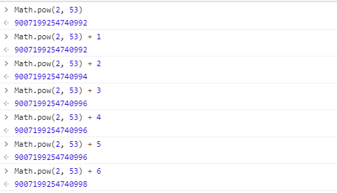
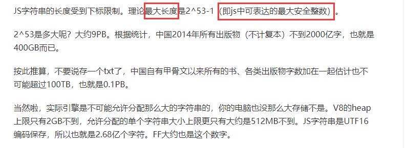
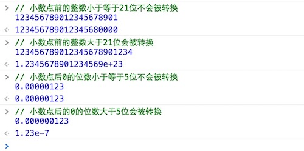
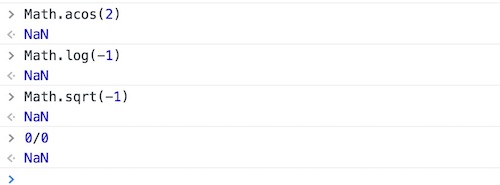
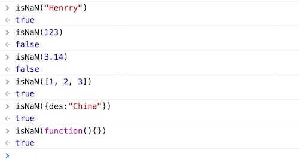
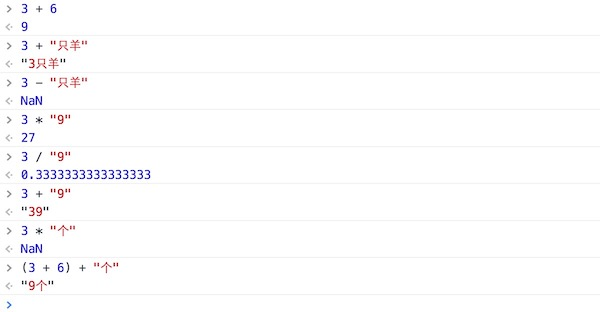
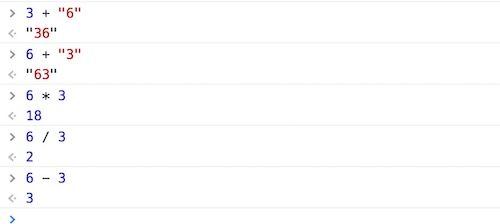
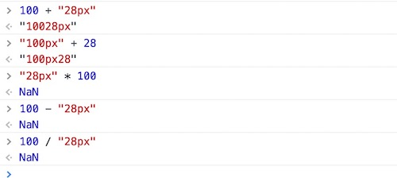
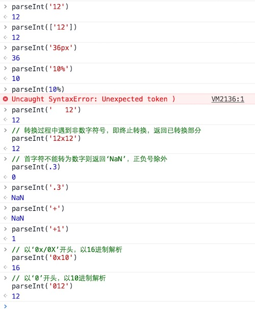
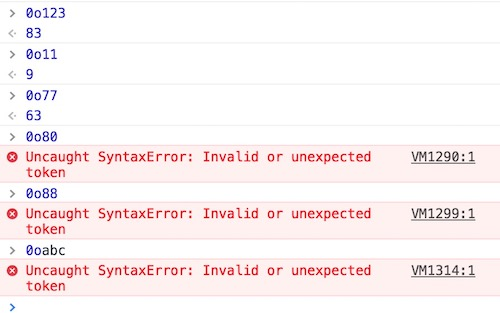

## 一、概述

数值型作为JavaScript中一个**基本数据类型**在程序中是不可或缺的，程序中的逻辑实现、条件判断都直接或间接地需要数值才能实现。比如说对数组的操作，循环语句的实现，没有数值型这种数据类型是办不到的。当然，这只是指这种数据类型在程序中的运用。谈到实际的项目，像金融这一类的网站或应用，如果对数值型这个数据类型没有充分的了解，做出的成品是很难有质量保证的，其所表示的数据准确性也会饱受怀疑，在对互联网软件产品质量要求越来越高的今天，这样的产品是达不到上线要求的。

在JavaScript中，所有的数字都是以 64位**浮点数（小数）**的形式存储的，就算是表面上看到的是一个整数，实质上它也是一个浮点数。如“**1**”和“**1.0**”完全是同一个数，执行“**1 === 1.0** ”会返回“**true**”的布尔值。其实在JavaScript语言的底层，根本没有整数（其他编程语言是“**int**”型）这个类型 。但有的时候JavaScript的值的计算必须要整数才能完成，JavaScript的做法也只是将它64位的数值转换为32位再进行运算而已。


## 二、数值型的精度问题

**浮点数始终是一个不精确的数**，在进行浮点数运算的时候会出现一些意料外的情况。比如现在我们拿以下几个浮点数在控制台内进行运算输出，观察结果：


可以发现，浮点数在做加法运算的时候，它的值并不是一个精确的 **0.3** 。

所以，在进行一些 **需要高精度的整数计算** 的时候，最好能对运算数使用保留小数点的方法“**toFixed()**”，再用对应的十分位数相乘转换回原始计算结果，该方法的括号内需要有一个参数，参数是一个数值型，如**toFixed(2)**”表示计算结果保留两位小数，然后将得出的结果乘以“100”即会得到一个相对精确的整数。

[^ 更多详情]: https://www.cnblogs.com/xinggood/p/6639022.html


根据**IEEE 754**规定，JavaScript能精确表示的数值范围在*-(2<sup>53</sup>-1)到2<sup>53</sup>-1*之间。在JavaScript中对数值求幂（N次方）的函数是“ `Math.pow(binary,power)` ，其中“binary”是指“底数”，函数中的参数意思就是“binary”的“power”次幂（次方），如“Math.pow(5,3)”得出的结果就是125，表示5的3次方。所以，针对上述原理，我们可以算出JavaScript最大能保留的精度数值，写作：Math.pow(2,53)。我们在控制台内做这样一个实验：



从上面示例可以看到，大于2的53次方以后，整数运算的结果开始出现错误。所以，大于等于2的53次方的数值，都无法保持精度。而且大于该值 **位数** 的值都不能被保存，会被自动省略掉。

[^ tips]:注意是 位数，详情如下：




JavaScript还能采用科学计数法来表示一个数值，将数字写在“e”或“E”后方表示指数，如：

```javascript
123e2  //  12300
-123e2  // -12300

0.0314e2 //  3.14
-0.0314e2 // -3.14
```


有两种情况，JavaScript会将一个数值自动转换为科学计数法，一种是小数点前多于21位的数字，另外一种是小数点后的“0”多于5位的情况，如：




## 三、NAN

### 3.1 含义

在数值型数据中，有一个特殊值 `NaN`，它表示的是 “非数字”（ Not a Number），主要出现在将字符串解析成数字出错的场合。

```javascript
Number("x");
NaN
```

上面代码运行时，会自动将字符串*x*转为数值，但是由于*x*不是数值，所以最后得到结果为 `NaN`，表示它是“非数字”。

另外，一些数学函数及运算操作的结果会出现 `NaN`。



需要注意的是，`NaN` 不是一种独立的数据类型，而是一种特殊数值，它的数据类型依然属于**Number**，使用 `typeof`  运算符可以查看数据类型。

```javascript
typeof NaN;
"number"
```


### 3.2 运算规则

1. `NaN` 不等于任何值，包括它本身。

   ```javascript
   NaN === NaN; // false
   ```

2. `NaN` 在布尔运算时被当作 `false`。

   ```javascript
   Boolean(NaN); // false 
   ```

3. `NaN` 与任何数（包括它自己）的运算，得到的都是 `NaN`。

   ```javascript
   NaN + 32; // NaN
   NaN - 32; // NaN
   NaN * 32; // NaN
   NaN / 32; // NaN
   ```


### 3.3 判断NaN的方法

要判断一个数据的值是否是“NaN”，JavaScript提供了一个方法：`isNaN(param)`，将需要判断的值或变量作为参数放置于该方法内，即可根据返回的值判断该值或变量是否为一个“NaN”，该方法的返回值是一个布尔值，如果返回的值为true，表示值为NaN，如果返回的值为false，那就表示它的值不是NaN，如例：



可以发现，其实直接对值类型进行判断的情况下，除了数值型以外，返回的结果都是true，当然也包括它自身`isNaN(NaN)`，得出的结果同样是true。NaN产生的条件是：当参与**算术运算**中的某个值不为数值型的值，那返回的结果就会为NaN。但“*+*”运算符比较特殊，因为有的时候它是可以作为字符串拼接运算符的。观察控制台中输出的结果：




## 四、数值转换

在实际的数值获取中，很多时候取到的数值并非是以数值存在的。如：字符串*"3"*，像素单位*"30px"*，单个数组元素 *[30]* 等，这些类型的值在参与和数值型算术运算时会产生意外的结果，如，一个数值在和一个字符串、像素单位值或单个数组进行“***+***”运算时，起到的是一个“**字符串拼接**”的作用，而在执行“-”、“×”或“÷”运算时又是进行基本算术运算。如例：



当然，上面这些“非数值”的内容都还是一个数值内容，能通过程序自动转换的情况。倘若取到的值是一个带单位的，情况又有所不同了：



在数值转换中，除了自动转换，还包括下面几个转换方法：


### 1、parseInt()

- 作用：转换结果为整数

- 转换规则：从左往右依次转换，直到遇到非数字字符为止。

- 定义和用法：

  ```javascript
  parseInt(string, radix)
  ```

  parseInt() 函数可解析一个 **字符串** ，并返回一个 **整数** 。

  当参数 radix 的值为 0，或没有设置该参数时，parseInt() 会根据 string 来判断数字的基数。

  当忽略参数 radix , JavaScript 默认数字的基数如下:

  - 如果 string 以 "0x" 开头，parseInt() 会把 string 的其余部分解析为十六进制的整数。
  - 如果 string 以 0 开头，那么 ECMAScript v3 允许 parseInt() 的一个实现把其后的字符解析为八进制或十六进制的数字。
  - 如果 string 以 1 ~ 9 的数字开头，parseInt() 将把它解析为十进制的整数。



[^ tips]: parseInt 只接受一个参数时，可以当做第二个参数默认是10。转换结果不是**十进制数** 就是**NaN**。parseInt 能转换数组首元素

`parseInt` 不能转换科学计数法，在转换科学计数法的数字时，会省略`e`后面的内容：

```javascript
parseInt("314e-2") // 314
parseInt("21e3")   // 21
```


### 2、parseFloat()

作用：可解析一个字符串，并返回一个浮点数。

转换规则：从左往右依次转换，直到遇到非数字字符为止。

```javascript
parseFloat(string)
```


```javascript
parseFloat('20.25')   // 20.25
parseFloat(['20.25']) // 20.25
// 可以科学计数法
parseFloat('20.25e2') // 2025
parseFloat('1234e-2') // 12.34
parseFloat('3.14abc') // 3.14
parseFloat('   3.14')  // 3.14

parseFloat('A2') // NaN
parseFloat('[]') // NaN
parseFloat('  ') // NaN
```


### 3、Number()

Number() 函数把对象的值转换为数字。

如果对象的值无法转换为数字，那么 Number() 函数返回 NaN。

```javascript
Number("1");    // 1
Number("3.14"); // 3.14
Number("12e2"); // 1200
Number("3x14"); // NaN
```


## 五、数值进制

作为一门计算机语言，JavaScript自然也支持四种基本的进制表示法，它们分别是：十进制、二进制、八进制和十六进制。

### 1、十进制

日常生活中的数字


### 2、二进制

需要在数值之前加上**前导数**：“`0b`”或“`0B`”，且前导数后方的数值不能大于`1`，或是其它内容，否则浏览器会报错，如：


### 3、八进制

需要在数值之前加上前导数：“`0o`”或“`0O`”，且前导数后方的数值不能大于`7`，或是其它内容，否则浏览器会报错容，如：




### 4、十六进制

需要在数值之前加上前导数：“`0x`”或“`0X`”，且前导数后方的数值不能大于`f`或`F`（相当于十进制内的15），或是其它内容，否则浏览器会报错，如：


## 六、进制转换

通过 `parseInt` 方法，可以将任意进制数转换为十进制数。但当需要转换的进制数为一个字符串时，该方法只能对十六进制的数进行正确的转换。

```javascript
parseInt(0b1010)   // 10
parseInt(0o12)   // 10
parseInt(0xA)  // 10

parseInt("0b1010") // 异常 ‘0’
parseInt("0o12") // 异常 ‘0’
parseInt("0xA") // 10
```

但我们在实际的项目操作中获取到的进制数大多是以字符串的形式存在的，这里我们可以使用 *parseInt* 的第二个参数，该参数可以告诉该方法需要转换的字符是何种进制的，并将其转换为十进制的数。需要注 意的是，如果配置了第二个参数，那第一个参数就不能包含前导数了，否则除了十六进制会出现异常。

```javascript
parseInt("1010", 2);
10
parseInt("0b1010", 2);
0 // 异常
parseInt("12", 8);
10
parseInt("0o12", 8);
0 // 异常
parseInt("A", 16);
10
parseInt("0xA", 16);
10
```

`parseInt` 方法的第二个参数除了上述几种形式之外还可以为其他进制数，它的范围是2~36之间的数值，只有在这个范围内才会返回有意义的数值，如果超出这个范围则会返回`NaN`。

```javascript
parseInt("11", 2)  // 二进制 3
parseInt("11", 3)  // 三进制 4
parseInt("11", 4)  // 四进制 5
parseInt("11", 36) // 三十六进制 37

parseInt("11", 1)  // 一进制，异常
parseInt("11", 37) // 三十七进制，异常
```

上面提到的，是将各种进制数转换为十进制数，有时你可能想将一个十进制数转换为其他进制数，这时我们可以使用 `toString()` 方法，括号里面的参数为转换到的进制，如下所示：

```javascript
(10).toString(2)  // "1010"
(10).toString(8)  // "12"
(10).toString(16) // "a"
```


## 七、数值对象

### 什么是包装对象

对象是 JavaScript 语言最主要的数据类型，三种原始类型的值——数值、字符串、布尔值——在一定条件下，也会自动转为对象，也就是原始类型的“包装对象”（`wrapper`）。

所谓“包装对象”，指的是与数值、字符串、布尔值分别相对应的`Number`、`String`、`Boolean`三个原生对象。**这三个原生对象可以把原始类型的值变成（包装成）对象。**

```javascript
var v1 = new Number(123);
var v2 = new String('abc');
var v3 = new Boolean(true);

typeof v1 // "object"
typeof v2 // "object"
typeof v3 // "object"

v1 === 123 // false
v2 === 'abc' // false
v3 === true // false
```


### 1、简介

**Number** 对象是数值对应的包装对象，可以作为构造函数使用，也可以作为工具函数使用。

```javascript
 // 1、构造函数使用，生成数值对象
var n = new Number(1); // 1
typeof n; // "object"

// 2、工具函数使用，类型转换
Number('3.14'); // 3.14
```


### 2、属性

| 属性                                                         | 描述                                                         |
| :----------------------------------------------------------- | :----------------------------------------------------------- |
| [`Number.MAX_VALUE`](https://developer.mozilla.org/zh-CN/docs/Web/JavaScript/Reference/Global_Objects/Number/MAX_VALUE) | 可表示的最大正数                                             |
| [`Number.MIN_VALUE`](https://developer.mozilla.org/zh-CN/docs/Web/JavaScript/Reference/Global_Objects/Number/MIN_VALUE) | 可表示的最小正数，最大的负数是 `-MIN_VALUE`。                |
| [`Number.NaN`](https://developer.mozilla.org/zh-CN/docs/Web/JavaScript/Reference/Global_Objects/Number/NaN) | 特指”非数字“                                                 |
| [`Number.NEGATIVE_INFINITY`](https://developer.mozilla.org/zh-CN/docs/Web/JavaScript/Reference/Global_Objects/Number/NEGATIVE_INFINITY) | 特指“负无穷”;在溢出时返回                                    |
| [`Number.POSITIVE_INFINITY`](https://developer.mozilla.org/zh-CN/docs/Web/JavaScript/Reference/Global_Objects/Number/POSITIVE_INFINITY) | 特指“正无穷”;在溢出时返回                                    |
| [`Number.EPSILON`](https://developer.mozilla.org/zh-CN/docs/Web/JavaScript/Reference/Global_Objects/Number/EPSILON) | 表示1和比最接近1且大于1的最小[`Number`](https://developer.mozilla.org/zh-CN/docs/Web/JavaScript/Reference/Global_Objects/Number)之间的差别 |
| [`Number.MIN_SAFE_INTEGER`](https://developer.mozilla.org/zh-CN/docs/Web/JavaScript/Reference/Global_Objects/Number/MIN_SAFE_INTEGER) | JavaScript最小安全整数.                                      |
| [`Number.MAX_SAFE_INTEGER`](https://developer.mozilla.org/zh-CN/docs/Web/JavaScript/Reference/Global_Objects/Number/MAX_SAFE_INTEGER) | JavaScript最大安全整数.                                      |


### 3、方法

#### 3.1 toString() 

`toString()`  方法用于将数值转为字符串

```javascript
var n = 3.14;
n.toString();      // "3.14"

(101).toString();  // "101"
(3.2).toString();  // "3.2"
```

`toString` 方法可以接受一个参数，表示输出的进制。如果省略这个参数，默认将数值先转为十进制，再输出字符串；否则，就根据参数指定的进制，将一个数字转化成某个进制的字符串。

```javascript
(10).toString(2)  // "1010"
(10).toString(8)  // "12"
(10).toString(16) // "a"
```

上面代码中，之所以要把10放在括号里，是为了表明10是一个单独的数值，后面的点表示调用对象属性。如果不加括号，这个点会被JavaScript引擎**解释成小数点**，从而报错。

```javascript
10.toString(2)
// SyntaxError: Unexpected token ILLEGAL
```

只要能够让JavaScript引擎不混淆小数点和对象的点运算符，各种写法都能用，一般建议使用括号`()` 区分。

```javascript
10..toString()  // "10"
10 .toString()  // "10"
10.0.toString() // "10"
(10).toString() // "10"
```


#### 3.2 toFixed()

`toFixed` 方法用于将一个数转为**指定位数**的小数，返回这个小数对应的字符串

```javascript
(10).toFixed(2) // "10.00"

(3.1415926).toFixed(2) // "3.14"
(3.1415926).toFixed(3) // "3.141"
```

[^ tips]: toFixed的规则并不是所谓的“四舍五入”或者是“四舍六入五成双”，所谓“四舍六入五成双”，在百度百科上给的解释是：也即“4舍6入5凑偶”这里“四”是指≤4 时舍去，"六"是指≥6时进上，"五"指的是根据5后面的数字来定，当5后有数时，舍5入1；当5后无有效数字时，需要分两种情况来讲：①5前为奇数，舍5入1；②5前为偶数，舍5不进。（0是最小的偶数） 。
[^ 解决]: 实际上要处理精度问题，需要重新写方法：

1. 将数值，转为字符串

   ```javascript
   1.23456789 => "1.23456789"
   // 如1.23456789 需要精确6位 变为 1.234568
   ```

2. 再通过保留的位数，截取对应长度的字符串+1

   ```javascript
   // 保留6位，那么就截取小数后的7位
   "1.23456789" => "1.2345678"
   ```

3. 在对字符串处理，乘以10的(多少位+1)次方，变为整数字符串

   ```javascript
   "1.2345678" => "12345678"
   ```

4. 判断

   ```javascript
   // 通过if和截取，判断最后一位的值
   // <5，那么倒数第二位至首位不变
   // >=5，那么倒数第二位至首位转为数值，再+1
   "12345678" => 1234567  和  8
   8 >= 5成立，1234567+1 变为1234568
   1234568再转为字符串"1234568"
   ```

5. 得到的数值，根据上面的精确位置，添加小数点

   ```javascript
   "1234568" => "1.234568"
   ```

6. 使用其他方式，Math.round()

   Math.round(): 方法可把一个数字舍入为最**接近的整数**。

   我们可以通过他的这个特性，先把小数乘以我们需要保留的位数，再做除法运算，如：

   ```javascript
   var num = 2.235556724
   var newNum = Math.round(num * 1000) / 1000
   console.log(newNum)	// 2.236
   ```

   

#### 3.3 toExponential()

`toExponential` 方法用于将一个数转为科学计数法形式。该方法的参数表示小数点后有效数字的位数，范围为0到20，超出这个范围，会抛出一个RangeError。

```javascript
(12345).toExponential(1);
"1.2e+4"
(12345).toExponential(2);
"1.23e+4"
(12345).toExponential(3);
"1.235e+4"
(12345).toExponential(4);
"1.2345e+4"
```


#### 3.4.toPrecision()

`toPrecision`方法用于将一个数转为指定位数的有效数字。

```javascript
(123).toPrecision(1);
"1e+2"
(123).toPrecision(2);
"1.2e+2"
(123).toPrecision(3);
"123"
(123).toPrecision(4);
"123.0"
(123).toPrecision(5);
"123.00"
```

`toPrecision` 方法用于四舍五入时不太可靠，跟浮点数不是精确储存有关。

```javascript
(3.1415926).toPrecision(1) // 3
(3.1415926).toPrecision(2) // 3.1
(3.1415926).toPrecision(3) // 3.14
(3.1415926).toPrecision(4) // 3.141
```

