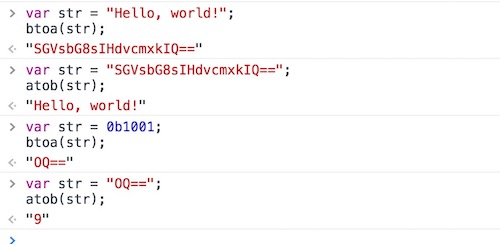
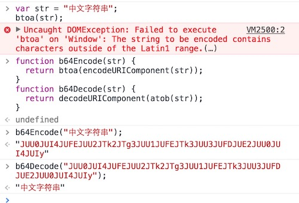

## 一、概述

在JavaScript中，所谓字符串就是包含在英文“**双引号**”或‘**单引号**’中的内容，可以是数字、运算符号、各国语言、特殊编码字符，甚至还能是HTML的标签。也就是说，只要符合在双引号或单引号中这个要求，计算机文本中的内容基本上都可以成为一个字符串，ES6新引入了模板字符串，使用反引号（**`**）标识。


## 二、字符串引号使用规则

在使用字符串的引号时需要注意，如果一个字符串已经使用过引号，若再在字符串内使用引号需要使用另外一个引号。即双引号内使用单引号，单引号内使用双引号，或者使用转义符 `\` 对同样的引号进行转换，多层引号嵌套，该规则同样适用，如：

```javascript
var str1 = "Hello, I'm Petter!";
var str2 = 'How do you think about "JavaScript"?';
var str3 = "设置字体的'颜色'代码是：<p style=\"color:red;\">";	
```

需要了解的一个字符串常识就是，字符串不能直接分成多行去写，否则浏览器会报错。如果字符串过长，需要进行换行使视觉层次上更加地清晰，那需要这样去写：

```javascript
var str = "这是一个" + 
          "分行写的" +
          "字符串";
console.log(str); // 输出：这是一个分行写的字符串
```


## 三、字符串与数组

`parseInt()` 和 `parseFloat()` 方法可以将字符串转换为数值，同时也能对数组元素中的第一个元素进行数值转化。这说明在某种程度上，字符串和数组是有一点联系的。实际上，数组拥有的很多属性，字符串也同样具备。来看这样一个输出例子：

```javascript
var str = 'ABCDE';
var arr = ['A', 'B', 'C', 'D', 'E'];

console.log(str.length); // 5
console.log(arr.length); // 5
```

通过上例可以清晰地发现，字符串和数组是何等的相似。实际上，数组和字符串是可以互相转换的，这就需要用到两个方法：`split()` 和 `join()`：

### 3.1 split()

split() 方法用于把一个 **字符串** 分割成 **字符串数组** 。

[^ tips]: split() 方法不改变原始字符串。

```javascript
stringObject.split(separator,howmany)
```

| 参数      | 描述                                                         |
| :-------- | :----------------------------------------------------------- |
| separator | 必需。字符串或正则表达式，从该参数指定的地方分割 stringObject。 |
| howmany   | 可选。该参数可指定返回的数组的最大长度。如果设置了该参数，返回的子串不会多于这个参数指定的数组。如果没有设置该参数，整个字符串都会被分割，不考虑它的长度。 |

```javascript
var result;
var str = "HTML,CSS,JavaScript,jQuery";

result = str.split();
console.log(result); // ["HTML,CSS,JavaScript,jQuery"]

result = str.split(',');
console.log(result); // ["HTML", "CSS", "JavaScript", "jQuery"]

// 如果把空字符串 ("") 用作 separator，那么 stringObject 中的每个字符之间都会被分割。

result = str.split("");
console.log(result); // ["H", "T", "M", "L", ",", "C", "S", "S", ",", "J", "a", "v", "a", "S", "c", "r", "i", "p", "t", ",", "j", "Q", "u", "e", "r", "y"]
```


### 3.2 join()

join() 方法用于把数组中的所有元素转换一个字符串。

元素是通过指定的分隔符进行分隔的。

```javascript
array.join(separator)
```

| 参数        | 描述                                                         |
| :---------- | :----------------------------------------------------------- |
| *separator* | 可选。指定要使用的分隔符。如果省略该参数，则使用逗号作为分隔符。 |

```javascript
var arr = ["152", "2888", "5771"];

result = arr.join();
console.log(result); // "152,2888,5771"

result = arr.join('-');
console.log(result); // "152-2888-5771"
```


## 四、转义符

反斜杠 `\` 在字符串中有特殊用途，用来表示一些特殊的字符，所以又称 **转义操作符**（简称：转义符），以下是一些常用转义符的表示法：（小括号中的值表示法为**Unicode**）

```javascript
\n（或：\u000A）用于表示：换行符

\t（或：\u0009）用于表示：制表符

\'（或：\u0027）用于表示：单引号

\"（或：\u0022）用于表示：双引号

\\（或：\u005C）用于表示：反斜杠
```

当然，转义符远不止上面列出的这些。你需要注意的是，在非特殊字符前面加上转义符 `\`，那 `\` 会被省略掉，如果需要输出 `\`，那就需要写成双斜杠 `\ \` 的形式。


## 五、UNICODE

### 5.1 字符的 Unicode 表示法

JavaScript 允许采用 `\uxxxx` 形式表示一个字符，其中 `xxxx` 表示字符的 Unicode 码点，每个Unicode码都有各自对应的字符，如  `\u00A9` 就是用于输出版权符号“©”的。

在JavaScript引擎内部，所有字符都用Unicode表示，它不仅以Unicode储存字符，还允许直接在程序中使用Unicode编号表示字符。解析代码的时候，JavaScript会 **自动识别** 一个字符是字面形式表示，还是Unicode形式表示。输出给用户的时候，所有字符都会转成字面形式。其实也就是说，任何JavaScript中允许的字符都是可以通过Unicode来表示的。

```javascript
"\u5e72\u7684\u6f02\u4eae\u000d\u000a"
// 干的漂亮
```

我们还需要知道，每个字符在JavaScript内部都是以16位（即2个字节）的UTF-16格式储存。也就是说，JavaScript的单位字符长度固定为16位长度，即2个字节。因此，`\uxxxx` 这种表示法只限于码点在`\u0000`~`\uFFFF`之间的字符。超出这个范围的字符，必须用两个双字节的形式表示。

```javascript
"\u20BB7" // "₻7"
"\uD842\uDFB7" // "𠮷" 
```

上面代码表示，如果直接在`\u`后面跟上超过`0xFFFF`的数值（比如`\u20BB7`），JavaScript会理解成 `\u20BB+7`。由于 `\u20BB` 是一个不可打印字符，所以只会显示一个空格，后面跟着一个`7`。ES6 对这一点做出了改进，只要将码点放入大括号，就能正确解读该字符。

```javascript
"\u{20BB7}" // "𠮷"
```


### 5.2 str.charCodeAt(idx) 

charCodeAt(index) 方法可返回指定位置的字符的 Unicode 编码。这个返回值是 0 - 65535 之间的整数。

在ES5中，如果想将一个现成的字符转换为十六进制的Unicode的话，需要通过 `str.charCodeAt(idx)`方法获取字符数字编码值，其中，**str** 为原字符串，**idx**为需要获取数字编码的字符对应的下标。然后再通过 **toString(16)** 将刚才得到的数字编码值转化为一个十六进制的字符，并在这个十六进制的字符的前面拼接上 **\u**，就可以得到一个十六进制表示法的Unicode了。

```javascript
/**
 * 函数封装：将字符串转为Unicode编码
 */
Object.prototype.toUnicodeString = function(str) {
    var s = str || this.valueOf() ;
    var res = "";
    for (var i = 0; i < s.length; i++) {
        res += "\\u" + s.charCodeAt(i).toString(16);
    }
    return res;	
}
"王者荣耀".toUnicodeString(); // "\u738b\u8005\u8363\u8000"
```

但你需要注意，正如上一小节所说，JavaScript内部，字符以UTF-16的格式储存，每个字符固定为`2`个字节。对于那些需要`4`个字节储存的字符（Unicode码点大于`0xFFFF`的字符），JavaScript会认为它们是两个字符。

```javascript
var s = "𠮷";

s.length // 2

s.charAt(0) // "�"
s.charAt(1) // "�"

s.charCodeAt(0) // 55362
s.charCodeAt(1) // 57271
```

上面代码中，汉字**“𠮷”**（注意，这个字不是”吉祥“的”吉“）的码点是`0x20BB7`，UTF-16编码为 `0xD842 0xDFB7`（十进制为`55362 57271`），需要`4`个字节储存。对于这种`4`个字节的字符，JavaScript不能正确处理，字符串长度会误判为2，而且 **charAt** 方法无法读取整个字符，**charCodeAt** 方法只能分别返回前两个字节和后两个字节的值。


### 5.3 String.fromCharCode()

在ES5中，我们可以通过`String.fromCharCode(numCode)`（这里的“numCode”为转换出的数字编码），又重新将数字编码转换为原来的字符串：

```javascript
var str = "帅";
var numCode = str.charCodeAt(0); // 24069
var oriStr  = String.fromCharCode(numCode); // "帅"
```

这个方法不能识别32位的UTF-16字符（即Unicode编号大于`0xFFFF` 的字符）。

```javas
String.fromCharCode(0x20BB7) // // "ஷ"
```


## 六、包装对象

JavaScript语言“一切皆对象”，数组和函数本质上都是对象，就连三种原始类型的值——数值、字符串、布尔值——在一定条件下，也会自动转为对象，也就是原始类型的“包装对象”。

JS中共有三种包装对象：即数值、字符串、布尔值相对应的Number、String、Boolean三个原生对象。这三个原生对象可以把原始类型的值变成（包装成）对象。

```javascript
var v1 = new Number(10);
var v2 = new String("Hi");
var v3 = new Boolean("true");
```

上面代码根据原始类型的值，生成了三个对象，与原始值的类型不同。这用typeof运算符就可以看出来。

```javascript
typeof v1 // "object"
typeof v2 // "object"
typeof v3 // "object"
```

[^ tips]: 当上述三个对象充当构造函数时，可以将原始类型的值转换为对象；当充当普通函数时，可以将任意类型的值，转换为原始类型的值。

包装对象即对象，因此继承Object对象提供的原生方法。主要有一个方法叫`valueOf()`，这个方法的作用是返回包装对象实例对应的原始类型的值----即还原原始类型。

```javascript
v1.valueOf() // 10
```

**如何判断一个对象是内置对象还是包装对象？**

在 JavaScript中对象主要分为两大类，一类称作“**包装对象**”，一类称作“**内置对象**”。从编码角度讲，它们的区别是在使用了 `Object()` 方法后是否还全等于自身，若不等于自身，那就是一个包装对象；若等于自身，那就是一个内置对象。

```javascript
var str = "Henrry Lee";
str === Object(str); // false 包装对象

var obj = {name: "Henrry Lee"};
obj === Object(obj); // true  内置对象
```


或者说：

它们的区别是如果使用typeof之后为“object”，那么它就是一个内置对象，否则就是包装对象。

```javascript
var str = "Henrry Lee";
typeof(str); // "string" 包装对象

var obj = {name: "Henrry Lee"};
typeof(obj); // "object"  内置对象
```


**为什么要有包装类型：**

因为原始类型的值本身不能有任何 属性和函数，放不下。


## 七、字符串对象

### 7.1 定义

```javascript
var str = "Hello, world!";
var str = 'Hello, world!';
var str = `Hello, world!`;  // ES6

var str = new String("Hi!");
var str = new Object("Hi!");
```


### 7.2 长度

**length** 属性，用于返回字符串长度。

```javascript
var str = "China!";
str.length; // 6
```


### 7.3 查询

#### a. charAt()

**charAt** 方法返回指定位置的字符，参数是从**0**开始编号的下标。其语法形式为：`charAt(idx)`

```javascript
var s = new Object("ABCDE");
String {"ABCDE"}
0: "A"
1: "B"
2: "C"
3: "D"
4: "E"
s.charAt(2);
"C"
s.charAt(); // 如果没有传递任何参数，默认下标为0
"A"
s.charAt(s.length - 1); // 获取最后一个字符
"E"
// 如果传入的下标超出了有效下标的范围，则返回空字符串
s.charAt(5); 
""
s.charAt(-1); 
""
```


#### b. indexOf() 、 lastIndexOf()

这两个方法用于确定一个字符串在另一个字符串中的位置，返回一个整数，表示匹配开始的位置。如果返回`-1`，就表示不匹配。两者的区别在于，**indexOf** 从字符串头部开始匹配，**lastIndexOf** 从尾部开始匹配。

这两个方法都是返回 **第一次** 查找到这个字符串的下标位置

```javascript
var s = "干包谷林头绑干包谷";

s.indexOf("包谷"); // 1
s.indexOf("玉米"); // -1
s.lastIndexOf("包谷"); //7
s.lastIndexOf("玉米"); // -1
```

它们还可以接受第二个参数，对于 **indexOf** 方法，第二个参数表示从该位置开始向后匹配；对于**lastIndexOf**，第二个参数表示从该位置起向前匹配。	

```javascript
var str = 'Hello, world!';

str.indexOf('l', 5); // 10
str.lastIndexOf('l', 5) // 3
```


#### c. match()

**match** 方法用于字符串查询，如果没有找到，则返回**null**，如果找到，返回一个数组。

```javascript
var str = "abc";
var strNew = "abc123abc000aaabc";

str.match("ab"); // ["ab"]
str.match("ac"); // null

// 结合正则，匹配多个
strNew.match(/abc/g); // ["abc", "abc", "abc"]
```


#### d. search()

**search** 方法的用法等同于 **indexOf/lastIndexOf**，但是其返回值为匹配到的**第一个**位置。如果没有找到匹配，则返回 `-1`。

```javascript
stringObject.search(regexp)
```

```javas
var str = 'Hello, china!';

str.search('china'); // 7
str.search('world'); // -1

```

search() 方法**不执行全局匹配**，它将忽略标志 g。它同时忽略 regexp 的 lastIndex 属性，并且总是从字符串的开始进行检索，这意味着它总是返回 stringObject 的**第一个**匹配的位置。


#### e. substring

substring() 方法返回字符串的子字符串。

- **beginIndex** -- 起始索引（包括）, 索引从 0 开始。
- **endIndex** -- 结束索引（不包括）。

```javascript
let str = 'dwillchen';
console.log(str.substring(5,9))	// chen
```


它与 slice() 方法的作用相同，但有一些奇怪的规则，因此不建议使用这个方法，优先使用 slice() 方法。这些奇怪的规则表现如：

```javascript
let str = 'dwillchen';
console.log(str.substring(5,9)) // 正常索引序号 chen
console.log(str.substring(9,5)) // 索引序号开始大于结束 chen
console.log(str.substring(-5)); // dwillchen
console.log(str.substring(-9,-5));  // ""
```

- 当开始的下标大于结束的下标，该方法这会自动调整两个值的位置进行输出。
- 如果参数是负数，substring() 方法会自动将负数转为0，无论参数是 1 个还是 2 个的情况（很多时候我们并不希望这样的结果）。
- 上例中方法内的“-2,-5”相当于被转化成了“0,0”，即开始位和结束位都为 0。


#### f. substr

substr() 方法的作用和 slice() 方法仍然很相似，不同的是当 substr() 方法 **配置了第二个参数后** ，该值不再是指字符串的结束位置，而是 ***字符串的长度（length）*** 了。

- 该方法的参数同样可以为负数，也是从字符串的最后一位开始计数。由于第二位参数表示返回的长度，所以，如果第二位参数的值为负数，那将自动被转化为0，返回的内容为一个空字符串。

```javascript
let str = 'dwillchen';
console.log(str.substr(5)); // 正常的单参数:起始位置    chen
console.log(str.substr(5, 4));  // 正常的双参数:起始位置、长度  chen
console.log(str.substr(-4));    // 正常的单参数:起始位置负数(从最后一位开始计算)    chen
console.log(str.substr(5, 0));  // 正常的双参数:但是长度为0 ""
console.log(str.substr(5, -4)); // 第二位参数为负数: 自动转为0  ""
```


#### g. substring和substr区别

**相同点：**

- 当有一个参数时 **(且都不为负数)** ，两者的功能是一样的，返回从start指定的位置直到字符串结束的子串。

**不同点：**

- 当有一个参数时，**且为负数**，substr是从最后一位开始计算，substring将负数转为0
- 当有两个参数时，substring第二个参数是表示**结束索引**，substr是表示**长度**


#### h. 查询头部/尾部

字符串提供了三种方法便于我们查询是头部、尾部和是否包含，具体如下：

- startsWith：查询头部
- endsWith：查询尾部
- includes：查询是否包含

当然，你也可以使用正则表达式实现同样的效果：

```javascript
var website = "http://www.baidu.com";
// 查询头部，正则表达式规则：/^condition/
/^http/.test(website);

// 查询尾部，正则表达式规则：/condition$/
/com$/.test(website);

// 查询是否包含，正则表达式规则：/condition/
/baidu/.test(website);
```


### 7.4 拼接

拼接字符串，使用`+`号：

```javascript
var str1 = 'Hello, ';
var str2 = 'China!';
var str3 = str1 + str2; // "Hello, China!";

// 模板字符串写法
var str4 = `${str1}${str2}`
```


### 7.5 截取

**slice** 方法用于字符串截取，其语法形式为： 

```javascript
slice(start, end)
```

- `start`：开始位置
- `end`：结束位置（不含该位置）

```javascript
'JavaScript'.slice(0, 4) // "Java"
```

如果省略第二个参数，则表示从指定位置开始截取到末尾。

```javascript
'JavaScript'.slice(4) // "Script"
```

如果参数是负值，表示从结尾开始倒数计算的位置，即该负值加上字符串长度。

- 负数：值为多少，可以理解为倒数第几位，但是不包含该位（**为第二个参数时，才不包含**）
- 负数：可以理解为，转换成整数，如下面的JavaScript长度为10，(0, -6)，-6可以变为**该负值加上字符串长度**，即(0， 4)

```javascript
'JavaScript'.slice(-6) // "Script"
'JavaScript'.slice(0, -6) // "Java"
'JavaScript'.slice(-2, -1) // "p"
```

如果第一个参数大于第二个参数，**slice** 方法返回一个空字符串。

```javascript
'JavaScript'.slice(2, 1) // ""
```


### 7.6 去除空格

**trim** 方法用于去除字符串**两端**的空格，返回一个新字符串，不改变原字符串。

```javascript
'  Hello world!  '.trim() // "Hello world!"
```


### 7.7 大小写转换

- `toLowerCase`：转小写

- `toUpperCase`：转大写

  所有的字符全部转换：

```javascript
"ChInA".toLowerCase();
"china"
"ChInA".toUpperCase();
"CHINA"
```

这个方法也可以将布尔值或数组转为大写字符串，但是需要通过**call**方法使用。

```javascript
String.prototype.toUpperCase.call(true)
// 'TRUE'
String.prototype.toUpperCase.call(['a', 'b', 'c'])
// 'A,B,C'
```

简单介绍一下call()

```javascript
fn.call(obj,arg1,arg2);
这是call()方法的使用形式，apply()是差不多的。作用是用obj对象来替换fn中的this

举个栗子：

function A(){
    this.color="blue";
}
function B(){ 
    this.color="yellow"; 
} 
var a=new A();
B.call(a);  //用a对象来替换B()函数中的this；函数在调用call()或apply()的时候会执行函数
alert(a.color);  //这里将输出yellow
// 因此，上面的代码就可以改写成：
function A(){
    this.color="blue";
}
function B(){ 
    a.color="yellow";  //上面的B.call(a)的结果就变成了这样
} 
var a=new A();
B();  //调用了一次B()，从而修改了a.color的值
alert(a.color);  //所以输出yellow
```


### 7.8 字符串比较

JavaScript允许使用 `>` 、`<` 或 `==` 比较字符串，返回一个布尔值。其在比较时是通过字符的 [Unicode](http://ascii.911cha.com/) 编码进行比较的。

```javascript
var compare = (s1, s2) => {
	if (s1 > s2) {
		console.log(`${s1} > ${s2}`);
	}else if(s1 == s2) {
		console.log(`${s1} = ${s2}`);
	}else {
		console.log(`${s1} < ${s2}`);
	}
}

compare('a', 'b');   // "a < b"
compare('a', 'A');   // "a > A"
compare('ab', 'ac'); // "ab < ac"
compare('ab', 'ab'); // "ab = ab"
```

有一种情况需要注意，就是计算机的区域设置。因为用"`<`"和"`>`"来比较字符串时，并不会考虑当地的排序规则，比如在西班牙语中，按照传统的排序，"ch"将作为一个字符排在"c"和"d"之间。`localeCompare()` 提供了一种方式，可以帮助你使用默认区域设置下的字符排序规则。

**localeCompare** 用本地特定的顺序来比较两个字符串。其语法形式为：	`stringObject.localeCompare(target)`，如果 stringObject 小于 target，则 localeCompare() 返回小于 0 的数。如果 stringObject 大于 target，则该方法返回大于 0 的数。如果两个字符串相等，或根据本地排序规则没有区别，该方法返回 0。

```javascript
'apple'.localeCompare('banana') // -1

'apple'.localeCompare('apple')  // 0
```

[^ 提示]: ECMAscript 标准并没有规定如何进行本地特定的比较操作，它只规定该函数采用底层操作系统提供的排序规则。


### 7.9 字符串替换

**replace** 方法用于字符串替换，其语法形式为：

```js
replace(search, replacement)
```

- `search`：替换源
- `replacement`：要替换成什么数据

```javascript
var str = "Hello, world!";
str.replace("world", "china"); // "Hello, china!"
```

replace只会替换第一次匹配到的字段，不能完全替换：

```js
var str = "#fffff#";
str.replace("f", "o"); // "#offff#"
```

上述例子中只会替换第一个f，如果想要全局匹配替换，我们可以使用正则表达式，如下所示：

```javascript
// g -> global：全局模式
str.replace(/f/g, "o"); // "#ooooo#"
```


## 八、Base64转码

Base64是一种编码方法，可以将任意字符转成可打印字符。这种编码方法，一开始的作用是为了不显示特殊字符，简化程序的处理。但因为这种编码方式比较复杂，现在使用JavaScript的开发者都少有涉及这种编码方式，所以更多时候都将其作为一种加密手段在使用。该编码提供两个方法来转换字符：

- **btoa()**

  将字符串或二进制值转为Base64编码

- **atob()**

  将Base64编码转为原来的编码

我们先来看一个将普通字符串转换为Base64格式编码，再将该格式转换为普通字符串在控制台中输出的例子：



可以从示例中的前两个结果很直观的发现，我们首先是用btoa()将一串普通的字符串“Hello, world!”转换成为了Base64码“YXVsZW5jZQ==”，然后我们将得出的Base64码通过atob()方法将得到的Base64码再次成功地转换成为了普通的字符串“Hello, world!”。示例中的后两个结果我们是对二进制数“0b1001”进行了相同方式的转换，最后得到字符串“9”（若用parseInt(0b1001)，得出的结果为数字9，而不是字符串“9”）。可见这两种方法是可以将字符串和Base64码在两种格式之间互相转换的，但是要注意的是，通过atob()这种方法是不能还原出数值型的值的，这为我们拼接密码字符串提供了便利（因为“+”运算符只能做拼接运算了）。但在模型情况下需要得出的结果是一个数值型的值，那就得用“数值的转换”提供的三种方法来进行转换了。

但是在使用这两个方法的时候需要注意的是，这两个方法不支持对**非ASC II字符**转换为Base64码，否则在浏览器中会报错。如果要对非ASC II的字符进行Base64转码，需要用到两个对URI组件编码的函数：“encodeURIComponent()”函数和“decodeURIComponent()”函数，前者能将字符串作为 URI 组件进行编码，后者能将encodeURIComponent() 函数编码的 URI 进行解码。如例：

