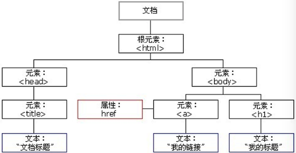
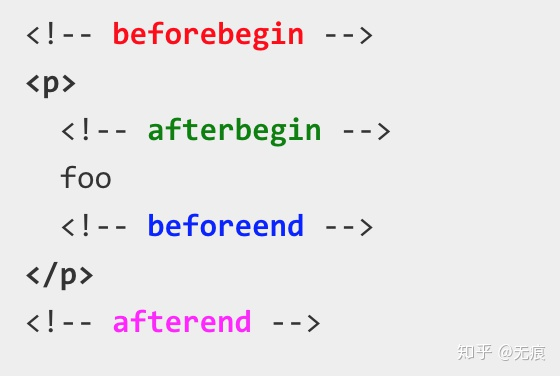

## 一、概述

DOM是JavaScript操作网页的接口，全称为 “**文档对象模型** ”（Document Object Model）。它的作用是将网页转为一个JavaScript对象，从而可以用脚本进行各种操作（比如增删内容）。

浏览器会根据DOM模型，将结构化文档（比如HTML和XML）解析成一系列的节点，再由这些节点组成一个树状结构。所有的节点和最终的树状结构，都有规范的对外接口。所以，DOM可以理解成网页的编程接口。

严格地说，DOM不属于JavaScript，但是操作DOM是JavaScript最常见的任务，而JavaScript也是最常用于DOM操作的语言。本章介绍的就是JavaScript对DOM标准的实现和用法。


## 二、节点

### 1.概念

DOM的最小组成单位叫做节点（Node）。文档的树形结构（DOM树），就是由各种不同类型的节点组成。

节点的类型有七种：

- **Document**：文档节点 -> 整个文档树的顶层节点 
- **DocumentType**：*doctype* 标签（比如 `<!DOCTYPE html>` ）
- **Element**：元素节点 -> 网页的各种HTML标签（比如 `<body>`、`<a>`等）*
- **Attribute**：属性节点 -> 网页元素的属性（比如 `class="right"` ）*
- **Text**：文本节点 -> 标签之间或标签包含的文本*
- **Comment**：注释节点 -> 网页中的注释
- **DocumentFragment**：文档的片段

> 提示：这七种节点都属于浏览器原生提供的 **节点对象** 的派生对象，具有一些共同的属性和方法。

我们可通过 nodeName 和 nodeType 属性判断对应节点的名称和类型。

| 类型                   | 描述     | nodeName                  | nodeType |
| ---------------------- | -------- | ------------------------- | -------- |
| ELEMENT_NODE *         | 元素节点 | 大写的HTML标签名          | 1        |
| ATTRIBUTE_NODE *       | 属性节点 | 等同于Attr.name（属性名） | 2        |
| TEXT_NODE *            | 文本节点 | #text                     | 3        |
| COMMENT_NODE           | 注释节点 | #comment                  | 8        |
| DOCUMENT_NODE          | 文档节点 | #document                 | 9        |
| DOCUMENT_FRAGMENT_NODE |          | #document-fragment        | 11       |
| DOCUMENT_TYPE_NODE     |          | 等同于DocumentType.name   | 10       |

> 提示：本节知识点作为了解即可。


### 2.节点树

一个文档的所有节点，按照所在的层级，可以抽象成一种树状结构。这种树状结构就是DOM树。

最顶层的节点就是 document 节点，它代表了整个文档。文档里面最高一层的HTML标签，一般是 `<html>`，它构成树结构的根节点（root node），其他HTML标签节点都是它的下级。

除了根节点以外，其他节点对于周围的节点都存在两种关系。

- 父子关系
- 兄弟关系

示例：

```html
<!DOCTYPE html>
<html>  
	<head>  
	    <title>DOM Tutorial</title>   
	</head>   
	<body>   
	    <h1>DOM Lesson one</h1>    
	    <a href="javascript:;">主页</a>   
	</body>   
</html> 
```

上述代码的节点树模型：




### 3.节点集合

节点都是单个对象，有时会需要一种数据结构，能够容纳多个节点。DOM提供两种集合对象，用于实现这种节点的集合：

- NodeList
- HTMLCollection

访问集合成员可通过下标或 `.item(index)` 获取。

```javascript
// NodeList
<body>
    <div class="box1">
        父
        <div class="box2">
            子
            <div class="box3">孙</div>
        </div>
    </div>
    
    <script>
        console.log(document.getElementsByTagName('body')[0].childNodes)
		// NodeList(4) [text, div.box1, text, script]
        // 0: text
        // 1: div.box1
        // 2: text
        // 3: script
        // 4: text
        // length: 5
        // __proto__: NodeList
    </script>
</body>


// HTMLCollection
<body>
    <h2>h2标签</h2>
    <p>p标签1</p>
    <p>p标签2</p>
    <p id="demo">p标签3</p>

    <script>
        let myCollection = document.getElementsByTagName("p");
        console.log(myCollection)
 
        // HTMLCollection(3) [p, p, p#demo, demo: p#demo]
        // 0: p
        // 1: p
        // 2: p#demo
        // length: 3
        // demo: p#demo
        // __proto__: HTMLCollection
    </script>
</body>
```


> 提示：NodeList/HTMLCollection 属于类似数组对象，不能直接使用数组方法，如果要通过数组方法来遍历节点集合，你需要将它们转换为真正的数组。


## 三、节点查询

为了便于演示后面的示例，我们现在HTML编辑如下内容：

```html
<p id="name">My Home</p>
<ul class="departments">
    <li>一楼</li>
    <li>二楼</li>
    <li>三楼</li>
    <li>四楼</li>
    <li>五楼</li>
  	<li>六楼</li>
</ul>
<p name="address">东光街XX号院XX栋XX单元XX号</p>
```


### 3.1 直接查找

```javascript
// 1. 根据ID查找
console.log(document.getElementById("name"))
// 2. 根据name属性查找
console.log(document.getElementsByName("address"))
// 3. 根据类名查找
console.log(document.getElementsByClassName("departments"))
// 4. 根据标签名查找
console.log(document.getElementsByTagName("li"))
// 5. 根据CSS选择器查找
console.log(document.querySelector("#name"))
console.log(document.querySelectorAll(".departments li"))
```


### 3.2 间接查找

通过已找到的其他标签来查找。

```js
let list = document.querySelector(".departments");
// 1. 获取上一个兄弟节点
console.log(list.previousElementSibling)
// 2. 获取下一个兄弟节点
console.log(list.nextElementSibling)
// 3. 获取父节点
console.log(list.parentElement)
// 4. 获取所有子节点
console.log(list.children)
// 5. 获取第一个子节点
console.log(list.firstElementChild)
// 5. 获取最后一个子节点
console.log(list.lastElementChild)
```


### 3.3 其他查询

```javascript
// 01. 查找文档类型
console.log(document.doctype)
// 02. 查找根节点
console.log(document.documentElement)
// 03. 查找Window对象
console.log(document.defaultView)
// 04. 查找head元素
console.log(document.head)
// 05. 查找body元素
console.log(document.body)
// 06. 查询页面中正在获取焦点的元素
console.log(document.activeElement)
// 07. 获取页面所有的<a>
console.log(document.links)
// 08. 获取页面所有的<form>
console.log(document.forms)
// 09. 获取页面所有的
console.log(document.images)
// 10. 获取页面所有的<script>
console.log(document.scripts)
// 11. 获取页面所有的<link>
console.log(document.styleSheets)
// 12. 获取页面所有的<embeds>
console.log(document.embeds)
// 13. 获取/设置网页标题
console.log(document.title)
```


## 四、节点操作

### 4.1 创建节点

```javascript
// 创建节点
let el = document.createElement("a");
el.innerHTML = "a标签"
el.href = ""
document.body.appendChild(el);


let el2 = "<div class='box'>CHINA</div>"
let AllHtml = document.body.innerHTML
document.body.innerHTML += el2;
```


### 4.2 操作属性

```javascript
<button onclick="removeTarget()">移除属性target</button>

<script>
    let el = document.createElement("a");
    el.innerHTML = "Dwill-chen"

    // 1. 设置、修改、读取属性 *
    el.setAttribute("href", "https://github.com/Dwill-chen");
    el.setAttribute("target", "_blank");
    el.getAttribute("href");
    // 2. 判断指定属性是否存在 *
    console.log(el.hasAttribute("href"));
    // 3. 移除指定属性 *
    function removeTarget() {
        el.removeAttribute("target");
    }
    // 4. 获取所有属性
    console.log(el.attributes);
    // 5. 添加自定义属性“data-*” *
    el.dataset.desc = "Dwill-chen";
	console.log(el.attributes);


    document.body.appendChild(el)

    let el2 = "<div class='box'>CHINA</div>"
</script>
```


### 4.3 操作类名

```javascript
let el = document.createElement("a");
el.innerHTML = "Dwill-chen"

// 1. 通过classname操作类名 *
// - 设置类名
el.className = "link";
el.className = "blog";
// // - 访问类名
console.log(el.className);
// // - 移除类名
el.className = "";

// 2. 通过classList操作类名 
// - 添加类名 *
el.classList.add("link");
el.classList.add("flag");
// - 移除类名 *
el.classList.remove("flag");
// - 查询是否包含某个类名 *
console.log(el.classList.contains("link")); // true
// - 查询指定位置的类名
console.log(el.classList.item(0)); // link
// - 将类名集合转为字符串
console.log(el.classList.toString())

document.body.appendChild(el)
```


### 4.4 操作内容

```javas
let el = document.createElement("a");
// 1. textContent
// - 设置
el.textContent = "Henry's github link";
// - 读取
console.log(el.textContent);

// 2. innerHTML
// - 设置
el.innerHTML = "<mark>Henry's</mark> github link";
// - 读取
console.log(el.innerHTML)

document.body.appendChild(el)
```

[^ tips]: textContent 设置显示文本，不能识别html标签，而innerHTML可以识别html标签。


### 4.5 插入节点

```javascript
<!DOCTYPE html>
<html lang="en">

<head>
    <meta charset="UTF-8">
    <meta name="viewport" content="width=device-width, initial-scale=1.0">
    <title>Document</title>
    <style>
        button {
            width: 200px;
            margin: 5px;
        }

        span {
            margin: 0 20px;
            border: 1px solid black;
            vertical-align: middle;
            padding: 0 10px;
        }
    </style>
</head>

<body>
    <ul id="myList">
        <li>1</li>
        <li>2</li>
        <li id="tag">3</li>
        <li>4</li>
        <li>5</li>
    </ul>

    <p>指定元素为3</p>
    <button onclick="fn1()">appendChild / append</button><span>在指定元素内追加(后面)</span><br>
    <button onclick="fn2()">prepend</button><span>在指定元素内追加(前面)</span><br>
    <button onclick="fn3()">before / insertBefore</button><span>在指定元素前加入</span><br>
    <button onclick="fn4()">after</button><span>在指定元素后加入</span><br>
    <button onclick="fn5()">insertAdjacentHTML</button><span>在指定元素的指定位置加入</span><br>
    <button onclick="fn6()">重置</button><span class="el">追加的内容元素</span><br>

    <script>
        let el = document.getElementsByClassName("el")[0];
        let tag = document.querySelector("#tag");
        function fn1() {
            // 1. 在指定元素内追加(后面)
            tag.appendChild(el);
            // tag.append(el);
        }
        function fn2() {
            // 2. 在指定元素内追加(前面)
            tag.prepend(el)
        }
        function fn3() {
            // 3. 在指定元素前加入
            tag.before(el);
            // document.getElementsByTagName("ul")[0].insertBefore(el, tag);
        }
        function fn4() {
            // 4. 在指定元素后加入
            tag.after(el);
        }
        function fn5() {
            // 5. 在指定元素的指定位置加入
            /*
            insertAdjacentHTML
            - beforebegin：在当前元素节点的前面。
            - afterbegin：作为当前元素的第一个子元素插入。
            - afterend：在当前元素节点的后面。
            - beforeend：作为当前元素的最后一个子元素插入。*/
            tag.insertAdjacentHTML("beforeend", "<h1>新插入的节点</h1>");
        }
        function fn6() {
            location.reload()
        }
    </script>
</body>

</html>
```

[^tips]: insertAdjacentHTML的 第二个参数 是 字符串 被解析成HTML或XML插入到DOM树中、并且可以识别html标签。




### 4.6 操作样式

```js
// 1. 逐一赋值
el.style.color = "orange";
el.style.fontStyle = "italic";
el.style.letterSpacing = "8px";

// 2. 统一赋值
el.style.cssText = "color:orange;font-style:italic;letter-spacing:8px;";
```

判断浏览器是否支持某个样式属性，代码如下：

```js
if(el.style.color == undefined) {
    console.log("不支持color样式属性")  
}else {
    console.log("支持color样式属性") 
}
```

> 提示：通过脚本添加/读取的样式是行内样式。


### 4.7 替换节点

```javascript
// 1. 主动替换
tag.replaceWith(el);
// 2. 被动替换（通过父元素替换）
parent.replaceChild(el, child);
```


### 4.8 移除节点

```javascript
// 1. 主动移除
el.remove();

// 2. 被动移除（通过父元素移除）
parent.removeChild(el);
```


## 五、补充知识

```javascript
// 01. 获取元素的id
el.id;
// 02. 获取标签名称
el.tagName;
// 03. 获取内部标签结构（不包括自身）
el.innerHTML;
// 04. 获取内部标签结构（包括自身）
el.outerHTML;
// 05. 表单元素获取焦点
el.focus();
// 06. 滚动当前元素，进入浏览器的可见区域，参数true顶部对齐，false底部对齐
// 这个意思其实就是将这个元素到顶部来浏览器窗口的顶部来显示
el.scrollIntoView();
// 07. 是否包含子节点
el.hasChildNodes();
// 08. 克隆节点，参数true，子节点同时克隆
el.cloneNode();
// 09. 是否包含某个子节点
el.contains();
// 10. 判断两个节点是否相等
el.isEqualNode();
```

06.scrollIntoView()

[^ tips]: 因为是锚点，前提是，跳转的时候，必须有滚动，且滚动条够长。不然元素无法移动到浏览器顶部。
[^ 布尔参数]: 如果为`true`，元素的顶端将和其所在滚动区的可视区域的顶端对齐。如果为`false`，元素的底端将和其所在滚动区的可视区域的底端对齐。

```javascript
<!DOCTYPE html>
<html lang="en">

<head>
    <meta charset="UTF-8">
    <meta name="viewport" content="width=device-width, initial-scale=1.0">
    <title>Document</title>
    <style>
        div{
            width: 200px;
            height: 800px;
            border: 1px solid black;
        }
    </style>
</head>

<body>
    <button onclick="fn1()">点我</button>
    <div>123</div>
    <div id="toMy">点击后，锚点到我这里</div>
    <script>
        function fn1() {
            var dd = document.getElementById("toMy").scrollIntoView(true);
        }
    </script>
</body>

</html>
```


## 六、表单操作

```javascript
// 1. 获取输入框输入的值
input.value

// 2. 获取单选值
radios.forEach(function(radio) {
    radio.onchange = function() {
        console.log(this.value);
    }
});

// 3. 获取select选中值
// - 单选
select.value
// - 多选
select.selectedOptions
```


## 七、拓展

### 7.1 获取非行间样式

```javascript
function getStyle(el, attr) {
	// 兼容IE
	if (el.currentStyle) {
		return el.currentStyle[attr];
	}else {
		return getComputedStyle(el, null)[attr];
	}
}
```


### 7.2 动态加载页面元素

在实际开发中，我们需要动态加载页面元素，首先我们需要在html页面中准备一个容器，比如列表：

```html
<ul class="list"></ul>
```

然后在脚本中根据数据动态加载`li`标签并添加至`ul`列表内部，具体实现如下：

```javascript
<!DOCTYPE html>
<html lang="en">

<head>
    <meta charset="UTF-8">
    <meta name="viewport" content="width=device-width, initial-scale=1.0">
    <title>Document</title>
</head>

<body>
    <ul class="list"></ul>
    <script>
        // 1. 数据封装（模拟后台返回的数据结构）
        var data = [
            {
                "name": "李白",
                "position": "刺客",
                "skill": "青莲剑歌",
                "exp": 500
            },
            {
                "name": "貂蝉",
                "position": "刺客/法师",
                "skill": "绽·风华",
                "exp": 350
            },
            {
                "name": "鲁班",
                "position": "射手",
                "skill": "空中支援",
                "exp": 800
            }
        ];
        // 2. 获取容器
        var list = document.querySelector(".list");
        // 3. 遍历数据拼接li标签
        var htmlStr = "";
        data.forEach(function (hero) {
            htmlStr += `<li>
        <p class="name">英雄：${hero.name}</p>
        <p class="position">定位：${hero.position}</p>
        <p class="skill">技能：${hero.skill}</p>
        <p class="exp">熟练度：${hero.exp}</p>
    </li>`
        })
        // 4. 将拼出出来的标签呈现在页面上
        list.innerHTML = htmlStr;
    </script>
</body>

</html>
```


### 7.3 DOM 性能优化

- [高频dom操作和页面性能优化探索](https://feclub.cn/post/content/dom)
- 通过修改 class 更新样式
- 使用 innerHTML 批量生产 DOM
- 使用 DocumentFragment  批量生产 DOM
- 避免使用 +=，将拼接元素放入数组通过 join() 方法效率更高
- 创建节点之后应立即append
- 通过 absolute 或 显示/隐藏元素 后再操作DOM可以减少重排/重绘
- 进来使用 id 来遍历 DOM 元素