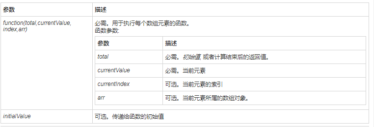

## in运算符

in的用法：x in y。

in运算符要求第1个（左边的）操作数必须是字符串类型或可以转换为字符串类型的其他类型，而第2个（右边的）操作数必须是数组或对象。

### a. 对象

如果第二个运算数为对象，则in运算符用来检测第一个运算数是否是第二个运算数的属性名。是，返回true，否则返回false。

```javascript
var obj = { x: 1, y: 2 };
console.log("x" in obj)     // 返回true
console.log("y" in obj)     // 返回true
console.log("z" in obj)     // 返回false
```


### b. 数组

如果第二个运算数为数组，则in运算符用来检测第一个运算数是否为数组包含的 **索引** 之一。

```javascript
var arr = [12, 45, 78];
console.log(12 in arr)       // 返回false
console.log(45 in arr)       // 返回false
console.log(78 in arr)       // 返回false
console.log(0 in arr)        // 返回true
console.log(2 in arr)        // 返回true
```


## 一、数值

### ***数值后面不能直接跟方法

因为`.`会被js解析器当成小数点。

可以把数值用圆括号包起来。如：

```javascript
(3).toString()
```


### ***数值精确度

JavaScript能精确表示的数值范围在*-(2<sup>53</sup>-1)到2<sup>53</sup>-1*之间。

即:

```javascript
-(Math.pow(2, 53) - 1) 到 (Math.pow(2, 53) - 1)
// -9007199254740991
// 9007199254740991
```


### 1.1 toString()

可把一个 Number 对象转换为一个字符串，并返回结果

```javascript
var n = 3.14;
n.toString();      // "3.14"

(101).toString();  // "101"
(3.2).toString();  // "3.2"
```


### 1.2 toLocaleString()

可把一个 Number 对象转换为本地格式的字符串

常用：

1.数值(number)

```javascript
let a = "123456";
let b = "123.456";
let c = 1234567;
console.log(a.toLocaleString());	// "123456"    字符串无效，跟没使用方法之前一样
console.log(b.toLocaleString());	// "123.456"   字符串无效，跟没使用方法之前一样
console.log(c.toLocaleString());	// "1,234,567"
```


2.时间

```javascript
var nowTime = new Date();
console.log(nowTime)	// Mon Dec 07 2020 17:04:08 GMT+0800 (中国标准时间)
console.log(nowTime.toLocaleString())	// 2020/12/7 下午5:04:08
```

更多详情、及参数设置: https://blog.csdn.net/weixin_39749820/article/details/82869537


### 1.3 toFixed()

可把 Number 指定小数位数的数字

```javascript
(10).toFixed(2) // "10.00"

(3.1415926).toFixed(2) // "3.14"
(3.1415926).toFixed(3) // "3.141"
```


### 1.4 toExponential()

可把对象的值转换成指数计数法。

`toExponential` 方法用于将一个数转为科学计数法形式。该方法的参数表示小数点后有效数字的位数，范围为0到20，超出这个范围，会抛出一个RangeError。

```javascript
(12345).toExponential(1);
"1.2e+4"
(12345).toExponential(2);
"1.23e+4"
(12345).toExponential(3);
"1.235e+4"
(12345).toExponential(4);
"1.2345e+4"
```


### 1.5 toPrecision()

`toPrecision`方法用于将一个数转为指定位数的有效数字。

```javascript
(123).toPrecision(1);
"1e+2"
(123).toPrecision(2);
"1.2e+2"
(123).toPrecision(3);
"123"
(123).toPrecision(4);
"123.0"
(123).toPrecision(5);
"123.00"
```

`toPrecision` 方法用于四舍五入时不太可靠，跟浮点数不是精确储存有关。

```javascript
(3.1415926).toPrecision(1) // 3
(3.1415926).toPrecision(2) // 3.1
(3.1415926).toPrecision(3) // 3.14
(3.1415926).toPrecision(4) // 3.141
```


## 二、字符串

### **2.1 concat**

将两个或多个字符的文本**组合**起来，返回一个新的字符串。

```javascript
let a = 'hello';
let b = 'word';
let c = a.concat(b);
console.log(c)	// helloword
```


### **2.2 idexOf**

返回字符串中一个子串第一处出现的**索引**（从左到右搜索）。如果没有匹配项，返回 -1 。

第二个参数表示从该位置开始 **向后** 匹配。

```javascript
let a = 'aaaaaaa';
let index1 = a.indexOf('a');
let index2 = a.indexOf('a', 3);
console.log(index1);	// 0
console.log(index2);	// 3
```


### **2.3 charAt**

返回**指定位置的字符**。

```javascript
let a = 'hello';
let get_char = a.charAt(1);
console.log(get_char);	// e
```


### **2.4 lastIndexOf**

返回字符串中一个子串**最后一处出现的索引**（从右到左搜索），如果没有匹配项，返回 -1 。

第二个参数表示从该位置起 **向前** 匹配。

```javascript
let a = 'abcdeedcba';
let index1 = a.lastIndexOf("b");
let index2 = a.lastIndexOf("b", 4)
console.log(index1);	// 8
console.log(index2);	// 1
```


### 2.5 match

用于字符串查询，如果没有找到，则返回**null**，如果找到，返回一个数组。

```javascript
let str = "abc";
let strNew = 'abc000andhsjwnaaaaaaabc';

console.log(str.match("ab"));
console.log(str.match("bcd"));

// 结合正则，匹配多个
strNew.match(/abc/g); // ["abc", "abc"]
```


### **2.6 substring**

返回字符串的一个子串，传入参数是**起始位置和结束位置**。

```javascript
let str = 'dwillchen';
console.log(str.substring(5,9))	// chen
```


### **2.7 substr**

返回字符串的一个子串，传入参数是**起始位置和长度**

```javascript
let str = 'dwillchen';
console.log(str.substr(5, 4));  // chen
```


### **2.8 replace**

**replace** 方法用于字符串替换，其语法形式为：

```js
replace(search, replacement)
```

- `search`：替换源
- `replacement`：要替换成什么数据

```javascript
var str = "Hello, world!";
str.replace("world", "china"); // "Hello, china!"
```

replace只会替换第一次匹配到的字段，不能完全替换：

```js
var str = "#fffff#";
str.replace("f", "o"); // "#offff#"
```

上述例子中只会替换第一个f，如果想要全局匹配替换，我们可以使用正则表达式，如下所示：

```javascript
// g -> global：全局模式
str.replace(/f/g, "o"); // "#ooooo#"
```


### **2.9 search**

**search** 方法的用法等同于 **indexOf/lastIndexOf**，但是其返回值为匹配到的**第一个**位置。如果没有找到匹配，则返回 `-1`。

```javascript
stringObject.search(regexp)
```

```javas
var str = 'Hello, china!';

str.search('china'); // 7
str.search('world'); // -1

```

search() 方法**不执行全局匹配**，它将忽略标志 g。它同时忽略 regexp 的 lastIndex 属性，并且总是从字符串的开始进行检索，这意味着它总是返回 stringObject 的**第一个**匹配的位置。


### **2.10 slice**

**slice** 方法用于字符串截取，其语法形式为： 

```javascript
slice(start, end)
```

- `start`：开始位置
- `end`：结束位置（不含该位置）

```javascript
'JavaScript'.slice(0, 4) // "Java"
```

如果省略第二个参数，则表示从指定位置开始截取到末尾。

```javascript
'JavaScript'.slice(4) // "Script"
```

如果参数是负值，表示从结尾开始倒数计算的位置，即该负值加上字符串长度。

- 负数：值为多少，可以理解为倒数第几位，但是不包含该位（**为第二个参数时，才不包含**）
- 负数：可以理解为，转换成整数，如下面的JavaScript长度为10，(0, -6)，-6可以变为**该负值加上字符串长度**，即(0， 4)

```javascript
'JavaScript'.slice(-6) // "Script"
'JavaScript'.slice(0, -6) // "Java"
'JavaScript'.slice(-2, -1) // "p"
```

如果第一个参数大于第二个参数，**slice** 方法返回一个空字符串。

```javascript
'JavaScript'.slice(2, 1) // ""
```


### **2.11 split**

split() 方法用于把一个 **字符串** 分割成 **字符串数组** 。

[^ tips]: split() 方法不改变原始字符串。

```javascript
stringObject.split(separator,howmany)
```

| 参数      | 描述                                                         |
| :-------- | :----------------------------------------------------------- |
| separator | 必需。字符串或正则表达式，从该参数指定的地方分割 stringObject。 |
| howmany   | 可选。该参数可指定返回的数组的最大长度。如果设置了该参数，返回的子串不会多于这个参数指定的数组。如果没有设置该参数，整个字符串都会被分割，不考虑它的长度。 |

```javascript
var result;
var str = "HTML,CSS,JavaScript,jQuery";

result = str.split();
console.log(result); // ["HTML,CSS,JavaScript,jQuery"]

result = str.split(',');
console.log(result); // ["HTML", "CSS", "JavaScript", "jQuery"]

// 如果把空字符串 ("") 用作 separator，那么 stringObject 中的每个字符之间都会被分割。

result = str.split("");
console.log(result); // ["H", "T", "M", "L", ",", "C", "S", "S", ",", "J", "a", "v", "a", "S", "c", "r", "i", "p", "t", ",", "j", "Q", "u", "e", "r", "y"]
```


### **2.12 length**

返回字符串的长度，所谓字符串的长度是指其包含的字符的个数。

```javascript
let a = "dwillchen";
console.log(a.length)   // 9
```


### **2.13 toLowerCase**

将整个字符串转成小写字母。

```javascript
console.log("ChInA".toLowerCase()); // china
```


### **2.14 toUpperCase**

将整个字符串转成大写字母。

```javascript
console.log("china".toUpperCase()); // CHINA
```


## 三、数组

### 3.1 jion()

把数组转换成字符串，然后给他规定个连接字符，默认的是逗号( ，)。

```javascript
var arr = [1, 2, 3];
console.log(arr.join());    // 1,2,3
console.log(arr.join("-")); // 1-2-3
console.log(arr);           // [1, 2, 3]（原数组不变）
```


### 3.2 **push()和pop()**

push(): 把里面的内容添加到数组末尾，并返回修改后的长度。

pop()：移除数组最后一项，返回移除的那个值，减少数组的length。

```javascript
var arr = ["Lily", "lucy", "Tom"];
var count = arr.push("Jack", "Sean");

console.log(count); 　　　　　　　　　　// 5
console.log(arr); 　　　　　　　　　　　// ["Lily", "lucy", "Tom", "Jack", "Sean"]

var item = arr.pop();
console.log(item); 　　　　　　　　　　 // Sean
console.log(arr); 　　　　　　　　　　  // ["Lily", "lucy", "Tom", "Jack"]
```


### 3.3 **shift() 和 unshift()**

unshift：将参数添加到原数组开头，并返回数组的长度。

shift()：删除原数组第一项，并返回删除元素的值；如果数组为空则返回undefined 。 

```javascript
var arr = ["Lily", "lucy", "Tom"];
var count = arr.unshift("Jack", "Sean");

console.log(count); 　　　　　　　　　　　　　　// 5
console.log(arr); 　　　　　　　　　　　　　　　//["Jack", "Sean", "Lily", "lucy", "Tom"]

var item = arr.shift();
console.log(item); 　　　　　　　　　　　　　　// Jack
console.log(arr); 　　　　　　　　　　　　　　 // ["Sean", "Lily", "lucy", "Tom"]

var arr2 = [];
var item2 = arr2.shift();
console.log(item2);                         //  undefined
console.log(arr2);                          //  []
```


### 3.4 sort()

在数组中排序使用 `sort()` 方法。

```javascript
var fruits = ["Banana", "Orange", "Apple", "Mango"];
fruits.sort();
console.log(fruits)	// ["Apple", "Banana", "Mango", "Orange"]
```

排序顺序可以是字母或数字，并按升序或降序。

默认排序顺序为按字母升序。


[^ 注意]: 当数字是按字母顺序排列时"40"将排在"5"前面。因为比较的是40中的4和5。

使用数字排序，你必须通过一个函数作为参数来调用。

函数指定数字是按照升序还是降序排列。

```javascript
var points = [40, 100, 1, 5, 25, 10];
points.sort(function (a, b) { return a - b });
console.log(points)	// [1, 5, 10, 25, 40, 100]
```


**更多详情如下：**

#### a. 数字排序

`sort()`  方法对数组成员进行升序排序，默认是按照**ASC II** 码顺序排序的，排序后，原数组将被改变。

```javascript
var arr = [1, "b", 3, 2, "A", "a", "B"];
arr.sort();
arr
(7) [1, 2, 3, "A", "B", "a", "b"]
```

`sort()` 的排序原理是根据字符一一对应进行排序，首先会比较第1个字符，如果第1个字符相等，则继续比较第2个字符，以此类推….

```javascript
var arr = [1, 12, 7, 5];
arr.sort();
arr
(4) [1, 12, 5, 7]
```

这样一来，就会导致排序不精确。若要对这样的数组实现数值大小的排序（实际项目中更多地是需要这样的结果），可以通过给 `sort()`  方法配置一个函数参数来实现，函数中需要配置两个参数，使该方法能实现一个差值排序的算法。用第一个参数减去第二个参数，得到的是一个升序数组；用第二个参数减去第一个参数，得到的是一个降序的数组。如例：

```javascript
var nums = [1, 8, 13, 30]; 

// 1、升序
var ascending = nums.sort(function(a1, a2) {
	return a1 - a2;
});
console.log(ascending); // [1, 8, 13, 30]


// 2、降序
var descending = nums.sort(function(a1, a2) {
	return a2 - a1;
})
console.log(descending); // [30, 13, 8, 1]
```

通过示例可以发现，得出的排序结果已经不再是按照ASC II中首字符的前后顺序来排序了，而是按照数学中数字的大小来进行的排序。而且当 `sort()` 方法内的函数的两个参数在执行差值运算的位置发生变化后，得出结果的排序升降关系也不一样。


#### b. 对象排序

那么如果数组里面的元素是对象类型呢？我们又该如何处理，我们俩看一个示例：

```javascript
var stus = [
    {stuNum: 1101, name: '曹操', score: 95},
    {stuNum: 1102, name: '吕布', score: 50},
    {stuNum: 1103, name: '貂蝉', score: 65},
    {stuNum: 1104, name: '赵云', score: 70}
];
var sortArr = stus.sort();
console.log(sortArr);

/*
(4) [{…}, {…}, {…}, {…}]
0: {stuNum: 1101, name: "曹操", score: 95}
1: {stuNum: 1102, name: "吕布", score: 50}
2: {stuNum: 1103, name: "貂蝉", score: 65}
3: {stuNum: 1104, name: "赵云", score: 70}
length: 4
__proto__: Array(0)
*/
```

通过访问遍历数组元素可以发现，数组内这四个对象的位置完全没有发生改变。其实要实现这个需求也是有办法的，就是同样需要给“sort()”方法配置一个函数作为参数来实现，实现思路和对数组排序时配置函数一致。

```javascript
var sortArr = stus.sort(function(obj1, obj2) {
    return obj2.score - obj1.score;
});
console.log(sortArr);
/*
(4) [{…}, {…}, {…}, {…}]
0: {stuNum: 1101, name: "曹操", score: 95}
1: {stuNum: 1104, name: "赵云", score: 70}
2: {stuNum: 1103, name: "貂蝉", score: 65}
3: {stuNum: 1102, name: "吕布", score: 50}
length: 4
__proto__: Array(0)
*/
```


#### c. 字符串排序

localeCompare()用本地特定的顺序来比较两个字符串。

```javascript
stringObject.localeCompare(target)
```

| 参数   | 描述                                                 |
| :----- | :--------------------------------------------------- |
| target | 要以本地特定的顺序与 stringObject 进行比较的字符串。 |

```javascript
var strs = ["Apple", "Banana", "Angular", "Orange"];
strs.sort(function(a, b) {
	return a.localeCompare(b);
});
strs
(4) ["Angular", "Apple", "Banana", "Orange"]
```


#### d. 中文排序

```javascript
var  citys = ["上海","北京","杭州", "成都"];
citys.sort(function(a, b) {
	return a.localeCompare(b, "zh-CN");
});
citys
(4) ["北京", "成都", "杭州", "上海"]
```


### 3.5 **reverse()**

`reverse()`  方法的作用是将已有数组倒序排列，并返回改变后的数组。该方法同样会改变原数组。

```javascript
var arr = [1, 2, 3, 4];
arr
arr.reverse();
(4) [4, 3, 2, 1]
```

需要注意的是该方法不具备 `sort()` 方法那样对数组排序的能力，它只是单纯地将当前的数组的元素进行先后顺序地调转而已。所以，在对一个有序（已经完成升序或降序排序）的数组进行反向排序的时候，会比 `sort()`  方法通过配置函数的参数，再对函数的参数进行位置调整来计算差值这种方式的性能要高很多。


### 3.6 **concat()**

将参数添加到原数组中。这个方法会先创建当前数组一个副本，然后将接收到的参数添加到这个副本的末尾，最后返回新构建的数组。

在没有给 concat()方法传递参数的情况下，它只是复制当前数组并返回副本。

```javascript
var arr = [1, 3, 5, 7];
var arrCopy = arr.concat(9, [11, 13]);

console.log(arrCopy); 　　　　　　　　　　　 // [1, 3, 5, 7, 9, 11, 13]
console.log(arr); 　　　　　　　　　　　　　　// [1, 3, 5, 7](原数组未被修改)
```


### 3.7 **slice()**

截取数组元素与字符串截取类似，使用 `slice` 方法，该方法语法形式如下：

```javascript
arr.slice(startIdx, endIdx);
```

语法解读：

- `startIdx`：起始位置（从下标0开始）
- `endIdx`：结束位置，不包括结束位置的元素，如果省略该参数，则表示从头截取到末尾。

```javascript
var heros = ["上官婉儿", "李白", "嬴政", "貂蝉", "兰陵王"];
var res = heros.slice(1, 4);
res
(3) ["李白", "嬴政", "貂蝉"]

var res = heros.slice(1);
res
(4) ["李白", "嬴政", "貂蝉", "兰陵王"]
```

除此之外，该方法还可以利用原型链中的 `call()` 方法将一个类似数组转化成真正的数组，其语法形式为：

```javascript
Array.prototype.slice.call(obj);
```

代码示例：

```html
<ul class="list">
    <li>LIST-1</li>
    <li>LIST-2</li>
    <li>LIST-3</li>
    <li>LIST-4</li>
    <li>LIST-5</li>
</ul>
```

```javascript
// 1. 获取所有的.list下li标签
var lis = document.querySelectorAll(".list li");
console.log(lis);
/*
NodeList(5) [li, li, li, li, li]
0: li
1: li
2: li
3: li
4: li
length: 5
__proto__: NodeList
*/
// 2. 企图在lis对象上调用push方法
// lis.push("<li></li>");

// 3. 程序会报错，因为lis本质上不是数组而是NodeList对象
// Uncaught TypeError: lis.push is not a function

// 4. 如果想要调用push方法添加内容，需将类似数组转为真正的数组
lis = Array.prototype.slice.call(lis);
console.log(lis);
/*
(5) [li, li, li, li, li]
0: li
1: li
2: li
3: li
4: li
length: 5
__proto__: Array(0)
*/
// 5. lis已经被转换成真正的数组，所以可以调用push方法了
lis.push("<li></li>");
console.log(lis);
```

将一个类似数组转换为真正的数组的意义在于，类似数组不具有数组的方法，直接对一个类似数组使用数组的方法浏览器会报错，而很多时候我们的操作只有通过使用数组的方法才能完成，或用数组的方法完成才是最佳的选择。


### 3.8 **splice()**

splice()：删除、插入和替换。

**删除：**指定 2 个参数：要删除的第一项的位置和要删除的项数。

**插入：**可以向指定位置插入任意数量的项，只需提供 3 个参数：起始位置、 0（要删除的项数）和要插入的项。

**替换：**可以向指定位置插入任意数量的项，且同时删除任意数量的项，只需指定 3 个参数：起始位置、要删除的项数和要插入的任意数量的项。插入的项数不必与删除的项数相等。

```javascript
var arr = [1, 3, 5, 7, 9, 11];
var arrRemoved = arr.splice(0, 2);

// 删除
console.log(arr); 　　　　　　　　　　　　　　　// [5, 7, 9, 11]
console.log(arrRemoved); 　　　　　　　　　　　// [1, 3]

// 插入4,6
var arrRemoved2 = arr.splice(2, 0, 4, 6);
console.log(arr); 　　　　　　　　　　　　　　　// [5, 7, 4, 6, 9, 11]
console.log(arrRemoved2); 　　　　　　　　　　 // []

// 替换7->2,4
var arrRemoved3 = arr.splice(1, 1, 2, 4);
console.log(arr); 　　　　　　　　　　　　　　　// [5, 2, 4, 4, 6, 9, 11]
console.log(arrRemoved3); 　　　　　　　　　　 // [7]
```


### 3.9 **indexOf()和 lastIndexOf()**

indexOf()：接收两个参数：要查找的项和（可选的）表示查找起点位置的索引。其中， 从数组的开头（位置 0）开始向后查找。

lastIndexOf：接收两个参数：要查找的项和（可选的）表示查找起点位置的索引。其中， 从数组的末尾开始向前查找。

这两个方法都是返回 **第一次** 查找到这个字符串的下标位置。

```javascript
var arr = [1, 3, 5, 7, 7, 5, 3, 1];
console.log(arr.indexOf(5));        //  2   5的索引是2
console.log(arr.lastIndexOf(5));    //  5   从末尾开始，5的索引是5
console.log(arr.indexOf(5, 2));     //  2   5的索引，从索引2开始找，索引是2
console.log(arr.lastIndexOf(5, 4)); //  2   5的索引，从索引4开始，从后向前找（不是以索引是为起点，是索引4作为终点），索引是2
console.log(arr.indexOf("5"));      //  -1  都是数值，因此字符串找不到，返回-1
```


### 3.10 **forEach()**

forEach()：对数组进行遍历循环，对数组中的每一项运行给定函数。这个方法没有返回值。参数都是function类型，默认有传参，参数分别为：遍历的数组内容；第对应的数组索引，数组本身。

```javascript
var arr = [1, 2, 3, 4, 5];
arr.forEach((x, index, a) => {
    console.log(x + '|' + index + '|' + (a === arr));
});
// 输出为：
// 1|0|true
// 2|1|true
// 3|2|true
// 4|3|true
// 5|4|true
```


### 3.11 **map()**

map()：指“映射”，对数组中的每一项运行给定函数，返回每次函数调用的结果组成的数组。

```javas
var arr = [1, 2, 3, 4, 5];
var arr2 = arr.map((item) => {
return item * item;
});
console.log(arr2); 　　　　　　　　//[1, 4, 9, 16, 25]
```


### 3.12 **filter()**

filter()：“过滤”功能，数组中的每一项运行给定函数，返回满足过滤条件组成的数组。

```javascript
var arr = [1, 2, 3, 4, 5, 6, 7, 8, 9, 10];
var arr2 = arr.filter((x, index) => {
    return index % 3 === 0 || x >= 8;
});
console.log(arr2); 　　　　　　　　//[1, 4, 7, 8, 9, 10]
```


### 3.13 **every()**

every()：判断数组中每一项都是否满足条件，只有所有项都满足条件，才会返回true。

```javascript
var arr = [1, 2, 3, 4, 5];
var arr2 = arr.every((x) => {
    return x < 10;
});
console.log(arr2); 　　　　　　　　//true
var arr3 = arr.every((x) => {
    return x < 3;
});
console.log(arr3); 　　　　　　　　// false
```


### 3.14 **some()**

some()：判断数组中是否存在满足条件的项，只要有一项满足条件，就会返回true。

```javascript
var arr = [1, 2, 3, 4, 5];
var arr2 = arr.some((x) => {
    return x < 3;
});
console.log(arr2); 　　　　　　　　//true
var arr3 = arr.some((x) => {
    return x < 1;
});
console.log(arr3); 　　　　　　　　// false
```


### 3.15 includes()

判断一个数组是否包含一个指定的值，如果包含则返回 true，否则返回false。

```javascript
var arr = [1, 2, 3, 2, 5];

console.log(arr.includes(3));    //  true
console.log(arr.includes("3"));  //  false
console.log(arr.includes(4));    //  false
```


### 3.16 find()

返回数组中满足提供的测试函数的 **第一个** 元素的 **值** 。否则返回undefined。

```javascript
var arr = [1, 2, 3, 2, 5];

var res = arr.find((item) => {
    return item > 2
});
console.log(res); // 3
```


### 3.17 findIndex()

返回数组中满足提供的测试函数的 **第一个** 元素的 **索引** 。否则返回-1。

```javascript
var arr = [1, 2, 3, 2, 5];

var index = arr.findIndex((item) => {
    return item == 3;
});
console.log(index);	// 2
```


### 3.18 reduce()

`reduce` 语法规则：

```javascript
array.reduce(function(total, currentValue, currentIndex, arr), initialValue)
```

对数组中的所有元素调用指定的回调函数。该回调函数的返回值为累积结果，并且此返回值在下一次调用该回调函数时作为参数提供。



```javascript
var numbers = [65, 44, 12, 4];
function getSum(total, num) {
    return total + num;
}
console.log(numbers.reduce(getSum))	// 125
```


当满足下列任一条件时，将引发 **TypeError** 异常：

- `callbackfn` 参数不是函数对象。
- 数组不包含元素，且未提供 `initialValue`。

> 提示：
>
> 1、如果提供了 `initialValue`，则 reduce 方法会对数组中的每个元素调用一次 `callbackfn` 函数（按升序索引顺序）。如果未提供 `initialValue`，则 reduce 方法会对从第二个元素开始的每个元素调用 `callbackfn` 函数。
>
> 2、回调函数的返回值在下一次调用回调函数时作为 `previousValue` 参数提供。最后一次调用回调函数获得的返回值为 reduce 方法的返回值。
>
> 3、不为数组中缺少的元素调用该回调函数。

回调函数的语法如下所示：

```
function callbackfn(previousValue, currentValue, currentIndex, array)
```

可使用最多四个参数来声明回调函数。

下表列出了回调函数参数。

| 回调参数        | 定义                                                         |
| --------------- | ------------------------------------------------------------ |
| *previousValue* | 通过上一次调用回调函数获得的值。如果向 **reduce** 方法提供 *initialValue*，则在首次调用函数时，*previousValue* 为 *initialValue*。 |
| *currentValue*  | 当前数组元素的值。                                           |
| *currentIndex*  | 当前数组元素的数字索引。                                     |
| *array*         | 包含该元素的数组对象。                                       |

#### a. 实例解析 initialValue 参数

先看第一个例子

```javascript
var arr = [1, 2, 3, 4];
var sum = arr.reduce(function(prev, cur, index, arr) {
    console.log(prev, cur, index);
    return prev + cur;
})
console.log(arr, sum);

打印结果：
1 2 1
3 3 2
6 4 3
[1, 2, 3, 4] 10
```

这里可以看出，上面的例子index是从1开始的，第一次的prev的值是数组的第一个值。数组长度是4，但是reduce函数循环3次。

再看第二个例子：

```javascript
var  arr = [1, 2, 3, 4];
var sum = arr.reduce(function(prev, cur, index, arr) {
    console.log(prev, cur, index);
    return prev + cur;
}，0) //注意这里设置了初始值
console.log(arr, sum);

打印结果：
0 1 0
1 2 1
3 3 2
6 4 3
[1, 2, 3, 4] 10
```

这个例子index是从0开始的，第一次的prev的值是我们设置的初始值0，数组长度是4，reduce函数循环4次

> 结论：如果没有提供initialValue，reduce 会从索引1的地方开始执行 callback 方法，跳过第一个索引。如果提供initialValue，从索引0开始。

> 注意：如果这个数组为空，运用reduce是什么情况？

```javascript
var  arr = [];
var sum = arr.reduce(function(prev, cur, index, arr) {
    console.log(prev, cur, index);
    return prev + cur;
})
//报错，"TypeError: Reduce of empty array with no initial value"
```

但是要是我们设置了初始值就不会报错，如下：

```javascript
var  arr = [];
var sum = arr.reduce(function(prev, cur, index, arr) {
    console.log(prev, cur, index);
    return prev + cur;
}，0)
console.log(arr, sum); // [] 0
```

**所以一般来说我们提供初始值通常更安全**


#### b. 高级用法

##### 1）. 计算数组中每个元素出现的次数

[^ tips]: 用到了关键字in，initialValue初始值设置空对象（1.in的性质、2.从第一个元素开始调用函数），并结合关键字in

格式：（变量 in 对象）

当‘对象’是数组时：“变量”指的是数组的“索引”；

当‘对象’为对象是，“变量”指的是对象的“属性”。

```javascript
let names = ['Alice', 'Bob', 'Tiff', 'Bruce', 'Alice'];

let nameNum = names.reduce((pre,cur)=>{
  if(cur in pre){
    pre[cur]++
  }else{
    pre[cur] = 1 
  }
  return pre
},{}) // initialValue初始值设置空对象，并结合关键字in
console.log(nameNum); //{Alice: 2, Bob: 1, Tiff: 1, Bruce: 1}
```


##### 2）. 数组去重

```javascript
 let arr = [1, 2, 3, 4, 4, 1]
 let newArr = arr.reduce((pre, cur) => {
     // debugger
     if (!pre.includes(cur)) {
         // return pre.concat(cur) 等价于push下面的方法
         pre.push(cur)
         return pre
     } else {
         return pre
     }
 }, [])
 console.log(newArr);// [1, 2, 3, 4]
```


##### 3）.对象里的属性求和

```javascript
var result = [
    {
        subject: 'math',
        score: 10
    },
    {
        subject: 'chinese',
        score: 20
    },
    {
        subject: 'english',
        score: 30
    }
];

var sum = result.reduce(function(prev, cur) {
    return cur.score + prev;
}, 0);
console.log(sum) //60
```


## 四、Object

https://www.jianshu.com/p/8608c7669bbc

### 4.1 Object.entries(obj)
 将一个可枚举对象按照键值对展开为数组

```jsx
let obj = {
    a:1,
    b:2,
}
let arr = Object.entries(obj)
//arr [[a,1],[b,2]]
```


### 4.2 Object.assign(target, source)

 将一个或多个可枚举对象的可枚举属性复制到 target 对象，返回 target 对象。第一级属性深拷贝，以后级别属性浅拷贝

```jsx
let obj1 = {
    a:1,
    b:2,
}
let obj2 = {
    c:3,
    d:4,
}
let obj3 = Object.assign(obj1, obj2)
//将 obj2 并入 obj1，返回 obj1 
//此时obj1，obj3 都指向{a:1,b:2,c:3,d:4}
//遇到相同的键，新的覆盖原有的，后面的覆盖前面的，可以用作重置相同对象
//相同的key，重置Object.assign(this.$data, this.$options.data())
```


### 4.3 Object.freeze(obj)

 相应的也有判断是否冻结的方法----Object.isFrozen()
 冻结一个对象。一个被冻结的对象再也不能被修改，包括所有的属性，甚至包括他的原型。返回与原对象相同参数的对象


```jsx
var obj = {
  prop: function() {},
  foo: 'bar'
};
var o = Object.freeze(obj);
//此时对o的所有操作都是失效的，只读
//在严格模式，行为将抛出 TypeErrors
```


### 4.4 Object.create(obj)

 创建一个新对象，将现有的对象创建为新对象的**proto**。返回一个新对象


```jsx
const person = {
  isHuman: false,
  printIntroduction: function () {
    console.log(`My name is ${this.name}. Am I human? ${this.isHuman}`);
  }
};
const me = Object.create(person);
me.name = "Matthew"; // "name" is a property set on "me", but not on "person" name不是继承来的，而是me自己的

//继承的属性可以被覆写，但person.isHuman并不会被更改，覆写后相当于新建独有属性，脱离继承
me.isHuman = true; 

me.printIntroduction(); //My name is Matthew. Am I human? true
```


### 4.5 Object.keys(obj)

 遍历一个对象，将 key 返回为数组

```jsx
var obj = { 0: 'a', 1: 'b', 2: 'c' };
console.log(Object.keys(obj)); // console: ['0', '1', '2']
```


### 4.6 Object.defineProperty(obj, prop, descriptor)

 参数：
 obj：被操作对象
 prop：修改或要定义的属性名
 descriptor：修改或要定义的属性的属性描述，即prop的描述

```csharp
//descriptor 的可选值
configurable：true/false //当此值为true，此属性的其他描述才可被编辑
enumerable：true/false //是否可枚举
value：'' //该属性对应的值
writable：true/false //true时，value可被编辑
get() //属性被访问时触发，默认无此属性，为undefined，需手动设置
set() //属性被改变时触发，默认无此属性，为undefined，需手动设置
```

新增或修改一个对象的属性，并返回该对象

```jsx
//单个操作
let obj = {}
Object.defineProperty(obj,'name',{value:'hello'})

//循环操作
var obj = { 0: 'a', 1: 'b', 2: 'c' };
Object.keys(obj).forEach(key=>{
    console.log(obj[key]) //依次输出'a','b','c'
    Object.defineProperty(obj, key,{value:'hello'}) ////'a','b','c'依次变为'hello'
})
// obj的结果 {0: "hello", 1: "hello", 2: "hello"}
```

扩展：在vue中通过递归调用此方法，为对象的每一个属性绑定get()、set()方法，实现对象的数据监听


### 4.7 Object.getPrototypeOf(obj)

 返回目标对象的 prototype 的值。
 给定对象的原型。如果没有继承属性，则返回 [null]

```jsx
const obj1 = {};
const obj2 = Object.create(obj1); // 新建对象obj2，并将obj1作为obj2的__proto__

console.log(Object.getPrototypeOf(obj2) === obj1);
// expected output: true
```

