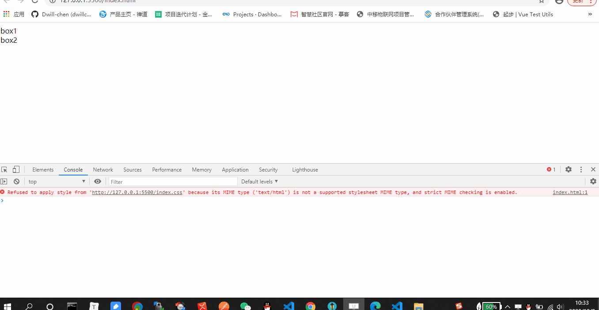
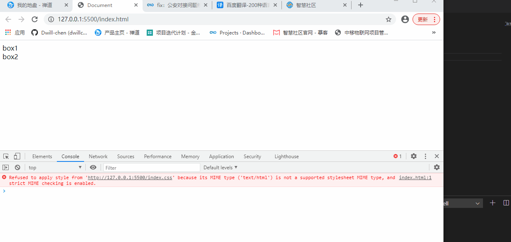
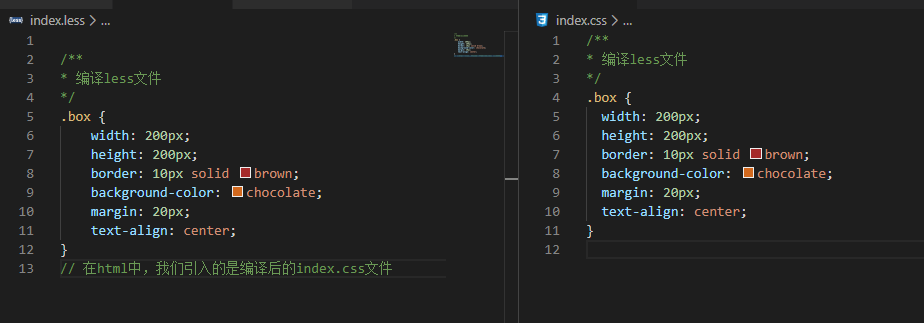

## 一、概述

什么是css预处理器？css预处理器是用一种专门的语言，进行网页的样式设计，之后再被编译为正常的css文件，以供项目使用。

使用css预处理语言的好处：是css更加简洁、方便修改、可读性强、适应性强并且更易于代码的维护。

CSS预处理语言主要有三种：LESS/SASS/STYLUS。

> 1. SASS：
>
> 2007年诞生，最早也是最成熟的CSS预处理器，拥有ruby社区的支持和compass这一最强大的css框架，目前受LESS影响，已经进化到了全面兼容CSS的SCSS（SCSS 需要使用分号和花括号而不是换行和缩进）

>2. LESS：
>
>2009年出现，受SASS的影响较大，但又使用CSS的语法，让大部分开发者和设计师更容易上手，在ruby社区之外支持者远超过SASS，其缺点是比起SASS来，可编程功能不够，不过优点是简单和兼容CSS，反过来也影响了SASS演变到了SCSS的时代，著名的Twitter Bootstrap就是采用LESS做底层语言的。

>3. STYLUS：
>
>2010年产生，来自Node.js社区，主要用来给Node项目进行CSS预处理支持，在此社区之内有一定支持者，在广泛的意义上人气还完全不如SASS和LESS。


## 二、LESS

- <http://lesscss.cn/>
- <http://less.bootcss.com/#getting-started>
- <http://www.bootcss.com/p/lesscss/#guide>


### 2.1 编译

#### a. lessc（less源码编译器）

安装

```shell
$ npm i -D less
```

编译

```shell
$ lessc <source path> <target path>
$ ./node_modules/.bin/lessc ./src/less/index.less ./dist/static/css/index.css
```

> 提示：lessc 只能编译单文件，并且无法实现自动编译。

例子如下图，我们只创建了less文件，但是link中引入的是css文件，没有编译时，页面会报错：




#### b. VSCode：Easy Compile

首先在VSCode中下载 “Easy Compile” 插件，然后配置扩展程序：

```less
"easycompile.less": {
    // 输出路径,${workspaceRoot}VSCode当前打开的文件夹
    "out": "${workspaceRoot}/",
    // 扩展名
    "outExt": ".css",
    // 压缩
    "compress": false,
    // 自动注入浏览器前缀
    "autoprefixer": "last 5 versions"
}
```




#### c. Koala

koala是一个前端预处理器语言图形编译工具，支持Less、Sass、Compass、CoffeeScript，帮助web开发者更高效地使用它们进行开发。跨平台运行，完美兼容windows、linux、mac。

官网下载地址：http://koala-app.com/index-zh.html

使用教程：https://www.cnblogs.com/webBlog-gqs/p/7174712.html


### 2.2 语法

#### a. 注释

- /* 此注释方法会编译 */
- // 此注释方法不会被编译 




#### b. 变量

声明语法：`@变量名:值;`，如：`@box_len:300px;`

```less
/** 定义变量
* @w 宽度
* @color 颜色
*/
@w: 200px;
@color: pink;
.box {
    width: @w;
    height: 200px;
    border: 10px solid brown;
    background-color: @color;
    margin: 20px;
    text-align: center;
}
```

编译后的样式为：

```css
/** 定义变量
* @w 宽度
* @color 颜色
*/
.box {
  width: 200px;
  height: 200px;
  border: 10px solid brown;
  background-color: pink;
  margin: 20px;
  text-align: center;
}

```


#### c. 混合

##### c-1. 基本使用

我们先来看一个示例，帮助理解混合。

```less
/** 定义变量
* @w 宽度
* @color 颜色
*/
@w: 200px;
@color: pink;
.border {
    border: 10px solid brown;
}
.box {
    width: @w;
    height: 200px;
    background-color: @color;
    margin: 20px;
    text-align: center;
    // 混合其他样式
    .border
}
```

运行程序，我们可以发现视图多了一个边框，我们知道，以前要实现这个边框，我们需要为 `.box`  添加一个类 `.bordered`，在 less 中，利用混合这一特性，我们可以直接在 `.box {}` 内使用 `.boder` ，而无需再到html页面中为对应元素添加类名。

以前添加，如下：

```javascript
<div class="bordered box"></div>

// 添加类名
.bordered {
    border: 10px solid brown;
}
// 或者在box中直接书写
.box {
    width: 200px;
    height: 200px;
    border: 10px solid brown;
}
```


##### c-2. 混合参数

混合还可以带参数，假设我们定义了一个边框，在后面的盒子中我们都会采用这个边框，但是每个盒子的边框粗细不一样，这个时候我们可以使用混合参数来实现这一功能，具体参考下面的示例：

```less
/** 定义变量
* @w 宽度
* @color 颜色
*/
@w: 200px;
@color: pink;
.border(@color) {
    border: 10px solid @color;
}
.box {
    width: @w;
    height: 200px;
    background-color: @color;
    margin: 20px;
    text-align: center;
    // 混合其他样式
    // 传入参数
    .border(black)
}
```

#### 

##### c-5. 混合默认值

我们也可以为混合指定一个默认值，这样在调用时就无需传入参数， 但是切记，括号不能省略。

```less
/** 定义变量
* @w 宽度
* @color 颜色
*/
@w: 200px;
@color: pink;
// 为参数设置默认值
.border(@color: red) {
    border: 10px solid @color;
}
.box {
    width: @w;
    height: 200px;
    background-color: @color;
    margin: 20px;
    text-align: center;
    // 混合其他样式
    // 传入参数
    .border()
}
```

提示：混合如果定义时，设置了参数，那么在调用时必须有圆括号，否则程序报错。


##### c-5. arguments 变量

`@arguments `包含了所有传递进来的参数. 如果你不想单独处理每一个参数的话就可以像这样写:

```less
.box-shadow(@offsetX: 0px, @offsetY: 0px, @blur: 1px, @color: purple) {
    -webkit-box-shadow: @arguments;
    -moz-box-shadow: @arguments;
    box-shadow: @arguments;
}
.box {
    .box-shadow(6px, 8px);
}
```

输出为：

```css
.box {
    -webkit-box-shadow: 6px 8px 1px purple;
    -moz-box-shadow: 6px 8px 1px purple;
    box-shadow: 6px 8px 1px purple;
}
```

再来看一个示例：

```less
.border(@width:5px; @style: solid; @color: #000) {
  	// border: @width @style @color;
    border: @arguments;
}
```

输出为：

```javascript
.box {
    border: 5px solid #000;
}
```


#### d. 模式匹配

相当于编程语言中的if语句，即如果满足条件，则执行。我们来看一个示例：


```less
/** 定义变量
* @w 宽度
* @color 颜色
*/
@w: 200px;
@color: pink;

.border(top; @border_width: 10px; @border_color: red){
    border: @border_width solid transparent;
    border-top-color: @border_color;
}

.border(right; @border_width: 10px; @border_color: red){
    border: @border_width solid transparent;
    border-right-color: @border_color;
}

.border(bottom; @border_width: 10px; @border_color: red){
    border: @border_width solid transparent;
    border-bottom-color: @border_color;
}

.border(left; @border_width: 10px; @border_color: red){
    border: @border_width solid transparent;
    border-left-color: @border_color;
}

// 默认执行(无论是否匹配，都会执行)
.border(@_; @border_width: 10px; @border_color: red){
    width: @w;
    height: 200px;
    background-color: @color;
    margin: 20px;
    text-align: center;
}
.box {
    .border(left);
}
```

上述示例中，调用 .border，根据参数进行匹配，选择不同的样式。


#### e. 导引

当我们想根据 **表达式** 进行匹配，而非根据值和参数匹配时，导引就显得非常有用。如果你对函数式编程非常熟悉，那么你很可能已经使用过导引。

为了尽可能地保留CSS的可声明性，LESS通过导引混合而非if/else语句来实现条件判断，因为前者已在@media query特性中被定义。

以此例做为开始：

```less
.mixin (@a) when (lightness(@a) >= 50%) {
  background-color: black;
}
.mixin (@a) when (lightness(@a) < 50%) {
  background-color: white;
}
.mixin (@a) {
  color: @a;
}
```

when关键字用以定义一个引导序列(此例只有一个引导)。接下来我们运行下列代码：

```less
.class1 { .mixin(#ddd) }
.class2 { .mixin(#555) }
```

就会得到：

```css
.class1 {
  background-color: black;
  color: #ddd;
}
.class2 {
  background-color: white;
  color: #555;
}
```

导引中可用的全部比较运算有： **>  >=  =  =<  <**。此外，关键字`true`只表示布尔真值，下面两个混合是相同的：

```less
.truth (@a) when (@a) { ... }
.truth (@a) when (@a = true) { ... }
```

除去关键字true以外的值都被视示布尔假：

```less
.class {
  .truth(40); // Will not match any of the above definitions.
}
```

导引序列使用逗号‘`,`’—分割，有一个条件都符合时，就会被视为匹配成功。

```less
.mixin (@a) when (@a > 10), (@a < -10) { ... }
```

导引可以无参数，也可以对参数进行比较运算：

```less
@media: mobile;
.mixin (@a) when (@media = mobile) { ... }
.mixin (@a) when (@media = desktop) { ... }

.max (@a, @b) when (@a > @b) { width: @a }
.max (@a, @b) when (@a < @b) { width: @b }
```

最后，如果想基于值的类型进行匹配，我们就可以使用is*函式：

```less
.mixin (@a, @b: 0) when (isnumber(@b)) { ... }
.mixin (@a, @b: black) when (iscolor(@b)) { ... }
```

下面就是常见的检测函式：

- `iscolor`
- `isnumber`
- `isstring`
- `iskeyword`
- `isurl`

如果你想判断一个值是纯数字，还是某个单位量，可以使用下列函式：

- `ispixel`	——    px
- `ispercentage`    ——    %
- `isem`    ——    em

最后再补充一点，在导引序列中可以使用**and**关键字实现 **与条件** ：

```less
.mixin (@a) when (isnumber(@a)) and (@a > 0) { ... }
```

使用`,`分割实现 **或条件**

```javascript
.mixin (@a) when (isnumber(@a)), (@a > 0) { ... }
```

使用**not**关键字实现 **非条件** 

```less
.mixin (@b) when not (@b > 0) { ... }
```


#### f. 运算

Less 支持加减乘除运算。

```less
@width: 100px;
.box {
    width: @width - 20;
}
```

> 提示：运算符左右两边加空格，否则无效。


#### g. 嵌套

Less允许嵌套，我们来看一个示例：

```html
<ul class="list">
    <li><a href="javascript:;">A</a></li>
    <li><a href="javascript:;">B</a></li>
    <li><a href="javascript:;">C</a></li>
    <li><a href="javascript:;">D</a></li>
    <li><a href="javascript:;">E</a></li>
</ul>
```

Less引入嵌套之后，我们可以这样来设计样式：

```css
.list {
    list-style: none;
    padding: 0;
    li {
        display: inline-block;
        width: 100px;
        line-height: 35px;
        background: purple;
        text-align: center;
        a {
            color: #ffffff;
        }
        // & 符号, 表示这个&所在的上一层选择器, 比如上述&,表示 .list li : hover
        &:hover {
            background: orange;
        }
    }
}
```

编译之后：

```css
.list {
  list-style: none;
  padding: 0;
}
.list li {
  display: inline-block;
  width: 100px;
  line-height: 35px;
  background: purple;
  text-align: center;
}
.list li a {
  color: #ffffff;
}
.list li:hover {
  background: orange;
}

```


#### h. 函数

##### h-1. color 函数

LESS 提供了一系列的颜色运算函数. 颜色会先被转化成 *HSL* 色彩空间, 然后在通道级别操作:

```less
lighten(@color, 10%);     // return a color which is 10% *lighter* than @color
darken(@color, 10%);      // return a color which is 10% *darker* than @color

saturate(@color, 10%);    // return a color 10% *more* saturated than @color
desaturate(@color, 10%);  // return a color 10% *less* saturated than @color

fadein(@color, 10%);      // return a color 10% *less* transparent than @color
fadeout(@color, 10%);     // return a color 10% *more* transparent than @color
fade(@color, 50%);        // return @color with 50% transparency

spin(@color, 10);         // return a color with a 10 degree larger in hue than @color
spin(@color, -10);        // return a color with a 10 degree smaller hue than @color

mix(@color1, @color2);    // return a mix of @color1 and @color2
```

使用起来相当简单:

```less
@base: #f04615;

.class {
  color: saturate(@base, 5%);
  background-color: lighten(spin(@base, 8), 25%);
}
```

你还可以提取颜色信息:

```less
hue(@color);        // returns the `hue` channel of @color
saturation(@color); // returns the `saturation` channel of @color
lightness(@color);  // returns the 'lightness' channel of @color
```

如果你想在一种颜色的通道上创建另一种颜色，这些函数就显得那么的好用，例如:

```less
@new: hsl(hue(@old), 45%, 90%);
```

`@new` 将会保持 `@old`的 *色调*, 但是具有不同的饱和度和亮度.


##### h-2. math 函数

LESS提供了一组方便的数学函数，你可以使用它们处理一些数字类型的值:

```less
round(1.67); // returns 2
ceil(2.4);   // returns 3
floor(2.6);  // returns 2
```

如果你想将一个值转化为百分比，你可以使用`percentage` 函数:

```less
percentage(0.5); // returns `50%`
```


#### i. 命名空间

有时候，你可能为了更好组织CSS或者单纯是为了更好的封装，将一些变量或者混合模块打包起来, 你可以像下面这样在`#bundle`中定义一些属性集之后可以重复使用:

```less
#bundle {
  .button () {
    display: block;
    border: 1px solid black;
    background-color: grey;
    &:hover { background-color: white }
  }
  .tab { ... }
  .citation { ... }
}
```

你只需要在 `#header a`中像这样引入 `.button`:

```less
#header a {
  color: orange;
  #bundle > .button;
}
```


#### j. 作用域

LESS 中的作用域跟其他编程语言非常类似，首先会从本地查找变量或者混合模块，如果没找到的话会去父级作用域中查找，直到找到为止.

```less
@color: red;

#page {
  @color: white;
  #header {
    color: @color; // white
  }
}

#footer {
  color: @color; // red  
}
```


#### k. @import

你可以在main文件中通过下面的形势引入 `.less` 文件, `.less` 后缀可带可不带:

```less
@import "lib.less";
@import "lib";
```

如果你想导入一个CSS文件而且不想LESS对它进行处理，只需要使用`.css`后缀就可以:

```less
@import "lib.css";
```

这样LESS就会跳过它不去处理它.


#### l. 字符串插值

变量可以用类似ruby和php的方式嵌入到字符串中，像`@{name}`这样的结构:

```less
@base-url: "http://assets.fnord.com";
background-image: url("@{base-url}/images/bg.png");
```

> 提示：LESS中不能使用单引号`‘`；


#### m. 避免编译

有时候我们需要输出一些不正确的CSS语法或者使用一些LESS不认识的专有语法。要输出这样的值我们可以在字符串前面加上一个：~ 。比如:

```less
width: ~'calc(100% - 35px)'
```


## 三、SASS

### 3.1 编译

#### a. sass

安装：

```shell
$ npm i -D sass
```

编译：

```shell
$ ./node_modules/.bin/sass ./src/sass/:./dist/static/css/ --watch
```


#### b. VSCode：Easy Compile

```javascript
"easycompile.sass": {
  // 输出路径
  "out": "${workspaceRoot}/",
  // 扩展名
  "outExt": ".css",
  // 压缩
  "compress": false,
  // 自动注入浏览器前缀
  "autoprefixer": "last 5 versions"
}
```

> 提示：指定输出目录，需提前创建好目录结构。


#### c. Koala

koala是一个前端预处理器语言图形编译工具，支持Less、Sass、Compass、CoffeeScript，帮助web开发者更高效地使用它们进行开发。跨平台运行，完美兼容windows、linux、mac。

官网下载地址：http://koala-app.com/index-zh.html

使用教程：https://www.cnblogs.com/webBlog-gqs/p/7174712.html


#### d. 语法

<https://www.sass.hk/docs/>

<https://www.sass.hk/guide/>

https://www.html.cn/doc/sass/