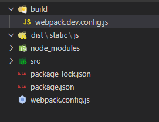

**参考文献**

1. <https://webpack.github.io/>
2. <https://webpack.docschina.org/>


## 一、概述


webpack 是一个打包工具，打包静态资源。当 webpack 处理应用程序时，它会递归地构建一个[依赖关系图(dependency graph)](https://webpack.docschina.org/concepts/dependency-graph/)，其中包含应用程序需要的每个[模块](https://webpack.docschina.org/concepts/modules/)，然后将所有这些模块打包成一个或多个 bundle。

从图中我们可以看出，*Webpack* 可以将多种静态资源 js、css、sass 转换成一个静态文件，减少了页面的请求。


### 1.1 什么是webpack？

> WebPack可以看做是**模块打包机**：它做的事情是，分析你的项目结构，找到JavaScript模块以及其它的一些浏览器不能直接运行的拓展语言（Sass，TypeScript等），并将其转换和打包为合适的格式供浏览器使用。在3.0出现后，Webpack还肩负起了优化项目的责任。

这段话有三个重点：

- 打包：可以把多个Javascript文件打包成一个文件，减少服务器压力和下载带宽。
- 转换：把拓展语言转换成为普通的JavaScript，让浏览器顺利运行。
- 优化：前端变的越来越复杂后，性能也会遇到问题，而WebPack也开始肩负起了优化和提升性能的责任。


### 1.2 为什么需要webpack？

Webpack 是现代前端技术的基石，常规的开发方式，比如 jQuery、HTML、CSS 静态网页开发已经落后了。现在是MVVM的时代，数据驱动视图，Webpack 将现代js开发中的各种新型有用的技术，集合打包。通过下图理解webpack生态圈：


### 1.3 模块化

模块化是一种处理复杂系统分解为更好的可管理模块的方式，简单来说就是解耦。通常一个文件就是一个模块，有自己的作用域，只向外暴露特定的变量和函数。

其优势为：简化开发、按需加载、便于管理、可复用。

目前流行的js模块化规范有CommonJS、AMD、CMD以及ES6的模块系统


#### a. 耦合

- 耦合是指两个或两个以上的体系或两种运动形式间通过相互作用而彼此影响以至联合起来的现象。
- 在软件工程中，对象之间的耦合度就是对象之间的依赖性。对象之间的耦合越高，维护成本越高，因此对象的设计应使类和构件之间的耦合最小。
- 分类：有软硬件之间的耦合，还有软件各模块之间的耦合。耦合性是程序结构中各个模块之间相互关联的度量。它取决于各个模块之间的接口的复杂程度、调用模块的方式以及哪些信息通过接口。


#### b. 解耦

- 解耦，字面意思就是解除耦合关系。
- 在软件工程中，降低耦合度即可以理解为解耦，模块间有依赖关系必然存在耦合，理论上的绝对零耦合是做不到的，但可以通过一些现有的方法将耦合度降至最低。
- 设计的核心思想：尽可能减少代码耦合，如果发现代码耦合，就要采取解耦技术。让数据模型，业务逻辑和视图显示三层之间彼此降低耦合，把关联依赖降到最低，而不至于牵一发而动全身。原则就是A功能的代码不要写在B的功能代码中，如果两者之间需要交互，可以通过接口，通过消息，甚至可以引入框架，但总之就是不要直接交叉写。
- 观察者模式：观察者模式存在的意义就是「解耦」，它使观察者和被观察者的逻辑不再搅在一起，而是彼此独立、互不依赖。比如网易新闻的夜间模式，当用户切换成夜间模式之后，被观察者会通知所有的观察者「设置改变了，大家快蒙上遮罩吧」。QQ消息推送来了之后，既要在通知栏上弹个推送，又要在桌面上标个小红点，也是观察者与被观察者的巧妙配合。


#### c. [commonJS 规范](http://www.commonjs.org/specs/modules/1.0/)

CommonJS就是一个JavaScript模块化的规范，是用在服务器端的node的模块规范，webpack也是对CommonJS原生支持的。

> a. 特点：

- 模块输出的是一个值的拷贝， 模块是运行时加载，同步加载
- CommonJS 模块的顶层 `this` 指向当前模块

> b. API：

- require：导入
- module.exports 或者exports：导出

> c. 示例：新建两个模块 A.js、B.js

```javascript
// A.js
// writing one:
let a = 10, b = 20;
module.exports = { a, b };

// writing two:
module.exports.a = 10;
module.exports.b = 20;

// writing three:
exports.a = 10;
exports.b = 20;

// 三种写法结果是一样，对外暴露的接口的结果是一致的
```

```javascript
// B.js
const A = require("./A");
A  // {a:10, b:20}
```

[^ tips]:require()是 Node.js 中才支持的方法，目前前端浏览器都还没有原生支持。


##### commonJS例子

- 首先，我们创建需要依赖的模块代码m1、m2、m3

```javascript
// m1.js
module.exports = {
    msg: 'm1',
    foo: function () {
        return this.msg;
    }
}

// m2.js
module.exports = function () {
    return 'm2';
}

// m3.js
 // var exports = module.exports;在第博客二部分：commonjs规范中第六小点由说明
 exports.foo = function () {
     return 'ms';
 }
```

- 创建主入口文件index.js

```javascript
// index.js
var m1 = require('./m1');
var m2 = require('./m2');
var m3 = require('./m3');

console.log(m1.foo());
console.log(m2());
console.log(m3.foo());
```

- 前面规范中说过在浏览器并不支持commonjs规范，主入口文件index.js肯定不能直接被demo.html结构文本使用，直接使用的话会报错；所以在要前端开发中使用commonjs规范的话就必须使用插件将commonjs模块化规范转换成浏览器识别的代码结构，在这之前系统上必须安装nodejs环境，这时候我们可以先在控制台中测试看看index.js的依赖是否成功：

```shell
1 node -v //测试node环境是否安装成功，如果成功的话会在控制台打印出node的版本号
2 node index.js
```

- 这是在node环境下能够编译执行index.js,前面说过要想将commonjs模块化结构代码在浏览器中编译执行，得需要使用工具转换成浏览器能够编译执行的代码结构，这个工具就是Browserify，工具的官网：http://browserify.org/

```shell
npm install browserify
```

- 安装成功后，我们查看官网可以发现有一句话

```shell
 browserify main.js -o bundle.js
```

- 意思是将commonjs规范的main.js文件通过browserify转换成浏览器能够执行的bundle.js文件；那么我们就可以使用这个命令来将示例中的index.js转换成一个可以在浏览器使用的js文件（下面这句命令是要在命令窗口执行）：

```shell
// 我们自己的文件
 browserify index.js -o bundle.js
```

- 每次都需要输入 固定的 输入和输出文件名，我们可以使用命令，在package.json中修改

```javascript
"browserify": "./node_modules/.bin/browserify ./src/js/index.js -o ./src/js/bundle.js"
// 每次运行只需要输入npm run browserify
```

- 最后引入js，在我们的html文件中引入bundle.js

```javascript
<script src="./js/bundle.js"></script>
```

- 完整目录结构如下


具体详情参考：https://www.cnblogs.com/ZheOneAndOnly/p/11071280.html


注意：

1. exports 与module.exports 的区别：exports 是对 module.exports 的引用，不能直接给exports 赋值，直接赋值无效，结果是一个空对象，module.exports 可以直接赋值。

2. 一个文件不能写多个module.exports ，如果写多个，对外暴露的接口是最后一个module.exports。

3. 模块如果没有指定使用module.exports 或者exports 对外暴露接口时，在其他文件就引用该模块，得到的是一个空对象。


#### d. ES6

ES6 在语言标准的层面上，实现了模块功能，而且非常简单，ES6到来，完全可以取代 CommonJS 和AMD规范，成为浏览器和服务器通用的模块解决方案。

> a. 特点：

- ES6 模块之中，顶层的`this`指向`undefined`，即不应该在顶层代码使用`this`。
- 自动采用严格模式"use strict"。须遵循严格模式的要求
- ES6 模块export、import命令可以出现在模块的任何位置，但是必须处于模块顶层。如果处于块级作用域内，就会报错
- ES6 模块输出的是值的引用

> b. API

[import](https://developer.mozilla.org/zh-CN/docs/Web/JavaScript/Reference/Statements/import)：导入模块

[export](https://developer.mozilla.org/zh-CN/docs/Web/JavaScript/Reference/Statements/export)：导出模块

> 示例

```js
// 1. 导出单个属性
export const a = 10;
export const b = 20;
import {a, b} from "./path"
// 2. 导出属性列表
const a = 10, b = 20;
export {a, b}
import {a, b} from "./path"
// 3. 重命名导出
export {a as x, b as y }
import {x, y} from "./path"
// 4. 默认导出
export default { min:10, max:20 }
import 变量 from "./path"
```


## 二、初探

### 2.1 准备

创建项目并在项目根目录中通过 `npm` 或 `yarn` 生成 *package.json* 配置文件。

```shell
# NPM
$ npm init --yes
# YARN
$ yarn init --yes
```


### 2.2 安装

安装 `webpack` 及其命令行工具 `cli`：

```shell
# NPM
$ npm install webpack webpack-cli --save-dev 
# YARN
$ yarn add webpack webpack-cli --save-dev  
# 查看版本
$ ./node_modules/.bin/webpack --version
4.41.2
```

> 提示：官方建议使用局部安装，局部安装可以使用最新的技术栈，JavaScript 是弱语言,有局部变量和全局变量,其实全局安装与局部安装的性质与函数的全局变量与局部变量有点类似。


### 2.3 创建项目结构

接下来创建如下项目结构：

```
.
├── dist
    └── index.html
├── node_modules
├── package.json
└── src
    └── js
    	├── main.js
   		├── util.js
```

>  提示：
>
>  1. src是源码文件，dist是我们编译打包好的文件；一个用于**开发环境**，一个用于**生产环境**。
>  2. node_modules 为 yarn 或 npm 安装依赖时自动生成的文件。


### 2.4 编辑项目文件

-> index.html

```html
<!DOCTYPE html>
<html lang="zh-CN">
<head>
    <meta charset="UTF-8">
    <meta name="viewport" content="width=device-width, initial-scale=1.0">
    <meta http-equiv="X-UA-Compatible" content="ie=edge">
    <title>hello-webpack</title>
</head>
<body>
		<h1 id="title"></h1>
    <!-- 引入webpack打包后生成的文件 -->
    <script src="../dist/static/js/main-bundle.js"></script>
</body>
</html>
```

-> util.js

```javascript
class Util {
    constructor() {}
    static setTitle(id, title) {
        let el = document.getElementById(id);
        el.textContent = title;
    }
}

module.exports  = {
    Util
}
```

-> main.js

```javascript
import {
    Util
} from "./until.js";
Util.setTitle("title", "Hello, webpack!");
```


### 2.5 创建配置文件 

在 <ins>项目根目录下</ins> 创建 “webpack.config.js ” 文件，配置如下：

[^ tips]: `__dirname` 总是指向被执行 js 文件的绝对路径。如：当你在 `/d1/d2/myscript.js` 文件中写了 `__dirname`， 它的值就是 `/d1/d2` 。

```javascript
// 1. 引入模块
const path = require('path');
// 2. 导出配置
module.exports = {
    // 配置基础路径为当前目录（默认为配置文件所在的当前目录）
    context: path.resolve(__dirname, './'),
    // 打包模式 development | production
    mode: 'development',
    // 入口 string | array | object
    entry: {
        main: './src/js/main.js'
    },
    // 出口
    output: {
        // 输出目录/绝对路径
        path: path.resolve(__dirname, './dist/'),
        // 输出文件名
        filename: 'static/js/[name]-bundle.js'
    },
    // 加载器
    module: {
        rules: []
    },
    // 开发服务
    devServer: {}
};
```


### 2.6 编译打包

## 

```shell
$ ./node_modules/.bin/webpack 
[webpack-cli] Compilation finished
asset static/js/main-bundle.js 4.53 KiB [emitted] (name: main)
runtime modules 931 bytes 4 modules
cacheable modules 277 bytes
  ./src/js/main.js 84 bytes [built] [code generated]
  ./src/js/until.js 193 bytes [built] [code generated]
webpack 5.10.1 compiled successfully in 104 ms
```

执行打包任务之后，会在 “./dist/static/js” 目录下生产一个  ”main-bundle.js“ 文件，运行 ”index.html“ 可以看到 ”Hello, webpack!“ 说明打包成功。

> 提示：你可以尝试不同的打包模式观察二者的区别。


### 2.7 开发环境

在上面，虽然我们能正常显示，说明打包成功。但是，如果我们修改了显示文字，或者其他，我们想要在页面上呈现修改后的效果，又需要再次执行打包命令。


[webpack-dev-server](https://www.npmjs.com/package/webpack-dev-server) 为你提供了一个简单的 web server，并且具有 live reloading（实时重新加载） 功能。安装方式如下：

```shell
$ npm i webpack-dev-server -D 
OR
$ yarn add webpack-dev-server -D
```

devServer常用配置项如下，更多配置可参考 [这里](https://webpack.docschina.org/configuration/dev-server) 。

| 配置选项           | 功能描述                                                     |
| ------------------ | ------------------------------------------------------------ |
| contentBase        | 默认webpack-dev-server会为根文件夹提供本地服务器，如果想为另外一个目录下的文件提供本地服务器，应该在这里设置其所在目录（本例设置到“dist"目录） |
| port               | 设置默认监听端口，如果省略，默认为”8080“                     |
| inline             | 自动刷新页面                                                 |
| historyApiFallback | 处理404                                                      |
| host               | 设置服务器主机号，在开发阶段，一般设置为：localhost          |
| proxy              | 设置代理                                                     |

devServer 配置如下：

**webpack.config.js**

```javascript
devServer: {
    contentBase:path.resolve(__dirname,"./dist/"),
    host: "127.0.0.1",
    port: 8090,
    open: true,
    inline: true,
    hot: true // 热替换
}
```

要实现热替换，还需调用插件。在热替换（HMR）机制里，不是重载整个页面，HMR程序会只加载被更新的那一部分模块，然后将其注入到运行中的APP中。

```js
new webpack.HotModuleReplacementPlugin()
```

HMR 需要用到 HotModuleReplacementPlugin 这个插件，这个插件是 webpack 自带的插件，首先引入webpack

在**webpack.config.js**

```javascript
const webpack = require('webpack');
```

在**devServer**中增加：

```javascript
devServer: {
    contentBase:path.resolve(__dirname,"./dist/"),
    host: "127.0.0.1",
    port: 8090,
    open: true,
    inline: true,
    hot: true, // 热替换
    
    hotOnly: true	// 即使HMR没有生效，浏览器也不会自动刷新
}
```

[^ tips]:hot 和 hotOnly 的区别是在某些模块不支持热更新的情况下，前者会自动刷新页面，后者不会刷新页面，而是在控制台输出热更新失败

再配置插件——plugins

```javascript
plugins: [
    new webpack.HotModuleReplacementPlugin()
]
```


在 “package.json” 中添加如下命令，可以开启本地服务器：

```javascript
{
	"scripts": {
    	"dev": "./node_modules/.bin/webpack-dev-server"
	}
}
```

在终端中输入`npm run dev` 或 `yarn run dev `即可在本地的 `8090` 端口查看结果。

> 注意：
>
> 1、webpack-dev-server 在编译之后不会写入到任何输出文件。而是将 bundle 文件保留在内存中，然后将它们 serve 到 server 中，就好像它们是挂载在 server 根路径上的真实文件一样。如果你的页面希望在其他不同路径中找到 bundle 文件，则可以通过 dev server 配置中的 [`publicPath`](https://webpack.docschina.org/configuration/dev-server/#devserver-publicpath-) 选项进行修改。
>
> 2、如果你自定义了配置文件，如 “webpack.dev.config.js”，那么在执行devServer的时候，也要指定相应的配置文件，如：webpack-dev-server --config webpack.dev.config.js。
>
> 3、在开发阶段，我们可以通过设置 “output” 中的 “publicPath” 字段访问静态资源，以刚刚配置devServer为例，我们可以在“output”出口设置中添加如下字段：*publicPath: "http://localhost:8090/"*，此时，你静态资源的访问路径将会变成：publicPath + 静态资源地址，待项目上线之后，再将publicPath设置为线上地址即可。


[^ tips]:npm run dev启动的时候，如果报错。先到github项目的Issues中，检索一下相关问题，比在百度谷歌上直接搜索非官方解决方案好得多。

如：上面我们在`npm run dev`时报错

```javascript
Error: Cannot find module 'webpack-cli/bin/config-yargs'
```

我们 ISSUES中搜索到的结果如下：

临时解决方案：
将webpack cli退回到版本3。*例如：

```javascript
"webpack-cli": "^ 3.3.12"
```

我们再安装对应的版本，并安装相应依赖。

```javascript
"devDependencies": {
    "webpack": "^5.1.0",
    "webpack-cli": "^3.3.12",
    "webpack-dev-server": "^3.11.0"
  }
```

再次`npm run dev`则成功了。

并且在成功启动后的，本地服务号（带端口）中，我们可以找到我们打包的js文件。并且内容也根据我们手动的修改做了热更新。


### 2.8 扩展知识

#### a. 指定配置文件编译

在实际开发过程中，你可能会创建不同的config.js文件来满足不同的开发需求，比如你在开发阶段，通常会创建一个 “webpack.dev.config.js” 文件，那么你在执行编译指令的时候需要指向该配置文件，如下所示：

package.json配置：

```javascript
"scripts": {
    "test": "echo \"Error: no test specified\" && exit 1",
    "dev": "./node_modules/.bin/webpack-dev-server",
    "myDev": "./node_modules/.bin/webpack --config ./build/webpack."
  },
```

我们使用`myDev`

目录结构：



webpack.dev.config.js配置：

```javascript
// 1. 引入模块
const path = require('path');
const webpack = require('webpack');
// 2. 导出配置
module.exports = {
    // 配置基础路径为当前目录（默认为配置文件所在的当前目录）
    context: path.resolve(__dirname, './'),
    // 打包模式 development | production
    mode: 'development',
    // 入口 string | array | object
    entry: {
        main: '../src/js/main.js'
    },
    // 出口
    output: {
        // 输出目录/绝对路径
        path: path.resolve(__dirname, '../dist/'),
        // 输出文件名
        filename: 'static/js/[name]-dev-bundle.js'
    },
    // 加载器
    module: {
        rules: []
    },
    // 开发服务
    devServer: {
        contentBase: path.resolve(__dirname, "../dist/"),
        host: "127.0.0.1",
        port: 8090,
        open: true,
        inline: true,
        hot: true, // 热替换
        hotOnly: true // 即使HMR没有生效，浏览器也不会自动刷新
    },
    plugins: [
        new webpack.HotModuleReplacementPlugin()
    ]
};
```

当我们执行`npm run myDev`后，并且成功，我们可以发现`dist`文件夹下生成了新的js文件。


#### b. 编译参数配置

webpack 自身提供了一些参数来优化编译任务，以下简单列出了一些参数：

| 参数                    | 描述                   |
| ----------------------- | ---------------------- |
| --config                | 指定配置文件           |
| --watch, -w             | 监听变动并自动打包     |
| -p                      | 压缩混淆脚本           |
| --progress              | 显示进度条             |
| --display-reasons       | 显示添加打包模块的原因 |
| --display-error-details | 出错时错误的详情       |

> 提示：想了解webpack更多参数，可在终端输入 `./node_modules/.bin/webpack -h`  查看

这里以监听为例，执行编译的时候带上 -w 参数，如下所示：

```shell
$ ./node_modules/.bin/webpack --config ./build/webpack.dev.config.js  -w
```

当你对文件做了任何修改都会进行自动编译，如果你想要取消监听状态，可使用快捷键：`CTR/CMD+C`

此时，我们打开`index.html`文件，并修改`main.js`文件中的文本，我们不需要重新去执行编译命令，在页面刷新即可看见页面展示的变化。


#### c. 简化指令

可以发现，如果执行编译任务，特别是在参数比较多的情况，是比较麻烦的，我们可以在 npm 的 ”package.json“ 文件中进行添加一个脚本指令的字段，如下所示：

```json
"scripts": {
  "build":"./node_modules/.bin/webpack --progress --display-modules --display-reasons --display-error-details --watch"
},
```

在 ”package.json“ 文件中配置添加完脚本配置之后，我们可直接通过如下令执行打包任务，如下所示:

```shell
$ npm run build
OR
$ yarn run build
```

至此，你已经初步了解了webpack的基本使用及webpack模块化思想。


### 2.9 构建过程

- 初始化：启动构建，读取与合并配置参数，加载 [Plugin](https://www.webpackjs.com/api/plugins/)，实例化 [Compiler](https://www.webpackjs.com/api/compiler-hooks/)。

- 编译：从 [Entry](https://webpack.docschina.org/concepts/#入口-entry-) 发出，针对每个 [Module](https://webpack.docschina.org/concepts/modules/#src/components/Sidebar/Sidebar.jsx) 串行调用对应的 [Loader](https://webpack.docschina.org/concepts/loaders/#src/components/Sidebar/Sidebar.jsx) 去翻译文件内容，再找到该 [Module](https://webpack.docschina.org/concepts/modules/#src/components/Sidebar/Sidebar.jsx) 依赖的 [Module](https://webpack.docschina.org/concepts/modules/#src/components/Sidebar/Sidebar.jsx)，递归地进行编译处理。

- 输出：对编译后的 Module 组合成 [Chunk](https://zhuanlan.zhihu.com/p/21318102)，把 [Chunk](https://zhuanlan.zhihu.com/p/21318102) 转换成文件，输出到本地。


## 二、核心

### 2.1 Entry

`Entry`：入口起点(entry point)，指示 webpack 应该使用哪个模块，来作为构建其内部依赖图的开始。进入入口起点后，webpack 会找出有哪些模块和库是入口起点（直接和间接）依赖的。

入口文件常用的配置形式如下：

```js
module.exports {
    entry: {
        "main": "./src/js/main.js",
        "news": "./src/js/news.js"  
    }
}
```

> 提示：在多页面项目中设置出口时，通过`[name]` 即可获取文件名，其中文件名就是入口设置中的 `key` 项。


### 2.2 Output

`Output`：该属性告诉 webpack 在哪里输出它所创建的 bundles，以及如何命名这些文件。你可以通过在配置中指定一个 output 字段，来配置这些处理过程。

出口文件常用的配置形式如下：

```javascript
module.exports {
	output: {
      // 输出目录
  		path: path.resolve(__dirname, "./dist/"),
  		// 输出文件名
  		filename: "static/js/[name]-bundle.js",
  		// 处理静态资源路径
  		// 静态资源最终访问路径 = output.publicPath + 资源loader或插件等配置路径
  		// 这里假设开启devServer服务
  		publicPath: "http://localhost:8080/"
    }
}
```

- `[name]`：模块名称，也就是在指定入口时的 `key` 值。
- `[hash]`：打包后文件的 hash 值，md5，保证文件唯一性。
- `[chunkhash]`：模块自身的hash值。


**hash、chunkhash、contenthash的区别：**

详情介绍：https://www.cnblogs.com/ihardcoder/p/5623411.html


**简单理解：**

首先明确compilation：compilation对象代表某个版本的资源对应的编译进程。当使用Webpack的development中间件时，每次检测到项目文件有改动就会创建一个compilation，进而能够针对改动生产全新的编译文件。compilation对象包含当前模块资源、待编译文件、有改动的文件和监听依赖的所有信息。

**hash：**

- 是根据每次编译compilation的内容计算所得，也可以理解为项目总体文件的hash值，而不是针对每个具体文件的。
- 是compilation对象计算所得，而不是具体的项目文件计算所得。所以以上配置的编译输出文件，所有的文件名**都会使用相同**的hash指纹。
- 这样带来的问题是，三个js文件任何一个改动都会影响另外两个文件的最终文件名。上线后，另外两个文件的浏览器缓存也全部失效。这肯定不是我们想要的结果。
- 所以，**hash**可以作为版本控制的一环，将其作为编译输出文件夹的名称统一管理

```javascript
output: {
	filename: '/dest/[hash]/[name].js'
}
```


**chunkhash：**

- 是根据具体 **模块文件** 的内容计算所得的hash值，所以某个文件的改动只会影响它本身的hash指纹，不会影响其他文件。

```javascript
output: {
    path: __dirname + '/built',
    filename: '[name].[chunkhash:8].js'
}
```


**contenthash:**

- 代表的是文本文件内容的hash值，也就是只有style文件的hash值。
- 通过contenthash，可以处理style问题。
- **什么是style问题：**webpack的编译理念，webpack将style视为js的一部分，所以在计算`chunkhash`时，会把所有的js代码和style代码混合在一起计算。
- 比如`main.js`引用了`main.scss`：webpack计算chunkhash时，以`main.js`文件为编译入口，整个chunk的内容会将`main.scss`的内容也计算在内：所以，**不论是修改了js代码还是scss代码**，整个chunk的内容都改变了，计算所得的chunkhash自然就不同了。
- 这个hash值——**contenthash**就是解决上述问题的。

```javascript
new ExtractTextPlugin('[name].[contenthash].css');
```


结合上文提到的种种，考虑一下这个问题：**如果只修改了`main.scss`文件，未修改`main.js`文件，那么编译输出的js文件的hash指纹会改变吗？**

答案是肯定的。那么怎么解决这个问题呢？

我们需要做的只是将这个插件加入到webpack的配置中：

```javascript
var WebpackMd5Hash = require('webpack-md5-hash');

module.exports = {
    output: {
        //...
        chunkFilename: "[chunkhash].chunk.js"
    },
    plugins: [
        new WebpackMd5Hash()
    ]
};
```


我们可以看一看，使用`hash和chunkhash`打包出来的文件有什么不一样

[^ tips]: 平时，我们的入口、出口文件，打包都是一对一、多对一，没法多对多，在查看官方文档后，发现，也有多对多的方法，以上面hash和chunkhansh为例：

- 单入口

```javascript
output: {
    filename: 'bundle.js'
}
```

- 多入口

  - 使用入口名称

  ```javascript
  output: {
      filename: '[name].bundle.js'
  }
  ```

  - 使用内部 chunk id

  ```javascript
  output: {
      filename: '[id].bundle.js'
  }
  ```

  - 使用由生成的内容产生的 hash

  ```javascript
  output: {
      filename: '[contenthash].bundle.js'
  }
  ```

  - 结合多个替换组合使用

  ```javascript
  output: {
      filename: '[name].[contenthash].bundle.js'
  }
  ```

  - 使用函数返回 filename

  ```javascript
  output: {
      filename: (pathData) => {
          return pathData.chunk.name === 'main' ? '[name].js' : '[name]/[name].js'
      }
  }
  ```


结合上面官方文档的知识点，我们可以使用最后一个 `函数返回filename`实现多对多、N对多（N大于等于1），代码如下：**output对象中**

```javascript
// 1. 引入模块
const path = require('path');
const webpack = require('webpack');
// 2. 导出配置
module.exports = {
    // 配置基础路径为当前目录（默认为配置文件所在的当前目录）
    context: path.resolve(__dirname, './'),
    // 打包模式 development | production
    mode: 'development',
    // 入口 string | array | object
    entry: {
        main: '../src/js/main.js',
        main2: '../src/js/main.js'
    },
    // 出口
    output: {
        // 输出目录/绝对路径
        path: path.resolve(__dirname, '../dist/'),
        // 输出文件名
        filename: (chunkData) => {
            return chunkData.chunk.name === 'main'
                ? 'static/js/[name]-[hash]-bundle.js'
            	: 'static/js/[name]-[hash:8]-bundle.js'
        }
    },
    // 加载器
    module: {
        rules: []
    },
    // 开发服务
    devServer: {
        contentBase: path.resolve(__dirname, "../dist/"),
        host: "127.0.0.1",
        port: 8090,
        open: true,
        inline: true,
        hot: true, // 热替换
        hotOnly: true // 即使HMR没有生效，浏览器也不会自动刷新
    },
    plugins: [
        new webpack.HotModuleReplacementPlugin()
    ]
};
```


### 2.3 Loader

`webpack`本身只能打包`Javascript`文件，对于其他资源例如 `css`，图片，或者其他的语法集比如`jsx`，是没有办法加载的。 这就需要对应的`loader`将资源转化，加载进来。

```js
module.exports = {
    // 加载器
    module: {
        rules: []
    }
}
```

- `test`：required - 处理文件
- `use`：required - 加载器
- `include/exclude`：optional - 包含/不包含文件；

```javascript
module: {
    rules: [
        {
            test: /\.css$/,  // 正则匹配所有.css后缀的样式文件
            use: ['style-loader', 'css-loader'] // 使用这两个loader来加载样式文件
        }
    ]
} 
```

`module.rules` 允许你在 `webpack` 配置中指定多个 `loader`。 这是展示 `loader` 的一种简明方式，并且有助于使代码变得简洁。

**上述rules的作用：**
`webpack`在打包过程中，凡是遇到后缀为`css`的文件，就会使用`style-loader`和`css-loader`去加载这个文件。


**Loader使用流程：**

- 安装loader

  ```javascript
  npm install --save-dev less
  npm install --save-dev less-loader
  npm install --save-dev css-loader
  npm install --save-dev style-loader
  ```

  这些`loader`的作用如下：

  - 安装`less-loader`后可以在`js`中使用`require`的方式来加载`less`文件了；
  - 安装`css-loader`后可以在`js`中加载`css`文件；
  - 安装`style-loader`的目的是为了让加载的`css`作为`style`标签内容插入到`html`中。

- 配置loader

  **webpack.config.js代码如下：**

  ```javascript
  module.exports = {
      devtool: 'eval-source-map',
      entry:  __dirname + "/src/index.js",  //入口文件
      output: {
          path: __dirname + "/app",  //打包后的文件存放的地方
          filename: "bundle.js" //打包后输出文件的文件名
      },
      module: {
          rules: [
              {
                  test: /\.less$/,
                  use: ['style-loader','css-loader', 'less-loader']
              }
          ]
      }
  }
  ```

- 新建样式文件

  `main.less`代码如下：

  ```javascript
  .demo {
      width: 200px;
      height: 100px;
      margin: auto;
      border: 1px solid;
      p {
          font-weight:bold;
          padding-left: 30px;
      }
  }
  ```

- 修改入文件口

  在入口文件`index.js`里引入我们的样式文件

  ```javascript
  require ('./main.less');
  var element = document.createElement('div');
  element.className = 'demo';
  var p = document.createElement('p');
  p.innerText = 'webpack系列之loader的基本使用！';
  element.appendChild(p);
  document.body.appendChild(element);
  ```

- 打包

  在项目根目录（`webpack-demo`）下执行打包命令：

  ```javascript
  webpack-demo webpack
  ```


#### a. 处理脚本

[babel-loader](https://www.npmjs.com/package/babel-loader)

**> 概述：**

编译ES.X，如ES6

**> 安装：**

```shell
# NPM
$ npm i -D babel-loader @babel/core @babel/preset-env
# YARN
$ yarn add -D babel-loader @babel/core @babel/preset-env
```

**> 配置：**

```javascript
// 编译es语法
{
    test: /\.js$/,
    exclude: /node_modules/,
    use: {
        loader: "babel-loader",
        options: {
            presets: ["@babel/preset-env"]
        }
    }
}
```


#### b. 处理样式

**\> 概述：**

- [style-loader](https://www.npmjs.com/package/style-loader)：将所有计算后的样式加入页面中

- [css-loader](https://www.npmjs.com/package/css-loader)：使你能够使用类似 `import` 和 `url()`  的方法实现  `require()` 的功能。

- [less-loader](https://www.npmjs.com/package/less-loader)：编译LESS

- [sass-loader](https://www.npmjs.com/package/sass-loader)：编译SASS

- [postcss-loader](https://www.npmjs.com/package/postcss-loader)：添加浏览器前缀（该loader还有其他额外的功能）

**> 安装：**

```shell
# NPM
$ npm i css-loader style-loader less less-loader postcss-loader autoprefixer -D
# YARN
$ yarn add css-loader style-loader less less-loader postcss-loader autoprefixer -D
```

**\> 配置：**

自动添加前缀（autoprefixer）指定兼容版本需在 “package.json”中的“browserslist”字段中配置即可：

```json
"browserslist": [
  "last 2 version"
]
```

然后在配置文件中添加如下代码：

```js
{
    test: /\.less$/,
    exclude: /node_modules/,
    use: ["style-loader", "css-loader", {
        loader: "postcss-loader",
        options: {
            ident: "postcss",
            plugins: [require("autoprefixer")]
        }
    }, "less-loader"]
}
```

> 注意：引用顺序为从右到左，样式引入使用 commonJS规范引入。如果需要分离CSS文件，可使用插件 [mini-css-extract-plugin](https://www.npmjs.com/package/mini-css-extract-plugin)，webpack v4.0之前使用[extract-text-webpack-plugin](https://www.npmjs.com/package/extract-text-webpack-plugin) 。


#### c. 处理图片

[file-loader](https://www.npmjs.com/package/file-loader)、[url-loader](https://www.npmjs.com/package/url-loader)

**\> 安装**

```shell
# NPM
$ npm i -D url-loader file-loader html-loader
# YARN
$ yarn add -D url-loader file-loader html-loader
```

- url-loader：处理路径
- html-loader：处理html中的图片

**\> 配置**

```js
// 处理HTML
{
    test: /\.html$/,
    use: "html-loader"
},
// 处理图片
{
    test: /\.(jpg|jpeg|png|svg|gif)$/,
    exclude: /node_modules/,
    use: {
        loader: "url-loader",
        options: {
            // <= 2kb，则转换成base64
            limit: 2000, 
            // 图片名字
            name: "[name]-[hash:5].[ext]",
            // 输出路径
            outputPath: "static/images/",
            // 启用commonJS规范  
            esModule: false
        }
    }
},
```

最后在webpack.config.js文件的output选项中设置publicPath，主要作用就是处理静态文件路径的。

```javascript
output: {
    filename: "js/bundle.js",
    path: path.resolve(__dirname, "./dist"),
    publicPath: "http://localhost:8080/"
},
```

注意，这里的IP和端口，是你本机的ip或者是你devServer配置的IP和端口。

配置完成后，你再使用webpack命令进行打包，你会发现原来的相对路径改为了绝对路径，这样来讲速度更快。


#### d. 处理字体

```js
{
    test: /\.(woff|woff2|eot|ttf|otf)$/,
    use: [{
        loader: 'url-loader',
        options: {
            name: '[name]-[hash:5].[ext]',
            limit: 5000,
            outputPath: 'static/fonts/'
        }
    }]
}
```


### 2.4 Plugins

插件（Plugins）是用来拓展Webpack功能的，它们会在整个构建过程中生效，执行相关的任务。
Loaders和Plugins常常被弄混，但是他们其实是完全不同的东西，可以这么来说，loaders是在打包构建过程中用来处理源文件的，一次处理一个，插件并不直接操作单个文件，它直接对整个构建过程起作用。

Webpack有很多内置插件，同时也有很多第三方插件，可以让我们完成更加丰富的功能。

使用插件步骤：

- 安装插件
- 导入插件
- 在 plugins 数组中创建插件实例


#### a. [webpack-bundle-analyzer](https://www.npmjs.com/package/webpack-bundle-analyzer)

**\> 概述**

该插件是将打包后的内容用canvas以图形的方式展示出来，借助这个工具，我们可以知道每个chunk由哪些模块组成，非常方便好用

**\> 安装**

```shell
# NPM 
$ npm install --save-dev webpack-bundle-analyzer
# Yarn 
$ yarn add -D webpack-bundle-analyzer
```

**\> 配置**

```js
new BundleAnalyzerPlugin()
```


#### b. [Html-Webpack-Plugin](https://www.npmjs.com/package/html-webpack-plugin)

**> 概述**

HtmlWebpackPlugin 简化了HTML文件的创建，以便为你的webpack包提供服务，它可以自动为你生成项目中的html文件。 这对于在文件名中包含哈希的webpack bundle尤其有用，其主要作用如下：

- 为html文件中引入的外部资源如 script、link 动态添加每次compile后的hash，防止引用缓存的外部文件问题。
- 可以生成创建html入口文件，比如单页面可以生成一个html文件入口，配置多个 html-webpack-plugin 可以生成多个页面入口

插件的基本作用就是生成html文件，其原理主要是将 webpack中 entry 配置的相关入口chunk  和  extract-text-webpack-plugin 抽取的css**样式插入到该插件提供的** template 或者 templateContent 配置项指定的内容基础上生成一个html文件，具体插入方式是将样式link插入到head元素中，script插入到head或者body中。

**> 安装**

```shell
# NPM
$ npm i html-webpack-plugin  -D
# YARN
$ yarn add html-webpack-plugin -D
```

**> 配置**

```javascript
new HtmlWebpackPlugin({
    // 模板文件
    template: "./src/index.html",
    // 标题
    title: "主页",
    // 文件名(相对于output.path)，可通过文件名设置目录，如 static/pages/detail.html
    filename: "index.html",
    // 静态资源位置
    inject: "body",
    // 是否hash
    hash: false,
    // 指定输出文件所依赖的入口文件（*.js）的[name]
    chunks: ["main"],
    // 控制压缩
    minify: {
        collapseWhitespace: false,
        removeComments: true,
        removeAttributeQuotes: true,
        removeEmptyAttributes: true
    }
})
```

> 提示：
>
> 1. filename配置的html文件目录是相对于webpackConfig.output.path路径而言的，不是相对于当前项目目录结构的。
> 2. 指定生成的html文件内容中的 `link` 和 `script` 路径是相对于生成目录下的，写路径的时候请写生成目录下的相对路径。
> 3. 使用模板标题，需要在模板文件的头部标题标签中添加 *<%= htmlWebpackPlugin.options.title %>*


#### c. [clean-webpack-plugin](https://www.npmjs.com/package/clean-webpack-plugin)

**> 说明**

清除每次打包后的缓存文件，确保每次都是最新的

**> 安装**

```shell
# NPM
$ npm install clean-webpack-plugin -D
# YARN
$ yarn add  clean-webpack-plugin -D
```

**> 配置**

```javascript
const { CleanWebpackPlugin } = require('clean-webpack-plugin');
 
new CleanWebpackPlugin(),
```

> 注意：
>
> - 名字中的 `C` 字母必须大写。
> - 应该把CleanWebpackPlugin放在plugin配置项的最后一个，因为 webpack 配置是倒序的（最后配置的最先执行）。以保证每次正式打包前，先清空原来遗留的打包文件。


#### d. [BannerPlugin](https://webpack.docschina.org/plugins/banner-plugin)

**> 说明**

添加版权声明

**> 安装**

无需安装，该插件为 webpack 内置插件，直接使用即可。

**> 配置 **

```js
const webpack = require('webpack');
module.exports = {
    plugins: [
        new webpack.BannerPlugin("版权所有，翻版必究！")
    ]
};
```


#### e. [mini-css-extract-plugin](https://github.com/webpack-contrib/mini-css-extract-plugin)

**> 概述：**

通过webpack 打包的样式被嵌入到了 bundle.js 文件中，如果你想要将其抽离出来，我们可以使用该插件。

**> 安装：**

```shell
# NPM
$ npm install -D mini-css-extract-plugin
# YARN
$ yarn add -D mini-css-extract-plugin
```

**> 配置：**

```javascript
// module
{
    test: /\.less$/,
    exclude: /node_modules/,
    use: [
        // "style-loader",
        // => 使用插件中的loader代替style方式
        {
            loader: MiniCssExtractPlugin.loader,
            options: {
                reloadAll: true
            }
        },
        "css-loader",
        {
            loader: "postcss-loader",
            options: {
                ident: "postcss",
                plugins: [require("autoprefixer")]
            }
        },
        "less-loader"]
}
// plugins
new MiniCssExtractPlugin({
    filename: 'static/css/[name].css'
})
```

> 提示：
>
> - 输出路径相对于 output.path 设置
> - webpack v4.0之前使用 [extract-text-webpack-plugin]


#### f. [purifycss-webpack](https://www.npmjs.com/package/purifycss-webpack)

**> 概述：**

消除未使用的CSS

**> 安装：**

```shell
# NPM
$ npm i -D purifycss-webpack purify-css
# YARN
$ yarn add -D purifycss-webpack purify-css
```

**> 配置：**

```javascript
const glob = require('glob');
const PurifyCSSPlugin = require('purifycss-webpack');

// plugins
new PurifyCSSPlugin({
    // Give paths to parse for rules. These should be absolute!
    paths: glob.sync(path.join(__dirname, "./src/**/*.html")),
}),
```

这里配置了一个paths，主要是找html模板，purifycss根据这个配置会遍历你的文件，查找哪些css被使用了。配置好上边的代码，我们可以故意在css文件里写一些用不到的属性，然后用webpack打包，你会发现没用的CSS已经自动给你删除掉了。在工作中记得一定要配置这个plugins，因为这决定你代码的质量，非常有用。


#### g. [optimize-css-assets-webpack-plugin](https://www.npmjs.com/package/optimize-css-assets-webpack-plugin)

**\> 概述：**

压缩CSS

**\> 安装：**

```shell
# NPM
$ npm install -D optimize-css-assets-webpack-plugin 
# YARN
$ yarn add -D optimize-css-assets-webpack-plugin 
```

**\> 配置：**

```javascript
const OptimizeCSSAssetsPlugin = require('optimize-css-assets-webpack-plugin');

new OptimizeCSSAssetsPlugin ({
    // 默认是全部的CSS都压缩，该字段可以指定某些要处理的文件
    assetNameRegExp: /\.(sa|sc|c|le)ss$/g, 
    // 指定一个优化css的处理器，默认cssnano
    cssProcessor: require('cssnano'),
    cssProcessorPluginOptions: {
    preset: [  'default', {
        discardComments: { removeAll: true}, // 对注释的处理
        normalizeUnicode: false // 建议false,否则在使用unicode-range的时候会产生乱码
    }]
    },
    canPrint: true  // 是否打印编译过程中的日志
})
```


#### h. [copy-webpack-plugin](https://www.npmjs.com/package/copy-webpack-plugin)

**> 概述：**

工作中会有一些已经存在但在项目中没有引用的图片资源或者其他静态资源（比如设计图、开发文档），这些静态资源有可能是文档，也有可能是一些额外的图片。项目组长会要求你打包时保留这些静态资源，直接打包到指定文件夹。其实打包这些资源只需要用到copy-webpack-plugin。

**\> 安装：**

```shell
# NPM
$ npm i -D copy-webpack-plugin
# YARN
$ yarn add -D copy-webpack-plugin
```

**\> 配置：**

```js
const CopyPlugin = require("copy-webpack-plugin");

new CopyPlugin([
    {
        from: "./src/README.md",
        to: "./"
    }
])
```

- from：要打包的静态资源目录地址
- to：要打包到的文件夹路径，跟随output配置中的目录。


### 2.5 延伸

#### a. context

上下文，基础目录，**绝对路径**，用于从配置中解析入口起点和 loader，入口起点会相对于此目录查找。默认为当前目录，即配置文件所在的目录，所以一般当自定义配置文件之后，我们需要设置该属性，比如配置文件放在在 ”./build“ 目录中，则上下文配置如下：

```js
context: path.resolve(__dirname, "../");
```

目录结构：


#### b. 资源映射

```javascript
module.exports = {
	devtool: 'eval-source-map'
}
```

总结：调试在开发中也是必不可少的，但是一定要记得在上线前一定要修改webpack配置，在打出上线包。

[^ 更多详情]:https://www.jb51.net/article/134834.htm
[^ devtool]: 七种模式详细介绍：https://juejin.cn/post/6844903450644316174


#### c. 引用三方库

