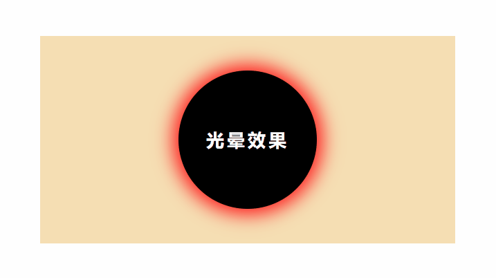
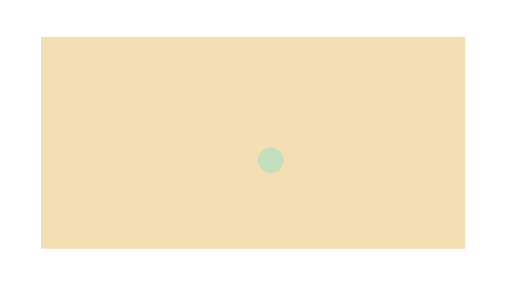

### 1.光晕效果

通过box-shadow的 *blur*——模糊距离、*spread*——阴影大小，来控制阴影，以达到视觉上的效果。

```html
<!DOCTYPE html>
<html lang="en">

<head>
    <meta charset="UTF-8">
    <meta name="viewport" content="width=device-width, initial-scale=1.0">
    <title>Document</title>
    <style lang="">
        div {
            position: relative;
            top: 100px;
            left: 100px;
            width: 600px;
            height: 300px;
            background-color: wheat;
        }

        span {
            position: relative;
            display: inline-block;
            width: 200px;
            height: 200px;
            background-color: black;
            top: 50%;
            left: 50%;
            transform: translate(-50%, -50%);
            border-radius: 50%;
            text-align: center;
            line-height: 200px;
            color: white;
            font-size: 26px;
            font-weight: 700;
            letter-spacing: 4px;
            animation: boxShadow 2s linear infinite;
        }

        @keyframes boxShadow {
            0% {
                box-shadow: 0px 0px 5px 0px #fff;
            }

            70% {
                box-shadow: 0px 0px 30px 10px #ff0000;
            }

            100% {
                box-shadow: 0px 0px 5px 0px #fff;
            }
        }
    </style>
</head>

<body>
    <div>
        <span>光晕效果</span>
    </div>
</body>

</html>
```




### 2.气泡爆炸消失效果

原理：气泡从诞生到消失的过程，分两步：1.从小变大。 2.从没有到有，最后爆炸又消失。

所以用scale和opacity来实现：

```html
<!DOCTYPE html>
<html lang="en">

<head>
    <meta charset="UTF-8">
    <meta name="viewport" content="width=device-width, initial-scale=1.0">
    <title>Document</title>
    <style lang="">
        div {
            position: relative;
            top: 100px;
            left: 100px;
            width: 600px;
            height: 300px;
            background-color: wheat;
        }

        span {
            position: relative;
            display: inline-block;
            width: 50px;
            height: 50px;
            background-color: turquoise;
            top: 50%;
            left: 50%;
            transform: translate(-50%, -50%);
            border-radius: 50%;
            text-align: center;
            line-height: 50px;
            font-size: 26px;
            font-weight: 700;
            letter-spacing: 4px;
            animation: boom 1s ease-in-out infinite;
        }

        @keyframes boom {
            from {
                transform: scale(0.0);
            }

            to {
                transform: scale(1.0);
                opacity: 0;
            }
        }
    </style>
</head>

<body>
    <div>
        <span></span>
    </div>
</body>

</html>
```




### 3.气泡/水泡上漂

原理：1.气泡的运动轨迹：从下至上，从左至右再左。 2.气泡显示：从无到有，再到消失。

因此，单个的气泡，会用到定位position搭配bottom和位移translateX。

至于多个气泡，通过不同的：大小、动画时间、动画延迟、X轴位置来达到视觉上的效果。

[^ tips]:下方代码，只用了css，如果很多气泡，可以使用js来完成某些样式设置，也可以使用随机数来控制某些参数（如：气泡大小、动画时间、动画延迟）

注意：代码中，bottom写死的1000px，实际的需要计算需要的高度（如：满屏的话，计算可视高度）

```html
<!DOCTYPE html>
<html lang="en">

<head>
    <meta charset="UTF-8">
    <meta name="viewport" content="width=device-width, initial-scale=1.0">
    <title>Document</title>
    <style lang="">
        html {
            width: 100%;
            height: 100%;
        }

        body {
            height: 100%;
            background-color: #ec5241;
            overflow: hidden;
        }

        div {
            position: absolute;
            width: 50px;
            height: 50px;
            background-color: #f1f1f1;
            border-radius: 50%;
            opacity: 0.5;
            left: 0;
            bottom: -100px;
            animation: flying 5s ease-in infinite;
        }
        .div1, .div6 {
            animation-duration: 6s;
        }
        .div2, .div7 {
            left: 10%;
            width: 30px;
            height: 30px;
            animation-duration: 5s;
            animation-delay: 1s;
        }
        .div3, .div8 {
            left: 20%;
            width: 10px;
            height: 10px;
            animation-duration: 7s;
            animation-delay: 2s;
        }
        .div4, .div9 {
            left: 30%;
            width: 40px;
            height: 40px;
            animation-duration: 4s;
        }
        .div5, .div10{
            left: 40%;
            width: 30px;
            height: 30px;
            animation-duration: 7s;
            animation-delay: 1s;
        }
        .div6 {
            left: 50%;
        }
        .div7 {
            left: 60%;
        }
        .div8 {
            left: 70%;
        }
        .div9 {
            left: 80%;
        }
        .div10 {
            left: 90%;
        }

        @keyframes flying {
            0% {
                bottom: -100px;
                transform: translateX(0px);
            }
            50% {
                transform: translateX(100px);
            }
            100%{
                bottom: 1000px;
                transform: translateX(-200px);
            }
        }
    </style>
</head>

<body>
    <div class="div1"></div>
    <div class="div2"></div>
    <div class="div3"></div>
    <div class="div4"></div>
    <div class="div5"></div>
    <div class="div6"></div>
    <div class="div7"></div>
    <div class="div8"></div>
    <div class="div9"></div>
    <div class="div10"></div>
</body>

</html>
```


老李上的demo，以及 微信搜索   -  让人眼前一亮的  -   我写CSS的常用套路 