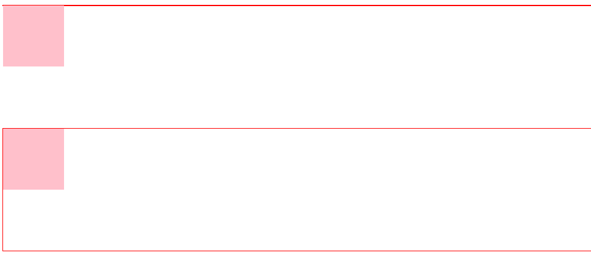
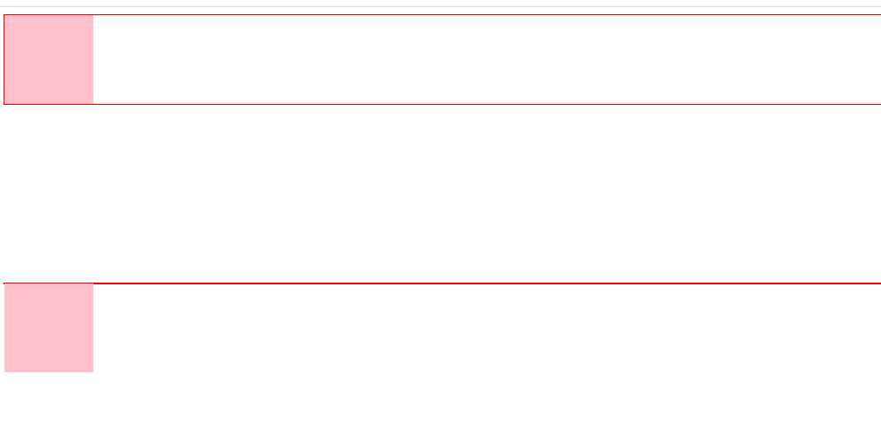

## 浮动

[^ 文档流]: 是文档中可显示对象在排列时所占用的位置。如：在没有样式设置的时候，HTML的自上而下、从左至右。

float` 属性可以使元素脱离**文档流**，在 **父容器** 中进行浮动，停靠到**父元素的内容边界**或**其它浮动元素的边框**，浮动的元素会忽略元素间的空格，让同样具有该属性的元素“紧密”地排列在一起。

该属性通常用于处理一些需要紧密排列在一起的“块级元素”，如“导航条”、“相册”，或用于处理“图文混排”等。

- none：默认，元素不进行浮动。
- left：元素从左到右进行浮动。
- right：元素从右到左进行浮动。
- inherit：继承。


### 浮动的特征

- 使block标签在一行显示
- 使inline标签支持宽度
- 不设置宽度的时候标签由内容撑开
- 脱离文档流
- 提升层级半层


### 清除浮动

元素的某个方向上不能有浮动元素。

clear：

- left：左侧
- right：右侧
- none：没有
- inherit：继承
- both：左右两边


### 清除浮动方法

#### 为什么要清除浮动

在特性上，因为会脱离文档流，所以在布局上会有影响。


#### 加高

给父元素添加高度，来撑开元素

[^ 缺点]: 扩展性不好，如果高度不是固定的，即子元素（浮动元素）是靠内容撑开的，则不能给父元素添加高度。

```html
<!DOCTYPE html>
<html lang="en">

<head>
    <meta charset="UTF-8">
    <meta name="viewport" content="width=device-width, initial-scale=1.0">
    <style>
        .box{
            border: 1px solid red;
        }
        .item{
            width: 100px;
            height: 100px;
            background-color: pink;
            float: left;
        }
        .box2 {
            margin-top: 200px;
            height: 200px;
        }
    </style>
</head>

<body>
    <div class="box box1">
        <div class="item">
            <div class="content"></div>
        </div>
    </div>
    <div class="box box2">
        <div class="item">
            <div class="content"></div>
        </div>
    </div>
</body>

</html>
```




#### 父级浮动

[^ 缺点]: 1.当元素有嵌套的时候，给父级添加了浮动，父级也浮动了，此时，又要清除父级的浮动，又要给父级的父级清除浮动，因此，到最后，页面上的所有元素都需要添加浮动。2.添加了浮动，元素的margin左右auto居中失效。


#### inline-block

给父元素添加inline-block

[^ 缺点]: margin左右auto居中失效。


#### 空标签清除浮动

[^ 缺点]: 在每一个需要清除的地方都要放置一个空标签，并且IE6最小高度是19px（解决后IE6下还有2px的偏差）。

```html
<!DOCTYPE html>
<html lang="en">

<head>
    <meta charset="UTF-8">
    <meta name="viewport" content="width=device-width, initial-scale=1.0">
    <style>
        .box{
            border: 1px solid red;
        }
        .item{
            width: 100px;
            height: 100px;
            background-color: pink;
            float: left;
        }
        .clearfix{
            clear: both;
        }
        .box2{
            margin-top: 200px;
        }
    </style>
</head>

<body>
    <div class="box box1">
        <div class="item">
            <div class="content"></div>
        </div>
        
        <div class="clearfix"></div>
    </div>
    <div class="box box2">
        <div class="item">
            <div class="content"></div>
        </div>
    </div>
</body>

</html>
```



#### br清浮动

```html
<br clear="all">
```

[^ 缺点]: 不符合工作中：结构、样式、行为，三者分离的要求。即，我们需要在每一个需要清除浮动的地方，都放置该标签，会大量的重复使用，且会使用过多的标签。


```html
<!DOCTYPE html>
<html lang="en">

<head>
    <meta charset="UTF-8">
    <meta name="viewport" content="width=device-width, initial-scale=1.0">
    <style>
        .box{
            border: 1px solid red;
        }
        .item{
            width: 100px;
            height: 100px;
            background-color: pink;
            float: left;
        }
        .box2{
            margin-top: 200px;
        }
    </style>
</head>

<body>
    <div class="box box1">
        <div class="item">
            <div class="content"></div>
        </div>
        <br clear="all">
    </div>
    <div class="box box2">
        <div class="item">
            <div class="content"></div>
        </div>
    </div>
</body>

</html>
```


#### 伪类清除

他的原理简单来说就是再已经浮动的元素后面添加一个什么也没有的元素，以此来消除子元素因为浮动而让父元素塌陷的一种解决办法。

```html
.clearfix:after{#在需要清除浮动的父元素中添加这个clearfix类。
	content:"";
    display:block;
    height:0;
    clear:both;
    visibility:hidden;
}
```


#### overflow:hidden 清除浮动

给父级添加overflow属性

[^ 缺点]: 若子元素宽高 比 父元素大， 则超出部分不可见


## BFC（block formatting context）

BFC(Block formatting context)直译为"块级格式化上下文"。它是一个独立的渲染区域，只有Block-level box参与， 它规定了内部的Block-level Box如何布局，并且与这个区域外部毫不相干。

[^ BFC]: <a>https://blog.csdn.net/sinat_36422236/article/details/88763187</a>


**标准浏览器有哪些**：Firefox Chrome Safari Opera（说简单点就是除了IE）。


这些特性是在标准浏览器下特有的、可以触发BFC：

1. float的值不为none
2. overflow的值不为visible
3. display的值为table-cell，table-caption，inline-block中的任何一个
4. position的值不为relative和static
5. width | height | min-width | min-height ：(!auto)

说了这么多到底什么是BFC呢？
千言万语汇成一句话：BFC就是一种属性(相当一个人(元素)具有一种本领(BFC属性)),这种属性会影响元素的定位和与其他元素之间的相互作用，**一旦一个元素拥有了BFC属性，就代表这个元素内部的所有物质(自己定义的，元素的集合)与这个元素以外的元素就没有关系了。**


## haslayout

IE浏览器下特有的属性

[^ 更多参考]: https://www.cnblogs.com/xiaohuochai/p/4845314.html 、 https://blog.csdn.net/weixin_34406796/article/details/93058591

1. writing-mode:tb-rl
2. -ms-writing-mode:tb-rl
3. zoom:(!normal)，常用的是zoom: 1

