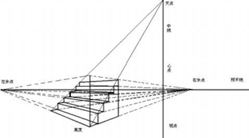

## 变形转换

### 概述

在CSS中执行变形转换的属性是CSS3属性中的 `transform`，能够执行“**位移**”、“**旋转**”、“**缩放**”、“**倾斜**”、“**翻转**”和“**透视**”等变形转换的设置，可以让Web页面的表现更加的“活跃”，增加页面的交互感，给用户留下更深的“印象”。但在用该属性进行设置时，特别是用于生产环境中时，一定要控制一个“度”，也就是说要避免“过度设计”，否则反而会让“印象”这一词有了贬义的意思。


### transform

#### 1.translate

该属性值可以让元素从当前位置根据“ `left`（X轴）”参数和“ `top`（Y轴）”参数的设置在水平和垂直方向进行移动。它和用于布局的“ `position` ”属性，特别是当它的“ `position` ”的值为“ `relative `”时十分相似，在进行移动后，自身的位置仍然保留，也不会影响到其它元素的位置，但有存在着区别：

- “translate”可以作用于已经执行了“绝对定位（position：absolute）”的元素，而要用“position”已经设置为了“绝对定位”的元素使用“相对定位（position：relative）”需要对布局进行重新计算，或修改DOM的标签嵌套方式。
- 使用“translate”可以让 GPU 参与运算，动画的 FPS 更高。
- 使用“translate”可以让动画的像素精确到浮点数，而使用“position”属性的值最小执行动画的单位是1像素。

  所以说，“position”属性是为布局而生，而“Transform”的“translate”是为动画而生。

  该属性值有一下几种类型：

- **translateX( x )**：设置元素在X轴方向的偏移
- **translateY( y )**：设置元素在Y轴方向的偏移
- **translateZ( z )**：设置元素在Z轴方向的偏移
- **translate( x, y )**：同时设置元素在X轴和Y轴方向的偏移

```html
<!DOCTYPE html>
<html lang="en">

<head>
    <meta charset="UTF-8">
    <meta name="viewport" content="width=device-width, initial-scale=1.0">
    <title>Document</title>
    <style>
        div {
            width: 100px;
            height: 100px;
            display: inline-block;
            margin-right: 50px;
            transition: all 0.5s linear 0s;
        }

        .red {
            background-color: red;
        }

        .red:hover {
            transform: translateX(20px);
        }

        .pink {
            background-color: pink;
        }

        .pink:hover {
            transform: translateY(20px);
        }

        .blue {
            background-color: blue;
        }

        .blue:hover {
            transform: translate(20px, 20px);
        }
    </style>
</head>

<body>
    <div class="red">red</div>
    <div class="pink">pink</div>
    <div class="blue">blue</div>
</body>

</html>
```


#### 2.rotate 

该属性值会让元素以当前元素的**中心(X=width/2，Y=height/2)**进行旋转（若不对“transform-origin”进行设置），旋转的角度为参数所设定的值，“正数”是顺时针，“负数”是逆时针，单位为“*deg*”。

该属性有三种类型：

- **rotateX( angle )**：设置元素在X轴方向的旋转
- **rotateY( angle )**：设置元素在Y轴方向的旋转
- **rotateZ( angle )**：设置元素在Z轴方向的旋转

```html
<!DOCTYPE html>
<html lang="en">

<head>
    <meta charset="UTF-8">
    <meta name="viewport" content="width=device-width, initial-scale=1.0">
    <title>Document</title>
    <style>
        div {
            width: 100px;
            height: 100px;
            display: inline-block;
            margin-right: 50px;
            transition: all 1s linear 0s;
        }

        .red {
            background-color: red;
        }

        .red:hover {
            transform: rotateX(360deg);
        }

        .pink {
            background-color: pink;
        }

        .pink:hover {
            transform: rotateY(360deg);
        }

        .blue {
            background-color: blue;
        }

        .blue:hover {
            transform: rotateZ(360deg);
        }
    </style>
</head>

<body>
    <div class="red">red</div>
    <div class="pink">pink</div>
    <div class="blue">blue</div>
</body>

</html>
```


#### 3.scale

该属性值会让元素以当前元素的中心进行缩放，参数的值为一个整数或浮点数，如：“1（默认）”不进行缩放，“0.8”缩小为原来的80%，“1.5”扩大到原来的150%，参数不需要单位。

该属性值有三种类型：

- **sclaeX ( x )**：设置元素在X轴方向的缩放
- **sclaeY ( y )**：设置元素在Y轴方向的缩放
- **sclae ( x, y )**：设置元素在X轴及Y轴方向的缩放

```html
<!DOCTYPE html>
<html lang="en">

<head>
    <meta charset="UTF-8">
    <meta name="viewport" content="width=device-width, initial-scale=1.0">
    <title>Document</title>
    <style>
        body {
            padding-top: 100px;
            padding-left: 100px;
        }
        div {
            width: 100px;
            height: 100px;
            display: inline-block;
            margin-right: 50px;
            transition: all .5s linear 0s;
        }

        .red {
            background-color: red;
        }

        .red:hover {
            transform: scaleX(0.5);
        }

        .pink {
            background-color: pink;
        }

        .pink:hover {
            transform: scaleY(1.5);
        }

        .blue {
            background-color: blue;
        }

        .blue:hover {
            transform: scale(1.2, 1.2);
        }
    </style>
</head>

<body>
    <div class="red">red</div>
    <div class="pink">pink</div>
    <div class="blue">blue</div>
</body>

</html>
```


#### 4.skew

该属性值会让元素根据水平（X轴）和垂直（Y轴）线参数设定倾斜角度。这里的**X轴和Y轴**与我们平时认为的坐标系的XY轴正好**相反**；且**X轴正值是逆时针**变形，而**Y轴正值是顺时针变形。**基点默认为中心点。

该属性值有三种类型：

- **skewX( angle )**：设置元素在水平轴方向的倾斜
- **skewY( angle )**：设置元素在垂直轴方向的倾斜
- **skew( x-angle, y-angle )**：设置元素在水平轴及垂直轴方向的倾斜

```html
<!DOCTYPE html>
<html lang="en">

<head>
    <meta charset="UTF-8">
    <meta name="viewport" content="width=device-width, initial-scale=1.0">
    <title>Document</title>
    <style>
        body {
            padding-top: 100px;
            padding-left: 100px;
        }
        div {
            width: 100px;
            height: 100px;
            display: inline-block;
            margin-right: 50px;
            transition: all .5s linear 0s;
        }

        .red {
            background-color: red;
        }

        .red:hover {
            transform: skewX(30deg);
        }

        .pink {
            background-color: pink;
        }

        .pink:hover {
            transform: skewY(30deg);
        }

        .blue {
            background-color: blue;
        }

        .blue:hover {
            transform: skew(30deg, 30deg);
        }
    </style>
</head>

<body>
    <div class="red">red</div>
    <div class="pink">pink</div>
    <div class="blue">blue</div>
</body>

</html>
```


#### 5.transform 组合值

和其它具有分支属性的CSS属性一样，`transform` 属性也能采用多值组合的方式来实现一个CSS的复杂效果，有一点需要特别注意的是，若该属性配合过渡CSS特效 `transition` 属性来使用的话，值的先后顺序不一样，很多时候效果也是不一样的，需要根据需要去调整值设置的顺序。

```css
.wrap {
    transform: scale(1.5) translateX(500px);
}
```


#### 6.transform-origin

该属性用于设置旋**转元素的原点（基点）位置**，默认为元素的中点。可以为3种类型的值：“方位英文单词”，“Web常用长度单位”，“百分数”。

- 方位英文单词

  有“top”、“right”、“bottom”、“left”和“center”5个值可以使用，如“top left”表示左上角，“right bottom”表示右下角，“center center”表示默认的中点。

- Web常用长度单位

  如最常用的像素“px”，字符“em”，点“pt”等，如：“16px 20px”表示旋转的轴在“X轴”的16像素，“Y轴（向下为正，向上为负）”的20像素的位置。

- 百分数

  第一个百分数表示相对于元素宽度的百分比位置，第二个百分数表示相对于元素高度的百分比位置，如：“0% 0%”相当于左上角，“50% 50%”相当于默认的中点，“100% 100%”相当于元素的右下角。

```html
<!DOCTYPE html>
<html lang="en">

<head>
    <meta charset="UTF-8">
    <meta name="viewport" content="width=device-width, initial-scale=1.0">
    <title>Document</title>
    <style>
        body {
            padding-top: 100px;
            padding-left: 100px;
        }

        div {
            width: 100px;
            height: 100px;
            display: inline-block;
            margin-right: 50px;
            transition: all .5s linear 0s;
            color: white;
        }
        div:hover{
            transform: rotateZ(360deg);
        }

        .red {
            background-color: red;
            transform-origin: 0px 0px;
        }

        .pink {
            background-color: pink;
            transform-origin: 100% 0%;
        }

        .blue {
            background-color: blue;
            transform-origin: 0px 100%;
        }

        .black {
            background-color: black;
            transform-origin: right bottom;
        }

        .chocolate {
            background-color: chocolate;
            transform-origin: center 50%;
        }
    </style>
</head>

<body>
    <div class="red">左上</div>
    <div class="pink">右上</div>
    <div class="blue">左下</div>
    <div class="black">右下</div>
    <div class="chocolate">中心</div>
</body>

</html>
```


### transform-3D

三维坐标系：


#### 1.transform-style

该属性规定如何在3D空间中呈现被嵌套的元素（是子元素，而不是元素本身），它主要有两个值：

- flat：（默认）表示所有子元素在2D平面呈现。
- preserve-3d：表示所有子元素在3D空间中呈现。

当“transform-style”的值为“preserve-3D”时更贴近我们现实中的思维，因为平时我们眼睛所看到的东西都是“3D（立体）”的，而当值为“flat”的时候，就相当于在纸上画画，无论画功再好，画出的东西都是平面的，只是由于透视和明暗关系，有的时候看起来[“很立体”](http://www.gexing.com/shaitu/724322.html)罢了。

```html
<!DOCTYPE html>
<html lang="en">

<head>
    <meta charset="UTF-8">
    <meta name="viewport" content="width=device-width, initial-scale=1.0">
    <title>Document</title>
    <style>
        .wrap {
            text-align: center;
        }

        .wrap section {
            width: 160px;
            height: 160px;
            background-color: #000;
            margin: 30px;

            display: inline-block;
        }

        .wrap section>span {
            width: inherit;
            height: inherit;

            cursor: pointer;

            background-color: orange;
            opacity: .75;

            color: #fff;
            font-size: 20px;
            letter-spacing: 2px;

            display: flex;
            justify-content: center;
            align-items: center;

            transition: all .75s linear;

        }

        .wrap>section.t1 {
            /*2d场景*/
            transform-style: flat;
        }

        .wrap>section.t2 {
            /*3d场景*/
            transform-style: preserve-3d;
        }

        .wrap section>span:hover {
            transform: rotateX(45deg) rotateY(45deg);
        }
    </style>
</head>

<body>
    <div class="wrap">
        <section class="t1">
            <span>Flat</span>
        </section>
        <section class="t2">
            <span>Preserve-3d</span>
        </section>
    </div>
</body>

</html>
```


#### 2.perspective 

“perspective” 意为透视、视角，该属性定义3D元素距视图的距离（个人理解为景深），**它只对转换为了3D模式的元素生效，单位为像素**。

[^ tips]:上面的描述可能让人难以理解一些，其实对于`perspective`属性，我们可以简单的理解为视距，用来设置用户和元素3D空间Z平面之间的距离。


学美术或者学建筑的同学肯定接触过透视的一些东西：




不过，CSS3 3D transform中的透视的透视点与上面两张示例图是不同的：CSS3 3D transform的透视点是在浏览器的前方。或者这么理解吧：显示器中3D效果元素的透视点在显示器的上方（不是后面），近似就是我们眼睛所在方位。

比方说，一个1680像素宽的显示器中有张美女图片，应用了3D transform，同时，该元素或该元素父辈元素设置的“perspective”大小为2000像素。则这张美女呈现的3D效果就跟你本人在1.2个显示器宽度的地方(1680*1.2≈2000)看到的真实效果一致。


“perspective”属性有两种使用方式

- 一种是直接作为一个属性去使用，即“perspective:400”的形式
- 还有一种形式是作为“Transform”属性的值去使用，这个时候就需要加上单位了，即：“transform: perspective(400px)”。为了浏览器兼容，我们需加上浏览器前缀。

```html
.stage {
    perspective: 400px;
}

.stage .box {
    transform: perspective(400px) rotateY(45deg);
}
```

我们可以通过 “translateZ” 寻找透视位置，如果说 `rotateX` / `rotateY` / `rotateZ`可以帮助理解三维坐标，则 `translateZ`则可以帮你理解透视位置。

我们都知道近大远小的道理，对于没有 `rotateX` 以及 `rotateY` 的元素，`translateZ` 的功能就是让元素在自己的眼前或近或远。比方说，我们设置元素 `perspective` 为201像素，如下：

```css
perspective: 201px;
```

则其子元素，设置的 `translateZ`值越小，则子元素大小越小（因为元素远去，我们眼睛看到的就会变小）；`translateZ`值越大，该元素也会越来越大，当`translateZ`值非常接近201像素，但是不超过201像素的时候（如200像素），该元素的大小就会撑满整个屏幕（如果父辈元素没有类似 `overflow:hidden` 的限制的话）。因为这个时候，子元素正好移到了你的眼睛前面。当 `translateZ` 值再变大，超过201像素的时候，该元素看不见了——这很好理解：我们是看不见眼睛后面的东西的！

再生动的文字描述也不如一个实例来得直观，我们可以直接看示例：

```html
<!DOCTYPE html>
<html lang="en">

<head>
    <meta charset="UTF-8">
    <meta name="viewport" content="width=device-width, initial-scale=1.0">
    <title>Document</title>
    <style>
        body {
            padding-top: 100px;
            padding-left: 500px;
        }

        .box {
            margin-top: 50px;
            width: 400px;
            height: 200px;
            background-color: brown;
            perspective: 201px;
            z-index: 9;
        }

        .box1 {
            position: relative;
            width: 200px;
            height: 100px;
            top: 50px;
            margin: 0 auto;

            line-height: 100px;

            text-align: center;
            background-color: coral;

        }

        form {
            position: absolute;
            z-index: 99;
        }
    </style>
</head>

<body>

    <form>
        <label>-100</label>
        <input type="range" id="rangeIpt" min="-100" max="250" value="0" oninput="functionName()">
        <label>250</label>
    </form>

    <div class="box">
        <div class="box1">perspective: 201px</div>
    </div>
    <script>

        let box1 = document.getElementsByClassName("box1")[0];
        let prev = document.getElementsByClassName("prev")[0];
        let to200 = document.getElementsByClassName("to200")[0];
        let next = document.getElementsByClassName("next")[0];
        let ipt = document.getElementById("rangeIpt");
        let opt = document.getElementById("opt");

        function functionName() {
            box1.style.cssText = `transform: translateZ(${event.target.value}px);`
            prev.style.cssText = `transform: translateZ(${event.target.value}px);`
            next.style.cssText = `transform: translateZ(${event.target.value}px);`
        }
    </script>
</body>

</html>
```


#### 3.perspective-origin

“perspective-origin” 这个属性超级好理解，表示你那双色迷迷的眼睛看的位置。默认就是所看舞台或元素的中心。有时候，我们对中心的位置是不感兴趣的，希望视线放在其他一些地方。比方说：


一图胜千言，屌丝男们这个应该都懂的。下面为立方体的实际应用透视效果图：

不同透视位置的图例：

```html
<!DOCTYPE html>
<html lang="en">

<head>
    <meta charset="UTF-8">
    <meta name="viewport" content="width=device-width, initial-scale=1.0">
    <title>Document</title>
    <style>
        .potl {
            perspective-origin: top left;
            -webkit-perspective-origin: top left;
        }

        .potm {
            perspective-origin: top;
            -webkit-perspective-origin: top;
        }

        .potr {
            perspective-origin: top right;
            -webkit-perspective-origin: top right;
        }

        .poml {
            perspective-origin: left;
            -webkit-perspective-origin: left;
        }

        .pomm {
            perspective-origin: 50% 50%;
            -webkit-perspective-origin: 50% 50%;
        }

        .pomr {
            perspective-origin: right;
            -webkit-perspective-origin: right;
        }

        .pobl {
            perspective-origin: bottom left;
            -webkit-perspective-origin: bottom left;
        }

        .pobm {
            perspective-origin: bottom;
            -webkit-perspective-origin: bottom;
        }

        .pobr {
            perspective-origin: bottom right;
            -webkit-perspective-origin: bottom right;
        }

        /* Define the container div, the cube div, and a generic face */
        .container {
            width: 100px;
            height: 100px;
            margin: 24px;
            border: none;
        }

        .cube {
            width: 100%;
            height: 100%;
            backface-visibility: visible;
            perspective: 300px;
            transform-style: preserve-3d;
            -webkit-backface-visibility: visible;
            -webkit-perspective: 300px;
            -webkit-transform-style: preserve-3d;
        }

        .face {
            display: block;
            position: absolute;
            width: 100px;
            height: 100px;
            border: none;
            line-height: 100px;
            font-family: sans-serif;
            font-size: 60px;
            color: white;
            text-align: center;
        }

        /* Define each face based on direction */
        .front {
            background: rgba(0, 0, 0, 0.3);
            transform: translateZ(50px);
            -webkit-transform: translateZ(50px);
        }

        .back {
            background: rgba(0, 255, 0, 1);
            color: black;
            transform: rotateY(180deg) translateZ(50px);
            -webkit-transform: rotateY(180deg) translateZ(50px);
        }

        .right {
            background: rgba(196, 0, 0, 0.7);
            transform: rotateY(90deg) translateZ(50px);
            -webkit-transform: rotateY(90deg) translateZ(50px);
        }

        .left {
            background: rgba(0, 0, 196, 0.7);
            transform: rotateY(-90deg) translateZ(50px);
            -webkit-transform: rotateY(-90deg) translateZ(50px);
        }

        .top {
            background: rgba(196, 196, 0, 0.7);
            transform: rotateX(90deg) translateZ(50px);
            -webkit-transform: rotateX(90deg) translateZ(50px)
        }

        .bottom {
            background: rgba(196, 0, 196, 0.7);
            transform: rotateX(-90deg) translateZ(50px);
            -webkit-transform: rotateX(-90deg) translateZ(50px);
        }

        /* Make the table a little nicer */
        th,
        p,
        td {
            background-color: #EEEEEE;
            padding: 10px;
            font-family: sans-serif;
            text-align: left;
        }
    </style>
</head>

<body>
    <table>
        <tbody>
            <tr>
                <th>
                    <code>perspective-origin: top left;</code>
                </th>
                <th>
                    <code>perspective-origin: top;</code>
                </th>
                <th>
                    <code>perspective-origin: top right;</code>
                </th>
            </tr>
            <tr>
                <td>
                    <div class="container">
                        <div class="cube potl">
                            <div class="face front">1</div>
                            <div class="face back">2</div>
                            <div class="face right">3</div>
                            <div class="face left">4</div>
                            <div class="face top">5</div>
                            <div class="face bottom">6</div>
                        </div>
                    </div>
                </td>
                <td>
                    <div class="container">
                        <div class="cube potm">
                            <div class="face front">1</div>
                            <div class="face back">2</div>
                            <div class="face right">3</div>
                            <div class="face left">4</div>
                            <div class="face top">5</div>
                            <div class="face bottom">6</div>
                        </div>
                    </div>
                </td>
                <td>
                    <div class="container">
                        <div class="cube potr">
                            <div class="face front">1</div>
                            <div class="face back">2</div>
                            <div class="face right">3</div>
                            <div class="face left">4</div>
                            <div class="face top">5</div>
                            <div class="face bottom">6</div>
                        </div>
                    </div>
                </td>
            </tr>
            <tr>
                <th>
                    <code>perspective-origin: left;</code>
                </th>
                <th>
                    <code>perspective-origin: 50% 50%;</code>
                </th>
                <th>
                    <code>perspective-origin: right;</code>
                </th>
            </tr>
            <tr>
                <td>
                    <div class="container">
                        <div class="cube poml">
                            <div class="face front">1</div>
                            <div class="face back">2</div>
                            <div class="face right">3</div>
                            <div class="face left">4</div>
                            <div class="face top">5</div>
                            <div class="face bottom">6</div>
                        </div>
                    </div>
                </td>
                <td>
                    <div class="container">
                        <div class="cube pomm">
                            <div class="face front">1</div>
                            <div class="face back">2</div>
                            <div class="face right">3</div>
                            <div class="face left">4</div>
                            <div class="face top">5</div>
                            <div class="face bottom">6</div>
                        </div>
                    </div>
                </td>
                <td>
                    <div class="container">
                        <div class="cube pomr">
                            <div class="face front">1</div>
                            <div class="face back">2</div>
                            <div class="face right">3</div>
                            <div class="face left">4</div>
                            <div class="face top">5</div>
                            <div class="face bottom">6</div>
                        </div>
                    </div>
                </td>
            </tr>
            <tr>
                <th>
                    <code>perspective-origin: bottom left;</code>
                </th>
                <th>
                    <code>perspective-origin: bottom;</code>
                </th>
                <th>
                    <code>perspective-origin: bottom right;</code>
                </th>
            </tr>
            <tr>
                <td>
                    <div class="container">
                        <div class="cube pobl">
                            <div class="face front">1</div>
                            <div class="face back">2</div>
                            <div class="face right">3</div>
                            <div class="face left">4</div>
                            <div class="face top">5</div>
                            <div class="face bottom">6</div>
                        </div>
                    </div>
                </td>
                <td>
                    <div class="container">
                        <div class="cube pobm">
                            <div class="face front">1</div>
                            <div class="face back">2</div>
                            <div class="face right">3</div>
                            <div class="face left">4</div>
                            <div class="face top">5</div>
                            <div class="face bottom">6</div>
                        </div>
                    </div>
                </td>
                <td>
                    <div class="container">
                        <div class="cube pobr">
                            <div class="face front">1</div>
                            <div class="face back">2</div>
                            <div class="face right">3</div>
                            <div class="face left">4</div>
                            <div class="face top">5</div>
                            <div class="face bottom">6</div>
                        </div>
                    </div>
                </td>
            </tr>
        </tbody>
    </table>
</body>

</html>
```


单个%例子：perspective-origin: 20% 30%;

[^ tips]:如何用空间感去理解代码？

1.因为是立体的立方体，因此需要

```css
/* 转成3D效果 */
transform-style: preserve-3d;
/* 因为是3D效果，所以不在一个平面，需要一个透视点去观察他 */
perspective: 300px;
```

2.关于布局：

- 在不设置translateZ的时候，所有的div，其实都是在一个平面上，就算他们开始旋转，旋转的这个点也是这个平面的Z轴。
- 不管是先旋转，还是先产生translateZ的距离，translateZ其实是跟着旋转在转动的，所以在代码中，虽然我们看到的都是` translateZ(50px) `，但是因为旋转，其实translateZ的朝向已经发生了改变。
- 因此，以下代码会生成一个立方体：


```html
<!DOCTYPE html>
<html lang="en">

<head>
    <meta charset="UTF-8">
    <meta name="viewport" content="width=device-width, initial-scale=1.0">
    <title>Document</title>
    <style>
        /* .potl {
            perspective-origin: top left;
            -webkit-perspective-origin: top left;
        }

        .potm {
            perspective-origin: top;
            -webkit-perspective-origin: top;
        }

        .potr {
            perspective-origin: top right;
            -webkit-perspective-origin: top right;
        }

        .poml {
            perspective-origin: left;
            -webkit-perspective-origin: left;
        }

        .pomm {
            perspective-origin: 50% 50%;
            -webkit-perspective-origin: 50% 50%;
        }

        .pomr {
            perspective-origin: right;
            -webkit-perspective-origin: right;
        }

        .pobl {
            perspective-origin: bottom left;
            -webkit-perspective-origin: bottom left;
        }

        .pobm {
            perspective-origin: bottom;
            -webkit-perspective-origin: bottom;
        }

        .pobr {
            perspective-origin: bottom right;
            -webkit-perspective-origin: bottom right;
        } */
        .container {
            width: 100px;
            height: 100px;
            margin: 24px;
            border: none;
        }

        .cube {
            width: 100%;
            height: 100%;
            backface-visibility: visible;
            /* 转成3D效果 */
            transform-style: preserve-3d;
            /* 因为是3D效果，所以不在一个平面，需要一个透视点去观察他 */
            perspective: 300px;
        }

        .face {
            display: block;
            position: absolute;
            width: 100px;
            height: 100px;
            border: none;
            line-height: 100px;
            font-family: sans-serif;
            font-size: 60px;
            color: white;
            text-align: center;
        }

        .front {
            background: rgba(0, 0, 0, 0.3);
            transform: translateZ(50px);
        }

        .back {
            background: rgba(0, 255, 0, 1);
            color: black;
            transform: rotateY(180deg) translateZ(50px);
        }

        .right {
            background: rgba(196, 0, 0, 0.7);
            transform: rotateY(90deg) translateZ(50px);
        }

        .left {
            background: rgba(0, 0, 196, 0.7);
            transform: rotateY(-90deg) translateZ(50px);
        }

        .top {
            background: rgba(196, 196, 0, 0.7);
            transform: rotateX(90deg) translateZ(50px);
        }

        .bottom {
            background: rgba(196, 0, 196, 0.7);
            transform: rotateX(-90deg) translateZ(50px);
        }

        th,
        p,
        td {
            background-color: #EEEEEE;
            padding: 10px;
            font-family: sans-serif;
            text-align: left;
        }
    </style>
</head>

<body>
    <div class="container">
        <div class="cube potl">
            <div class="face front">1</div>
            <div class="face back">2</div>
            <div class="face right">3</div>
            <div class="face left">4</div>
            <div class="face top">5</div>
            <div class="face bottom">6</div>
        </div>
    </div>
</body>

</html>
```

