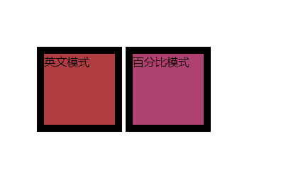
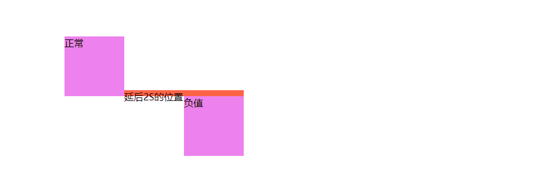
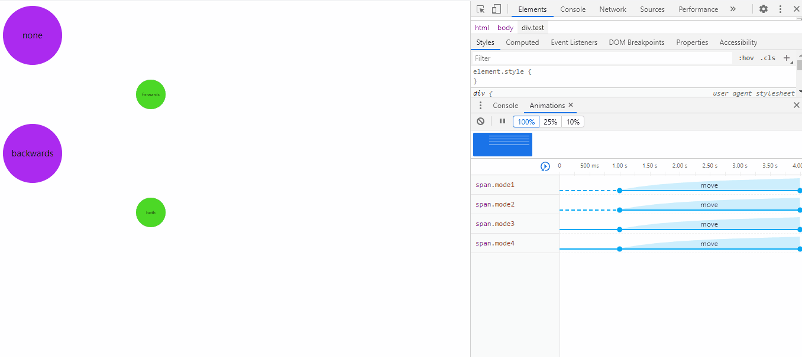
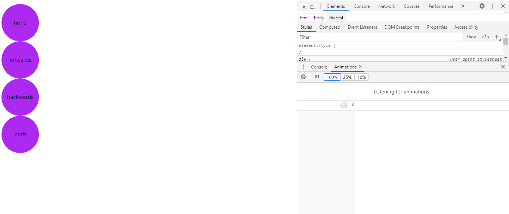

## 概述

前面一章中，我们可以发现，transition，配合 **transform和事件** 可以完成动画，那么在CSS中，有没有专门制作动画的属性呢——animation。

animation和transition大部分属性是相同的，他们都是随时间改变元素的属性值，他们的主要区别是transition需要触发一个事件才能改变属性，而animation不需要触发任何事件的情况下也会随时间改变属性值，并且transition为2帧，从from .... to，而animation可以一帧一帧的，也可以理解为一个animation是由多个transition组成。

**不同点 **可以总结为以下几点：

1. 触发条件不同。transition通常和hover等事件配合使用，由事件触发。animation则和gif动态图差不多，立即播放。
2. 循环。 animation可以设定循环次数。
3. 精确性。 animation可以设定**每一帧**的样式和时间。tranistion 只能设定**头尾**。 animation中可以设置每一帧需要单独变化的样式属性， transition中所有样式属性都要一起变化。
4. 与javascript的交互。animation与js的交互不是很紧密。tranistion和js的结合更强大。js设定要变化的样式，transition负责动画效果，天作之合，比之前只能用js时爽太多。

从不同点，我们可以总结以下结论：

1. 如果要灵活定制多个帧以及循环，用animation.
2. 如果要简单的from to 效果，用 transition.
3. 如果要使用js灵活设定动画属性，用transition.


## 动画属性

语法：

```css
animation: name duration timing-function delay iteration-count direction fill-mode play-state;
```

```css
animation: 动画名称 持续时间 线性规律 延迟时间 播放次数 周期逆向播放 首帧预设/末帧保留 播放/暂停；
```

[^ tips]: 动画名称与持续时间为必需属性，其他属性可根据实际需要省略。

### 1.animation-name

该属性用于定义动画的名称，以供需要使用该动画的 `animation` 属性调用，该名称完全是由用户**自定义**的，但也应该要“语义化”一些，方便调用者能更直观地了解此处定义动画的实际作用，而且切忌出现特殊符号（浏览器解析会存在差异），如一个改变元素颜色动画的名称定义应该是。

- 定义动画：       

```css
@keyframes changeColor {
    /* 各关键帧执行的css属性 */
}
```

- 设置动画：

```css
div {
    animation-name: changeColor
}
```

定义动画的“关键帧"有两种方式，一种是“英文单词”定义模式，一种是“百分比”定义模式。

- 英文单词模式

  该模式只包含两个关键帧，即开始帧“from”，表示动画开始时执行的CSS属性，和结束帧“to”，表示动画结束时执行的CSS属性。

- 百分数模式

  该模式相对“英文单词”定义关键帧的模式更为详细，能够支持理论上从“0%”到“100%”之间的所有帧的定义，“0%”相当于“from”，表示动画开始帧，“100%”相当于“to”，表示动画结束帧。该模式由于控制的精细度高，书写修改容易，甚至可以通过“定义百分比的跳跃”或“CSS属性值的跳跃”来实现动画的“匀速”、“加速”、“减速”，“变速”等动画速率的变化，非常地灵活，所以这种写法也是现今最主流的定义动画关键帧的方式

```html
<!DOCTYPE html>
<html lang="en">

<head>
    <meta charset="UTF-8">
    <meta name="viewport" content="width=device-width, initial-scale=1.0">
    <title>Document</title>
    <style lang="">
        div {
            display: inline-block;
            width: 100px;
            height: 100px;
            border: 10px solid black;
        }

        .div1 {
            animation-name: colorChange;
            animation-duration: 1s;
            animation-iteration-count: infinite;
        }

        .div2 {
            animation-name: colorChange2;
            animation-duration: 1s;
            animation-iteration-count: infinite;
        }

        @keyframes colorChange {
            from {
                background-color: brown;
            }

            to {
                background-color: pink;
            }
        }

        @keyframes colorChange2 {
            0% {
                background-color: purple;
            }

            50% {
                background-color: sandybrown;
            }

            100% {
                background-color: skyblue;
            }
        }
    </style>
</head>

<body>
    <div class="div1">英文模式</div>
    <div class="div2">百分比模式</div>
</body>

</html>
```



### 2.animation-duration

该属性用于定义**动画执行的时间**，即一段动画从开始到动画结束所经历的时间，单位为秒“s”或毫秒“ms”，默认值为“0”，即不执行任何动画，所以在定义设置一个动画的时候始终都要设置该属性，并给定一个大于“0”的时间。


### 3.animation-timing-function

该属性定义元素随着时间的推进执行动画的**速率变化**（线性规律）。主要有以下值：

- ease：默认值，逐渐变慢；
- linear：匀速
- ease-in：加速
- ease-out：减速
- ease-in-out：先加速，再减速
- cubic-bezier([参数])：可以定义一个时间曲线，可以为其配置四个参数，前两个参数为“x1”和“x2”，定义“开始控制点”，后两个参数为“y1”和“y2”，定义“结束控制点”。而“开始点”和“结束点”是通过这两条“转换点控制轴”分别去调整两个点来实现曲线的变化的。


### 4.animation-delay

该属性定义动画延迟时间，即延时一段时间之后再执行动画，其单位为秒或毫秒；

- 默认0：立即执行动画
- 正值：延迟指定时间后，开始执行动画
- 负值：立即执行，但跳过指定时间后进入动画(可以理解为，正值是延迟，那么负值就是提前，即提前执行，因此会立即执行，且立即执行的位置也是 `负值绝对值` 的时间)，例子如下:)

```html
<!DOCTYPE html>
<html lang="en">

<head>
    <meta charset="UTF-8">
    <meta name="viewport" content="width=device-width, initial-scale=1.0">
    <title>Document</title>
    <style lang="">
        div {
            position: relative;
            left: 200px;
            top: 100px;
            width: 100px;
            height: 100px;
            background-color: violet;
            animation-timing-function: linear;
        }

        .div1 {
            animation-name: change;
            animation-duration: 5s;
            animation-iteration-count: infinite;
        }

        .div1::after {
            content: "延后2S的位置";
            position: absolute;
            width: 200px;
            height: 10px;
            bottom: 0;
            left: 100px;
            background-color: tomato;
        }

        .div2 {
            animation-name: change2;
            animation-duration: 5s;
            animation-delay: -2s;
            animation-iteration-count: infinite;
        }

        @keyframes change {
            from {
                left: 200px;
            }

            to {
                left: 700px;
            }
        }

        @keyframes change2 {
            from {
                left: 200px;
            }

            to {
                left: 700px;
            }
        }
    </style>
</head>

<body>
    <div class="div1">正常</div>
    <div class="div2">负值</div>
</body>

</html>
```



[^ 原理]: 我们设置盒子宽度100px，5S位移500px，且是匀速，因此我们设置delay为负值-2S，因此下面的盒子会：1.立即执行 2.提前2S执行。从gif中可以看出，是立即执行的，并且上面盒子2S后的距离刚好就是下面盒子的位置。


### 5.animation-iteration-count

该属性用于设置动画播放的次数，它可以设置三种类型的值：

- 1（默认值）：表示在执行某事件后只执行1次动画。
- number：任意正整数，表示在执行某事件后只执行number次动画。
- infinite：表示在执行某事件后“无限次”执行动画。


### 6.animation-direction

该属性用于设置元素动画是否能够周期性地逆向播放，逆向动画播放的进行时间和“正向播放”一致，时间速度曲线会按照“100%（to）”到“0%（from）”的方向进行。

- normal：默认值；
- alternate：逆向执行(先执行一遍动画，然后再反向执行一遍动画)；

```html
<!DOCTYPE html>
<html lang="en">

<head>
    <meta charset="UTF-8">
    <meta name="viewport" content="width=device-width, initial-scale=1.0">
    <title>Document</title>
    <style lang="">
        div {
            position: relative;
            left: 200px;
            top: 100px;
            width: 300px;
            height: 100px;
            background-color: brown;
            animation-timing-function: linear;
        }

        .div1 {
            animation-name: change;
            animation-duration: 2s;
            animation-iteration-count: infinite;
            animation-direction: alternate;
        }

        @keyframes change {
            from {
                left: 200px;
            }

            to {
                left: 700px;
            }
        }
    </style>
</head>

<body>
    <div class="div1"></div>
</body>

</html>
```


### 7.animation-play-state

该属性用于设置动画播放状态，其值为：

- running：播放动画；
- paused：暂停动画；

可以配合js，来手动控制动画的暂停、播放。


### 8.animation-fill-mode

若不将动画的 `animation-iteration-count` 属性设置为 `infinite` 值的话，动画在播放完成后会还原到元素没有“挂载”动画播放效果之前的状态，在有的应用场景里这样似乎没有问题，但在有些应用场景下，这样的设定会让人有一种“瞎忙活”或“功败垂成”的感觉。而 `animation-fill-mode` 属性的出现克服了这个问题，它可以预设值动画播放前的“第一帧”和保留动画播放完成后的“最后一帧”，可以通过以下值进行设置：

- backwards：让元素保持动画第一帧定义里所设置的CSS属性，直到动画开始执行。
- forwards：让元素保持动画播放结束后最后一帧定义里所设置的CSS属性。
- both：让元素保持动画第一帧里定义的CSS属性，直到动画开始，动画播放完成后又保持动画最后一帧的属性。

```html
<!DOCTYPE html>
<html lang="en">

<head>
    <meta charset="UTF-8">
    <meta name="viewport" content="width=device-width, initial-scale=1.0">
    <title>Document</title>
    <style lang="">
        .test span {
            display: block;
            width: 100px;
            height: 100px;
            font-size: 14px;
            color: #000;
            line-height: 100px;
            text-align: center;
            border-radius: 100%;
            background: #ac2aef;
            animation-name: move;
            animation-duration: 3s;
            animation-delay: 1s;
            animation-timing-function: ease-in;
        }

        .mode1 {
            animation-fill-mode: none;
        }

        .mode2 {
            animation-fill-mode: forwards;
        }

        .mode3 {
            animation-fill-mode: backwards;
        }

        .mode4 {
            animation-fill-mode: both;
        }

        @keyframes move {
            0% {
                background: #FFFA90;
                transform: translateX(0) scale(1);
            }

            100% {
                background: #4cd826;
                transform: translateX(200px) scale(0.5);
            }
        }
    </style>
</head>

<body>
    <div class="test">
        <span class="mode1">none</span>
        <span class="mode2">forwards</span>
        <span class="mode3">backwards</span>
        <span class="mode4">both</span>
    </div>
</body>

</html>
```



- 没有动画的时候，上面的gif，因为动画是立即加载，所以我们看到的0s，其实已经算动画开始执行了，我们将@keyframes内容注释后，看下图，即没有动画的时候。

  

  - 我们可以看出，没有动画发生的时候，所有的样式都是一样的。

- 动画发生的时候，我们回到上面的gif中：

  - 因为我们设置了动画延迟 `animation-delay: 1s;` ，那么动画中@keyframes的from为0%的时候，应该是时间线为1s的时候，此时，我们可以发现1s的时候所有的圆，颜色都变为0%的黄色，动画的变化一直持续到动画时间结束，即4S的时候，在1-4S范围内，4个圆的变化完全一直，4S后又不一致了。
  - 再结合animation-fill-mode的几个属性看，我们便可以理解`backwards、forwards、both`的含义了。
  - 可以自己复制代码到控制台观看。


