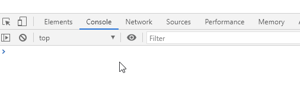
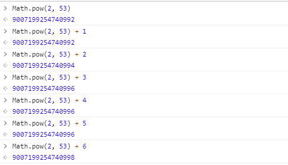
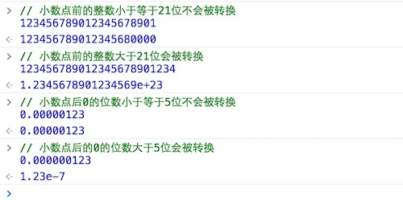
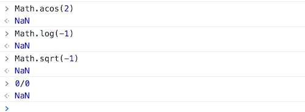
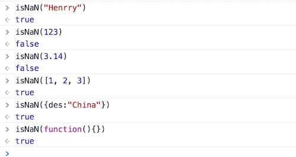
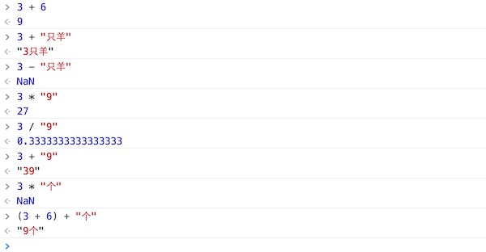
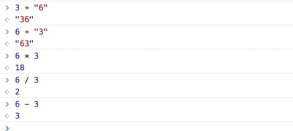
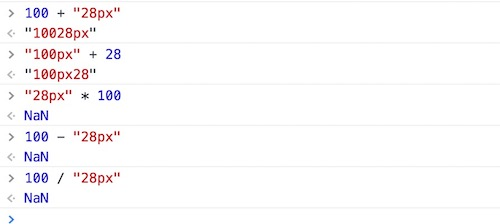

## 一、概述

数值型作为JavaScript中一个**基本数据类型**在程序中是不可或缺的，程序中的逻辑实现、条件判断都直接或间接地需要数值才能实现。比如说对数组的操作，循环语句的实现，没有数值型这种数据类型是办不到的。当然，这只是指这种数据类型在程序中的运用。谈到实际的项目，像金融这一类的网站或应用，如果对数值型这个数据类型没有充分的了解，做出的成品是很难有质量保证的，其所表示的数据准确性也会饱受怀疑，在对互联网软件产品质量要求越来越高的今天，这样的产品是达不到上线要求的。

在JavaScript中，所有的数字都是以 64位**浮点数（小数）**的形式存储的，就算是表面上看到的是一个整数，实质上它也是一个浮点数。如“**1**”和“**1.0**”完全是同一个数，执行“**1 === 1.0** ”会返回“**true**”的布尔值。其实在JavaScript语言的底层，根本没有整数（其他编程语言是“**int**”型）这个类型 。但有的时候JavaScript的值的计算必须要整数才能完成，JavaScript的做法也只是将它64位的数值转换为32位再进行运算而已。


## 二、数值型的精度问题

**浮点数始终是一个不精确的数**，在进行浮点数运算的时候会出现一些意料外的情况。比如现在我们拿以下几个浮点数在控制台内进行运算输出，观察结果：



可以发现，浮点数在做加法运算的时候，它的值并不是一个精确的 **0.3** 。

所以，在进行一些 **需要高精度的整数计算** 的时候，最好能对运算数使用保留小数点的方法“**toFixed()**”，再用对应的十分位数相乘转换回原始计算结果，该方法的括号内需要有一个参数，参数是一个数值型，如**toFixed(2)**”表示计算结果保留两位小数，然后将得出的结果乘以“100”即会得到一个相对精确的整数。


根据**IEEE 754**规定，JavaScript能精确表示的数值范围在*-(2<sup>53</sup>-1)到2<sup>53</sup>-1*之间。在JavaScript中对数值求幂（N次方）的函数是“ `Math.pow(binary,power)` ，其中“binary”是指“底数”，函数中的参数意思就是“binary”的“power”次幂（次方），如“Math.pow(5,3)”得出的结果就是125，表示5的3次方。所以，针对上述原理，我们可以算出JavaScript最大能保留的精度数值，写作：Math.pow(2,53)。我们在控制台内做这样一个实验：



从上面示例可以看到，大于2的53次方以后，整数运算的结果开始出现错误。所以，大于等于2的53次方的数值，都无法保持精度。而且大于该值 **位数** 的值都不能被保存，会被自动省略掉。

[^ tips]:注意是 位数，详情如下：


JavaScript还能采用科学计数法来表示一个数值，将数字写在“e”或“E”后方表示指数，如：

```javascript
123e2  //  12300
-123e2  // -12300

0.0314e2 //  3.14
-0.0314e2 // -3.14
```


有两种情况，JavaScript会将一个数值自动转换为科学计数法，一种是小数点前多于21位的数字，另外一种是小数点后的“0”多于5位的情况，如：




## 三、NAN

### 3.1 含义

在数值型数据中，有一个特殊值 `NaN`，它表示的是 “非数字”（ Not a Number），主要出现在将字符串解析成数字出错的场合。

```javascript
Number("x");
NaN
```

上面代码运行时，会自动将字符串*x*转为数值，但是由于*x*不是数值，所以最后得到结果为 `NaN`，表示它是“非数字”。

另外，一些数学函数及运算操作的结果会出现 `NaN`。



需要注意的是，`NaN` 不是一种独立的数据类型，而是一种特殊数值，它的数据类型依然属于**Number**，使用 `typeof`  运算符可以查看数据类型。

```javascript
typeof NaN;
"number"
```


### 3.2 运算规则

1. `NaN` 不等于任何值，包括它本身。

   ```javascript
   NaN === NaN; // false
   ```

2. `NaN` 在布尔运算时被当作 `false`。

   ```javascript
   Boolean(NaN); // false 
   ```

3. `NaN` 与任何数（包括它自己）的运算，得到的都是 `NaN`。

   ```javascript
   NaN + 32; // NaN
   NaN - 32; // NaN
   NaN * 32; // NaN
   NaN / 32; // NaN
   ```


### 3.3 判断NaN的方法

要判断一个数据的值是否是“NaN”，JavaScript提供了一个方法：`isNaN(param)`，将需要判断的值或变量作为参数放置于该方法内，即可根据返回的值判断该值或变量是否为一个“NaN”，该方法的返回值是一个布尔值，如果返回的值为true，表示值为NaN，如果返回的值为false，那就表示它的值不是NaN，如例：



可以发现，其实直接对值类型进行判断的情况下，除了数值型以外，返回的结果都是true，当然也包括它自身`isNaN(NaN)`，得出的结果同样是true。NaN产生的条件是：当参与**算术运算**中的某个值不为数值型的值，那返回的结果就会为NaN。但“*+*”运算符比较特殊，因为有的时候它是可以作为字符串拼接运算符的。观察控制台中输出的结果：




## 四、数值转换

在实际的数值获取中，很多时候取到的数值并非是以数值存在的。如：字符串*"3"*，像素单位*"30px"*，单个数组元素 *[30]* 等，这些类型的值在参与和数值型算术运算时会产生意外的结果，如，一个数值在和一个字符串、像素单位值或单个数组进行“***+***”运算时，起到的是一个“**字符串拼接**”的作用，而在执行“-”、“×”或“÷”运算时又是进行基本算术运算。如例：



当然，上面这些“非数值”的内容都还是一个数值内容，能通过程序自动转换的情况。倘若取到的值是一个带单位的，情况又有所不同了：



在数值转换中，除了自动转换，还包括下面几个转换方法：


### 1、parseInt()

- 作用：转换结果为整数
- 转换规则：从左往右依次转换，直到遇到非数字字符为止。