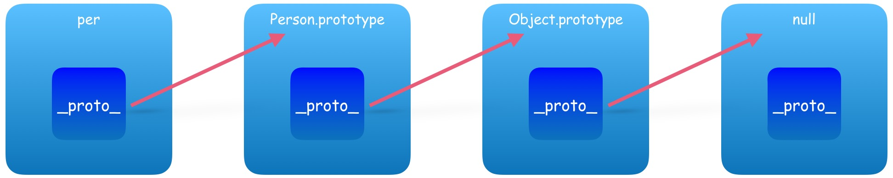

## 一、概述

对象（object）是JavaScript的核心概念，也是最重要的数据类型。JavaScript的所有数据都可以被视为对象。简单说，所谓对象，就是一种 **无序** 的数据集合，由若干个“ **键值对** ”（key-value，亦称属性名值对、成员等）构成。

JavaScript支持面 **向对象编程** ，虽然不同于传统的面向对象编程语言，但是JavaScript具有很强的面向对象编程能力。“面向对象编程”（Object Oriented Programming，缩写为OOP）是目前主流的编程范式。它的核心思想是将真实世界中各种复杂的关系，抽象为一个个对象，然后由对象之间的分工与合作，完成对真实世界的模拟。

传统的过程式编程（procedural programming）由一系列函数或一系列指令组成，而面向对象编程的程序由一系列对象组成。每一个对象都是功能中心，具有明确分工，可以完成接受信息、处理数据、发出信息等任务。因此，面向对象编程具有灵活性、代码的可重用性、模块性等特点，容易维护和开发，非常适合多人合作的大型软件项目。

那么，“对象”（object）到底是什么？我们从两个层次来理解。

- **“对象”是单个实物的抽象。**

  一本书、一辆汽车、一个人都可以是“对象”，一个数据库、一张网页、一个与远程服务器的连接也可以是“对象”。当实物被抽象成“对象”，实物之间的关系就变成了“对象”之间的关系，从而就可以模拟现实情况，针对“对象”进行编程。

- **“对象”是一个容器，封装了“属性”（property）和“方法”（method）。**

  所谓“属性”，就是对象的状态；所谓“方法”，就是对象的行为（完成某种任务）。比如，我们可以把动物抽象为animal对象，“属性”记录具体是那一种动物，“方法”表示动物的某种行为（奔跑、捕猎、休息等等）。


## 二、创建对象

### 1. 原始模式

```javascript
// 1、原始模式，Object构造函数方式
var tea = new Object();
obj.name  = "Petter";
obj.age   =  32;
obj.showName = function() { alert(this.name); }

// 2、原始模式，对象字面量方式 *
var tea = {
    name: 'Petter',
  	age: 32,
  	showName: function() { alert(this.name); }
}
```

> 优势：创建单一对象时比较快捷方便。
>
> 缺陷：当我们要创建批量对象时，代码过于冗余。脱离对象原型。


### 2. 工厂模式

```javascript
function createPerson(name, age) {
	var obj = new Object();
	obj.name = name;
	obj.age  = age;
	obj.showName = function() {
		alert(obj.name);
	}
	return obj;
}

var obj1 = createPerson('Admin', 22);
var obj2 = createPerson('Petter', 28);
```

> 优势：批量化生产，便捷方便。
>
> 缺陷：脱离对象原型。


### 3. 构造函数

构造函数：定义：通过 new + 函数名  来实例化对象的函数叫构造函数。

```javascript
function Person(name, age) {
	this.name = name,
	this.age  = age,
	this.showName = function() {
		alert(this.name);
	}
}
var per1 = new Person("李强", 24);
var per2 = new Person("李伟", 28);
```

上面代码中，**Person** 就是构造函数，它提供模板，用来生成对象实例。为了与普通函数区别，构造函数名字的第一个字母通常大写。

构造函数的特点有两个。

- 函数体内部使用了 `this` 关键字，代表了所要生成的对象实例。
- 生成对象的时候，必需用 `new` 命令调用 `Person` 函数。

> 优势：对象实例拥有对象原型（ `constructor` ）
>
> ```javascript
> console.log(per1.constructor === Person); // true
> console.log(per2.constructor === Person); // true
> ```
>
> 缺陷：内存浪费

Javascript还提供了一个`instanceof` 运算符，验证原型对象与实例对象之间的关系。

```javascript
console.log(per1 instanceof Person); // true
console.log(per2 instanceof Person); // true
```


### 4. 原型模式

Javascript规定，每一个构造函数都有一个 `prototype` 属性，指向另一个对象。**这个对象的所有属性和方法，都会被构造函数的实例继承**。意味着，我们可以把那些不变的属性和方法，直接定义在`prototype`对象上。

```javascript
// 1、原型模式，直接定义prototype属性
function Person () {}
Person.prototype.name = 'Petter';
Person.prototype.age = 31;
Person.prototype.showName = function () { alert(this.name); };

// 2、原型模式，字面量定义方式
function Person () {}
Person.prototype = {
    name: 'Petter',
    age: 31,
    showName: function () { alert(this.name); }
};
var p1 = new Person(); // name='Petter'
var p2 = new Person(); // name='Petter'
```


### 5. 混合模式（构造 + 原型）

## 

```javascript
// 原型构造组合模式，
function Person (name, age) {
    this.name = name;
    this.age = age;
}
Person.prototype = {
    hobby: ['running', 'game'],
    showName: function () { alert(this.name); },
    showAge: function () { alert(this.age); }
};

var p1 = new Person('Jack', 20); 
//p1:'Jack',20; __proto__: ['running','game'],showName,showAge
var p2 = new Person('Mark', 18); 
//p1:'Mark',18; __proto__: ['running','game'],showName,showAge
```

> 提示：做法是将需要独立的属性方法放入构造函数中，而可以共享的部分则放入原型中，这样做可以最大限度节省内存而又保留对象实例的独立性。

通过 *instanceof* 可查看对象实例

```js
p1 instanceof Person;	// true
```


## 三、属性与方法

### 1. 属性

在对象中，变量被认为是属性。属性向我们描述对象，一个英雄有名字、技能：

```javascript
// 1、键值对
var hero = {
	name: "李白",
	skill: "青莲剑歌"
}
// 2、点语法
var hero = {};
hero.name  = "李白";
hero.skill = "青莲剑歌";

// 3、表达式
var hero = {};
hero["hero" + "Name"] = "李白"; // 等价hero.heroName = "李白";
```

**访问对象属性**，主要有两种方法：

- 点语法，其语法形式为：`Obj.prop_name`，如  `hero.name`
- 下标法，其语法形式为：`Obj["prop_name"]`，如  `hero["name"]`

**区别：**

中括号运算符总是能代替点运算符。但点运算符却不一定能全部代替中括号运算符。

中括号运算符可以用字符串变量的内容作为属性名。点运算符不能。

中括号运算符可以用纯数字为属性名。点运算符不能。

中括号运算符可以用js的关键字和保留字作为属性名。点运算符不能。


### 2. 方法

在对象中，函数被认为是方法。方法代表和对象相关的任务。例如一部车可以加速或减速行驶。

```javascript
var car = {
	// 属性
	brand: "东风本田",
	color: "珍珠白",
	model: "思域",
	// 方法
	speedUp: function() {
		console.log("正在加速！");
	},
	slowDown: function() {
		console.log("正在减速！");
	}
}
```

**访问对象方法**，直接通过点语法即可访问，其语法形式：`Obj.function_name()`，如  `car.speedUp()`


## 四、对象操作

对于数据操作来讲，无非就是四种操作“增、删、改、查”。对于对象来讲，“**增**” 就是为一个对象新增一个之前不存在的属性名，然后进行赋值；“**改**” 就是对对象已经存在的属性名进行重新赋值，达到一个修改原始对象的效果；而 “**查**” 就是简单地通过对象的属性名访问即可。这些我们之前都讲解过，但对于 “**删**”来讲稍微有些特殊，需要用到关键字 “`delete`” 进行操作，为了说明问题，我们还是对这些操作进行回顾并在其中列出delete的使用方式。原对象如下：

```javascript
var phone = {
	brand:   "华为",
	model:   "P30 Pro",
	pubDate: "2019年4月10日",
}

// {brand: "华为", model: "P30 Pro", pubDate: "2019年4月10日"}
```

### 1. 增

```javascript
phone.postAddress = "上海东方体育中心";

// {brand: "华为", model: "P30 Pro", pubDate: "2019年4月10日", postAddress: "上海东方体育中心"}
```

### 2. 删

```javascript
delete phone.postAddress; 

// {brand: "华为", model: "P30 Pro", pubDate: "2019年4月10日"}
```

### 3. 改

```javascript
phone.pubDate = "2019年4月11日";

// {brand: "华为", model: "P30 Pro", pubDate: "2019年4月11日"}
```

### 4. 查

```javascript
phone.model; // "P30 Pro"
```


## 五、原型链

每个实例对象都有一个 **私有属性**（称之为`__proto__` ）指向它的构造函数的原型对象（`prototype` ）。该原型对象也有一个自己的原型对象(`__proto__`) ，层层向上直到一个对象的原型对象为 `null`。

根据定义，`null` 没有原型，并作为这个**原型链**中的最后一个环节。

```javascript
function Person(name, age) {
    this.name = name;
    this.age  = age;
}
var per = new Person("Admin", 28);
console.log(per.__proto__);  // Person.prototype
console.log(per.__proto__.__proto__);  // Object.prototype
console.log(per.__proto__.__proto__.__proto__); // null
```



> 注意：
>
> 1. 只有函数才有prototype。
> 2. prototype 原型对象包括了共享的属性、方法以及构造函数。
> 3. 上述示例中，`per` 实例对象，`Person.prototype` 原型对象，`Person` 构造函数。
> 4. `prototype.constructor`  指向构造函数。


### **new运算符的缺点**

参考链接 [阮一峰-Javascript继承机制的设计思想](http://www.ruanyifeng.com/blog/2011/06/designing_ideas_of_inheritance_mechanism_in_javascript.html)

[^ tips]: new一个函数，这个时候函数中的this就是创建出来的对象，而且函数的返回值直接就是this(隐式返回，不用写return了)。

```javascript
function createPerson(name) {
    var obj = new Object();
    obj.name = name;
    obj.showName = function(){
        alert(obj.name);
    }
    return obj
}
var p1 = createPerson("小明");
p1.showName()

// 等价于，但是下面都是this了，而且也没有return了

function CreatePeople(name) {
    this.name = name;
    this.showName = function () {
        alert(this.name)
    }
}
var p2 = new CreatePeople("小强")
p2.showName()
```


用 **构造函数生成实例对象** ，有一个缺点，那就是 **无法共享属性和方法** 。

比如，在DOG对象的构造函数中，设置一个实例对象的 **共有属性** species。

```javascript
function DOG(name) {
    this.name = name;
    this.species = '犬科';
}
```

然后，生成两个实例对象：

```javascript
var dogA = new DOG('大毛');
var dogB = new DOG('二毛');
```

这两个对象的species属性是独立的，修改其中一个，不会影响到另一个。

```javascript
dogA.species = '猫科';
console.log(dogB.species); // 显示"犬科"，不受dogA的影响
```

每一个实例对象，都有自己的属性和方法的副本。这不仅无法做到数据共享，也是极大的资源浪费。

**如何同时影响？**

现在，species属性放在**prototype**对象里，是两个实例对象共享的。只要修改了prototype对象，就会同时影响到两个实例对象。

```javascript
function DOG(name) {
    this.name = name;
}
DOG.prototype = { species: '犬科' };
var dogA = new DOG('大毛');
var dogB = new DOG('二毛');
console.log(dogA.species); // 犬科
console.log(dogB.species); // 犬科

DOG.prototype.species = "猫科";

console.log(dogA.species); // 猫科
console.log(dogB.species); // 猫科
```

### 原型：prototype

基本类型： 赋值的时候只是值的复制。比较：只要值相同就是true。

引用类型：赋值不仅是值的复制，而且也是引用的传递。比较： 值和引用都相同才是true。


在上面的代码中，我们再做一个测试

```javascript
function CreatePeople(name) {
    this.name = name;
    this.showName = function () {
        console.log(this.name)
    }
}
var p1 = new CreatePeople("小明")
var p2 = new CreatePeople("小强")
console.log(p1.showName);
console.log(p2.showName);
console.log(p1.showName == p2.showName)	// false
```

在控制台的打印中，我们可以看到p1.showName和p2.showName，他们的值其实是一样的，但是为什么结果又是false呢，因为：**只要在程序当中赋值，而不是修改，如：非push这类就是非修改(b = [1,2,3,4])，必然在内存当中重新生成一个地址**。虽然他们的值一样，但是判断时，他们的引用地址不一样，所以是false。

上面的结论中，那如果我们这样的p1、p2不止2个，而是很多个，200个2000个，那么，这个showName是不是在内存中就会存在200份、2000份，甚至更多，这样就会极大的消耗内存。那么，让上面的等式为true，是不是就是只有一个引用、一个值，也就是只有一份。

因此，要用到原型：具体内容下面有，先说概念和功能：

去改写对象下面的方法或者属性，让公用的方法或者属性在内存中存在一份（提高性能。）

上面的showName使用原型后，修改代码如下，且打印值为true:

```javascript
function CreatePeople(name) {
    this.name = name;
}
CreatePeople.prototype.showName = function () {
    alert(this.name)
}
var p1 = new CreatePeople("小明")
var p2 = new CreatePeople("小强")
console.log(p1.showName == p2.showName)	// true
```

可以总结为：面向对象的写法与使用如下：

```javascript
function 构造函数 () {
    this.属性 // 非公用的
}
构造函数.原型.方法 = function () {}	// 构造函数：自己写的就是指上面的构造函数，如果是数组之类，就是Array等
var 对象1 = new 构造函数()
对象1.方法 // 这个方法就是上面 构造函数.原型.方法的这个方法
```


## 六、对象继承

### 1. apply/call

JavaScript中的每一个Function对象都有一个apply()方法和一个call()方法，它们的语法分别为：

```javascript
/*apply()方法*/
function.apply(thisObj, [argArray])

/*call()方法*/
function.call(thisObj, [arg1[, arg2[, [,...argN]]]]);
```

**它们各自的定义：**

apply：调用一个对象的一个方法，用另一个对象替换当前对象。例如：B.apply(A, arguments);即A对象应用B对象的方法。

call：调用一个对象的一个方法，用另一个对象替换当前对象。例如：B.call(A, args1,args2);即A对象调用B对象的方法。

**它们的共同之处：**

都“ **可以用来代替另一个对象调用一个方法，将一个函数的对象上下文从初始的上下文改变为由thisObj指定的新对象** ”。

**它们的不同之处：**

apply：最多只能有两个参数——新this对象和一个数组argArray。如果给该方法传递多个参数，则把参数都写进这个数组里面，当然，即使只有一个参数，也要写进数组里。如果argArray不是一个有效的数组或arguments对象，那么将导致一个TypeError。如果没有提供argArray和thisObj任何一个参数，那么Global对象将被用作thisObj，并且无法被传递任何参数。

call：它可以接受多个参数，第一个参数与apply一样，后面则是一串参数列表。这个方法主要用在js对象各方法相互调用的时候，使当前this实例指针保持一致，或者在特殊情况下需要改变this指针。如果没有提供thisObj参数，那么 Global 对象被用作thisObj。 

实际上，apply和call的功能是一样的，只是传入的参数列表形式不同。

**示例代码：**

（1）基本用法

```javascript
function add(a,b){
  return a+b;  
}
function sub(a,b){
  return a-b;  
}
var a1 = add.apply(sub,[4,2]);　　//sub调用add的方法
var a2 = sub.apply(add,[4,2]);
alert(a1);  //6     
alert(a2);  //2

/*call的用法*/
var a1 = add.call(sub,4,2);
```

（2）实现继承

```javascript
function Animal(name){
  this.name = name;
  this.showName = function(){
        alert(this.name);    
    }    
}

function Cat(name){
  // 改变Animal中this指向，this指向Cat
  Animal.apply(this,[name]);    
  /*call的用法*/
  // Animal.call(this,name);
}

var cat = new Cat("咕咕");
cat.showName();

```

（3）多重继承

```javascript
function Class10(){
  this.showSub = function(a,b){
        alert(a - b);
    }   
}

function Class11(){
  this.showAdd = function(a,b){
        alert(a + b);
    }  
}

function Class12(){
  Class10.apply(this);
  Class11.apply(this);   
  // Class10.call(this);
  //Class11.call(this);  
}

var c2 = new Class12();
c2.showSub(3,1);    //2
c2.showAdd(3,1);    //4
```


构造函数 -> 使用 `call` 或 `apply` 方法实现继承：

原理：通过改变this指向实现继承。apply第二个参数必须是数组，call依次传入。

```javascript
function Per(){
    this.country = "中国";
}
function Stu(name, major) {
  //Per.call(this, arguments);
    Per.apply(this, arguments);
    this.name  = name;
    this.major = major;
}
var stu = new Stu("小明", "网页设计");
console.log(stu);
// Stu {country: "中国", name: "小明", major: "网页设计"}
```


### 2. prototype

构造函数:

```javascript
function Per(){
    this.country = "中国";
}
function Stu(name, major) {
    this.name  = name;
    this.major = major;
}

Stu.prototype = new Per(); 
console.log(Stu.prototype.constructor); // Per(){ this.country = "中国"; }
// 更正Stu的构造函数，可以不更正，会从原型上一层层往上找
// Stu.prototype.constructor = Stu;

var stu = new Stu("小明", "网页设计");
console.log(stu.country); // 中国
```


直接继承 prototype:

```javascript
function Per(){}
Per.prototype.country = "中国";

function Stu(name, major) {
    this.name  = name;
    this.major = major;
}

// 临时对象
function Temp() {}
Temp.prototype = Per.prototype;
Stu.prototype = new Temp();
Stu.prototype.constructor = Stu;

var stu = new Stu("小明", "网页设计");
console.log(stu);
```


封装继承：

```js
function extend(Child, Parent) {
    var p = Parent.prototype;
    var c = Child.prototype;
    for (var i in p) {
        c[i] = p[i];
    }
}
```


封装使用：

```js
function animal() { }
animal.prototype.total = "动物";
function dogFn(name, age) {
    this.name = name;
    this.age = age;
}
extend(dogFn, animal);
var dog1 = new dogFn("柴犬", "3");

console.log(dog1);	// dogFn {name: "柴犬", age: "3"}
console.log(dog1.total);	// 动物
```


### 3. Object

字面量对象 -> json格式的发明人Douglas Crockford，提出了一个`object()`函数，可以做到这一点。

```javascript
// Object继承
function object(parent) {
    var child = function () { };
    child.prototype = parent;
    return new child();
}
var obj = { school: "小学" };
var stu = object(obj);
stu.name = "dwill";
stu.major = "学渣";
console.log(stu.name, stu.major, stu.school);
// dwill 学渣 小学
```

[^ 提示]:通过object方法实现继承的缺陷就是在赋值对象属性时只能使用点语法，不建议使用。


### 4. 浅拷贝

字面量对象 -> 浅拷贝又称浅复制，即地址复制，我们可以把父对象的属性和方法拷贝一份给子对象，从而实现继承：

```js
function shallowCopy(parent, child) {
   	/*
   	构造函数继承：取消该注释
    var p = parent.prototype;
    var c = child.prototype;*/
    for(var key in p) {
        c[key] = p[key];
    }
}
```

代码示例：

```js
var per = {
    country: "中国",
    province: "四川省"
}
var stu = {
    name: "学渣",
    school: "小学"
}
for(var key in per) {
    stu[key] = per[key];
}
console.log(stu);
// {name: "学渣", school: "小学", country: "中国", province: "四川省"}
```

浅拷贝是指针复制，因此对于对象类型会有缺陷，我们继续看一个实例：

```js
var obj = {
    citys: ["北京", "上海", "成都"]
}
var stu = {
    name: "木子李"
}
for(var key in obj) {
    stu[key] = obj[key];
}
stu.citys.push("香港");
console.log(stu.citys);
// (4) ["北京", "上海", "成都", "香港"]
console.log(obj.citys);
// (4) ["北京", "上海", "成都", "香港"]
```

从上述示例可以看出，修改stu的citys属性也能实时的反映到obj上去。