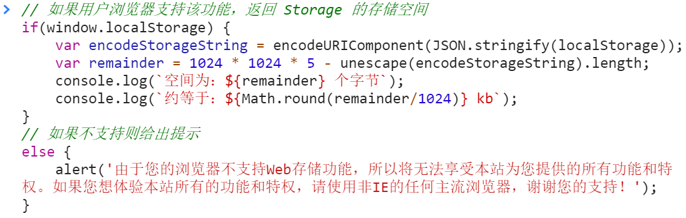
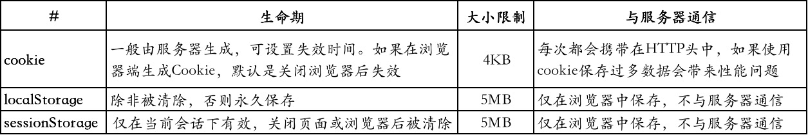

## 一、概述

数据存储，可以是临时存储，也可以是永久存储，接下来我们一起看看在Web中，有哪些方式可以存储数据。


## 二、Cookie

### 2.1 什么是Cookie

Cookie 是一些数据, 存储于你电脑上的文本文件中。

当 web 服务器向浏览器发送 web 页面时，在连接关闭后，服务端不会记录用户的信息。

Cookie 的作用就是用于解决 "如何记录客户端的用户信息":

- 当用户访问 web 页面时，他的名字可以记录在 cookie 中。
- 在用户下一次访问该页面时，可以在 cookie 中读取用户访问记录。

Cookie 以名/值对形式存储，如下所示:

username=John Doe

当浏览器从服务器上请求 web 页面时， 属于该页面的 cookie 会被添加到该请求中。服务端通过这种方式来获取用户的信息。


### 2.2 使用 JavaScript 创建Cookie

[^ tips]: 用IDE编辑器，必须得有本地服务器，因此我们在单个文件时，用live sever启动。

JavaScript 可以使用 **document.cookie** 属性来创建 、读取、及删除 cookie。

JavaScript 中，创建 cookie 如下所示：

```javascript
document.cookie="username=John Doe";
```

您还可以为 cookie 添加一个过期时间（以 UTC 或 GMT 时间）。默认情况下，cookie 在浏览器关闭时删除：

```javascript
document.cookie="username=John Doe; expires=Thu, 18 Dec 2043 12:00:00 GMT";
```

您可以使用 path 参数告诉浏览器 cookie 的路径。默认情况下，cookie 属于当前页面。

```javascript
document.cookie="username=John Doe; expires=Thu, 18 Dec 2043 12:00:00 GMT; path=/";
```


### 2.3 使用 JavaScript 读取 Cookie

在 JavaScript 中, 可以使用以下代码来读取 cookie：

```javascript
var x = document.cookie;
```

[^ tips]: document.cookie 将以字符串的方式返回所有的 cookie，类型格式： cookie1=value; cookie2=value; cookie3=value;


### 2.4 使用 JavaScript 修改 Cookie

在 JavaScript 中，修改 cookie 类似于创建 cookie，如下所示：

```javascript
document.cookie="username=John Smith; expires=Thu, 18 Dec 2043 12:00:00 GMT; path=/";
```

旧的 cookie 将被覆盖。


### 2.5 使用 JavaScript 删除 Cookie

删除 cookie 非常简单。您只需要设置 expires 参数为以前的时间即可，如下所示，设置为 Thu, 01 Jan 1970 00:00:00 GMT:

```javas
document.cookie = "username=; expires=Thu, 01 Jan 1970 00:00:00 GMT";
```

注意，当您删除时不必指定 cookie 的值。


### 2.6 Cookie 字符串

document.cookie 属性看起来像一个普通的文本字符串，其实它不是。

即使您在 document.cookie 中写入一个完整的 cookie 字符串, 当您重新读取该 cookie 信息时，cookie 信息是以名/值对的形式展示的。

如果您设置了新的 cookie( **新的键名** )，旧的 cookie 不会被覆盖。 新 cookie 将添加到 document.cookie 中，所以如果您重新读取document.cookie，您将获得如下所示的数据：

cookie1=value; cookie2=value;

```javascript
<!DOCTYPE html>
<html lang="en">

<head>
    <meta charset="UTF-8">
    <meta name="viewport" content="width=device-width, initial-scale=1.0">
    <title>Document</title>
</head>

<body>
    <button onclick="fn1()">显示所有</button>
    <button onclick="fn2()">创建键名username</button>
    <button onclick="fn3()">创建键名age</button>
    <button onclick="fn4()">删除键名username</button>
    <button onclick="fn5()">删除键名age</button>
    <script>
        function fn1() {
            let allCookie = document.cookie;
            alert(allCookie);
        }
        function fn2() {
            document.cookie = "username=dwillchen";
        }
        function fn4() {
            document.cookie = "username=; expires=Thu, 01 Jan 1970 00:00:00 GMT";
        }
        function fn3() {
            document.cookie = "age=18";
        }
        function fn5() {
            document.cookie = "age=; expires=Thu, 01 Jan 1970 00:00:00 GMT";
        }
    </script>
</body>

</html>
```

如果您需要查找一个指定 cookie 值，您必须创建一个JavaScript 函数在 cookie 字符串中查找 cookie 值。


### 2.7 JavaScript Cookie 实例

在以下实例中，我们将创建 cookie 来存储访问者名称。

首先，访问者访问 web 页面, 他将被要求填写自己的名字。该名字会存储在 cookie 中。

访问者下一次访问页面时，他会看到一个欢迎的消息。

在这个实例中我们会创建 3 个 JavaScript 函数:

1. 设置 cookie 值的函数
2. 获取 cookie 值的函数
3. 检测 cookie 值的函数


#### a. 设置 cookie 值的函数

首先，我们创建一个函数用于存储访问者的名字：

```javascript
function setCookie(cname,cvalue,exdays)
{
  var d = new Date();
  d.setTime(d.getTime()+(exdays*24*60*60*1000));
  var expires = "expires="+d.toGMTString();
  document.cookie = cname + "=" + cvalue + "; " + expires;
}
```

**函数解析：**

以上的函数参数中，cookie 的名称为 cname，cookie 的值为 cvalue，并设置了 cookie 的过期时间 expires。

该函数设置了 cookie 名、cookie 值、cookie过期时间。


#### b. 获取 cookie 值的函数

然后，我们创建一个函数用于返回指定 cookie 的值：

```javascript
function getCookie(cname)
{
  var name = cname + "=";
  var ca = document.cookie.split(';');
  for(var i=0; i<ca.length; i++) 
  {
    var c = ca[i].trim();
    if (c.indexOf(name)==0) return c.substring(name.length,c.length);
  }
  return "";
}
```

**函数解析：**

cookie 名的参数为 cname。

创建一个文本变量用于检索指定 cookie :cname + "="。

使用分号来分割 document.cookie 字符串，并将分割后的字符串数组赋值给 ca (ca = document.cookie.split(';'))。

循环 ca 数组 (i=0;i<ca.length;i++)，然后读取数组中的每个值，并去除前后空格 (c=ca[i].trim())。

如果找到 cookie(c.indexOf(name) == 0)，返回 cookie 的值 (c.substring(name.length,c.length)。

如果没有找到 cookie, 返回 ""。


#### c. 检测 cookie 值的函数

最后，我们可以创建一个检测 cookie 是否创建的函数。

如果设置了 cookie，将显示一个问候信息。

如果没有设置 cookie，将会显示一个弹窗用于询问访问者的名字，并调用 setCookie 函数将访问者的名字存储 365 天：

```javascript
function checkCookie()
{
  var username=getCookie("username");
  if (username!="")
  {
    alert("Welcome again " + username);
  }
  else 
  {
    username = prompt("Please enter your name:","");
    if (username!="" && username!=null)
    {
      setCookie("username",username,365);
    }
  }
}
```


#### d. 完整实例

```javascript
<!DOCTYPE html>
<html lang="en">

<head>
    <meta charset="UTF-8">
    <meta name="viewport" content="width=device-width, initial-scale=1.0">
    <title>Document</title>
</head>

<body>
    <script>
        function setCookie(cname, cvalue, exdays) {
            var d = new Date();
            d.setTime(d.getTime() + (exdays * 24 * 60 * 60 * 1000));
            var expires = "expires=" + d.toGMTString();
            document.cookie = cname + "=" + cvalue + "; " + expires;
        }
        function getCookie(cname) {
            var name = cname + "=";
            var ca = document.cookie.split(';');
            for (var i = 0; i < ca.length; i++) {
                var c = ca[i].trim();
                if (c.indexOf(name) == 0) { return c.substring(name.length, c.length); }
            }
            return "";
        }
        function checkCookie() {
            var user = getCookie("username");
            if (user != "") {
                alert("欢迎 " + user + " 再次访问");
            }
            else {
                user = prompt("请输入你的名字:", "");
                if (user != "" && user != null) {
                    setCookie("username", user, 30);
                }
            }
        }
        checkCookie();
    </script>
</body>

</html>
```


## 三、Web Storage

### 3.1 概述

“*Web Storage*”是 HTML5 新增的一种数据持久化机制（可以简单地认为是“Web 的数据存储”），随着浏览器对 HTML5 的支持度不断增加，在新建的项目中基本已经取代了 *cookie*，它是服务器保存在浏览器的一小段文本信息，每个 Cookie 的大小一般不能超过 4KB，超过这个长度的 Cookie，将被忽略，不会被设置。

“Web Storage”更像是 cookie 的强化版，能够动用大得多的存储空间。

Web Storage更像是cookie的强化版，能够动用大得多的存储空间。Web Storage存储机制包含 会话存储 和 本地存储 这两个对象。它们存储值的方式和JavaScript中对象属性储存值的方式一样，都是以“键值对”存在的。

但是随着浏览器版本的变化，每个浏览器的 Storage 存储量也会发生变化，这个时候可以运行下方的代码来获取该浏览器可以存储数据的空间大小：

[^ tips]: **localStorage** 中存储的是字符串，根据这一条件，我们可以通过取出所有的localStorage的内容，而其长度就是大小。

```javascript
var encodeStorageString = encodeURIComponent(JSON.stringify(localStorage));
// Chrome浏览器中localStorage最大5120kb，即5M
var remainder = 1024 * 1024 * 5 - unescape(encodeStorageString).length;
console.log("空间为：" + remainder + "个字节");
console.log("约等于：" + Math.round(remainder/1024) + "kb");
```

以上代码在不支持 Web Storage 的浏览器中会报出错误，所以，如果您的项目可能存在 IE 或老版本浏览器的用户，则可以将以上代码放置在一个条件判断语句以内，在运行 Storage 相关功能的时候给予用户有效的提示。如：



另外，Web Storage 与 Cookie、AJAX 以及 IndexedDB（存储空间更大的浏览器数据库，属于较冷门的技术）一样，它们也受“*同域*”限制，这种限制叫做浏览器的“*同源策略*”，它是浏览器最核心也最基本的安全功能，如果缺少了同源策略，则浏览器的正常功能可能都会受到影响。可以说 Web 是构建在同源策略基础之上的，浏览器只是针对同源策略的一种实现。某个网页存入的数据，只有“同域”下的网页才能读取。“同源策略”主要包含以下内容：


### 3.2 同源策略

#### a. 协议类型相同

HTTP 和 HTTPS 就是两个不同的协议。HTTP（HyperText Transfer Protocol）称作“超文本传输协议”，而 HTTPS（Hyper Text Transfer Protocol over SecureSocket Layer）是以安全为目标的 HTTP 通道，在 HTTP 的基础上通过传输加密和身份认证保证了传输过程的安全性。HTTPS 是在 HTTP 的基础下加入 *SSL* 层，HTTPS 的安全基础是 SSL，因此加密的详细内容就需要 SSL。所以，浏览器认为他们不是同一种协议类型。


#### b. 域名相同

##### 1. 顶级域名+主域名+子域名

一级域名由主域名加 "." 加顶级域名组成，即（主域名）+( . )+(顶级域名)。

比如您注册的域名是baidu.com,那么他是由一个字符串加一个域名尾，中间用.号隔开。这就是一个顶级域名，如果在顶级域名前在由.隔开加上不 同的字符，比如zhidao.baidu.com,那么我们就说zhidao是顶级域名baidu.com的一个主机名，zhidao.baidu.com就是一个二级域名。 道理等同二级域名，不过比二级域名更加延伸，比如我们继续扩展该域名的主机名，设置主机名为zhidao.user,那么就可以建立一个三级域 名:zhidao.user.baidu.com，当然也可以建立四级域名zhidao.user.man.baidu.com，五级域名zhidao.user.man.yong.baidu.com……，依次类 推，可以建立无限级别的域名，我们统称这些域名为顶级域名baidu.com的子域名。


##### 2. 顶级域名+其他级别域名

**顶级域名：**通用顶级域名、国家代码顶级域名(https://baike.baidu.com/item/%E5%9F%9F%E5%90%8D)

**其他级别域名：**

除了顶级域名，还有二级域名（SLD，second-level domain），就是最靠近顶级域名左侧的字段。如：zh.wikipedia.org中，wikipedia就是二级域名(有资料认为, 在顶级域名后面, 还存在一级域名, 那么zh就是二级域名)。

再下来就是三级域名，即最靠近二级域名左侧的字段，从右向左便可依次有四级域名、五级域名等等。举个正在使用中的三级域名的实例，www.ncic.ac.cn，其中www前缀表明此域名对应着万维网服务，每一级域名由英文半角句号分区，“ncic”作为三级域名是“ac.cn”的子域名。


##### 3. 目录

注意：目录不影响同源策略。

如：

```
http://www.xxx.com/1
http://www.xxx.com/2
```

上面2个网址，域名其实是一致的，只是对应的目录不同。目录 **1** 和 **2** 相当于是`http://www.xxx.com`的一部分。


#### c. 端口号相同

端口号（Port）在已经上线的网站中通常是隐藏了的，但是在开发环境中的浏览器地址栏上通常会显示出端口号。如通过“*live-server*”通常会启动一个地址为“http://127.0.0.1:5500”的页面，其中的“:5500”部分就为端口号，这个端口号不同，则为“不同域”。以 *Apache* 为例，HTTP 协议下的页面端口号通常为“:80”，而 HTTPS 协议下的页面端口号通常为“:443”，这是两个不同的端口号，所以哪怕域名部分完全一样，也涉及到“*跨域*”。


### 3.3 概述2

“Web Storage”存储机制包含 *sessionStorage* 和 *localStorage* 这两个实例，它们都是浏览器通过 *new Storage()* 实例化而来的（可以在浏览器控制台中输出 sessionStorage 或 localStorage 来观察它们的类名）。从名称上直译，可以将其称作 **“*会话存储*”和“*本地存储*”** 。它们存储值的方式和 JavaScript 中对象属性储存值的方式一样，都是以“键值对”存在的。

这两个实例的区别是：会话存储（sessionStorage）的键值在浏览器关闭后会被清除，而本地存储（localStorage）存储的键值会一直存在于浏览器中，除非在开发者工具中手动清除或使用 *clear()* 方法清除。需要注意，浏览器自带的“历史记录”清除功能也无法将其清除。这样一来我们 Web 前端开发者也可以达到“数据持久化存储”的目的了。这是这两种存储方式最主要的区别，一定要牢记区分。接下来我们看学习这两个实例的使用方式。


### 3.4 会话存储、本地存储

- `sessionStorage`：会话存储（临时存储），数据在浏览器关闭后会被清除	
- `localStorage`：本地存储，数据一直存在于浏览器中，除非调用 `clear` 清除，一般用于数据持久化存储

会话存储和本地存储常用的方法：

- `setItem(key, val)`：存储数据 & 修改数据
- `getItem(key)`：获取数据
- `removeItem(key)`：移除数据
- `clear()`：清空数据

> 提示：
>
> \- 不管是sessionStorage还是localStorage，他们的本质都是对象，所以我们可以通过点语法的形式对它们进行增删改查。
>
> \- 在浏览器调试工具的 Application 选项中可查看存储数据的可视化形式。


### 3.5 对象存储

Webstorage 不能直接存储对象类型的数据，需将对象类型的数据转换成JSON数据之后进行存储，读取的时候需进行解析。

```js
// 1. 存
sessionStorage.usr = JSON.stringify({
	name: "鲁班七号",
	age: 18,
	major: "射手"
});

// 2. 取
JSON.parse(sessionStorage.usr);
```


## 四、对比

- cookie用来保存登录信息，大小限制为4KB左右

- localStorage是Html5新增的，用于本地数据存储，保存的数据没有过期时间，一般浏览器大小限制在5MB

- sessionStorage接口方法和localStorage类似，但保存的数据的只会在当前会话中保存下来，页面关闭后会被清空。

