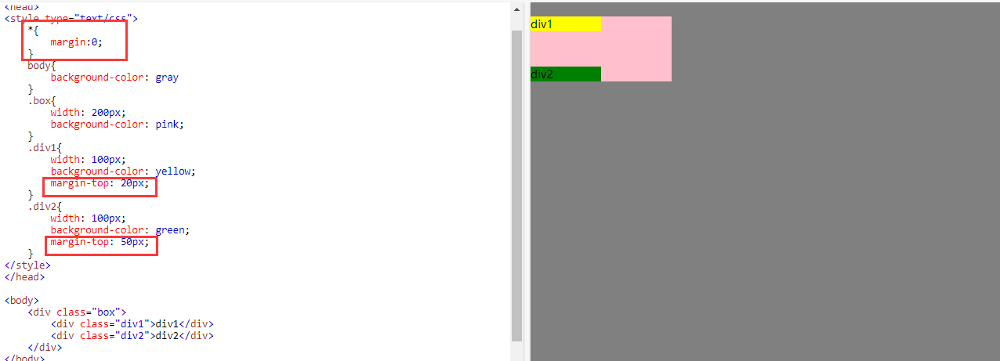
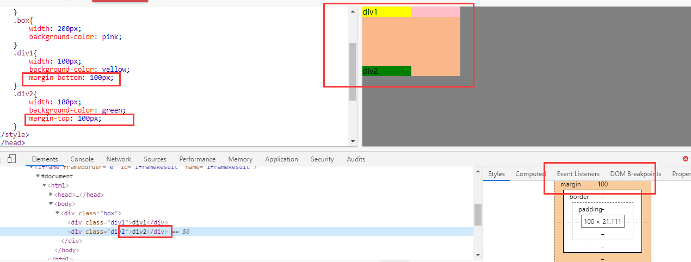
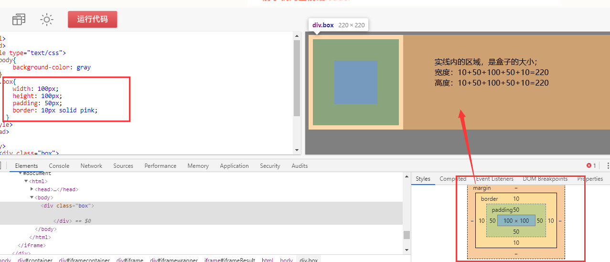
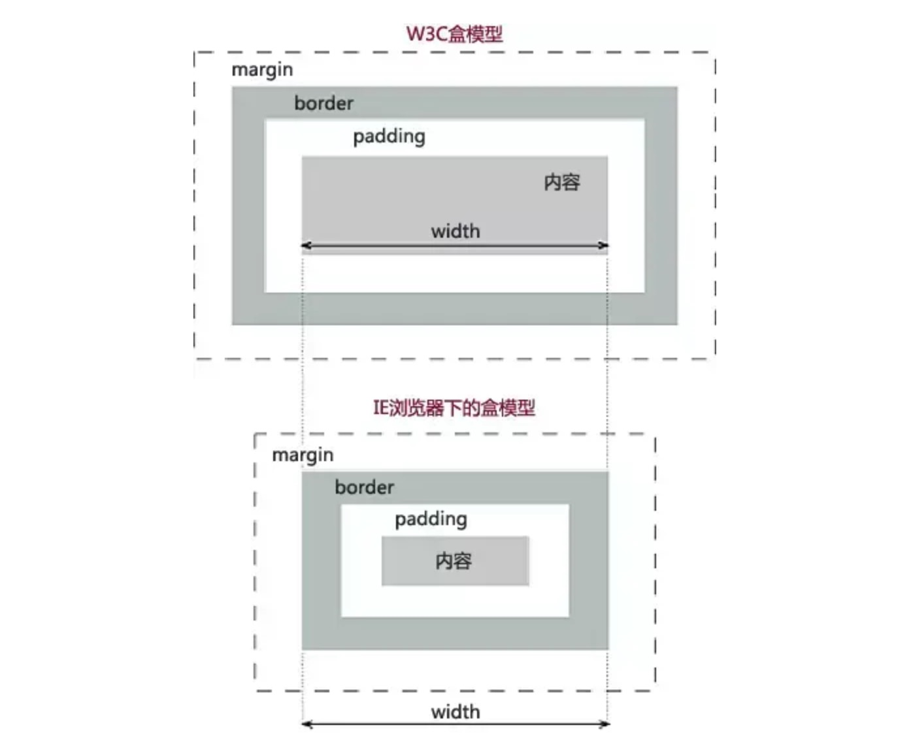
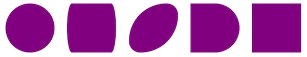

## 盒模型


### 常见样式-padding

padding 内边距

1. padding-top 上边内边距
2. padding-right 右边内边距
3. padding-bottom 下边内边距
4. padding-left 左边内边距

padding是内填充，默认的情况下，设置padding后，会撑大容器的大小。


#### 复合样式

- 只有一个属性值的时候：padding：10px；

  4个方向都是同一个值

- 有4个属性值的时候：padding：top right bottom left；

  顺序是顺时针方向，**`上右下左`**的顺序，分别对应4个方向。

- 设置2个属性值的时候：padding：10px 50px；

  第一个属性值设置的是**`上下`**，第二个属性值设置的是**`左右`**

- 设置3个属性值的时候：padding：10px 20px 50px；

  第一个属性值设置的是**`上`**

  第二个属性值设置的是**`左右`**

  第三个属性值设置的是**`下`**

  

### 常见样式-margin

margin 外边距

1. margin -top 上边外边距
2. margin -right 右边外边距
3. margin -bottom 下边外边距
4. margin -left 左边外边距

margin是标签与标签之间的间隔，不会撑开容器大小。

#### margin的问题

##### 1. margin-top传递的问题

如下图：

   

会发现：div1设置了margin-top，但是仍然和box盒子之间没有间距，但是box盒子的top却产生了一个间距。

**原理**

一个盒子（代码中的**`box`**）如果**没有上补白**(padding-top)和**上边框**(border-top)，那么这个盒子（**box**）的上边距会和其内部文档流中的第一个子元素（**div1**）的**上边距**重叠。

**解决办法：
**1.修改父元素的高度，增添padding-top样式模拟（常用）；
2.为父元素添加overflow:hidden;样式即可（完美）；
5.为父元素或者子元素声明浮动（可用）；
3.为父元素添加border（可用）;
4.添加额外的元素放在子元素最前面，设置高度为1px，overflow:hidden(若为行内元素，需要声明为块元素)（啰嗦）;
6.为父元素或者子元素声明绝对定位（……）


##### 2. margin的上下塌陷问题（叠压）

如下图：



会发现：div1有一个margin-bottom：100px，div2有一个margin-top：100px；

但是他们之间的间距却还是100px，而不是相加的200px。

**原理：**

在**标准文档流**中，**竖直**方向的margin会出现叠加现象（**水平方向不会塌陷**），两个margin紧挨着，**中间没有border或者padding**。
margin直接接触，就产生了合并。
**表现为较大的margin会覆盖掉较小的margin**，竖直方向的两个盒子中间只有一个较大的margin，这就是margin塌陷现象。


##### magin塌陷的分类

- 兄弟关系的盒子

  如上面，就是兄弟关系的塌陷。

- 父子关系的盒子，如下图：

  


**解决方案**

- 给父元素添加透明边框，至少添加`border-top:1px solid transparent`
- 给父元素添加`padding-top:npx`
- 给父元素添加`overflow:hidden`
- 给父元素添加`position: absolute;`
- 给父元素添加`position: fixed;`
- 给父元素添加`display: inline-block`;


### 盒模型

- 盒子大小 = border + padding + width/height

- 盒子宽度 = 左border + 左padding + width + 右padding + 右border

- 盒子高度 = 上boder + 上padding + height + 下padding + 下border

  


## 盒子类型

CSS盒子模型的类型主要有两个：

- IE浏览器盒子模型： 元素的宽高大小表现为内容的大小。
- 标准（W3C，其它主流浏览器）盒子模型（默认）：元素的宽高表现为内容 + 内边距 + 边框的大小。背景会延伸到边框的外沿。



通过 `box-sizing` 可切换盒子模型类型：

- `content-box`：标准盒子模型
- `border-box`：IE盒子模型


## 盒子圆角

border-radius` 属性可以设置边框圆角，该属性虽然带了一个 `border` 字样，同样也是用来设置元素的边界，但它和“border”并无太大的关系，它是对元素的“左上”、“右上”、“右下”和“左下”四个角的“圆度”进行设置。该属性能对任何显示类型的元素设置，包括“行级元素（inline）”。

`border-radius` 实现的原理是根据该属性所设置的值，在元素内建立一个以该值为半径的“看不见的圆”，并以该圆的边缘形状来设置边角的圆度。

`border-radius` 单位可以是像素或百分比，如果采用百分比如 50%，并且元素宽高相等，则会呈现一个正圆，否则会呈现出一个椭圆。使用百分比时，其上限值为50%，增加这个值并不会出现任何效果。

设值时，你也可以设置两个值，如：`border-radius: 100px/120px`，用 “`/`” 符号进行分割，第一个值表示水平方向圆的半径，第二个表示垂直方向圆的半径。

`border-radius` 属性除了能统一对元素的边角进行设置，还能分别对一个矩形元素的四个角分别进行设置，如：

- border-top-left-radius：左上角
- border-top-right-radius：右上角
- border-bottom-left-radius：左下角
- border-bottom-right-radius：由下角

```css
<div class="wrap">
	<section class="t1"></section>
	<section class="t2"></section>
	<section class="t3"></section>
	<section class="t4"></section>
	<section class="t5"></section>
</div>
```

```css
div.wrap > section {
    width:  100px;
    height: 100px;
    background-color: purple;

    display: inline-block;
    margin: 0 10px;
}

.t1 { border-radius: 50%; }
.t2 { border-radius: 10px/50px; }
.t3 {
    border-top-right-radius: 30%;
    border-top-left-radius: 100px;
    border-bottom-left-radius: 30%;
    border-bottom-right-radius: 100px;
}
.t4 {
    border-top-right-radius: 50%;
    border-bottom-right-radius: 50%;
}
```




## 元素轮廓

outline` 属性用于设置一个元素的轮廓线，和 `border` 不一样，`outline`  无论在什么“盒子模型”下，都不会占据页面的空间，并且它不能分别去设置各个方向的值，即不能对“top”、“right”、“bottom”和“left”方向的“outline”进行分别设置，只能进行统一设置。在使用“*webkit*（老版本Chrome浏览器、Safari浏览器以及iOS和Android系统自带浏览器）”内核或 “*blink*（以新版的Chrome浏览器和Opera浏览器为代表）”内核的浏览器中，该属性会在表单元素在获得焦点后自动出现，本意是让用户获得更好的交互体验，但该设定很多时候反而会影响我们对“Web”页面的风格设置，这个时候我们都是将它的值设置为“none”。另外，“outline”属性并不受圆角属性“border-radius”的影响。

和 “border” 属性大体一致，“outline” 有以下分支属性：

- **outline-width**：设置轮廓线的宽度，能为Web技术中常用的度量单位，最常用的为像素“px”。
- **outline-style**：设置轮廓线的样式，和“border-style”一致，这里就不在赘述。
- **outline-color**：设置轮廓线的颜色，和“border-color”一样支持Web的四种“颜色模式”。
- **outline-offset**：设置轮廓线相对元素边界的距离，通常以像素“px”为单位。


## 调整元素大小

resize` 属性是用于定义“块级元素”的大小是否可以调整、以何种方式（水平方向还是垂直方向）调整，该属性需要配合属性值为“auto”、“hidden ”或“scroll”的 `overflow` 属性使用，但被调整大小的元素的宽和高不能小于它原始的宽和高。另外，`resize` 属性有个特别案例，就是能够对表单元素 \<textarea>使用，并且无需显示的去设置`overflow`属性。

讲到“resize”这个属性，不得不提到四个新的属性，`max-width` 和 `max-height` ，它们分别表示元素允许的“最大宽度”和“最大高度”，与之对应的是 `min-width` 和 `min-height` ，它们分别表示元素允许的“最小宽度”和“最小高度”。这四个属性除了在“resize”中运用比较多，在限制\<table>单元格的宽高时也非常实用。

`resize` 可设置三个值：

- **vertical**：垂直方向可调整大小
- **horizontal**：水平方向可调整大小
- **both**：垂直与水平方向都可以调整大小

```css
section {
	width: 300px;
	height: 300px;
	background-color: red;

	margin: 50px auto;
}

section.t1 {

	overflow: auto;
	/*垂直方向可调整*/
	resize: vertical;
}

section.t2 {
	overflow: auto;
	/*水平方向可调整*/
	resize: horizontal;
}

section.t3 {
	overflow: auto;
	/*垂直于水平方向都可调整*/
	resize: both;
}
```

