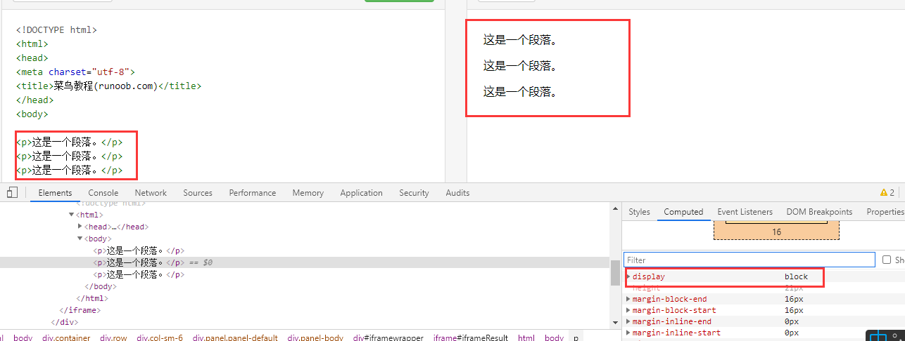
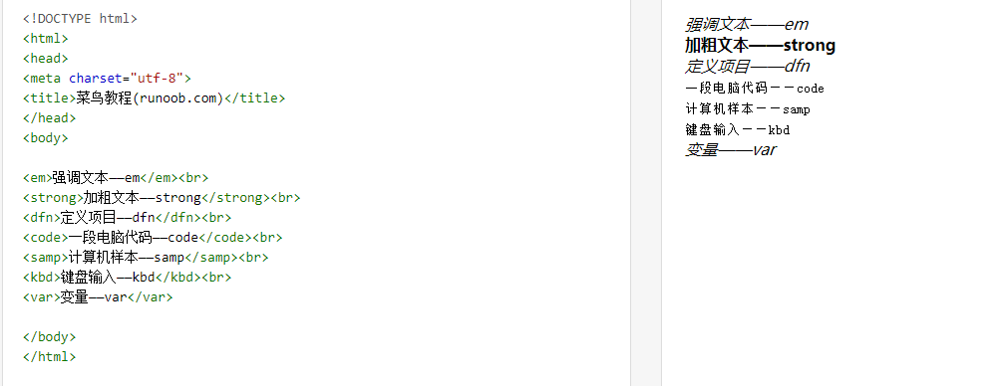
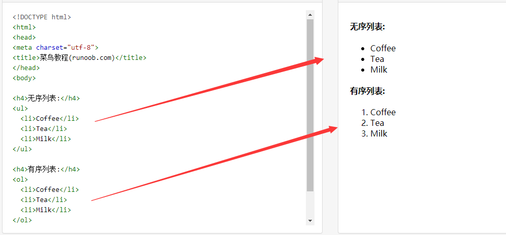
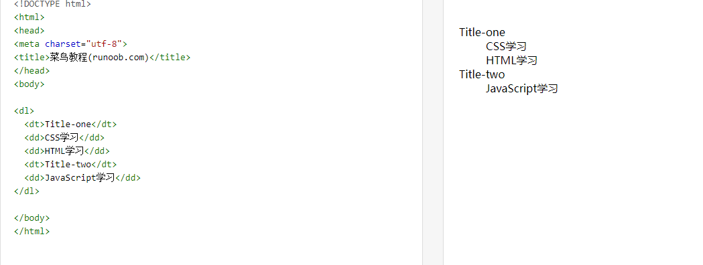
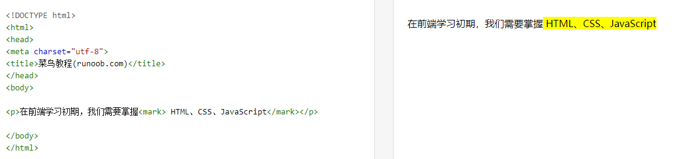

## 常用标签

### h标签——标题

- h1~h6标题标签。
- h1一般用在logo，且在当前页面最好只有一个。


### p标签——段落

表示一个段落，会换行，**display为block**。




### strong标签——强调

- 表现形式：加粗文本


### em标签——强调

- 表现形式：斜体




### span标签——区分样式


## 组合标签

### ul：无序列表

- ul：无序列表
- li：列表项
- ul的下一级元素只能是li，虽然，比如写div，效果也是正常的，但是不符合**标签嵌套规则**


### ol：有序列表

- ol：有序列表
- li：列表项
- ol的下一级元素也是只能是li，虽然，比如写div，效果也是正常的，但是不符合**标签嵌套规则**




### dl：自定义列表

```html
<dl>
    <dt>dl-自定义列表；dt-自定义列表title</dt>
    <dd>dd-自定义列表的列表项（信息）</dd>
</dl>
```




### mark：标记

部分文本高亮显示：

```html
<p>在前端学习初期，我们需要掌握<mark> HTML、CSS、JavaScript</mark></p>
```




## 特殊标签——img

-  标签定义 HTML 页面中的图像。

-  标签有两个必需的属性：src 和 alt。

- 图片中的 **alt** 属性是在**图片不能正常显示时**出现的文本提示。

  图片中的 **title** 属性是在**鼠标在移动到元素上**的文本提示。

[^ 注释]: 从技术上讲，图像并不会插入 HTML 页面中，而是链接到 HTML 页面上。 标签的作用是为被引用的图像创建占位符。
[^ 提示]: 通过在 <a> 标签中嵌套  标签，给图像添加到另一个文档的链接。

