## 选择器

[^参考手册]: 选择器-菜鸟教程  <a>https://www.runoob.com/cssref/css-selectors.html</a>

### 一、常用选择器


#### id选择器

选择指定的，具有ID的元素。

[^注意]: ID选择器 - 当前页面唯一的。

```css
<div id="box"></div>

<style>
	#box {
    	width: 200px;
        height: 200px;
        background-color: pink;
	}
</style>
```


#### 类选择器

选择指定类的**所有**元素。

[^注意]: 类选择器 - 选择范围内所有的。

```css
<div class="box"></div>
<div class="box"></div>
<div class="box"></div>

<style>
    .box {
		width: 200px;
        height: 200px;
        background-color: yellow;
    }
</style>
```


#### 标签选择器

选择范围内，标签名为XXX的所有标签的元素。

```css
<div>1</div>
<div>2</div>
<div>3</div>
<div>3</div>

<style>
    div {
		width: 200px;
        height: 200px;
        background-color: red;
    }
</style>
```


#### 群组选择器

[^群组选择器]: 用逗号(,)分割，被逗号分割的元素(选择器)全部执行统一的代码片段。

```css
<div>1</div>
<p>2</p>
<h1>3</h1>
<p class="oP">4</p>

<style>
    div, p, h1, .oP {
		width: 200px;
        height: 200px;
        background-color: green;
    }
</style>
```


#### 后代选择器

后代选择器又称为包含选择器。后代选择器可以选择作为某元素后代的元素。

后代选择器是对某元素所嵌套的指定元素进行选择，每个选择符之间用 **空格** 进行分割，多个嵌套层次应该以多个空格进行分割。

[^ 注意]: 后代选择器，他会选择满足条件的**后代元素**，即不一定是父子的这种相邻关系。


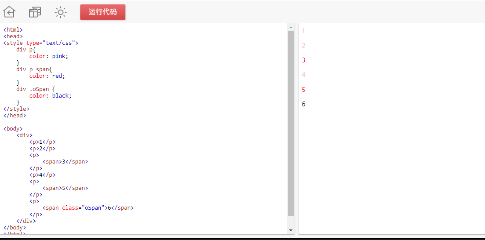


#### 子类选择器

子选择器区别于后代选择器的地方就是，后代选择器可以选择嵌套在标签内部任意层级的标签元素，而子选择器只能选择当前标签往内一层的元素，即直接子元素。每个选择符之间用 `>` 进行分割。

```htm
<header>
	
	<nav>
		<ul class="menu-list">
			<li><a href="javascript:;">首页</a></li>
			<li><a href="javascript:;">新闻</a></li>
			<li><a href="javascript:;">科技</a></li>
			<li><a href="javascript:;">社会</a></li>
		</ul>
	</nav>
</header>
```


```css
/*index.css*/
header > img { width:  80px; height: 30px; }
header > nav > ul.menu-list { list-style: none; }
```


#### 通配符

通用选择器使用 `*`  表示，它的作用是找到页面上符合规则的所有元素。


#### 同级选择器

该选择器能选定当前选择器同级的其它指定选择器，平时虽使用的不多，但配合伪类选择器经常可以做出一些很有“新意”的效果，也能减少对JavaScript的依赖。同级元素有两种：

- `+` ：选择该选择器相邻的下一个选择器。
- `~`：选择该选择器后的所有同级选择器。

```html
<html>
<head>
<style type="text/css">
	div{transition: all .25s linear;}
	#box div{
    	width: 100px;
        height: 100px;
        background-color: pink;
    }
    .box1:hover + div{
    	margin-left: 50px;
    }
    .box2:hover ~ div{
    	margin-left: 50px;
    }
    
</style>
</head>

<body>
	<div id="box">
    	<div class="box1">
        	<p>1</p>
        </div>
        <div class="box2">
        	<p>2</p>
        </div>
        <div class="box3">
        	<p>3</p>
        </div>
        <div class="box4">
        	<p>4</p>
        </div>
    </div>
</body>
</html>

```

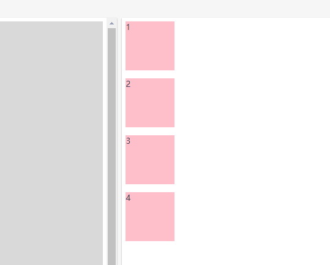


#### 属性选择器

该选择器所针对的既不是某个标签，也不是类名，或者ID，它是将一个标签的属性作为选择器来使用，最常用的地方就是涉及到属性多而杂的表单元素。其语法形式为：

```css
[attr] {
    ....
}
```

该选择器的定义方式如下：

- `[attr] {…}`：用于选取带有指定属性的元素 *
- `[attr  = val] {…}`：用于选取带有指定属性和值的元素 *
- `[attr ~= val] {…}`：用于选取属性值中包含指定词汇的元素
- `[attr |= val] {…}`：用于选取带有以指定值开头的属性值的元素，该值必须是整个单词
- `[attr ^= val] {…}`：匹配属性值以指定值开头的每个元素
- `[attr $= val] {…}`：匹配属性值以指定值结尾的每个元素
- `[attr *= val] {…}`：匹配属性值中包含指定值的每个元素

[^ 提示]:attr 表示属性名；val 表示属性值；


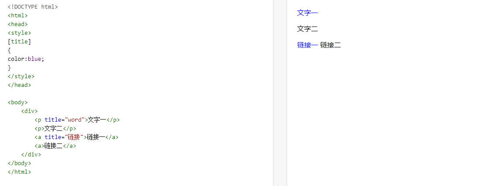


### 二、高级选择器

CSS高级选择器区别于CSS普通选择器，它并非是通过HTML页面标签中一些可见的因素进行选择（如标签名，属性名、值，同级关系，嵌套结构等），也不是对一些简单的操作条件进行选择（如鼠标悬浮，鼠标点击，输入框获得焦点等），而是对标签元素的结构、标签元素的索引、标签元素的状态等一些更为复杂的条件下进行的选择，甚至能改变现有标签的状态结构。

很多CSS高级选择器都是在CSS3标准后诞生的，它们出现一方面让标签的选择更加的简便精准，一方面又让HTML的DOM结构更加清晰，顺应了标签结构语义化，可读性更强的趋势，同时也使得搜索引擎能更好的检索到我们所开发的网站（SEO）。能正确灵活地运用CSS的高级选择器，不仅能让我们开发的网站功能更加地强大，表现更加地“绚丽”，还能更大程度地增加用户的体验度，让我们开发的网站在用户心目中留下一个深刻的好印象。


#### 状态

伪类选择器和其它选择器有所不同，它是通过触发一定的事件来实现效果，也就是说如果不进行任何操作是看不到该选择器的CSS样式设置的。以Google Chrome浏览器开发者工具为例，要想看到所设置的伪类选择器样式需通过：点击 **Element** 选项栏下 **Style** 选项栏中的  **:hov** 按钮，然后勾选需要查看的操作事件进行样式查看。目前支持的操作事件有，“hover”, “active”，“visited”和“focus”:

- :hover  -> 鼠标悬浮于该元素上设置的样式
- :active  -> 鼠标点击时该元素上设置的样式
- :visited -> 鼠标点击后（**选择器为已被访问的链接设置样式**）该元素上设置的样式（了解）
- :focus   -> 表单元素获得焦点后设置的样式


#### 伪元素

##### ::first-letter选择器 

:first-letter选择器用来指定元素第一个字母的样式，**只能与块级元素关联。**

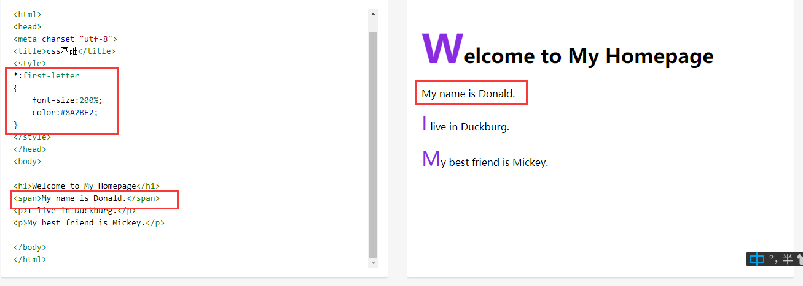


##### ::first-line选择器

:first-line选择器选择“块级元素”文本段落中的首行文本，**只能对“块级元素”生效。**

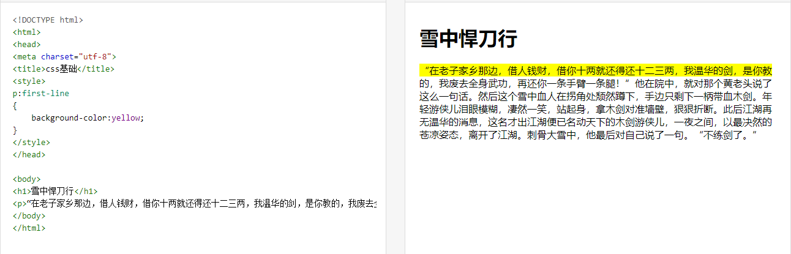


##### ::before选择器

:before在指定的选择器之前插入一段内容。插入的内容**默认为“行内元素”**，可以通过“display”强制转换显示类型。

[^ tips]: 两种不同的写法、根据需求来考虑。

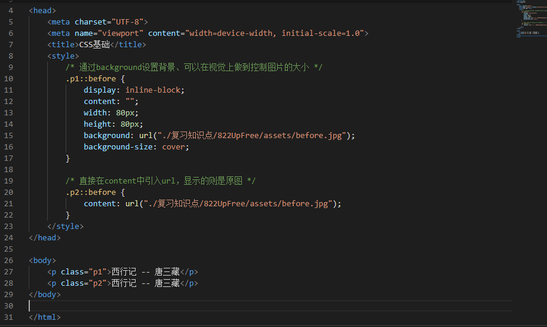

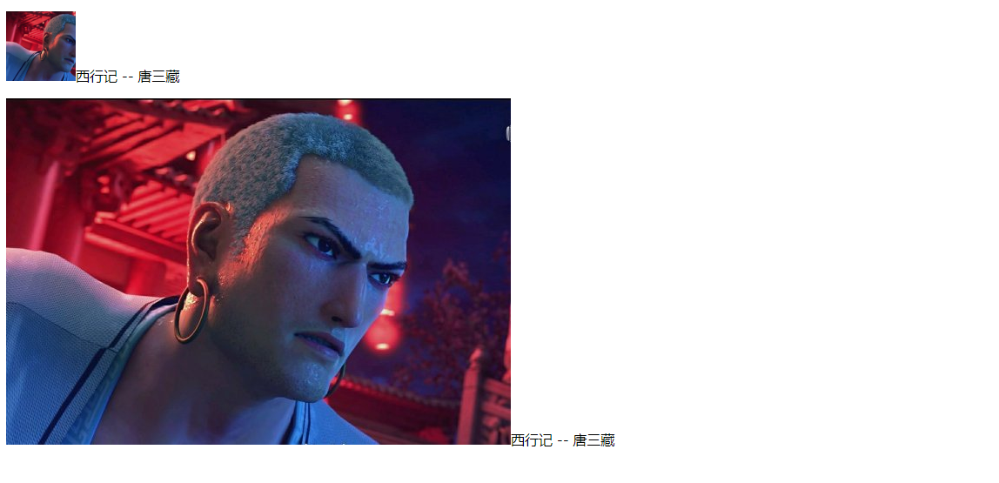

##### ::after选择器

在指定的选择器之后插入一段内容，使用方式和“::before”一样。插入的内容默认也是为“行内元素”，同样可以通过“display”强制装换显示类型。

[^ tips]: 如果需要插入文本字符串，则直接将字符串赋值给 `content` 属性，如：`content: 'Hello, world!'

使用“::before”和“::after”伪元素选择器不仅能为指定的元素添加文字、图片和各种利用“width”、“height”、“border”制作出来的形状，甚至还能添加音频、视频这些多媒体文件，而且具有高度自定义性。


##### ::selection

::selection选择器匹配元素中被用户选中或处于高亮状态的部分。

::selection只可以应用于少数的CSS属性：color, background, cursor,和outline。

```html
<!DOCTYPE html>
<html lang="en">
<head>
  <meta charset="UTF-8">
  <meta name="viewport" content="width=device-width, initial-scale=1.0">
  <title>Document</title>
  <style>
    ::selection {
      color: pink;
    }
  </style>
</head>
<body>
  <h1>选择一些文本试试。</h1>
  <p>选中文本，这部分文本会高亮哦。</p>
</body>
</html>
```


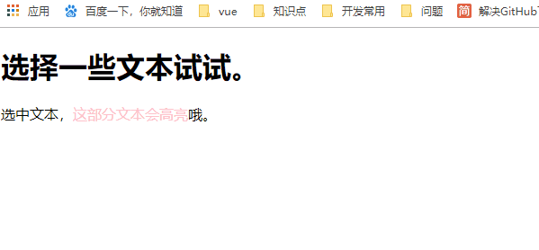

##### ::input-placeholder

设置表单占位符的样式。

```html
<!DOCTYPE html>
<html lang="en">

<head>
  <meta charset="UTF-8">
  <meta name="viewport" content="width=device-width, initial-scale=1.0">
  <title>Document</title>
  <style>
    .input1::placeholder {
      color: red;
    }
  </style>
</head>

<body>
  <input type="text" placeholder="占位符" />
  <input type="text" placeholder="占位符" class="input1" />

</body>

</html>
```


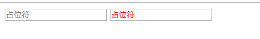


##### ::-webkit-scrollbar

::-webkit-scrollbar CSS伪类选择器影响了一个元素的滚动条的样式。

[^ tips]: `::-webkit-scrollbar` 仅仅在支持[WebKit](https://webkit.org/)的浏览器 (例如, 谷歌Chrome, 苹果Safari)可以使用.

你可以使用以下伪元素选择器去修改各式webkit浏览器的滚动条样式:

- `::-webkit-scrollbar` — 整个滚动条.
- `::-webkit-scrollbar-button` — 滚动条上的按钮 (上下箭头).
- `::-webkit-scrollbar-thumb` — 滚动条上的滚动滑块.
- `::-webkit-scrollbar-track` — 滚动条轨道.
- `::-webkit-scrollbar-track-piece` — 滚动条没有滑块的轨道部分.
- `::-webkit-scrollbar-corner` — 当同时有垂直滚动条和水平滚动条时交汇的部分.
- `::-webkit-resizer` — 某些元素的corner部分的部分样式(例:textarea的可拖动按钮).


**参考** MDN : <a>https://developer.mozilla.org/zh-CN/docs/Web/CSS/::-webkit-scrollbar</a>


#### 结构化伪类选择器

结构化伪类选择器是基于DOM元素在DOM树中的结构特性(跟父节点或者兄弟节点的关系)进行匹配选择，比如某个元素的第一个子节点，最后一个节点等等。


### 三、优先级

- !important
- 内联样式
- ID选择器 
- 类选择器/属性选择器/伪类选择器
- 元素选择器/关系选择器/伪元素选择器
- 通配符选择器


### 四、:after和::after的区别

- 在实际的开发工作中，我们会看到有人把伪元素写成`:after`，这实际是 CSS2 与 CSS3新旧标准的规定不同而导致的。

  CSS2 中的伪元素使用1个冒号，在 CSS3 中，为了区分伪类和伪元素，规定伪元素使用2个冒号。所以，对于 CSS2 标准的老伪元素，比如`:first-line`，`:first-letter`，`:before`，`:after`，写一个冒号浏览器也能识别，但对于 CSS3 标准的新伪元素，比如::selection，就必须写2个冒号了。


### 五、伪元素和伪类的区别

其中伪类和伪元素的根本区别在于：**它们是否创造了新的元素。**


伪元素/伪对象：不存在在DOM文档中，是虚拟的元素，是创建新元素。代表某个元素的子元素，这个子元素		虽然在逻辑上存在，但却并不实际存在于文档树中。

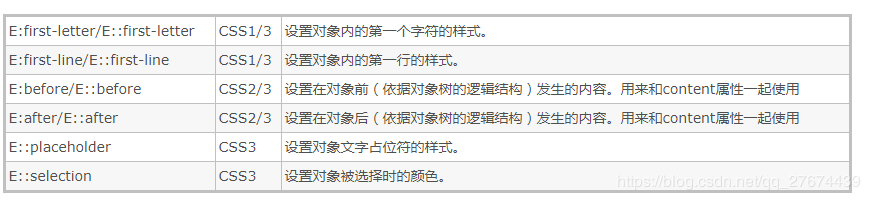


伪类：存在DOM文档中，逻辑上存在但在文档树中却无须标识的“幽灵”分类。

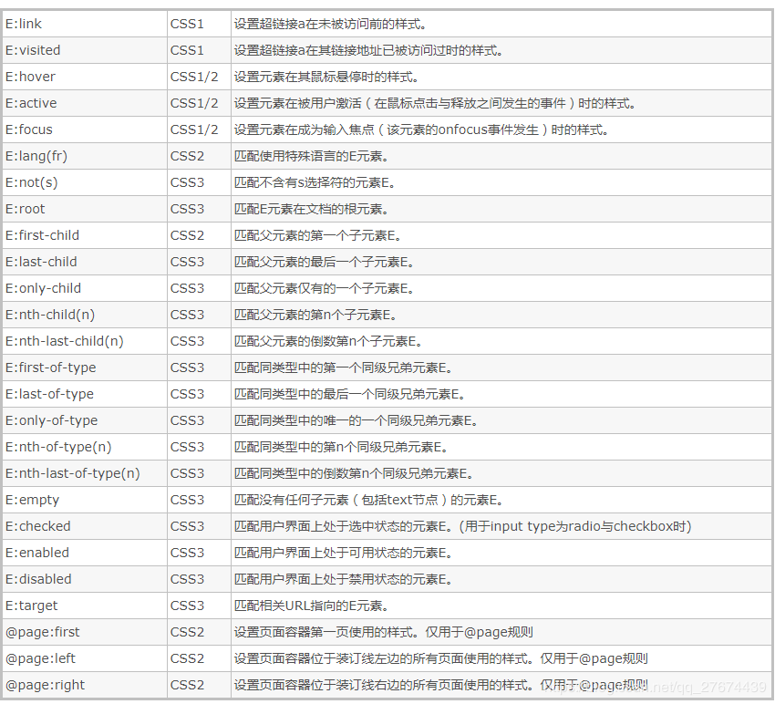


参考 <a>https://blog.csdn.net/qq_27674439/article/details/90608220</a></a>