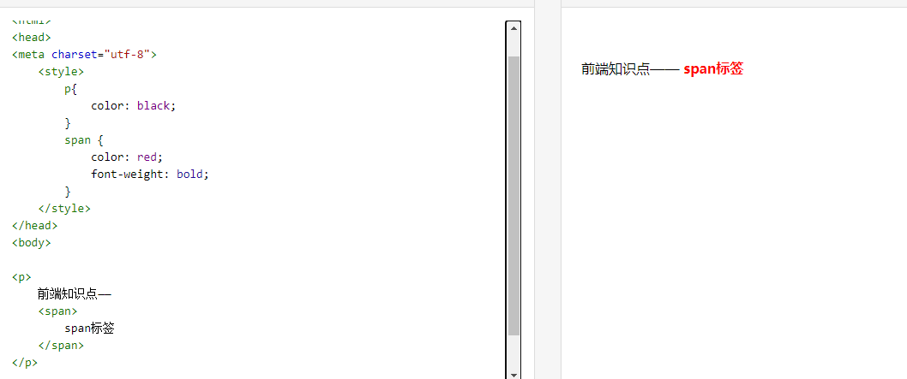

## 常见标签

### a标签

a标签：超链接，即可以进行页面的跳转。

也可以做：锚点、下载的操作。

<a href="https://github.com/Dwill-chen">超链接、我的github</a>

```html
<a href="https://github.com/Dwill-chen">超链接、我的github</a>
```

**伪类**：给元素添加特殊的效果，如：

- `:link`：未访问过的链接，其初始时的，如颜色。
- `:visited`：访问过后的。

- `:hover`：鼠标移入（悬停）时。
- `:active`：鼠标按下不动时。

```css
a:link {
    color: black;
}
a:visited {
    color: yellow;
}
a:hover {
    color: pink;
}
a:active {
    color: red;
}
```

**注意：**

四个伪类的书写顺序一定要正确，否则浏览器可能不会显示预期的结果。

顺序：L V H A（记忆：买了一个LV，HAHA大笑）。


**为什么必须得按顺序呢？**

首先注意关键的两点：

特指度（specificity）： 特指度表示一个css选择器表达式的重要程度。

​	1.这4个伪类特指度相同。

​	2.一个链接可能同时处于多种状态，即同时属于多个伪类。3.link和visited是常态效果，hover和active是瞬时效果。

　　未点击链接前，link伪类长期处于激活状态，鼠标悬停（或点击）时，<a>链接同时处于link和hover(或active)状态，由于它们特指度相同，在同时激活的情况下，后出现的伪类样式会覆盖前面的伪类样式，故link状态必须写在hover(或active)之前。

　　再讨论hover和active的顺序，若把hover放在active后面，当点击链接一瞬，实际你在激活active状态的同时触发了hover伪类,hover在后面覆盖了active的颜色，所以无法看到active的颜色。故hover在active之前

　　其次，若把visited放在hover后面，那已访问过的链接一直触发着visited伪类，会覆盖hover样式。

　　最后，其实link、visited两个伪类之间顺序无所谓。（因为它俩不可能同时触发，即又未访问同时又已访问。）


### span标签

`<span>`用于对文档中的行内元素进行组合，没有固定的格式表现。即区分样式。




### header

`<header></header>`页眉

- 主要用于页面的头部的信息介绍，也可用于板块头部。


### nav

`<nav></nav>`导航（包含链接的一个列表）

```html
<nav>
    <a href="#">链接</a>
    <a href="#">链接</a>
</nav>
```


### footer

`<footer></footer>`页脚

- 页面的底部，或者板块的底部。


### section

`<section></section>`页面上的板块

- 用于划分页面上的不同区域，或者划分文章里不同的节。


### article

`<article></article>`标签定义外部的内容。

- 用来在页面中表示一套结构完整独立的内容部分。

- 外部内容可以是来自一个外部的新闻提供者的一篇新的文章，或者来自 blog 的文本，或者是来自论坛的文本。亦或是来自其他外部源内容。

- <article>标签中的内容是独立的、完整的、摘自外部的内容。它可以是博客文章、新闻文章、论坛帖子、网友评论等独立的内容。<article>标签中的内容通常有它自己的标题，甚至有时候还有自己的脚注。它可以嵌套使用，但是一般需要外部内容和内部内容有关系。比如：一篇博客文章，它的评论就可以使用嵌套的形式，将评论内容嵌套在整体内容中。

- **说明**：<article>标签中的内容经常包含<h1>、<header>、<footer>等标签


### aside

`<aside></aside>` 2. 9:20

