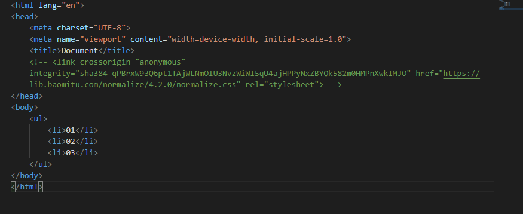
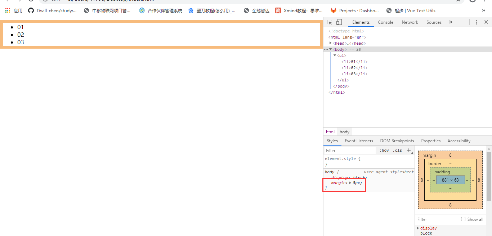
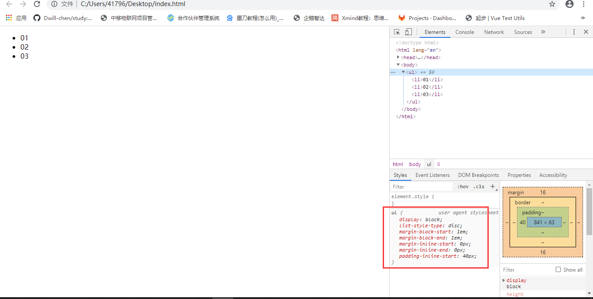
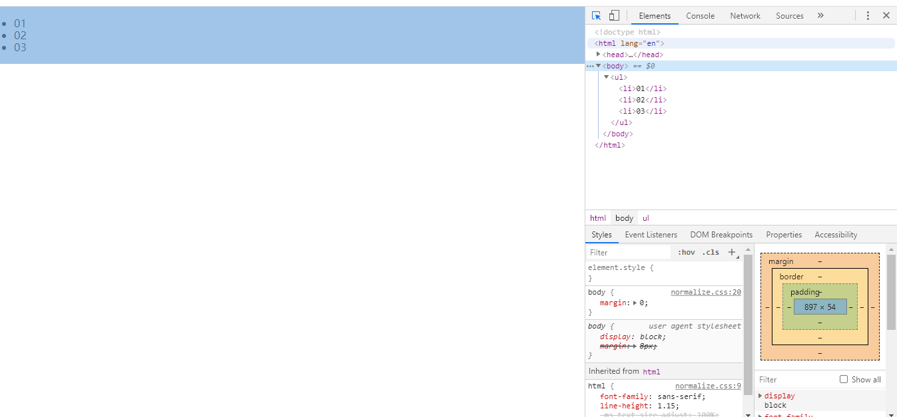
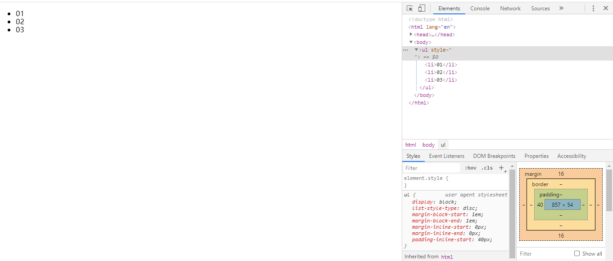

## 标签样式初始化

### css reset原则：

- 但凡是浏览器默认的样式，都不要使用。

- **因为**：每个浏览器下标签的默认样式可能会出现不一致的情况。

- **解决**：人为的将所有样式全部统一（清除），再根据实际情况（设计稿、原型图）进行设置。

  ​	

### 哪些样式是需要重置的？

- 与盒模型相关的样式：border、margin、padding。
- 标签特有的样式：ul>li、ol>li、a。


### 人为书写原则

- 用到什么标签就清除所用标签的默认样式。

- 建议不要直接将所有标签全部加上。（因为有些标签从始至终可能都用不上）

- 不要将所有标签全部设置成一致的reset，需根据标签默认样式特征，来进行分类设置。比如：h标签只有margin、ul标签有margin和padding、以及list-style。

  **list-style是一个复合的属性**

  **list-style-type只是其中的一项**

  语法：

  list-style: list-style-type, list-style-position, list-style-image.

```css
h1, h2, h3, h4, h5, h6, p {
    margin: 0;
}
ul, ol {
    margin: 0;
    padding: 0;
    list-style: none;
}
```

```css
ul 
{
	list-style:square inside url("xx.png");
}
```


### Normalize.css

Normalize.css 是一个可以定制的CSS文件，它让不同的浏览器在渲染网页元素的时候形式更统一。

**Normalize.css 能干什么：**

- **保留有用的默认值**，不同于许多 CSS 的重置
- 标准化的样式，适用范围广的元素。
- 纠正错误和常见的浏览器的不一致性。
- 一些细微的改进，提高了易用性。
- 使用详细的注释来解释代码。

**支持的浏览器：**

- Google Chrome (latest)
- Mozilla Firefox (latest)
- Mozilla Firefox ESR
- Opera (latest)
- Apple Safari 6+
- Internet Explorer 8+


**Normalize.css的github地址：** <a> https://github.com/necolas/normalize.css</a>

[^注意]: Normalize 保留有用的默认值，而不是清除样式

- 没有使用Normalize时：

  






- 使用Normalize：







[^tips]:可以发现，使用后，样式确实有改变，但是，保留了默认样式，而没有清除样式，比如ul的padding还保留在。


### reset.css

每个浏览器都有一些自带的或者共有的默认样式，或造成一些布局上的困扰，css reset的作用就是重置这些默认样式，使样式表现一致。

[^ 参考]: https://meyerweb.com/eric/tools/css/reset/

```CSS
/* http://meyerweb.com/eric/tools/css/reset/ 
   v2.0 | 20110126
   License: none (public domain)
*/

html, body, div, span, applet, object, iframe,
h1, h2, h3, h4, h5, h6, p, blockquote, pre,
a, abbr, acronym, address, big, cite, code,
del, dfn, em, img, ins, kbd, q, s, samp,
small, strike, strong, sub, sup, tt, var,
b, u, i, center,
dl, dt, dd, ol, ul, li,
fieldset, form, label, legend,
table, caption, tbody, tfoot, thead, tr, th, td,
article, aside, canvas, details, embed, 
figure, figcaption, footer, header, hgroup, 
menu, nav, output, ruby, section, summary,
time, mark, audio, video {
	margin: 0;
	padding: 0;
	border: 0;
	font-size: 100%;
	font: inherit;
	vertical-align: baseline;
}
/* HTML5 display-role reset for older browsers */
article, aside, details, figcaption, figure, 
footer, header, hgroup, menu, nav, section {
	display: block;
}
body {
	line-height: 1;
}
ol, ul {
	list-style: none;
}
blockquote, q {
	quotes: none;
}
blockquote:before, blockquote:after,
q:before, q:after {
	content: '';
	content: none;
}
table {
	border-collapse: collapse;
	border-spacing: 0;
}
```

