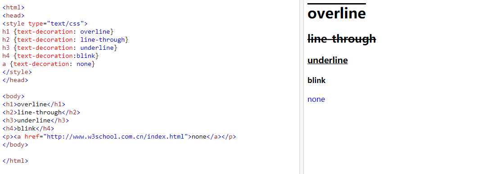
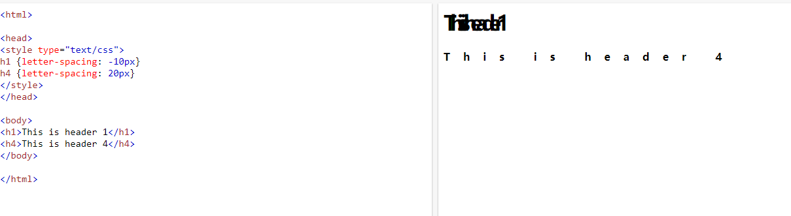
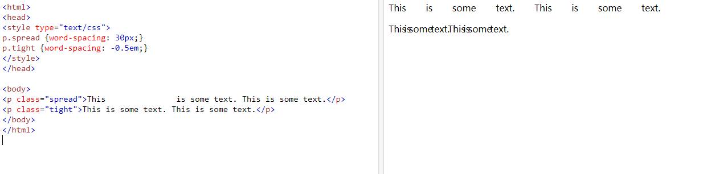

## 文本设置

### 文字颜色：color

```css
div {
    color: pink;
}
```


### 文本对齐方式：text-align

1. 默认： 左对齐
2. left： 左对齐
3. right：右对齐
4. center： 居中


### 首行缩进：text-indent

1. 如明确字体大小，font-size：16px，缩进2格，即text-index：32px；

   ```css
   div {
       font-size: 16px;
       text-indent: 32px;
   }
   ```

2. 不明确字体大小、或者字体大小发生变化，使用px会造成排版错位，这时应该使用em，em是根据字体大小来计算的，1em = 当前字体大小。

```css
div {
    font-size: 16px;
    text-indent: 2em;
}
```


### 文本修饰：text-decoration

1. 下划线：underline
2. 没有： none
3. 默认：也是none
4. overline：与underline相反，文本上方的一条线
5. line-through：穿过文本的一条线
6. blink：定义闪烁的文本。由于IE、Chrome 或 Safari 均不支持 "blink" 属性值，即现在的主流的浏览器均不支持该属性值，如果想继续使用该属性的话，建议尝试使用低版本的火狐浏览器。因为该标记目前的主流浏览器均不支持，所以也就没有任何实质性的使用价值和意义了，不建议使用。




### 字母间距：letter-spacing

中文、英文、字符，都会生效。可以为负值。




### 单词间距（以空格为解析单位）

多个空格并不会重复计算。

也可以为负值。




### 强制不换行：white-space

回车是换行符

1. 默认：正常的换行，normal。
2. 不换行：nowrap。文本不会换行，文本会在在同一行上继续，直到遇到 `<br>` 标签为止。
3. pre：空白会被浏览器保留。其行为方式类似 HTML 中的 `<pre>` 标签。
4. pre-wrap：保留空白符序列，但是正常地进行换行。
5. pre-line：合并空白符序列，但是保留换行符。


### 测量文字大小

测量文字大小的时候，最好是使用从上到下的方式去测量，因为文字的设计师，在设计文字的时候，右侧会保留1px的空隙，如果默认16px，会发现文字可能是15px * 16px大小。


### 一个空格有多大？

从文字大小可得知，文字右侧有间隙，因此，空格大小，应该从间隙的右侧到下一个文字的左侧。

可以得出：

1. 空格的大小：当前文字的一半（宋体）。
2. 但是我们把字体格式切换为其他字体，会发现不满足该结论。
3. 因此，空格大小，在宋体的情况下，是文字的一半。

