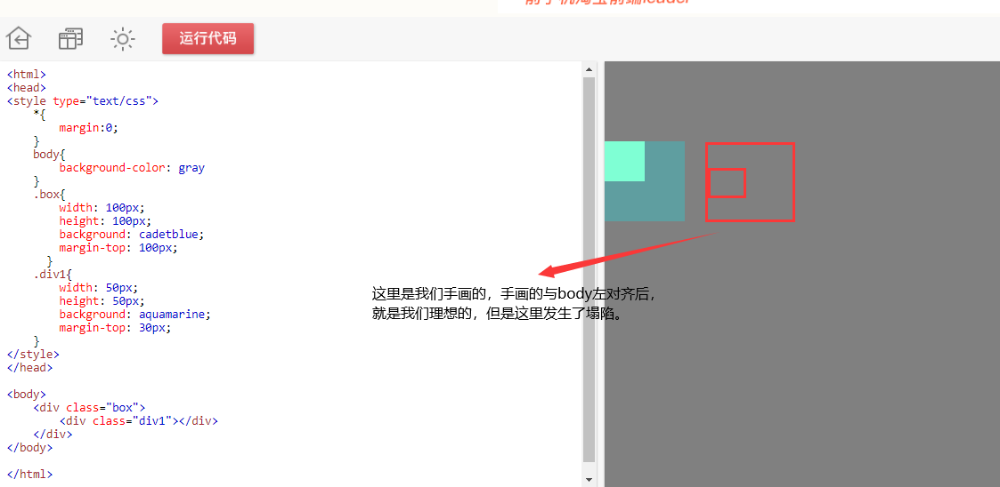

## 盒模型

### 常见样式-padding

padding 内边距

1. padding-top 上边内边距
2. padding-right 右边内边距
3. padding-bottom 下边内边距
4. padding-left 左边内边距

padding是内填充，默认的情况下，设置padding后，会撑大容器的大小。

#### 复合样式

- 只有一个属性值的时候：padding：10px；

  4个方向都是同一个值

- 有4个属性值的时候：padding：top right bottom left；

  顺序是顺时针方向，**`上右下左`**的顺序，分别对应4个方向。

- 设置2个属性值的时候：padding：10px 50px；

  第一个属性值设置的是**`上下`**，第二个属性值设置的是**`左右`**

- 设置3个属性值的时候：padding：10px 20px 50px；

  第一个属性值设置的是**`上`**

  第二个属性值设置的是**`左右`**

  第三个属性值设置的是**`下`**

  

### 常见样式-margin

margin 外边距

1. margin -top 上边外边距
2. margin -right 右边外边距
3. margin -bottom 下边外边距
4. margin -left 左边外边距

margin是标签与标签之间的间隔，不会撑开容器大小。

#### margin的问题

##### 1. margin-top传递的问题

如下图：

   

会发现：div1设置了margin-top，但是仍然和box盒子之间没有间距，但是box盒子的top却产生了一个间距。

**原理**

一个盒子（代码中的**`box`**）如果**没有上补白**(padding-top)和**上边框**(border-top)，那么这个盒子（**box**）的上边距会和其内部文档流中的第一个子元素（**div1**）的**上边距**重叠。

**解决办法：
**1.修改父元素的高度，增添padding-top样式模拟（常用）；
2.为父元素添加overflow:hidden;样式即可（完美）；
5.为父元素或者子元素声明浮动（可用）；
3.为父元素添加border（可用）;
4.添加额外的元素放在子元素最前面，设置高度为1px，overflow:hidden(若为行内元素，需要声明为块元素)（啰嗦）;
6.为父元素或者子元素声明绝对定位（……）

##### 2. margin的上下塌陷问题（叠压）

如下图：

会发现：div1有一个margin-bottom：100px，div2有一个margin-top：100px；

但是他们之间的间距却还是100px，而不是相加的200px。

**原理：**

在**标准文档流**中，**竖直**方向的margin会出现叠加现象（**水平方向不会塌陷**），两个margin紧挨着，**中间没有border或者padding**。
margin直接接触，就产生了合并。
**表现为较大的margin会覆盖掉较小的margin**，竖直方向的两个盒子中间只有一个较大的margin，这就是margin塌陷现象。

##### magin塌陷的分类

- 兄弟关系的盒子

  如上面，就是兄弟关系的塌陷。

- 父子关系的盒子，如下图：

  

**解决方案**

- 给父元素添加透明边框，至少添加`border-top:1px solid transparent`
- 给父元素添加`padding-top:npx`
- 给父元素添加`overflow:hidden`
- 给父元素添加`position: absolute;`
- 给父元素添加`position: fixed;`
- 给父元素添加`display: inline-block`;

### 盒模型

- 盒子大小 = border + padding + width/height

- 盒子宽度 = 左border + 左padding + width + 右padding + 右border

- 盒子高度 = 上boder + 上padding + height + 下padding + 下border

  