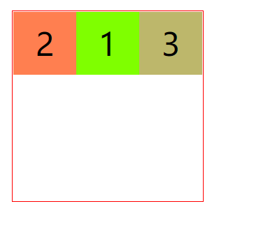
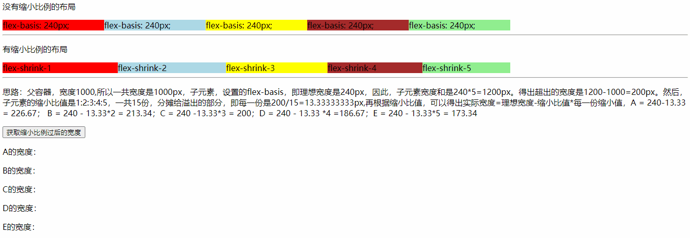

## Flex布局

网页布局（layout）是CSS的一个重点应用。


布局的传统解决方案，基于[盒状模型](https://developer.mozilla.org/en-US/docs/Web/CSS/box_model)，依赖 [display](https://developer.mozilla.org/en-US/docs/Web/CSS/display)属性 + [position](https://developer.mozilla.org/en-US/docs/Web/CSS/position)属性 + [float](https://developer.mozilla.org/en-US/docs/Web/CSS/float)属性。它对于那些特殊布局非常不方便，比如，[垂直居中](https://css-tricks.com/centering-css-complete-guide/)就不容易实现。


2009年，W3C提出了一种新的方案—-Flex布局，可以简便、完整、响应式地实现各种页面布局。目前，它已经得到了所有浏览器的支持，这意味着，现在就能很安全地使用这项功能。


Flex布局将成为未来布局的首选方案。本文介绍Flex布局的语法。


### 1、什么是Flex布局

Flex是Flexible Box的缩写，意为”弹性布局”，用来为盒状模型提供最大的灵活性。

任何一个容器都可以指定为Flex布局。

Flex是Flexible Box的缩写，意为”弹性布局”，用来为盒状模型提供最大的灵活性。

**任何一个容器都可以指定为Flex布局**。

```
.box{
  display: flex;
}
```

行内元素也可以使用Flex布局。

```
.box{
  display: inline-flex;
}
```

Webkit内核的浏览器，必须加上-webkit前缀。

```
.box{
  display: -webkit-flex; /* Safari */
  display: flex;
}
```

[^ tips]: 设为Flex布局以后，子元素的float、clear和vertical-align属性将失效。


### 2、基本概念

采用Flex布局的元素，称为Flex容器（flex container），简称”容器”。它的所有子元素自动成为容器成员，称为Flex项目（flex item），简称”项目”。


容器默认存在两根轴：水平的主轴（main axis）和垂直的交叉轴（cross axis）。主轴的开始位置（与边框的交叉点）叫做main start，结束位置叫做main end；交叉轴的开始位置叫做cross start，结束位置叫做cross end。

项目默认沿主轴排列。单个项目占据的主轴空间叫做main size，占据的交叉轴空间叫做cross size。


### 3、容器的属性

以下6个属性设置在容器上。

- flex-direction
- flex-wrap
- flex-flow
- justify-content
- align-items
- align-content


#### 3.1 flex-direction

flex-direction属性决定主轴的方向（即项目的排列方向）。

```html
.box {
  flex-direction: row | row-reverse | column | column-reverse;
}
```


它可能有4个值

- row（默认值）：主轴为水平方向，起点在左端。		**→**
- row-reverse：主轴为水平方向，起点在右端。             **←**
- column：主轴为垂直方向，起点在上沿。                      **↓**
- column-reverse：主轴为垂直方向，起点在下沿。       **↑**


#### 3.2 flex-wrap

默认情况下，项目都排在一条线（又称”轴线”）上。flex-wrap属性定义，如果一条轴线排不下，**如何换行**。


```
.box{
  flex-wrap: nowrap | wrap | wrap-reverse;
}
```

它可能取三个值：

- nowrap（默认）：不换行。
- wrap：换行，第一行在上方。
- wrap-reverse：换行，第一行在下方。


#### 3.3 flex-flow

flex-flow属性是flex-direction属性和flex-wrap属性的简写形式，默认值为row nowrap。

```
.box {
  flex-flow: <flex-direction> <flex-wrap>;
}
```


#### 3.4 justify-content

justify-content属性定义了项目在 **主轴** 上的对齐方式。

```
.box {
  justify-content: flex-start | flex-end | center | space-between | space-around;
}
```


它可能取5个值，具体对齐方式与**轴的方向**有关。下面假设**主轴为从左到右**。

- flex-start（默认值）：左对齐
- flex-end：右对齐
- center： 居中
- space-between：两端对齐，项目之间的间隔都相等。
- space-around：每个项目两侧的间隔相等。所以，**项目之间的间隔比项目与边框的间隔大一倍**。


#### 3.5 align-items

align-items属性定义项目在交叉轴上如何对齐。

```
.box {
  align-items: flex-start | flex-end | center | baseline | stretch;
}
```


它可能取5个值。具体的对齐方式与**交叉轴的方向**有关，下面假设**交叉轴从上到下**。

- flex-start：交叉轴的起点对齐。
- flex-end：交叉轴的终点对齐。
- center：交叉轴的中点对齐。
- baseline: 项目的第一行文字的基线对齐。
- stretch（默认值）：如果项目未设置高度或设为auto，将占满整个容器的高度。


#### 3.6 align-content

align-content属性定义了多根轴线的对齐方式。如果项目只有一根轴线，该属性不起作用。

```
.box {
  align-content: flex-start | flex-end | center | space-between | space-around | stretch;
}
```


该属性可能取6个值。

- flex-start：与交叉轴的起点对齐。
- flex-end：与交叉轴的终点对齐。
- center：与交叉轴的中点对齐。
- space-between：与交叉轴两端对齐，轴线之间的间隔平均分布。
- space-around：每根轴线两侧的间隔都相等。所以，轴线之间的间隔比轴线与边框的间隔大一倍。
- stretch（默认值）：轴线占满整个交叉轴。


### 4、项目的属性

以下6个属性设置在项目上。

- order
- flex-grow
- flex-shrink
- flex-basis
- flex
- align-self


#### 4.1 order

order属性定义项目的排列顺序。数值越小，排列越靠前，默认为0。

```
.item {
  order: <integer>;
}
```


```html
<!DOCTYPE html>
<html lang="en">
<head>
    <meta charset="UTF-8">
    <meta name="viewport" content="width=device-width, initial-scale=1.0">
    <title>Document</title>
    <style>
        .box{
            width: 300px;
            height: 300px;
            border: 2px solid red;
            display: flex;
        }
        .box div{
            width: 100px;
            height: 100px;
            background-color: chartreuse;
            font-size: 50px;
            text-align: center;
            line-height: 100px;
            /* 可以设置元素的三个样式(弹性盒的三个状态)  增长（flex-grow） 缩减(flex-shrink) 基础(静止时弹簧的长度 flex-base) */
            flex:1 0 auto;
            /* order 决定弹性元素的排列顺序，数字越小，越靠前 */
            order: 1
        }
        .box div:nth-child(2){
            background-color: coral;
            order:0;
        }
        .box div:nth-child(3){
            background-color: darkkhaki;
            order:5;
        }
    </style>
</head>
<body>
    <div class="box">
        <div class="box1">1</div>
        <div class="box2">2</div>
        <div class="box3">3</div>
    </div>
</body>
</html>

```



#### 4.2 flex-grow

flex-grow属性定义项目的放大比例，默认为0，即如果存在剩余空间，也不放大。

```
.item {
  flex-grow: <number>; /* default 0 */
}
```


如果所有项目的flex-grow属性都为1，则它们将等分剩余空间（如果有的话）。如果一个项目的flex-grow属性为2，其他项目都为1，则前者占据的剩余空间将比其他项多一倍。


#### 4.3 flex-shrink

flex-shrink属性定义了项目的缩小比例，默认为1，即如果空间不足，该项目将缩小。

```
.item {
  flex-shrink: <number>; /* default 1 */
}
```


如果所有项目的flex-shrink属性都为1，当空间不足时，都将等比例缩小。如果一个项目的flex-shrink属性为0，其他项目都为1，则空间不足时，前者不缩小。

负值对该属性无效。

**flex-basis**表示在flex items 被放入flex容器之前的大小，也就是items的理想或者假设大小，但是并不是其真实大小，其真实大小取决于flex容器的宽度

[^ tips]: 该属性，不是单纯的收缩比值，是子元素的空间和值，与父元素的空间值比较，如果超出了，才会计算，且超出的部分，是按这个属性来比例分摊，再对应的减去分摊下来的值。

例子：

```html
<!DOCTYPE html>
<html lang="en">

<head>
    <meta charset="UTF-8">
    <meta name="viewport" content="width=device-width, initial-scale=1.0">
    <style>
        .content {
            display: flex;
            width: 1000px;
        }
        .content div {
            flex-basis: 240px;
        }
        .box1 {
            flex-shrink: 1;
        }
        .box2 {
            flex-shrink: 2;
        }
        .box3 {
            flex-shrink: 3;
        }
        .box4 {
            flex-shrink: 4;
        }
        .box5 {
            flex-shrink: 5;
        }
    </style>
</head>

<body>
    <p>没有缩小比例的布局</p>
    <div class="content">
        <div style="background-color:red;">flex-basis: 240px;</div>
        <div style="background-color:lightblue;">flex-basis: 240px;</div>
        <div style="background-color:yellow;">flex-basis: 240px;</div>
        <div style="background-color:brown;">flex-basis: 240px;</div>
        <div style="background-color:lightgreen;">flex-basis: 240px;</div>
    </div>
    <hr>
    <p>有缩小比例的布局</p>
    <div class="content">
        <div class="box1 box" style="background-color:red;">flex-shrink-1</div>
        <div class="box2 box" style="background-color:lightblue;">flex-shrink-2</div>
        <div class="box3 box" style="background-color:yellow;">flex-shrink-3</div>
        <div class="box4 box" style="background-color:brown;">flex-shrink-4</div>
        <div class="box5 box" style="background-color:lightgreen;">flex-shrink-5</div>
    </div>
    <hr>
    <p>思路：父容器，宽度1000,所以一共宽度是1000px，子元素，设置的flex-basis，即理想宽度是240px，因此，子元素宽度和是240*5=1200px。得出超出的宽度是1200-1000=200px。然后，子元素的缩小比值是1:2:3:4:5，一共15份，分摊给溢出的部分，即每一份是200/15=13.33333333px,再根据缩小比值，可以得出实际宽度=理想宽度-缩小比值*每一份缩小值，A = 240-13.33 = 226.67； B = 240 - 13.33*2 = 213.34；C = 240 -13.33*3 = 200；D = 240 - 13.33 *4 =186.67；E = 240 - 13.33*5 = 173.34</p>
    <input type="button" value="获取缩小比例过后的宽度" onclick="getWidth()">
    <div class="showWidth">
        <p>A的宽度：<span class="widthA"></span></p>
        <p>B的宽度：<span class="widthB"></span></p>
        <p>C的宽度：<span class="widthC"></span></p>
        <p>D的宽度：<span class="widthD"></span></p>
        <p>E的宽度：<span class="widthE"></span></p>
    </div>
    <script>
        let divArr = document.getElementsByClassName("box");
        let showWidth = document.getElementsByClassName("showWidth")[0];
        let showP = showWidth.getElementsByTagName("p");
        function getWidth() {
            for (let i = 0; i < divArr.length; i++) {
                showP[i].getElementsByTagName("span")[0].innerHTML = divArr[i].offsetWidth;
            }
        }
    </script>
</body>

</html>
```




#### 4.4 flex-basis

flex-basis属性定义了在分配多余空间之前，项目占据的主轴空间（main size）。浏览器根据这个属性，计算主轴是否有多余空间。它的默认值为auto，即项目的本来大小。

```
.item {
  flex-basis: <length> | auto; /* default auto */
}
```

它可以设为跟width或height属性一样的值（比如350px），则项目将占据固定空间。

白话一点，也就是：

**flex-basis**表示在flex items 被放入flex容器之前的大小，也就是items的理想或者假设大小，但是并不是其真实大小，其真实大小取决于flex容器的宽度。


#### 4.5 flex

flex属性是flex-grow, flex-shrink 和 flex-basis的简写，默认值为0 1 auto。后两个属性可选。

```
.item {
  flex: none | [ <'flex-grow'> <'flex-shrink'>? || <'flex-basis'> ]
}
```

该属性有两个快捷值：auto (1 1 auto) 和 none (0 0 auto)。

建议优先使用这个属性，而不是单独写三个分离的属性，因为浏览器会推算相关值。


#### 4.6 align-self

align-self属性允许单个项目有与其他项目不一样的对齐方式，可覆盖align-items属性。默认值为auto，表示继承父元素的align-items属性，如果没有父元素，则等同于stretch。

```
.item {
  align-self: auto | flex-start | flex-end | center | baseline | stretch;
}
```


该属性可能取6个值，除了auto，其他都与align-items属性完全一致。