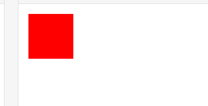

## 概述

在CSS中用于设置过渡特效的属性是 `transition`，该属性允许CSS的属性值在一定的时间区间内平滑地过渡，这就拜托了我们在CSS3版本标准之前对“JavaScript”和“Flash”的依赖，使页面的性能得以提升。这种效果可以在鼠标悬浮（:hover）、鼠标单击（:active）、表单元素获得焦点（:focus）或对元素任何改变以及在JavaScript中某些事件执行后触发，并圆滑（若不对时间曲线进行特殊设置）地以动画效果改变CSS的属性值。

**过渡属性只对样式属性值为数值时有效**。如：当元素的宽度为“width:100px”变化为“width:200px”的时候过渡效果能够生效，但当元素的宽度为“width:100px”变化为“width:auto”的时候，就不会产生过渡效果了。当一个元素的字体颜色为“#f31e1d”，变化为“#2396fd”的时候过渡有效，但当它的字体颜色由“#f31e1d”变为“transparent”的时候过渡就不会产生效果了。这一点在使用中需要留意。

该属性包含多个分支属性，主要有：“过渡CSS属性名称”、“过渡执行时间”、“过渡时间速率曲线”和“过渡的延时执行”四个主要内容，接下来我们对它的各分支属性进行详细的学习。


### transition 分支属性

#### 1.transition-property

**过渡属性**，该属性是用来指定当元素其中一个属性改变时执行的过渡动画效果，该属性有三种类型的值：

- none：将过渡效果设置为“无过渡效果”，或停止当前过渡效果。
- all：为所支持的所有CSS属性在值变化时执行动画过渡效果（默认）。
- [property name]：指定一个或多个属性名称列表，以逗号“,”进行分隔，当指定的属性产生变化时，为其执行指定属性的动画过渡效果。


#### 2.transition-duration

**过渡持续时间**，该属性是用于设定一个属性的值过渡被触发开始时到结束时所需要经历的时间，单位为秒（s），如：“0.3s”或“.3s”，它的默认值为“0”，单位不能省略，否则过渡动画无法执行。


#### 3.transition-timing-function

**过渡线性规律（又称时间曲线）**，该属性允许你根据时间的推进去改变属性值的变换速率，目前它可能够设置6个类型的值：

- ease：默认值，逐渐变慢
- linear：匀速
- ease-in：加速
- ease-out：减速
- ease-in-out：先加速，后减速
- cubic-bezier([参数])：定义一个时间曲线（贝塞尔曲线），可以为其配置四个参数，前两个参数为“ `x1` ”和“ `x2` ”，定义“开始控制点”，后两个参数为“ `y1` ”和“ `y2` ”，定义“结束控制点”。而“开始点”和“结束点”是通过这两条“转换点控制轴”分别去调整两个点来实现曲线的变化的，如果对Photoshop里面的“钢笔工具”的“路径”比较熟悉的话，稍加联想应该能理解到这个时间曲线轴的改变原理，这种曲线叫做“贝塞尔曲线”。[贝塞尔曲线](https://www.jianshu.com/p/d999f090d333)


#### 4.transition-delay

**过渡延迟**，该属性规定在用户进行操作后多久开始执行动画，也就是延迟执行过渡动画的时间，单位同样是秒“s”，写法与“transition-duration”一致，默认值同样为“0”。


#### 5.transition

过渡动画组合值属性，其语法形式为：

```css
transition: property duration timing-function delay;
```


### transition 示例

#### 1.单个属性变化

下面我们设置 **宽度** 变化

```html
<!DOCTYPE html>
<html>
<head>
<meta charset="utf-8"> 
<style> 
div
{
	width:100px;
	height:100px;
	background:red;
	transition: width 0.5s linear 0s
}

div:hover
{
	width:300px;
}
</style>
</head>
<body>

	<div></div>

</body>
</html>
```




#### 2.多个属性变化 -> 单独设置

下面我们设置 **宽度** ， **圆角** 变化

```html
<!DOCTYPE html>
<html>
<head>
<meta charset="utf-8"> 
<style> 
div
{
	width:100px;
	height:100px;
	background:red;
	transition: width 0.5s linear 0s, border-radius 1s ease-in 0s;
}

div:hover
{
	width:300px;
	border-radius: 40px;
}
</style>
</head>
<body>

	<div></div>

</body>
</html>
```


#### 3.多个属性变化 -> all

```html
<!DOCTYPE html>
<html>
<head>
<meta charset="utf-8"> 
<style> 
div
{
	width:100px;
	height:100px;
	background:red;
	transition: all 0.5s linear 0s;
}

div:hover
{
	width:300px;
	border-radius: 40px;
	background-color: black;
	transform: scale(0.8);
}
</style>
</head>
<body>

	<div></div>

</body>
</html>
```


#### 4.仿3D 凸起效果

```html
<!DOCTYPE html>
<html>
<head>
<meta charset="utf-8"> 
<style> 
	body{
		background-color: rgb(245, 245, 245);
	}
	div
	{
		/*内容居中*/
		display:flex;
		justify-content: center;
		align-items: center;
		
		/*容器居中*/
		position: absolute;
		top: 0;
		right: 0;
		bottom: 0;
		left: 0;
		margin: auto;
		
		width:200px;
		height:300px;
		background:white;
		transition: all 0.5s linear 0s;
		
		/*过渡效果*/
    	transition: all .25s linear;
	}
	span{
		color: #ff0000;
		letter-spacing: 5px;
		font-size: 30px;
		font-weight: bold;
		text-shadow: 1px 1px 2px #000;

		transition: all .25s linear;
	}

	div:hover
	{
		transform: translateY(-2px);
		box-shadow: 2px 2px 10px 2px #808080;
	}
	div:hover > span {
		font-size: 35px;
	}
</style>
</head>
<body>

	<div>
		<span>凸起效果</span>
	</div>

</body>
</html>
```

