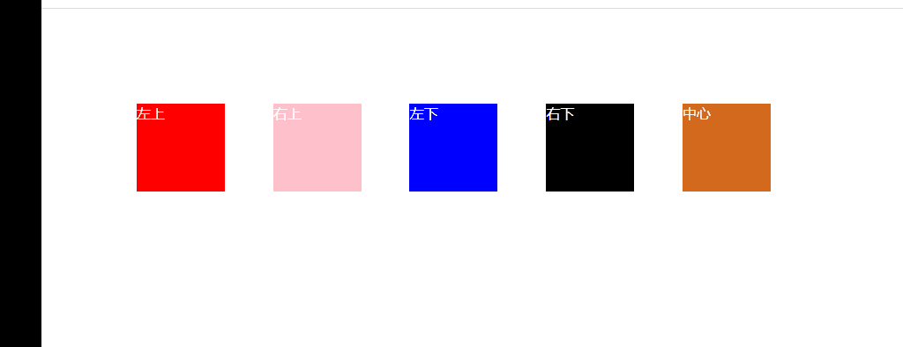

## 变形转换

### 概述

在CSS中执行变形转换的属性是CSS3属性中的 `transform`，能够执行“**位移**”、“**旋转**”、“**缩放**”、“**倾斜**”、“**翻转**”和“**透视**”等变形转换的设置，可以让Web页面的表现更加的“活跃”，增加页面的交互感，给用户留下更深的“印象”。但在用该属性进行设置时，特别是用于生产环境中时，一定要控制一个“度”，也就是说要避免“过度设计”，否则反而会让“印象”这一词有了贬义的意思。


### transform

#### 1.translate

该属性值可以让元素从当前位置根据“ `left`（X轴）”参数和“ `top`（Y轴）”参数的设置在水平和垂直方向进行移动。它和用于布局的“ `position` ”属性，特别是当它的“ `position` ”的值为“ `relative `”时十分相似，在进行移动后，自身的位置仍然保留，也不会影响到其它元素的位置，但有存在着区别：

- “translate”可以作用于已经执行了“绝对定位（position：absolute）”的元素，而要用“position”已经设置为了“绝对定位”的元素使用“相对定位（position：relative）”需要对布局进行重新计算，或修改DOM的标签嵌套方式。
- 使用“translate”可以让 GPU 参与运算，动画的 FPS 更高。
- 使用“translate”可以让动画的像素精确到浮点数，而使用“position”属性的值最小执行动画的单位是1像素。

  所以说，“position”属性是为布局而生，而“Transform”的“translate”是为动画而生。

  该属性值有一下几种类型：

- **translateX( x )**：设置元素在X轴方向的偏移
- **translateY( y )**：设置元素在Y轴方向的偏移
- **translateZ( z )**：设置元素在Z轴方向的偏移
- **translate( x, y )**：同时设置元素在X轴和Y轴方向的偏移

```html
<!DOCTYPE html>
<html lang="en">

<head>
    <meta charset="UTF-8">
    <meta name="viewport" content="width=device-width, initial-scale=1.0">
    <title>Document</title>
    <style>
        div {
            width: 100px;
            height: 100px;
            display: inline-block;
            margin-right: 50px;
            transition: all 0.5s linear 0s;
        }

        .red {
            background-color: red;
        }

        .red:hover {
            transform: translateX(20px);
        }

        .pink {
            background-color: pink;
        }

        .pink:hover {
            transform: translateY(20px);
        }

        .blue {
            background-color: blue;
        }

        .blue:hover {
            transform: translate(20px, 20px);
        }
    </style>
</head>

<body>
    <div class="red">red</div>
    <div class="pink">pink</div>
    <div class="blue">blue</div>
</body>

</html>
```


#### 2.rotate 

该属性值会让元素以当前元素的**中心(X=width/2，Y=height/2)**进行旋转（若不对“transform-origin”进行设置），旋转的角度为参数所设定的值，“正数”是顺时针，“负数”是逆时针，单位为“*deg*”。

该属性有三种类型：

- **rotateX( angle )**：设置元素在X轴方向的旋转
- **rotateY( angle )**：设置元素在Y轴方向的旋转
- **rotateZ( angle )**：设置元素在Z轴方向的旋转

```html
<!DOCTYPE html>
<html lang="en">

<head>
    <meta charset="UTF-8">
    <meta name="viewport" content="width=device-width, initial-scale=1.0">
    <title>Document</title>
    <style>
        div {
            width: 100px;
            height: 100px;
            display: inline-block;
            margin-right: 50px;
            transition: all 1s linear 0s;
        }

        .red {
            background-color: red;
        }

        .red:hover {
            transform: rotateX(360deg);
        }

        .pink {
            background-color: pink;
        }

        .pink:hover {
            transform: rotateY(360deg);
        }

        .blue {
            background-color: blue;
        }

        .blue:hover {
            transform: rotateZ(360deg);
        }
    </style>
</head>

<body>
    <div class="red">red</div>
    <div class="pink">pink</div>
    <div class="blue">blue</div>
</body>

</html>
```


#### 3.scale

该属性值会让元素以当前元素的中心进行缩放，参数的值为一个整数或浮点数，如：“1（默认）”不进行缩放，“0.8”缩小为原来的80%，“1.5”扩大到原来的150%，参数不需要单位。

该属性值有三种类型：

- **sclaeX ( x )**：设置元素在X轴方向的缩放
- **sclaeY ( y )**：设置元素在Y轴方向的缩放
- **sclae ( x, y )**：设置元素在X轴及Y轴方向的缩放

```html
<!DOCTYPE html>
<html lang="en">

<head>
    <meta charset="UTF-8">
    <meta name="viewport" content="width=device-width, initial-scale=1.0">
    <title>Document</title>
    <style>
        body {
            padding-top: 100px;
            padding-left: 100px;
        }
        div {
            width: 100px;
            height: 100px;
            display: inline-block;
            margin-right: 50px;
            transition: all .5s linear 0s;
        }

        .red {
            background-color: red;
        }

        .red:hover {
            transform: scaleX(0.5);
        }

        .pink {
            background-color: pink;
        }

        .pink:hover {
            transform: scaleY(1.5);
        }

        .blue {
            background-color: blue;
        }

        .blue:hover {
            transform: scale(1.2, 1.2);
        }
    </style>
</head>

<body>
    <div class="red">red</div>
    <div class="pink">pink</div>
    <div class="blue">blue</div>
</body>

</html>
```


#### 4.skew

该属性值会让元素根据水平（X轴）和垂直（Y轴）线参数设定倾斜角度。这里的**X轴和Y轴**与我们平时认为的坐标系的XY轴正好**相反**；且**X轴正值是逆时针**变形，而**Y轴正值是顺时针变形。**基点默认为中心点。

该属性值有三种类型：

- **skewX( angle )**：设置元素在水平轴方向的倾斜
- **skewY( angle )**：设置元素在垂直轴方向的倾斜
- **skew( x-angle, y-angle )**：设置元素在水平轴及垂直轴方向的倾斜

```html
<!DOCTYPE html>
<html lang="en">

<head>
    <meta charset="UTF-8">
    <meta name="viewport" content="width=device-width, initial-scale=1.0">
    <title>Document</title>
    <style>
        body {
            padding-top: 100px;
            padding-left: 100px;
        }
        div {
            width: 100px;
            height: 100px;
            display: inline-block;
            margin-right: 50px;
            transition: all .5s linear 0s;
        }

        .red {
            background-color: red;
        }

        .red:hover {
            transform: skewX(30deg);
        }

        .pink {
            background-color: pink;
        }

        .pink:hover {
            transform: skewY(30deg);
        }

        .blue {
            background-color: blue;
        }

        .blue:hover {
            transform: skew(30deg, 30deg);
        }
    </style>
</head>

<body>
    <div class="red">red</div>
    <div class="pink">pink</div>
    <div class="blue">blue</div>
</body>

</html>
```


#### 5.transform 组合值

和其它具有分支属性的CSS属性一样，`transform` 属性也能采用多值组合的方式来实现一个CSS的复杂效果，有一点需要特别注意的是，若该属性配合过渡CSS特效 `transition` 属性来使用的话，值的先后顺序不一样，很多时候效果也是不一样的，需要根据需要去调整值设置的顺序。

```css
.wrap {
    transform: scale(1.5) translateX(500px);
}
```


#### 6.transform-origin

该属性用于设置旋**转元素的原点（基点）位置**，默认为元素的中点。可以为3种类型的值：“方位英文单词”，“Web常用长度单位”，“百分数”。

- 方位英文单词

  有“top”、“right”、“bottom”、“left”和“center”5个值可以使用，如“top left”表示左上角，“right bottom”表示右下角，“center center”表示默认的中点。

- Web常用长度单位

  如最常用的像素“px”，字符“em”，点“pt”等，如：“16px 20px”表示旋转的轴在“X轴”的16像素，“Y轴（向下为正，向上为负）”的20像素的位置。

- 百分数

  第一个百分数表示相对于元素宽度的百分比位置，第二个百分数表示相对于元素高度的百分比位置，如：“0% 0%”相当于左上角，“50% 50%”相当于默认的中点，“100% 100%”相当于元素的右下角。

```html
<!DOCTYPE html>
<html lang="en">

<head>
    <meta charset="UTF-8">
    <meta name="viewport" content="width=device-width, initial-scale=1.0">
    <title>Document</title>
    <style>
        body {
            padding-top: 100px;
            padding-left: 100px;
        }

        div {
            width: 100px;
            height: 100px;
            display: inline-block;
            margin-right: 50px;
            transition: all .5s linear 0s;
            color: white;
        }
        div:hover{
            transform: rotateZ(360deg);
        }

        .red {
            background-color: red;
            transform-origin: 0px 0px;
        }

        .pink {
            background-color: pink;
            transform-origin: 100% 0%;
        }

        .blue {
            background-color: blue;
            transform-origin: 0px 100%;
        }

        .black {
            background-color: black;
            transform-origin: right bottom;
        }

        .chocolate {
            background-color: chocolate;
            transform-origin: center 50%;
        }
    </style>
</head>

<body>
    <div class="red">左上</div>
    <div class="pink">右上</div>
    <div class="blue">左下</div>
    <div class="black">右下</div>
    <div class="chocolate">中心</div>
</body>

</html>
```




### transform-3D

三维坐标系：

