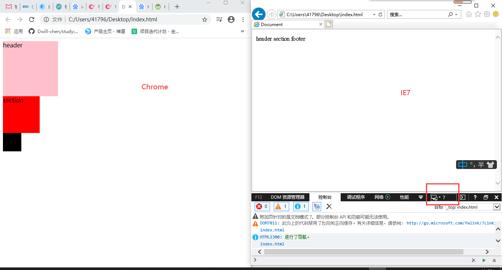
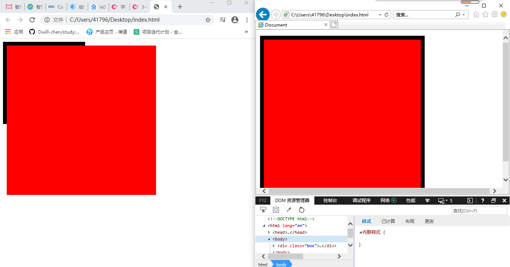
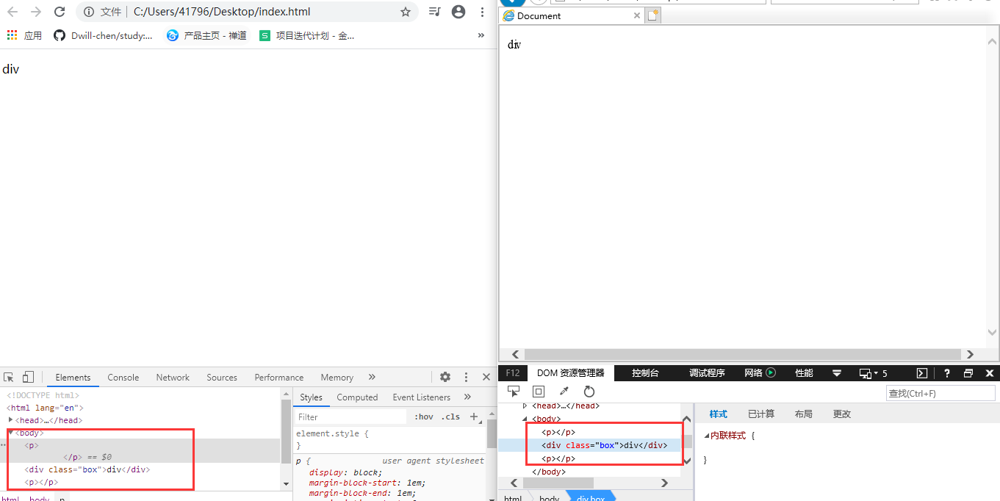
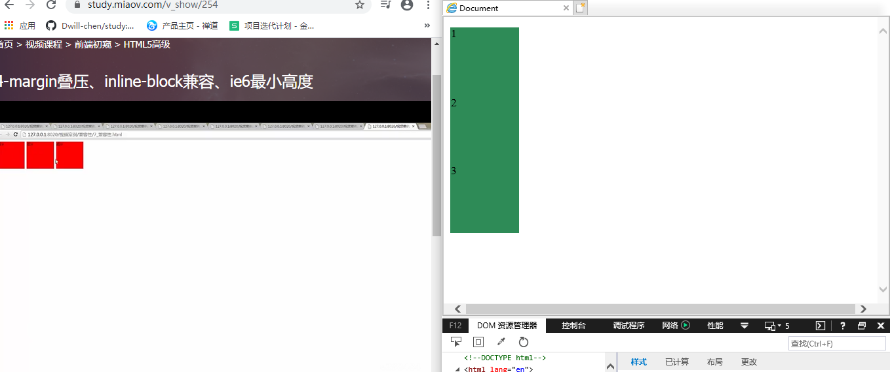
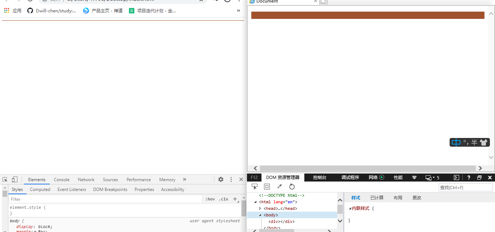
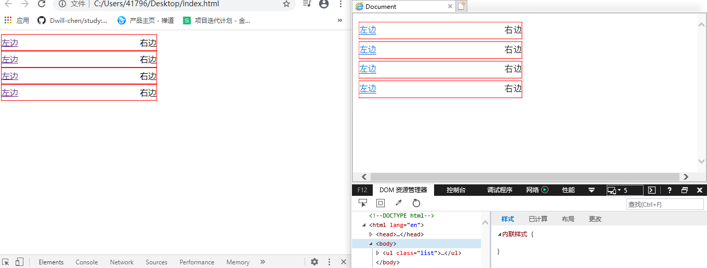

## 兼容性

### 一、CSS常见问题

#### 1、H5标签兼容

[^ 原因]: 低版本的IE浏览器，对H5标签的不支持，如下图：



从上图我们可以看出，标签内的文字正常显示，但是标签的样式却没有。

解决方式：

- 因为IE浏览器不支持HTML5标签，所以我们需要引入兼容JS文件，来保证我们的代码实现兼容效果;

- 在低版本中，并不能正常解析这些H5新标签，但是却可以识别通过创建的自定义标签(createElement)；
- 自定义标签，会被解析成**行内元素(inline)**对待，所以我们只需要将其转换成**块元素(block)**即可使用;


```html
<!DOCTYPE html>
<html lang="en">

<head>
    <meta charset="UTF-8">
    <meta name="viewport" content="width=device-width, initial-scale=1.0">
    <title>Document</title>
    <script>
        document.createElement("header");
        document.createElement("section");
        document.createElement("footer");
    </script>
    <style>
        header {
            width: 150px;
            height: 150px;
            display: block;
            background-color: pink;
        }

        section {
            width: 100px;
            height: 100px;
            display: block;
            background-color: red;
        }

        footer {
            width: 50px;
            height: 50px;
            display: block;
            background-color: black;
        }
    </style>
</head>

<body>
    <header>header</header>
    <section>section</section>
    <footer>footer</footer>
</body>

</html>
```


[^ 思考]: 如果页面上，我们有很多这样的H5标签，那么，我们需要创建很多的自定义标签，有什么更好的方法？

**解决方式：html5shiv.min.js**

html5shiv：用于解决IE9以下版本浏览器对HTML5新增标签不识别，并导致CSS不起作用的问题。

使用在线的 <a href="https://cdnjs.com/">cdnjs</a>

- 引入html5shiv
- 不同于平时，平时我们将script标签放于body末尾，但是引入的这个js，我们放于head中。
- 放body中，标签已经加载了，没有被该js方法渲染到页面上。

[^ tips]:放在head中的JS代码会在页面加载完成之前就读取，而放在body中的JS代码，会在整个页面加载完成之后读取。

```html
<!DOCTYPE html>
<html lang="en">

<head>
    <meta charset="UTF-8">
    <meta name="viewport" content="width=device-width, initial-scale=1.0">
    <title>Document</title>
    <script src="https://cdnjs.cloudflare.com/ajax/libs/html5shiv/3.7.3/html5shiv.min.js"></script>
    <style>
        header {
            width: 150px;
            height: 150px;
            background-color: pink;
        }

        section {
            width: 100px;
            height: 100px;
            background-color: red;
        }

        footer {
            width: 50px;
            height: 50px;
            background-color: black;
        }
    </style>
</head>

<body>
    <header>header</header>
    <section>section</section>
    <footer>footer</footer>


</body>

</html>
```


#### 2、元素浮动兼容

元素浮动后，能设置宽度的话就给元素加宽度，如果需要的**宽度是内容撑开**的，就给他里边的元素加浮动。

问题：下面这种结构的浮动，如果`.left`和`.right`2个容器，高度自适应撑开的情况下，`h2`标签的高度给一个值，会发现IE低版本下，`.right`布局独占了一行。

```html
<div class="box">
    <div class="left">
        <h2>左边</h2>
    </div>
    <div class="right">
		<h2>右边</h2>
    </div>
</div>
```

[^ 原因]: 我们浮动是给`div`加的，但是下面的`h2`标签，是块级元素，默认是撑满一行的，造成问题的并不是其父级容器，而是该块级元素。
[^ 解决]: 给`h2`添加浮动。浮动会使元素**隐式转换为行内块元素**，因此不会独占一行。

```html
<!DOCTYPE html>
<html lang="en">

<head>
    <meta charset="UTF-8">
    <meta name="viewport" content="width=device-width, initial-scale=1.0">
    <title>Document</title>
    <script src="https://cdnjs.cloudflare.com/ajax/libs/html5shiv/3.7.3/html5shiv.min.js"></script>
    <style>
        .box{
            width: 400px;
            border: 1px solid black;
            box-sizing: border-box;
        }
        .box::after{
            content: "";
            display: block;
            height: 0;
            visibility: hidden;
            clear: both;
        }
        .left {
            float: left;
            background-color: pink;
        }
        .right {
            float: right;
            background-color: blue;
        }
        h2{
            /* 给改标签添加浮动 */
            float: left;

            height: 30px;
            margin: 0;
        }
    </style>
</head>

<body>
    <div class="box">
        <div class="left">
            <h2>左边</h2>
        </div>
        <div class="right">
            <h2>右边</h2>
        </div>
    </div>
</body>

</html>
```


#### 3、子元素超出父级宽高、会把父元素宽高撑开

```html
<!DOCTYPE html>
<html lang="en">

<head>
    <meta charset="UTF-8">
    <meta name="viewport" content="width=device-width, initial-scale=1.0">
    <title>Document</title>
    <script src="https://cdnjs.cloudflare.com/ajax/libs/html5shiv/3.7.3/html5shiv.min.js"></script>
    <style>
        .box{
            width: 200px;
            height: 200px;
            border: 10px solid #000;
        }
        .content{
            width: 400px;
            height: 400px;
            background-color: red;
        }
    </style>
</head>

<body>
    <div class="box">
        <div class="content"></div>
    </div>
</body>

</html>
```



解决方案：**写法上，不要让子元素宽高超过父元素。**


#### 4、P元素包含块元素嵌套规则

```html
<!-- 元素结构 -->
    <p>
        <div class="box">div</div>
    </p>
```

代码中的元素结构，p和div是属于嵌套关系，我们看一看审查元素中：



可以发现，本应是嵌套的关系，审查元素中却是同级关系。

[^ tips]: 除了P标签之外，h标签和td标签也是。

解决方案：这三个标签，不能嵌套块级元素标签。


#### 5、margin的兼容性

```html
<!DOCTYPE html>
<html lang="en">

<head>
    <meta charset="UTF-8">
    <meta name="viewport" content="width=device-width, initial-scale=1.0">
    <title>Document</title>
    <style>
        .box{
            background-color: red;
        }
        .item{
            height: 50px;
            background-color: saddlebrown;
            margin: 50px;
        }
    </style>
</head>

<body>
    <div class="box">
        <div class="item"></div>
        <div class="item"></div>
    </div>
</body>

</html>
```

上面的布局会有2个问题：

- margin的传递：box没有margin，但是会有一个margin-top为50px
- 上下margin的叠压，2个红色块item之间，应该是margin-top和margin-bottom，共100px，但是只有50px的间隙。


解决方案：

- margin的传递：给box加上边框、overflow: hidden。

  但是会发现，ie下并没有解决。

[^ tips]: 加上overflow: hidden，会触发BFC，因此，ie没触发的，我们可以用`haslayout`，来解决ie。

因此，解决IE和其他，使用**BFC**和**haslayout**。

```html
.box{
    background-color: red;
    overflow: hidden;
    zoom: 1;
}
```


- margin叠压

  尽量使用同一方的的margin，**避免出现叠压的条件**。

  ```html
  .item {
      height: 50px;
      background-color: saddlebrown;
      margin-top: 50px;
  }
  
  .item2 {
  	margin-top: 100px;
  }
  ```

  

#### 6、display: inline-block

```html
<!DOCTYPE html>
<html lang="en">

<head>
    <meta charset="UTF-8">
    <meta name="viewport" content="width=device-width, initial-scale=1.0">
    <title>Document</title>
    <style>
        div{
            width: 100px;
            height: 100px;
            background-color: seagreen;
            display: inline-block;
        }
    </style>
</head>

<body>
    <div>1</div>
    <div>2</div>
    <div>3</div>
</body>

</html>
```

可以发现，IE下没生效：



原因：低版本IE 不支持display: inline-block。

解决方案：CSS hack。

**原理：**

由于不同的浏览器和浏览器各版本对CSS的支持及解析结果不一样，以及CSS优先级对浏览器展现效果的影响，我们可以据此针对不同的浏览器情景来应用不同的CSS。

CSS Hack大致有3种表现形式，**CSS属性前缀法**、**选择器前缀法**以及**IE条件注释法**（即HTML头部引用if IE）Hack，实际项目中CSS Hack大部分是针对IE浏览器不同版本之间的表现差异而引入的。

- 属性前缀法(即类内部Hack)：例如 IE6能识别下划线"_"和星号" * "，IE7能识别星号" * "，但不能识别下划线"_"，IE6~IE10都认识"\9"，但firefox前述三个都不能认识。
- 选择器前缀法(即选择器Hack)：例如 IE6能识别*html .class{}，IE7能识别*+html .class{}或者*:first-child+html .class{}。
- IE条件注释法(即HTML条件注释Hack)：针对所有IE(注：IE10+已经不再支持条件注释)： <!--[if IE]>IE浏览器显示的内容 <![endif]-->，针对IE6及以下版本： <!--[if lt IE 6]>只在IE6-显示的内容 <![endif]-->。这类Hack不仅对CSS生效，对写在判断语句里面的所有代码都会生效。

```html
div{
    width: 100px;
    height: 100px;
    background-color: seagreen;
    display: inline-block;
    *display: inline;
    *zoom: 1;
}
```


#### 7、IE最小高度

场景：比如，我们想要一个高度1px的容器。



可以发现IE下，高度远远超过1px。

从第6点中，我们可以知道有CSS hack，因此这里，我们也使用hack。

```html
div{
    height: 1px;
    background-color: sienna;
    *overflow: hidden;
}
```


#### 8、IE下的双边距

IE下，当元素浮动后，设置margin，会产生双倍边距。

```html
<!DOCTYPE html>
<html lang="en">

<head>
    <meta charset="UTF-8">
    <meta name="viewport" content="width=device-width, initial-scale=1.0">
    <title>Document</title>
    <style>
        body{
            margin: 0;
        }
        .item{
            width: 100px;
            height: 100px;
            background-color: sienna;
            margin-left: 50px;
            float: left;
        }
    </style>
</head>

<body>
    <div class="item"></div>
</body>

</html>
```

[^ tips]: 本地浏览器中没有IE6，在IE5、7及以上都正常，应该是只在IE6下存在。

解决方案：

如果遇到了：使用hack，添加 `*display: inline` 即可。

```html
.item{
    width: 100px;
    height: 100px;
    background-color: sienna;
    margin-left: 50px;
    float: left;
    *display: inline;
}
```


#### 9、li里的元素都浮动，会产生间隙

场景：li里面的元素 **都设置** 浮动，会长生间隙。

[^ tips]: li中的所有元素都浮动，产生4px间隙，可以用PS测量。

```html
<!DOCTYPE html>
<html lang="en">

<head>
    <meta charset="UTF-8">
    <meta name="viewport" content="width=device-width, initial-scale=1.0">
    <title>Document</title>
    <style>
        .list {
            margin: 0;
            padding: 0;
            list-style: none;
            width: 300px;
        }

        .list li {
            height: 30px;
            border: 1px solid red;
            line-height: 30px;
            *vertical-align: top;
        }

        .list li a {
            float: left;
        }

        .list li span {
            float: right;
        }
    </style>
</head>

<body>
    <ul class="list">
        <li>
            <a href="">左边</a>
            <span>右边</span>
        </li>
        <li>
            <a href="">左边</a>
            <span>右边</span>
        </li>
        <li>
            <a href="">左边</a>
            <span>右边</span>
        </li>
        <li>
            <a href="">左边</a>
            <span>右边</span>
        </li>
    </ul>
</body>

</html>
```





解决方案：因为针对IE，还是使用hack，*vertical-align。

```html
.list li {
    height: 30px;
    border: 1px solid red;
    line-height: 30px;
    *vertical-align: top;
    /* *vertical-align: middle;
    *vertical-align: bottom; */
}
```


#### 10、浮动元素之间注释，导致文字被覆盖

