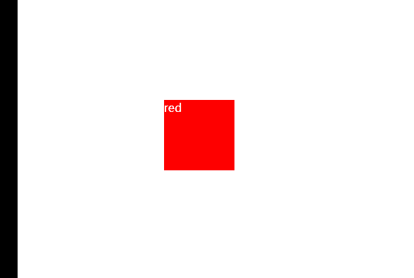
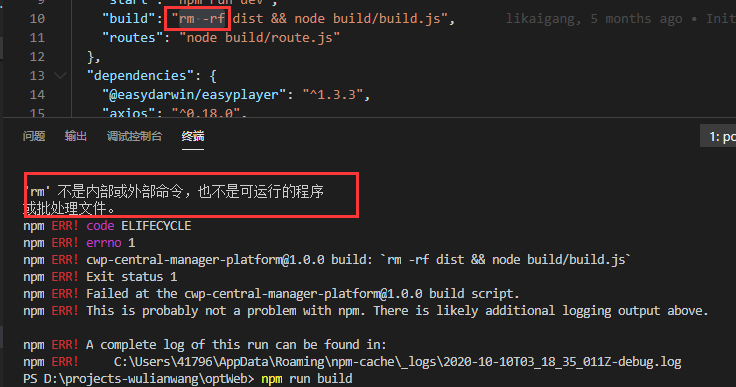

## 开发中遇到的问题

### 一、VUE

#### 1.vue ctrl+左键

使用vue时，如不能 `ctrl+左键` 跳转到对应的函数、定义的变量等，使用` vue-helper `插件


#### 2.vue热加载编译速度慢问题

vue热加载编译速度慢问题，引入按需加载插件 dynamic-import-node

- ```swift
  npm install babel-plugin-dynamic-import-node
  ```

- babelrc文件中添加

  ```javascript
  env: {
          development: {
            plugins: ['dynamic-import-node']
          }
      }
  ```


#### 3. vue中scoped样式污染

取消scoped，可以做到在本页面中，我们对某些样式的需求，但是会造成对其他页面样式的污染，如果我们想改变本页面样式，又不影响其他页面，可以：

vue引用了第三方组件，需要在组件中局部修改第三方组件的样式，而又不想去除scoped属性造成组件之间的样式污染。此时只能通过>>>，穿透scoped。

有些Sass 之类的预处理器无法正确解析 `>>>`。可以使用 `/deep/` 操作符( `>>>` 的别名)

语法格式：

```css
<style scoped lang="less">
    /deep/ .box {
        样式内容
    }
</style>
```


#### 4.元素中的滚轮事件，不生效时

给元素绑定scroll事件无效，有滚动操作也没有触发。

window.addEventListener("scroll", this.handleScroll, true)的第三个参数加上true

```html
// mounted中
mounted() {
	// 监听用户管理表单的滚动事件
	window.addEventListener("scroll", this.handleScroll, true);
}

// methods中
methods() {
	handleScroll() {
		const ele = this.$refs.formHasScroll;
		console.log(ele.scrollTop);
    }
}
```


#### 5.axios传递数组参数

https://www.jianshu.com/p/68d81da4e1ad，需要结合实际来总结，先记录，用到——paramsSerializer


### 二、页面问题

#### 1.布局单位

- 背景介绍
  我们为什么要选择合适的网页设计单位？
  随着Web的发展，对新的解决方案的需求也会继续增大，对网页的要求更高。
  网页设计单位是涉及到我们布局的效果，使用不同的单位会对最终的demo，会有影响。
  现在都是要求响应式设计，需要适配各种设备，电脑，手机，平板。如果单位不合适，可能在这个设备显示良好，那个设备就会打乱布局。
  所以需要我们选择合适的单位来进行开发，设计。

- 知识剖析

  - px
    px就是pixel的缩写，意为像素。px就是设备或者图片最小的一个点，比如常常听到的电脑像素是1024x768的，表示的是水平方向是1024个像素点，垂直方向是768个像素点。
    是我们网页设计常用的单位，也是基本单位。通过px可以设置固定的布局或者元素大小，缺点是没有弹性。
    特点是1. em的值并不是固定的； 2. em会继承父级元素的字体大小。

  - em

    参考物是父元素的font-size，具有继承的特点。如果自身定义了font-size按自身来计算（浏览器默认字体是16px），整个页面内1em不是一个固定的值。
    特点是1. em的值并不是固定的； 2. em会继承父级元素的字体大小。

  - rem

    rem是相对于根元素html，这样就意味着，我们只需要在根元素确定一个参考值，可以设计HTML为大小为10px，到时设置1.2rem就是12px.以此类推。

    优点是，只需要设置根目录的大小就可以把整个页面的成比例的调好。

  - %

    一般来说就是相对于父元素的。

    - 对于普通定位元素就是我们理解的父元素 
    - 对于position: absolute;的元素是相对于已定位的父元素 
    - 对于position: fixed;的元素是相对于ViewPort（可视窗口）

  - vw

    css3新单位，view width的简写，是指可视窗口的宽度。假如宽度是1200px的话。那10vw就是120px
    举个例子：浏览器宽度1200px, 1 vw = 1200px/100 = 12 px。

    css3新单位，view width的简写，是指可视窗口的宽度。假如宽度是1200px的话。那10vw就是120px
    举个例子：浏览器宽度1200px, 1 vw = 1200px/100 = 12 px

  - vh

    css3新单位，view height的简写，是指可视窗口的高度。假如高度是1200px的话。那10vh就是120px
    举个例子：浏览器高度900px, 1 vh = 900px/100 = 9 px。

  - vm

    css3新单位，相对于视口的宽度或高度中较小的那个。其中最小的那个被均分为100单位的vm 举个例子：浏览器高度900px，宽度1200px，取最小的浏览器高度，1 vm = 900px/100 = 9 px。
    兼容性太差 ，现在基本上没人用，我试了一下Chrome就用不了。
  
- 常见问题

  假如使用em来设置文字大小要注意什么？
  
- 解决方案

  注意父元素的字体大小，因为em是根据父元素的大小来设置的。比如同样是1.5em，要是父元素是20，那1.5em就是30px.要是父元素是30px,1.5em就是45px。

  特别是在多重div嵌套里面更要注意。

- 扩展思考

  css还有哪些长度单位？

  in:寸


  cm:厘米


  mm:毫米


  t:point，大约1/72寸

  pc:pica，大约6pt，1/6寸

- 更多问题

  - pc pt ch一般用在什么场景?
    这些我们网页设计基本上用不到，在排版上会有用处。
  - 如何使 1rem=10px
    在设置HTML{font-size：62.5%；}即可
  - 如果父元素没有指定高度，那么子元素的百分比的高度是多少？
    会按照子元素的实际高度，设置百分比已经没有效果了。

[^ tips]: 常用的%和vh的区别，一个相对于**父级**、一个相对于**可视区域**，在页面布局时，经常用到。


#### 2.伪元素 ::after ::before对于img

**img使用::after、::before无效：**

在CSS中总有一些你不用不知道，用到才知道的“坑”。比如今天要谈的，把 before, after 伪类用在  标签上。
嗯，实际上你用你会发现，在大多数浏览器这是无效的，dom中并不会出现你想要的结果。

为什么会这样呢？
让我们回归到 W3C 标准中寻觅一下，在标准中，**before, after 伪类**的定义如：

As their names indicate, the :before and :after pseudo-elements specify the location of content before and after an element's document tree content.
来自 https://www.w3.org/TR/CSS21/generate.html#before-after-content

我们应该注意到所谓 document tree content，对于 img 这种**自闭和**标签，**似乎不存在 content （内容或后代元素）在标签中**，所以选择器没有生效。但这样的解释还不够清晰，实际上标准中还有一行注释：

Note. This specification does not fully define the interaction of :before and :after with replaced elements (such as IMG in HTML). This will be defined in more detail in a future specification.

嗯，这回清楚了，**对于可替换元素（如 img、input、select 等）**，标准并没有清晰定义，这也导致了浏览器实现的差异性。
有解决办法么？搜了一下是有的（http://stackoverflow.com/questions/5843035/does-before-not-work-on-img-elements）：

**使用jQuery**

使用 jQuery 的 before，after 方法：
javascript
$('.target').after('');

**实际上，jQuery 只是在目标元素前后插入 dom 而已。**

**伪造 content**

给 img 这类标签添加 content 属性，输入一些无意义的文本，让浏览器认为标签含有 content。
如在 CSS 中添加：
css
img {
/ hide the default image /
height:0;
width:0;
/ hide fake content /
font-size:0;
color:transparent;
/ enable absolute position for pseudo elements /
position:relative;
/ and this is just fake content /
content:"I'm just fake content";
}

**但这种方法存在浏览器兼容问题**。

所以最后还是建议不要做这种尝试了，**给父标签添加伪类吧**。


#### 3.宽度%，高度auto，不用js，用css根据宽度来控制高度

[^ 原理]: 知识点是padding-bottom的**百分比值**是相对包含块的宽度来算的

对于`padding`属性而言，**任意方向的百分比**`padding`都现对于**宽度**计算可以让我们轻松实现**固定比例**的块级容器

```html
<!DOCTYPE html>
<html>
<head>
<meta charset="utf-8">
<style>
	.box1 {
		width: 300px;
		height: 300px;
		background: blue;
	}
	.box2 {
		width:50%;
		height: 0;
		padding-bottom: 30%;
		background: pink
	}
</style>
</head>

<body>
	<div class="box1">
		<div class="box2"></div>
	</div>
</body>
</html>

```


### 三、其他问题

#### 1.想用鼠标右键（新建）

创建一个新的文件，如：

在用md写东西时，我们想新建一个md文件，但是此时发现，鼠标右键中的新建里，没有md文件的选项。

1. 安装Typora, 一个md文件编辑器
2. win + R
3. 输入regedit, 确定
4. 定位到`HKEY_CLASSES_ROOT\.md`
5. 点击`.md`文件夹, 双击右侧`(默认)`项编辑字符串
6. 将`数值数据`改为`Typora.md`
7. 右键`.md`文件夹 => 新建 => 项
8. 把新建的项命名为`ShellNew`
9. 右键`ShellNew` => 新建 => 字符串值
10. 把新建的字符串值的名称改为`NullFile`


#### 2.hover多次触发问题

当我们想给某一个元素添加hover效果的时候，如：

鼠标移入时，图片旋转，但是从下图我们可以看见，hover不停的触发、造成卡顿等问题。

```html
<!DOCTYPE html>
<html lang="en">

<head>
    <meta charset="UTF-8">
    <meta name="viewport" content="width=device-width, initial-scale=1.0">
    <title>Document</title>
    <style>
        body {
            padding-top: 200px;
            padding-left: 200px;
        }

        div {
            width: 100px;
            height: 100px;
            display: inline-block;
            margin-right: 50px;
            transition: all .5s linear 0s;
            color: white;
        }
        div:hover{
            transform: rotateZ(360deg);
        }

        .red {
            background-color: red;
            transform-origin: 0px 0px;
        }

    </style>
</head>

<body>
    <div class="red">red</div>
</body>

</html>
```




解决思路：

1.首先，我们hover的是元素，而元素在移动，会不会是元素的不停移动，造成的这种问题？

2.我们想让鼠标移入的元素，不会随着动画而移动，因此，可以给这个元素一个容器，让这个父级容器固定。

3.在第二点中，逻辑上是可行的，但是冒泡和捕获的问题，造成结果和之前一样，也会有类似的卡顿。

4.冒泡和捕获，既然是向上、或者向下传递的，那么，我们再在第二点的基础上，绝对定位一个兄弟元素，再通过hover这个兄弟元素，控制我们想要的元素动画，是否可行呢？代码如下：

```html
<!DOCTYPE html>
<html lang="en">

<head>
    <meta charset="UTF-8">
    <meta name="viewport" content="width=device-width, initial-scale=1.0">
    <title>Document</title>
    <style>
        body {
            padding-top: 200px;
            padding-left: 200px;
        }

        .redWrap {
            position: relative;
            background-color: brown;
        }

        div {
            width: 100px;
            height: 100px;
            display: inline-block;
            margin-right: 50px;
            transition: all .5s linear 0s;
            color: white;
        }

        .red {
            background-color: red;
            transform-origin: 0px 0px;
        }

        .box {
            position: absolute;
            top: 0;
            left: 0;
            z-index: 9;
        }


        .box:hover+.red {
            transform: rotateZ(360deg);
        }
    </style>
</head>

<body>
    <div class="redWrap">
        <div class="box"></div>
        <div class="red">red</div>
    </div>
</body>

</html>
```

[^ 结果]: 执行上面的代码过后，我们可以发现，达到了想要的结果。

**解决方案：**

通过给产生 **动画的元素** ，添加一个容器，并且添加一个**兄弟元素**，让这个兄弟元素的形状和面积完全跟动画元素一致，且层级在上，通过hover这个兄弟元素，使动画元素的效果完成。


#### 3.npm run build 打包报错



错误原因可能：使用了`Linux` 下的 `rm -rf` 命令，而你的电脑是`windows`
解决办法：把`rm -rf` 命令替换为 `rimraf` 命令

rimraf` 包是一个递归删除文件的`nodejs`包，作用同 `Linux` 下的 `rm -rf


#### 4.如何获取事件冒泡里最顶层的元素（或者任意层的元素）

https://blog.csdn.net/zls986992484/article/details/73986921

同理，捕获的