## 开发中遇到的问题

### 一、VUE

#### 1.vue ctrl+左键

使用vue时，如不能 `ctrl+左键` 跳转到对应的函数、定义的变量等，使用` vue-helper `插件


#### 2.vue热加载编译速度慢问题

vue热加载编译速度慢问题，引入按需加载插件 dynamic-import-node

- ```swift
  npm install babel-plugin-dynamic-import-node
  ```

- babelrc文件中添加

  ```javascript
  env: {
          development: {
            plugins: ['dynamic-import-node']
          }
      }
  ```


#### 3. vue中scoped样式污染

取消scoped，可以做到在本页面中，我们对某些样式的需求，但是会造成对其他页面样式的污染，如果我们想改变本页面样式，又不影响其他页面，可以：

vue引用了第三方组件，需要在组件中局部修改第三方组件的样式，而又不想去除scoped属性造成组件之间的样式污染。此时只能通过>>>，穿透scoped。

有些Sass 之类的预处理器无法正确解析 `>>>`。可以使用 `/deep/` 操作符( `>>>` 的别名)

语法格式：

```css
<style scoped lang="less">
    /deep/ .box {
        样式内容
    }
</style>
```


#### 4.元素中的滚轮事件，不生效时

给元素绑定scroll事件无效，有滚动操作也没有触发。

```javascript
@scroll="事件"
```

即该事件无效

window.addEventListener("scroll", this.handleScroll, true)的第三个参数加上true

```html
// mounted中
mounted() {
	// 监听用户管理表单的滚动事件
	window.addEventListener("scroll", this.handleScroll, true);
}

// methods中
methods() {
	handleScroll() {
		const ele = this.$refs.formHasScroll;
		console.log(ele.scrollTop);
    }
}
```


#### 5.axios传递数组参数

[更多详情可以访问查看](https://www.jianshu.com/p/68d81da4e1ad)

当我们传递的参数是数组格式时，如下

```javascript
let params = {
    list: [1,2,3,4]
}
```

然后我们在接口中传递时，会发现报错，然后看参数：


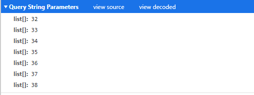

可以看到，我们传递的参数并不是我们理想中的，这个时候我们就需要 **paramsSerializer** 序列化

- 首先，需要引入qs

  ```javascript
  import qs from 'qs'
  ```

- 再在封装、或者正常请求，参数的位置，做序列化操作，下面以封装的接口的参数传递为例子

  ```javascript
  export function updateBigScreenContent(params) {
    return request.post(`${commonUrl1}/auth/zhsqBigScreenContent/updateBigScreenContent`, null, {
      params,
      // 这里我们将数组序列化
      paramsSerializer: param => qs.stringify(param, {
        arrayFormat: 'repeat',
      }),
    })
  }
  ```

- 除了上面这种形式，大概有4种

  ```javascript
  qs.stringify({ids: [1, 2, 3]}, { indices: false })
   //形式： ids=1&ids=2&id=3
  qs.stringify({ids: [1, 2, 3]}, {arrayFormat: ‘indices‘})
   //形式： ids[0]=1&aids1]=2&ids[2]=3
  qs.stringify({ids: [1, 2, 3]}, {arrayFormat: ‘brackets‘})
   //形式：ids[]=1&ids[]=2&ids[]=3
  qs.stringify({ids: [1, 2, 3]}, {arrayFormat: ‘repeat‘}) 
  //形式： ids=1&ids=2&id=3
  ```

现在我们再来看，在接口中传递的参数是什么样的：

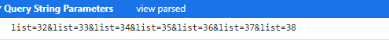

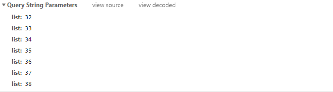


#### 6.跨域各个参数详解

```javasc
proxy: {
    '/api': {
        target: 'http://localhost:5000', //API服务器的地址
        ws: true, //代理websockets
        changeOrigin: true, // 虚拟的站点需要更管origin
        pathRewrite: { //重写路径 比如'/api/aaa/ccc'重写为'/aaa/ccc'
        	'^/api': ''
        }
    }
},
```

[^ tips]:若是后端的API为'/aaa/ccc'，我们需要在发请求时将路径设置为'/api/aaa/ccc',这个时候就要重写路径，将前面的/api重写为空,这样我们的请求才会被proxy代理到。


#### 7. vue.config.js各个选项(从6点衍生的)

```javascript
module.exports = {
    // 选项
    //  基本路径
    publicPath: "./",
    //  构建时的输出目录
    outputDir: "dist",
    //  放置静态资源的目录
    assetsDir: "static",
    //  html 的输出路径
    indexPath: "index.html",
    //文件名哈希
    filenameHashing: true,
    //用于多页配置，默认是 undefined
    pages: {
        index: {
            // page 的入口文件
            entry: 'src/index/main.js',
            // 模板文件
            template: 'public/index.html',
            // 在 dist/index.html 的输出文件
            filename: 'index.html',
            // 当使用页面 title 选项时，
            // template 中的 title 标签需要是 <title><%= htmlWebpackPlugin.options.title %></title>
            title: 'Index Page',
            // 在这个页面中包含的块，默认情况下会包含
            // 提取出来的通用 chunk 和 vendor chunk。
            chunks: ['chunk-vendors', 'chunk-common', 'index']
        },
        // 当使用只有入口的字符串格式时，

        // 模板文件默认是 `public/subpage.html`

        // 如果不存在，就回退到 `public/index.html`。

        // 输出文件默认是 `subpage.html`。

        subpage: 'src/subpage/main.js'

    },
    //  是否在保存的时候使用 `eslint-loader` 进行检查。
    lintOnSave: true,
    //  是否使用带有浏览器内编译器的完整构建版本
    runtimeCompiler: false,
    //  babel-loader 默认会跳过 node_modules 依赖。
    transpileDependencies: [ /* string or regex */],
    //  是否为生产环境构建生成 source map？
    productionSourceMap: true,
    //  设置生成的 HTML 中 <link rel="stylesheet"> 和 <script> 标签的 crossorigin 属性。
    crossorigin: "",
    //  在生成的 HTML 中的 <link rel="stylesheet"> 和 <script> 标签上启用 Subresource Integrity (SRI)。
    integrity: false,
    //  调整内部的 webpack 配置
    configureWebpack: () => { }, //(Object | Function)
    chainWebpack: () => { },
    // 配置 webpack-dev-server 行为。
    devServer: {
        open: process.platform === 'darwin',
        host: '0.0.0.0',
        port: 8080,
        https: false,
        hotOnly: false,
        // 查阅 https://github.com/vuejs/vue-docs-zh-cn/blob/master/vue-cli/cli-service.md#配置代理
        proxy: {
            '/api': {
                target: "http://app.rmsdmedia.com",
                changeOrigin: true,
                secure: false,
                pathRewrite: {
                    "^/api": ""
                }
            },
            '/foo': {
                target: '<other_url>'
            }
        }, // string | Object
        before: app => { }
    },
    // CSS 相关选项
    css: {
        // 将组件内的 CSS 提取到一个单独的 CSS 文件 (只用在生产环境中)
        // 也可以是一个传递给 `extract-text-webpack-plugin` 的选项对象
        extract: true,
        // 是否开启 CSS source map？
        sourceMap: false,
        // 为预处理器的 loader 传递自定义选项。比如传递给
        // Css-loader 时，使用 `{ Css: { ... } }`。
        loaderOptions: {
            css: {
                // 这里的选项会传递给 css-loader
            },
            postcss: {
                // 这里的选项会传递给 postcss-loader
            }
        },
        // 为所有的 CSS 及其预处理文件开启 CSS Modules。
        // 这个选项不会影响 `*.vue` 文件。
        modules: false
    },
    // 在生产环境下为 Babel 和 TypeScript 使用 `thread-loader`
    // 在多核机器下会默认开启。
    parallel: require('os').cpus().length > 1,
    // PWA 插件的选项。
    // 查阅 https://github.com/vuejs/vue-docs-zh-cn/blob/master/vue-cli-plugin-pwa/README.md
    pwa: {},
    // 三方插件的选项
    pluginOptions: {
        // ...
    }
}

```

[^ tips]: 更多详情内容，查看官网 https://cli.vuejs.org/zh/config/#devserver


#### 8.element-ui按钮(按下后，颜色应该复原)

- 描述：在使用elementUI的按钮组件时，我们点击了该按钮后，我们会发现，当鼠标移动出该按钮时，按钮的样式还是为点击时的样式，并没有恢复到正常状态。

- 分析：是因为Element UI点击按钮后不失焦，样式就没恢复正常状态。

- 解决方案：既然没有失焦，那么我们强制让其失焦。即`e.target.blur()`

  [^ tips]: 我们需要失焦的元素是按钮，但是按钮中，我们点击文字的时候，`e.target`对应的元素是文字所在元素span，因此需要结合冒泡。

  ```javascript
  click(e) {
      let target = e.target;
      // el-button的结构是固定的，因此：
      // 如果是SPAN标签，则向上找到父节点，即按钮本身
      if(target.nodeName == "SPAN"){
          target = e.target.parentNode;
      }
      target.blur();
  }
  ```

  对比如下：确定和重置的对比

  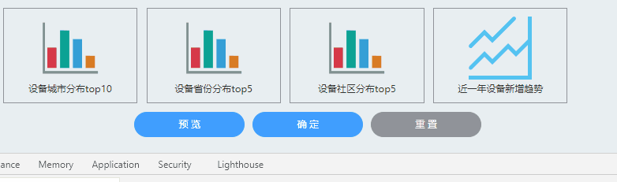

  [^ 描述]: 确定 是设置了样式恢复，重置 没有设置。我们可以发现鼠标点击后的状态，确定 按钮则复原了，而重置 按钮仍然保持的是点击的状态样式。


#### 9.vue中表单信息重置为空

https://blog.csdn.net/qq_32340877/article/details/79833750


### 二、页面问题

#### 1.布局单位

- 背景介绍
  我们为什么要选择合适的网页设计单位？
  随着Web的发展，对新的解决方案的需求也会继续增大，对网页的要求更高。
  网页设计单位是涉及到我们布局的效果，使用不同的单位会对最终的demo，会有影响。
  现在都是要求响应式设计，需要适配各种设备，电脑，手机，平板。如果单位不合适，可能在这个设备显示良好，那个设备就会打乱布局。
  所以需要我们选择合适的单位来进行开发，设计。

- 知识剖析

  - px
    px就是pixel的缩写，意为像素。px就是设备或者图片最小的一个点，比如常常听到的电脑像素是1024x768的，表示的是水平方向是1024个像素点，垂直方向是768个像素点。
    是我们网页设计常用的单位，也是基本单位。通过px可以设置固定的布局或者元素大小，缺点是没有弹性。
    特点是1. em的值并不是固定的； 2. em会继承父级元素的字体大小。

  - em

    参考物是父元素的font-size，具有继承的特点。如果自身定义了font-size按自身来计算（浏览器默认字体是16px），整个页面内1em不是一个固定的值。
    特点是1. em的值并不是固定的； 2. em会继承父级元素的字体大小。

  - rem

    rem是相对于根元素html，这样就意味着，我们只需要在根元素确定一个参考值，可以设计HTML为大小为10px，到时设置1.2rem就是12px.以此类推。

    优点是，只需要设置根目录的大小就可以把整个页面的成比例的调好。

  - %

    一般来说就是相对于父元素的。

    - 对于普通定位元素就是我们理解的父元素 
    - 对于position: absolute;的元素是相对于已定位的父元素 
    - 对于position: fixed;的元素是相对于ViewPort（可视窗口）

  - vw

    css3新单位，view width的简写，是指可视窗口的宽度。假如宽度是1200px的话。那10vw就是120px
    举个例子：浏览器宽度1200px, 1 vw = 1200px/100 = 12 px。

    css3新单位，view width的简写，是指可视窗口的宽度。假如宽度是1200px的话。那10vw就是120px
    举个例子：浏览器宽度1200px, 1 vw = 1200px/100 = 12 px

  - vh

    css3新单位，view height的简写，是指可视窗口的高度。假如高度是1200px的话。那10vh就是120px
    举个例子：浏览器高度900px, 1 vh = 900px/100 = 9 px。

  - vm

    css3新单位，相对于视口的宽度或高度中较小的那个。其中最小的那个被均分为100单位的vm 举个例子：浏览器高度900px，宽度1200px，取最小的浏览器高度，1 vm = 900px/100 = 9 px。
    兼容性太差 ，现在基本上没人用，我试了一下Chrome就用不了。

- 常见问题

  假如使用em来设置文字大小要注意什么？

- 解决方案

  注意父元素的字体大小，因为em是根据父元素的大小来设置的。比如同样是1.5em，要是父元素是20，那1.5em就是30px.要是父元素是30px,1.5em就是45px。

  特别是在多重div嵌套里面更要注意。

- 扩展思考

  css还有哪些长度单位？

  in:寸


  cm:厘米


  mm:毫米


  t:point，大约1/72寸

  pc:pica，大约6pt，1/6寸

- 更多问题

  - pc pt ch一般用在什么场景?
    这些我们网页设计基本上用不到，在排版上会有用处。
  - 如何使 1rem=10px
    在设置HTML{font-size：62.5%；}即可
  - 如果父元素没有指定高度，那么子元素的百分比的高度是多少？
    会按照子元素的实际高度，设置百分比已经没有效果了。

[^ tips]: 常用的%和vh的区别，一个相对于**父级**、一个相对于**可视区域**，在页面布局时，经常用到。


#### 2.伪元素 ::after ::before对于img

**img使用::after、::before无效：**

在CSS中总有一些你不用不知道，用到才知道的“坑”。比如今天要谈的，把 before, after 伪类用在  标签上。
嗯，实际上你用你会发现，在大多数浏览器这是无效的，dom中并不会出现你想要的结果。

为什么会这样呢？
让我们回归到 W3C 标准中寻觅一下，在标准中，**before, after 伪类**的定义如：

As their names indicate, the :before and :after pseudo-elements specify the location of content before and after an element's document tree content.
来自 https://www.w3.org/TR/CSS21/generate.html#before-after-content

我们应该注意到所谓 document tree content，对于 img 这种**自闭和**标签，**似乎不存在 content （内容或后代元素）在标签中**，所以选择器没有生效。但这样的解释还不够清晰，实际上标准中还有一行注释：

Note. This specification does not fully define the interaction of :before and :after with replaced elements (such as IMG in HTML). This will be defined in more detail in a future specification.

嗯，这回清楚了，**对于可替换元素（如 img、input、select 等）**，标准并没有清晰定义，这也导致了浏览器实现的差异性。
有解决办法么？搜了一下是有的（http://stackoverflow.com/questions/5843035/does-before-not-work-on-img-elements）：

**使用jQuery**

使用 jQuery 的 before，after 方法：
javascript
$('.target').after('');

**实际上，jQuery 只是在目标元素前后插入 dom 而已。**

**伪造 content**

给 img 这类标签添加 content 属性，输入一些无意义的文本，让浏览器认为标签含有 content。
如在 CSS 中添加：

```css
img {
    / hide the default image /
    height:0;
    width:0;
    / hide fake content /
    font-size:0;
    color:transparent;
    / enable absolute position for pseudo elements /
    position:relative;
    / and this is just fake content /
    content:"I'm just fake content";
}
```


**但这种方法存在浏览器兼容问题**。

所以最后还是建议不要做这种尝试了，**给父标签添加伪类吧**。


#### 3.宽度%，高度auto，不用js，用css根据宽度来控制高度

[^ 原理]: 知识点是padding-bottom的**百分比值**是相对包含块的宽度来算的，margin同理也是。

对于`padding`属性而言，**任意方向的百分比**`padding`都现对于**宽度**计算可以让我们轻松实现**固定比例**的块级容器

```html
<!DOCTYPE html>
<html>
<head>
<meta charset="utf-8">
<style>
	.box1 {
		width: 300px;
		height: 300px;
		background: blue;
	}
	.box2 {
		width:50%;
		height: 0;
		padding-bottom: 30%;
		background: pink
	}
</style>
</head>

<body>
	<div class="box1">
		<div class="box2"></div>
	</div>
</body>
</html>

```


#### 3.vue使用px2rem自动转换rem

px2rem，之前使用rem，是在main,js全局配置，书写样式的时候也是使用的rem作为单位。

使用这个插件后，书写样式的时候其实还是根据原型图，写的px，只不过在适配时，使用该插件，并配置相关比例，会自动去适应。

如：

- 容器宽度，我们设置100%，但是里面的left、right，我们设置400px宽度

- 在全屏、浏览器宽度较大时，我们的布局不会发生较大改变

- 但是在缩小浏览器宽度的时候，布局和全屏时的布局就不一致了，left、right之间的间隙没了。

  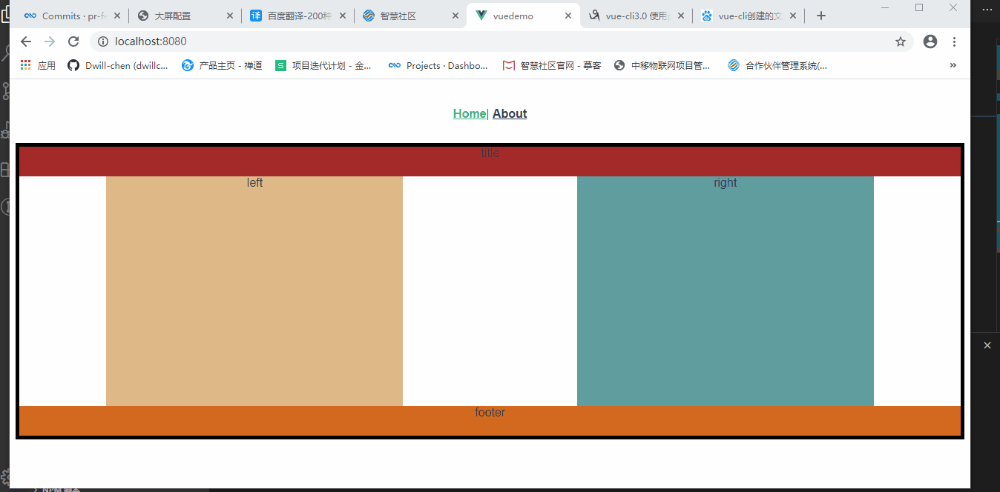


如何让其保持布局比例，实现响应式呢(注意，字体的响应式，chrome最小字体是12px)?

1. 安装安装px2rem-loader(devDependencies)

   ```javascript
   npm install postcss-px2rem
   ```

2. 在vue.config.js中添加配置

   ```javascript
   const px2rem = require('postcss-px2rem')
   
   const postcss = px2rem({
     remUnit: 32   //基准大小 baseSize，需要和rem.js中相同
   })
   
   module.exports = {
     css: {
       loaderOptions: {
         postcss: {
           plugins: [
             postcss
           ]
         }
       }
     }
   }
   ```

3. 添加rem.js（可以在一个公共方法utils中添加）

   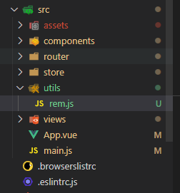

   ```javascript
   // 基准大小
   const baseSize = 32
   // 设置 rem 函数
   function setRem() {
     // 当前页面宽度相对于 750 宽的缩放比例，可根据自己需要修改。
     const scale = document.documentElement.clientWidth / 750
     // 设置页面根节点字体大小（“Math.min(scale, 2)” 指最高放大比例为2，可根据实际业务需求调整）
     document.documentElement.style.fontSize = baseSize * Math.min(scale, 2) + 'px'
   }
   // 初始化
   setRem()
   // 改变窗口大小时重新设置 rem
   window.onresize = function() {
     setRem()
   }
   ```

4. 引入rem.js

   ```javascript
   import "./utils/rem";
   ```

   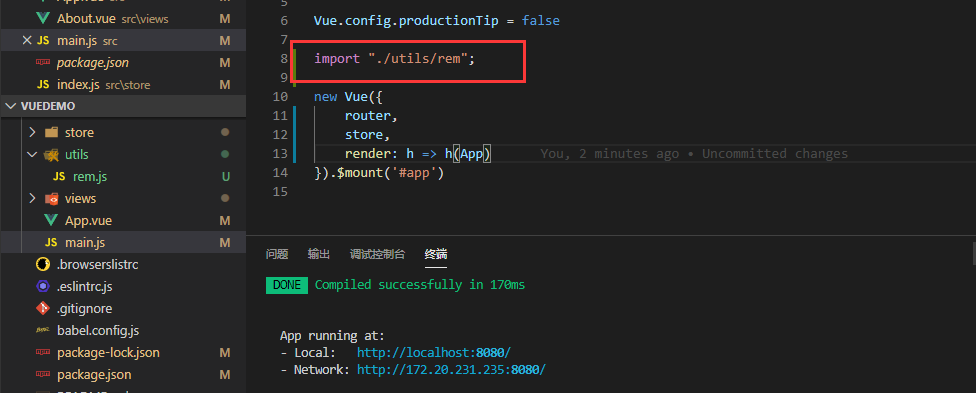

5. 实际效果（屏幕太小时，因为chrome字体12px最小，会有显示问题，但是实际上，也不会那么小的布局）

   我们可以发现，设置了rem后，就算使用了px，但是布局也是响应式的了。

   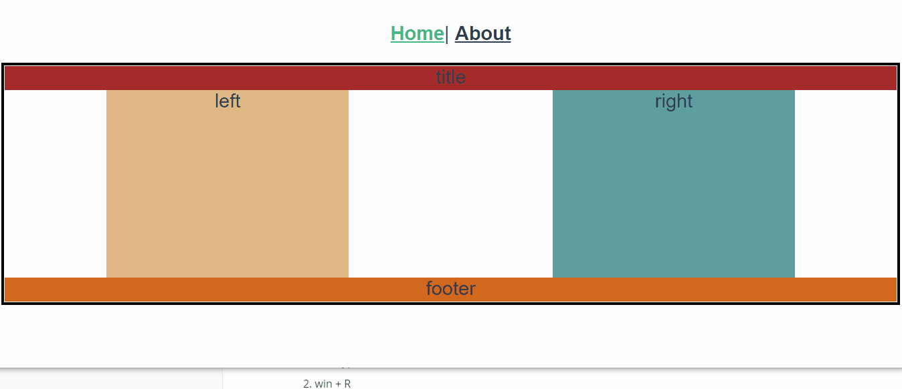

### 三、其他问题

#### 1.想用鼠标右键（新建）

创建一个新的文件，如：

在用md写东西时，我们想新建一个md文件，但是此时发现，鼠标右键中的新建里，没有md文件的选项。

1. 安装Typora, 一个md文件编辑器
2. win + R
3. 输入regedit, 确定
4. 定位到`HKEY_CLASSES_ROOT\.md`
5. 点击`.md`文件夹, 双击右侧`(默认)`项编辑字符串
6. 将`数值数据`改为`Typora.md`
7. 右键`.md`文件夹 => 新建 => 项
8. 把新建的项命名为`ShellNew`
9. 右键`ShellNew` => 新建 => 字符串值
10. 把新建的字符串值的名称改为`NullFile`


#### 2.hover多次触发问题

当我们想给某一个元素添加hover效果的时候，如：

鼠标移入时，图片旋转，但是从下图我们可以看见，hover不停的触发、造成卡顿等问题。

```html
<!DOCTYPE html>
<html lang="en">

<head>
    <meta charset="UTF-8">
    <meta name="viewport" content="width=device-width, initial-scale=1.0">
    <title>Document</title>
    <style>
        body {
            padding-top: 200px;
            padding-left: 200px;
        }

        div {
            width: 100px;
            height: 100px;
            display: inline-block;
            margin-right: 50px;
            transition: all .5s linear 0s;
            color: white;
        }
        div:hover{
            transform: rotateZ(360deg);
        }

        .red {
            background-color: red;
            transform-origin: 0px 0px;
        }

    </style>
</head>

<body>
    <div class="red">red</div>
</body>

</html>
```


解决思路：

1.首先，我们hover的是元素，而元素在移动，会不会是元素的不停移动，造成的这种问题？

2.我们想让鼠标移入的元素，不会随着动画而移动，因此，可以给这个元素一个容器，让这个父级容器固定。

3.在第二点中，逻辑上是可行的，但是冒泡和捕获的问题，造成结果和之前一样，也会有类似的卡顿。

4.冒泡和捕获，既然是向上、或者向下传递的，那么，我们再在第二点的基础上，绝对定位一个兄弟元素，再通过hover这个兄弟元素，控制我们想要的元素动画，是否可行呢？代码如下：

```html
<!DOCTYPE html>
<html lang="en">

<head>
    <meta charset="UTF-8">
    <meta name="viewport" content="width=device-width, initial-scale=1.0">
    <title>Document</title>
    <style>
        body {
            padding-top: 200px;
            padding-left: 200px;
        }

        .redWrap {
            position: relative;
            background-color: brown;
        }

        div {
            width: 100px;
            height: 100px;
            display: inline-block;
            margin-right: 50px;
            transition: all .5s linear 0s;
            color: white;
        }

        .red {
            background-color: red;
            transform-origin: 0px 0px;
        }

        .box {
            position: absolute;
            top: 0;
            left: 0;
            z-index: 9;
        }


        .box:hover+.red {
            transform: rotateZ(360deg);
        }
    </style>
</head>

<body>
    <div class="redWrap">
        <div class="box"></div>
        <div class="red">red</div>
    </div>
</body>

</html>
```

[^ 结果]: 执行上面的代码过后，我们可以发现，达到了想要的结果。

**解决方案：**

通过给产生 **动画的元素** ，添加一个容器，并且添加一个**兄弟元素**，让这个兄弟元素的形状和面积完全跟动画元素一致，且层级在上，通过hover这个兄弟元素，使动画元素的效果完成。


#### 3.npm run build 打包报错


错误原因可能：使用了`Linux` 下的 `rm -rf` 命令，而你的电脑是`windows`
解决办法：把`rm -rf` 命令替换为 `rimraf` 命令

rimraf` 包是一个递归删除文件的`nodejs`包，作用同 `Linux` 下的 `rm -rf


#### 4.如何获取事件冒泡里最顶层的元素（或者任意层的元素）

以点击事件为例：

```javascript
click (e) {
    let target = e.target || e.srcElement
    // 循环，直到找到标签名为XX元素，也可以通过其他判断，className之类的
    while (target.tagName != 'XX') {
        target = target.parentNode ? target.parentNode : ''  //不断取父节点来替换target
    }
    if (target) {   //如果目标元素XX存在，则执行dosomething
        // dosomething
    }
}
```


#### 5.渲染接口数据，显示顺序问题

如果，我们需要数据显示的顺序，按照的是，接口返回数据的顺序。

那么，返回的数据应该是数组，如果是对象形式，虽然在控制台中，我们console显示的顺序是正常的，

但是在页面上，我们看到的顺序不一定是正确的，因此，总结：

- 按数据的顺序显示，需要数据的格式是数组。
- 如果数据是对象，需要与后台沟通，协商数据格式为数组。


#### 6.不起眼的 .editorconfig

为什么要用 .editorconfig ？

在多人合作的项目中，每个人的开发习惯是不同的。以缩进来说，有的人习惯使用 space 键来进行缩进，有的人喜欢用 tab 键，有的人喜欢设置缩进为 4 个空格，有的人喜欢设置为 2 个空格。这样产生的后果就是每个人修改后的代码在格式上总是不统一的，那么提交到 git 上就会代码风格不一致，变得丑陋无比。

**为什么可以用 Eslint来 做代码 lint，那么为什么还要使用 .editorconfig 呢？细细想了下，应该有两个方面吧。**

- Eslint 确实包含 .editorconfig 中的一些属性，如缩进等，但并不全部包含，如 .editorconfig 中的 `insert_final_newline` 属性 Eslint 就没有。Eslint 更偏向于对语法的提示，如定义了一个变量但是没有使用时应该给予提醒。而 .editorconfig 更偏向于代码风格，如缩进等。
- Eslint 仅仅支持对 js 文件的校验，而 .editorconfig 不光可以检验 js 文件的代码风格，还可以对 .py（python 文件）、.md（markdown 文件）进行代码风格控制。

总结：根据项目需要，Eslint 和 .editorconfig 并不冲突，同时配合使用可以使代码风格更加优雅。


使用 .editorconfig

通用的 .editorconfig 配置文件一般如下所示：

```javascript
# http://editorconfig.org
root = true

[*]
#缩进风格：空格
indent_style = space
#缩进大小2
indent_size = 2
#换行符lf
end_of_line = lf
#字符集utf-8
charset = utf-8
#是否删除行尾的空格
trim_trailing_whitespace = true
#是否在文件的最后插入一个空行
insert_final_newline = true

[*.md]
trim_trailing_whitespace = false

[Makefile]
indent_style = tab
```

在上面配置文件中：

- 第一行 `http://editorconfig.org` 是 Editorconfig 的官方网站；
- 第二行 `root = true` 控制 .editorconfig 是否生效的字段；
- 其它字段应该注意的有 `indent_size` 和 `charset`，如果想要了解更多，参阅：[.editorconfig 配置文件字段详解](https://link.jianshu.com?t=https://github.com/editorconfig/editorconfig/wiki/EditorConfig-Properties) 。


测试是否可用：

在项目的 js 文件中使用 tab 键进行缩进，分别修改 indent_size 属性值为 2 和 4，观察是否有变化。如果没有任何变化，说明还没有安装 Editorconfig 插件。


Editorconfig 插件

该插件的作用是告诉开发工具，如 Webstorm 自动去读取项目根目录下的 `.editorconfig` 配置文件，如果没有安装这个插件，光有一个配置文件是无法生效的。Webstorm 2017.1 版本之后都是自动安装这个插件的。

如果你的 Webstorm 没有安装这个插件，参阅：[Webstorm 安装 Editorconfig 插件](https://www.jianshu.com/p/4ce97b360c13)。


#### 7.JS正则RegExp.test()使用注意事项(不具有重复性)

代码如下：

```javascript
let reg1 = new RegExp(`^[0-9a-zA-Z]{1,${50}}$`)
let reg2 = new RegExp(`^[0-9a-zA-Z]{1,${50}}$`, 'g')
let reg3 = new RegExp(`^[0-9a-zA-Z]{1,${50}}$`, 'g')
console.log(reg1.test(2))   // true
console.log(!reg1.test(2))  // false

console.log(reg2.test(2))   // true
console.log(!reg2.test(2))  // true

console.log(reg3.test(2))   // true
reg3.lastIndex = 0;
console.log(!reg3.test(2))  // false
```

[^ tips]: lastIndex用于标记由方法 RegExp.exec() 和 RegExp.test()找到的结果的下次检索的起始点,这样就可以通过反复调用这两个方法来遍历一个字符串中的所有匹配文本。但是前提是正则必须使用g才能使用。

在使用了全局匹配g过后，RegExp.test()方法，第一次从位置0开始查找，可以匹配；第二次的查找位置就不是0了，说以就不能匹配了。

解决方式挺简单：每次都让test从第0个位置开始匹配就可以了。


### 四、常规操作、进阶操作

#### 1.清除浮动

```css
:after{
	content: "";
	height:0;
	display: block;
	visibility: hidden;
	clear:both;
}
```


#### 2.多行文本溢出省略

```css
display: -webkit-box;
-webkit-box-orient: vertical;
-webkit-line-clamp: 3;
overflow: hidden;
word-wrap: break-word; // 数字和字母不换行，中文能自动换行，允许长单词换行到下一行。
```

display: -webkit-box; 必须结合的属性 ，将对象作为弹性伸缩盒子模型显示 。

-webkit-box-orient 必须结合的属性 ，设置或检索伸缩盒对象的子元素的排列方式 。


#### 3.vue 获取本地图片路径（动态引入 / 静态引入）

- require() 动态引入

  若果直接写静态图片的路径会找不到图片，因为被当作**字符串**处理了

  [^ 原理]: require 是 node 中的一个方法，他的作用是 “用于引入模块、 JSON、或本地文件”。 也就是说如果我们使用 require 来引入一个图片文件的话，那么 require 返回的就是用于引入的图片（npm 运行之后图片的编译路径）。 而如果使用字符串的话，那么则是一个 string 类型的固定字符串路径。  我们知道，src 中引入的图片应该为图片的本身路径（相对路径或者绝对路径），而 vue 项目通过 webpack 的 devServer 运行之后，默认的 vue-cli 配置下，图片会被打包成 name.hash 的图片名，在这种情况下，如果我们使用固定的 字符串路径则无法找到该图片，所以需要使用 require 方法来返回 图片的编译路径。  简单的说，使用require定义之后，你就可以动态使用了，不用require你就只能写死的。不用的话， :src="’…/img/image.jpg’" 会被解析为字符串

  ```html
  
  ```

  ```javascript
  appCodeImg() {
    	return require(`../../assets/login/${img}.png`);
  }
  ```

  不用require，图片路径是一个字符串，而不是对应的路径，因为，在webpack编译后，路径变为：

  ```css
  // 编译前，如果要引入图片
  < img src="./assets/4g.jpg" alt=""> 
  // 编译后，如果要引入图片
  < img src="/img/01.f0cfc21d.jpg" alt="">
  ```

  所以，如果是编译后的，那么路径的字符串去找，是找不到图片的。

  对比：

  ```javascript
  <template>
      <div class="about">
          <p v-for="(item, index) in imgArr" :key="index">
              
          </p>
      </div>
  </template>
  
  <script>
  export default {
      props: {},
      data() {
          return {
              imgArr: [
                  { url: require("../assets/pic1.png") },
                  { url: "../assets/pic2.jpg" }
              ]
          };
      }
  };
  </script>
  
  ```

  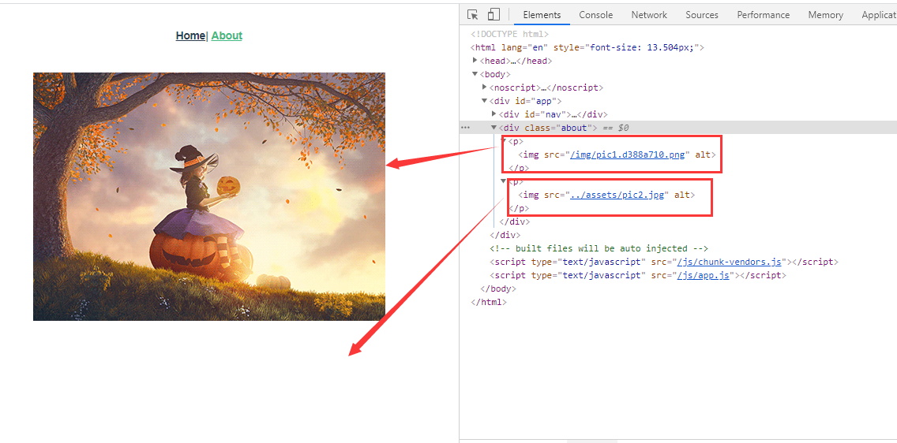

- public 静态引入

  如果做的是纯静态的网站展示，有许多的本地静态资源需要加载，里面包括本地数据和本地图片混合的好几组，建议使用 public 方式。其他情况下建议使用require方式

  

  如果你的图片在 public 下面，就直接写 图片名 `例：a.png`，如果有二级目录就直接地址 `例：images/a.png`

  **不需要写 public ，它会自动引用 public 里面的内容**

  ```javascript
  <template>
      <div class="hello">
          
      </div>
  </template>
  
  <script>
  export default {
      data() {
          return {
              imgUrl: "pic3.png"
          }
      },
  };
  </script>
  
  ```

  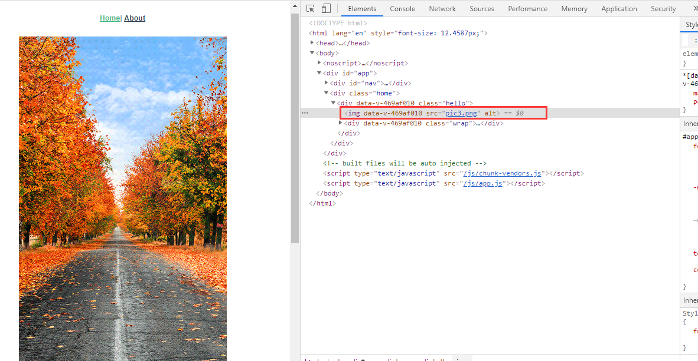


#### 4.vue中使用normalize.css

- 作用
  - Normalize.css是一种CSS reset的替代方案。
  - 保护有用的浏览器样式而不是去掉他们。
  - 为大部分HTML元素提供一般化的样式
  - 修复浏览器自身的bug并保证各浏览器的一致性。
  - 优化css可用性
  - 用注释和详细的文档来解释代码
  - Normalize支持包括手机浏览器在内的超多浏览器，同时对HTML5元素、排版、列表、嵌入的内容、表单和表哥都进行了一般化。尽管这个项目基于一般化的原则，但我们还是在合适的地方使用了更实用的默认值。

- 没使用时:

  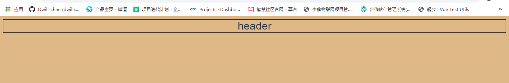

- 使用normalize.css

  - 安装

    ```javascript
    npm install --save normalize.css 
    ```

  - main.js引入

    ```javascript
    import 'normalize.css/normalize.css'
    ```

  - 效果

    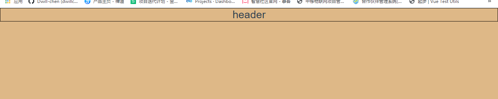